# 수목감별 120 학습 노트

출처: [파이팅혼공TV 원영상](https://www.youtube.com/watch?v=K3PvgTi3eXI), [사이버 수목원 수목도감](https://treeworld.co.kr/a01_01_02), [위키백과](https://ko.wikipedia.org/) 및 [Wikipedia](https://en.wikipedia.org/).
조경기능사 및 나무의사 수목감별 120종 시험 대비를 위해 영상 핵심 포인트와 수목도감의 학명·과명, 4대 형태학적 특징(잎, 꽃, 열매, 줄기/수형), 수목도감 부위별 실물 사진, 그리고 다각도 식물학적 동정을 위한 한국어/영문 위키백과 문서를 종합 정리한 개인 학습용 자료입니다.

영상 구간 링크는 해당 수목을 확인한 대표 화면 시점이며, 수목도감 및 위키백과 링크를 통해 상세한 식물학적 형태와 생태를 추가로 확인하실 수 있습니다.

## 001. 가막살나무
> *Viburnum dilatatum Thunb.* · Adoxaceae 연복초과

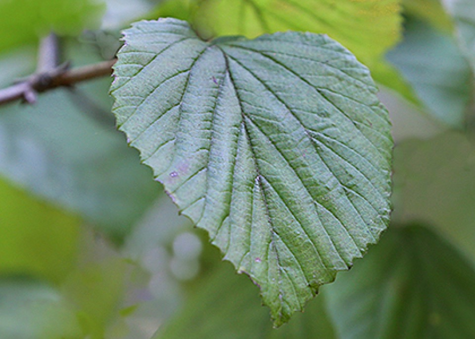
*잎 | 잎: 마주나기 · 잎몸은 거꿀달걀형, 넓은 달걀형, 타원형 또는 둥근형으로 길이 5 ~14 cm, 너비 3 ~13 cm이며, 변이가 많음 · 가장자리: 이빨꼴 톱니가 성기게 있음*

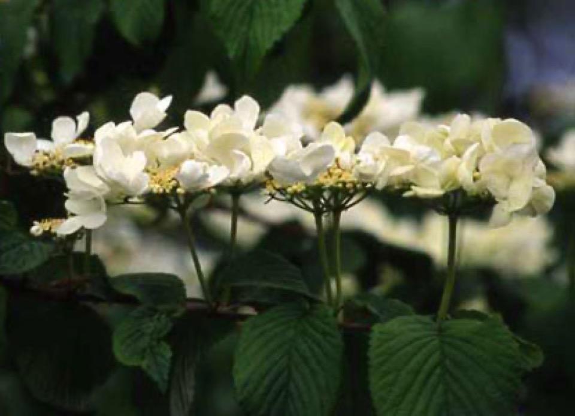
*꽃 | 꽃: 하양 꽃 · 고른꽃차례(산방화서), 겹우산꼴꽃차례(복산형화서) · 꽃대는 4개 때로 5개가 뻗어 지름 5~12 cm이고 거의 수평을 이룸*

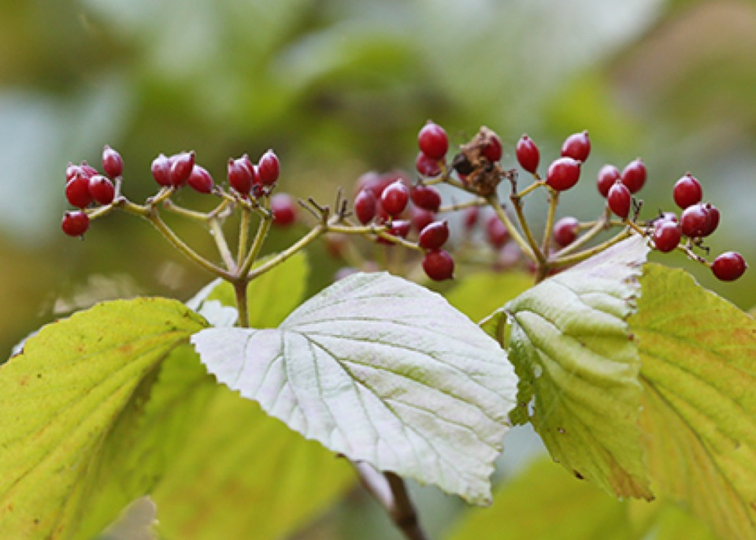
*열매 | 열매: 빨강 열매 · 굳은씨열매(핵과)*

*수형 | 수형: 높이 2~3(6) m · 수피: 검은갈색 또는 회갈색*

### 감별 핵심 포인트
- 깻잎을 닮은 넓은 잎에 잎맥과 주름이 뚜렷합니다.
- 작은 흰 꽃이 무리 지어 피고, 열매는 붉게 익습니다.
- 붉은 열매만 보지 말고 넓고 거친 잎을 함께 확인하세요.

### 주된 형태 특징 (4대 감별 지표)
- **🌿 잎:** 마주나기 · 잎몸은 거꿀달걀형, 넓은 달걀형, 타원형 또는 둥근형으로 길이 5 ~14 cm, 너비 3 ~13 cm이며, 변이가 많음 · 가장자리: 이빨꼴 톱니가 성기게 있음 · 깃꼴 곁맥은 6~9쌍으로 쭉 뻗거나 약간 굽어 톱니까지 이어지며, 뒷쪽은 솟아있음
- **🌸 꽃:** 하양 꽃 · 고른꽃차례(산방화서), 겹우산꼴꽃차례(복산형화서) · 꽃대는 4개 때로 5개가 뻗어 지름 5~12 cm이고 거의 수평을 이룸
- **🍒 열매:** 빨강 열매 · 굳은씨열매(핵과)
- **🪵 줄기·수형:** 높이 2~3(6) m · 수피: 검은갈색 또는 회갈색

**비교·주의:** 덜 익은 열매는 녹색입니다. 열매 색만으로 다른 수목이라고 판단하지 마세요.

[파이팅혼공 TV 강의](https://www.youtube.com/watch?v=K3PvgTi3eXI&t=50s) · [수목도감(treeworld)](https://treeworld.co.kr/a01_01_02/31137) · [위키백과(한국어)](https://ko.wikipedia.org/wiki/%EA%B0%80%EB%A7%89%EC%82%B4%EB%82%98%EB%AC%B4) · [Wikipedia(English)](https://en.wikipedia.org/wiki/Viburnum_dilatatum)

## 002. 가시나무
> *Quercus myrsinifolia Blume* · Fagaceae 참나무과 (너도밤나무과)

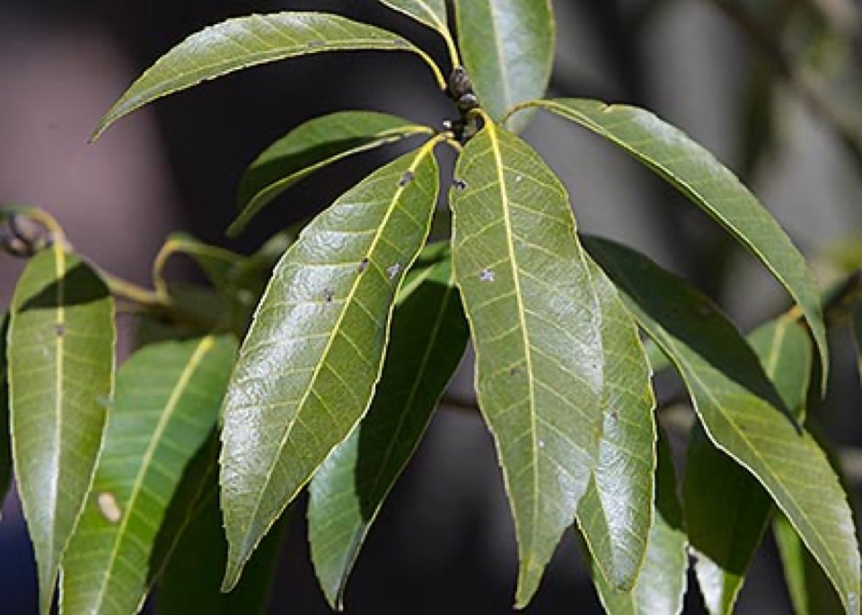
*잎 | 잎: 어긋나기 · 홑잎 · 가장자리: 윗부분(1*

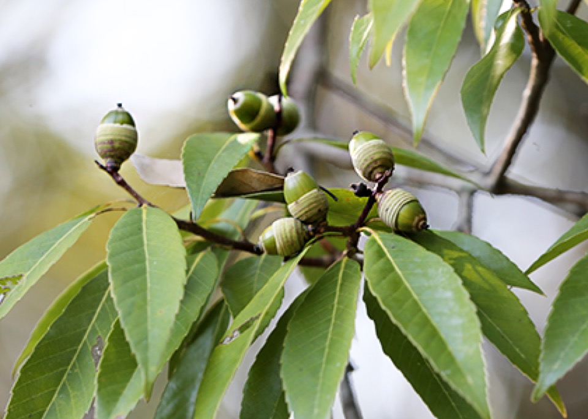
*꽃 | 꽃: 암꽃과 수꽃은 모두 노랑 꽃 · 암꽃꽃차례는 햇가지에서 곧게 위로 핌 · 암수한그루( 일가화, 자웅동주)*

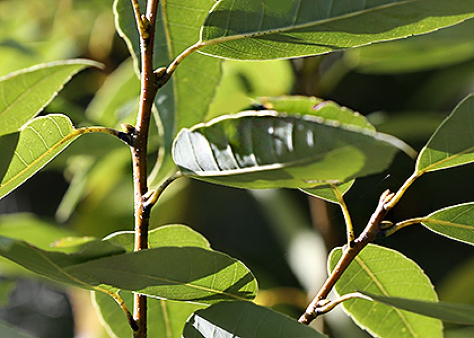
*열매 | 열매: 갈색 열매 · 굳은껍질열매(견과, 도토리, 굳은열매)*

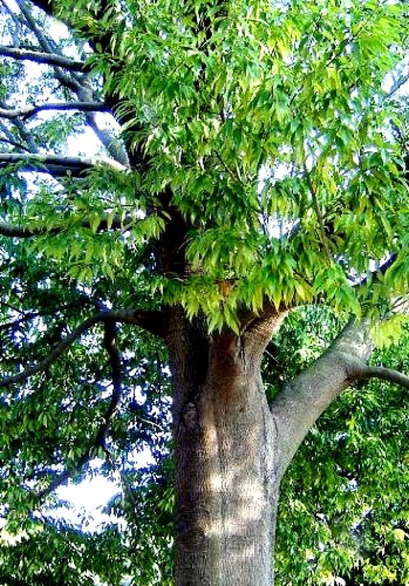
*수형 | 수형: 높이 9~15(20) m, 지름 80 cm 안팎 · 수피: 초록빛 검은 회색*

### 감별 핵심 포인트
- 길쭉한 잎의 표면이 매끈하고 광택이 납니다.
- 잎 가장자리에 톱니가 있지만 호랑가시나무처럼 큰 가시는 아닙니다.
- 도토리 모양의 열매와 잎을 함께 살펴보세요.

### 주된 형태 특징 (4대 감별 지표)
- **🌿 잎:** 어긋나기 · 홑잎 · 가장자리: 윗부분(1 · 곁맥(측맥)은 (9)11~15쌍
- **🌸 꽃:** 암꽃과 수꽃은 모두 노랑 꽃 · 암꽃꽃차례는 햇가지에서 곧게 위로 핌 · 암수한그루( 일가화, 자웅동주)
- **🍒 열매:** 갈색 열매 · 굳은껍질열매(견과, 도토리, 굳은열매)
- **🪵 줄기·수형:** 높이 9~15(20) m, 지름 80 cm 안팎 · 수피: 초록빛 검은 회색

**비교·주의:** 이름에 ‘가시’가 있어도 호랑가시나무의 날카로운 잎과는 다릅니다.

[파이팅혼공 TV 강의](https://www.youtube.com/watch?v=K3PvgTi3eXI&t=130s) · [수목도감(treeworld)](https://treeworld.co.kr/a01_01_02/31118) · [위키백과(한국어)](https://ko.wikipedia.org/wiki/%EA%B0%80%EC%8B%9C%EB%82%98%EB%AC%B4) · [Wikipedia(English)](https://en.wikipedia.org/wiki/Quercus_myrsinifolia)

## 003. 갈참나무
> *Quercus aliena Blume* · Fagaceae 참나무 과(너도밤나무 과)

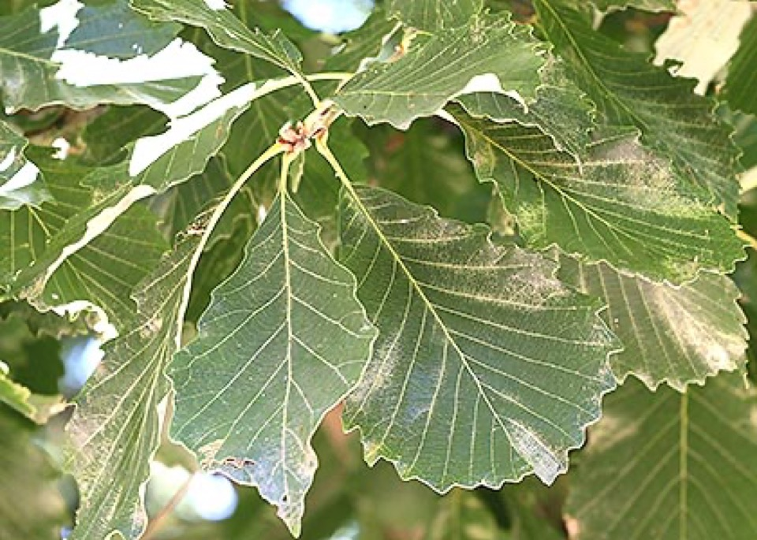
*잎 | 잎: 어긋나기 · 홑잎 · 가장자리: 물결꼴 또는 이빨꼴 톱니가 있고, 양쪽으로 갈래는 9~15개*

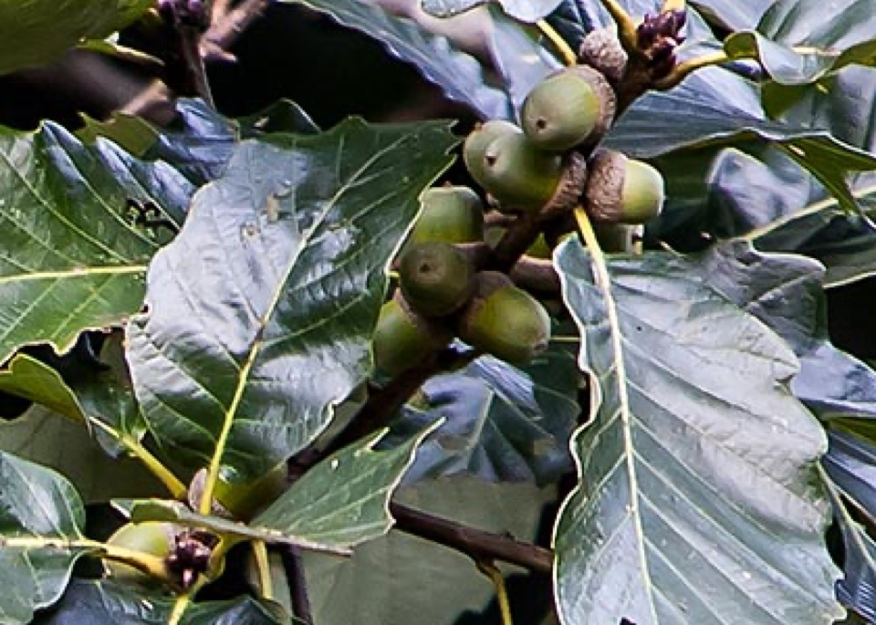
*열매 | 열매: 갈색 열매 · 굳은껍질열매(견과, 도토리)*

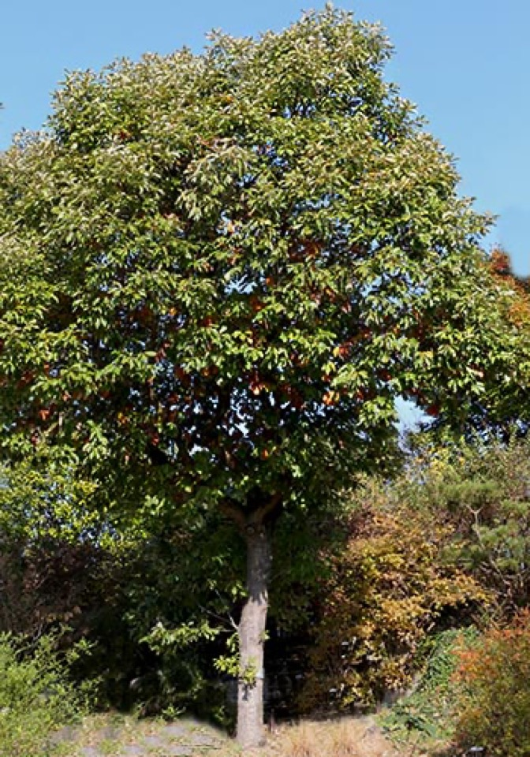
*수형 | 수형: 높이 20~30 m, 지름 1 m 안팎 · 수피: 회갈색*

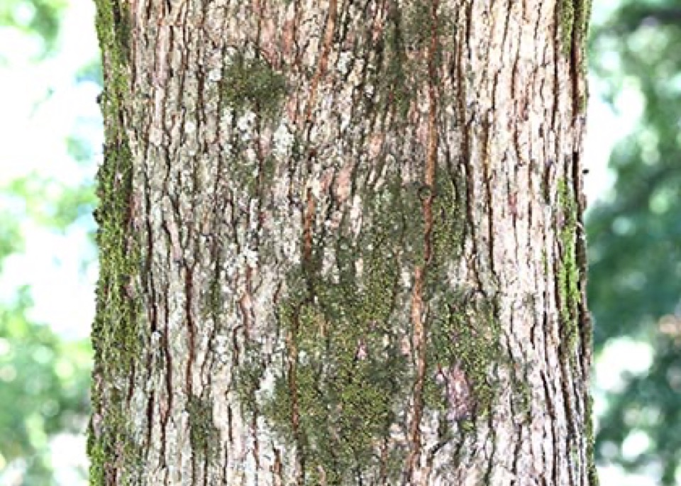
*줄기 | 줄기: 높이 20~30 m, 지름 1 m 안팎 · 수피: 회갈색*

### 감별 핵심 포인트
- 잎 가장자리에 둥글고 큰 톱니가 있으며 잎맥이 선명합니다.
- 어린잎은 주름져 보이고, 자라면서 넓게 펴집니다.
- 늘어지는 수꽃차례와 도토리를 잎 모양과 함께 확인하세요.

### 주된 형태 특징 (4대 감별 지표)
- **🌿 잎:** 어긋나기 · 홑잎 · 가장자리: 물결꼴 또는 이빨꼴 톱니가 있고, 양쪽으로 갈래는 9~15개 · 곁맥은 10~15쌍
- **🌸 꽃:** 노란초록 꽃 · 암꽃이삭은 이삭꼴꽃차례(수상화서)로 햇가지 끝부분의 잎겨드랑이에 곧추서 달림 · 암수한그루(일가화) 또는 잡성일가화
- **🍒 열매:** 갈색 열매 · 굳은껍질열매(견과, 도토리)
- **🪵 줄기·수형:** 높이 20~30 m, 지름 1 m 안팎 · 수피: 회갈색

**비교·주의:** 가시나무의 매끈하고 광택 나는 잎과 비교하면 좋습니다.

[파이팅혼공 TV 강의](https://www.youtube.com/watch?v=K3PvgTi3eXI&t=230s) · [수목도감(treeworld)](https://treeworld.co.kr/a01_01_02/31080) · [위키백과(한국어)](https://ko.wikipedia.org/wiki/%EA%B0%88%EC%B0%B8%EB%82%98%EB%AC%B4) · [Wikipedia(English)](https://en.wikipedia.org/wiki/Quercus_aliena)

## 004. 감나무
> *Diospyros kaki L. f.* · Ebenaceae 감나무과

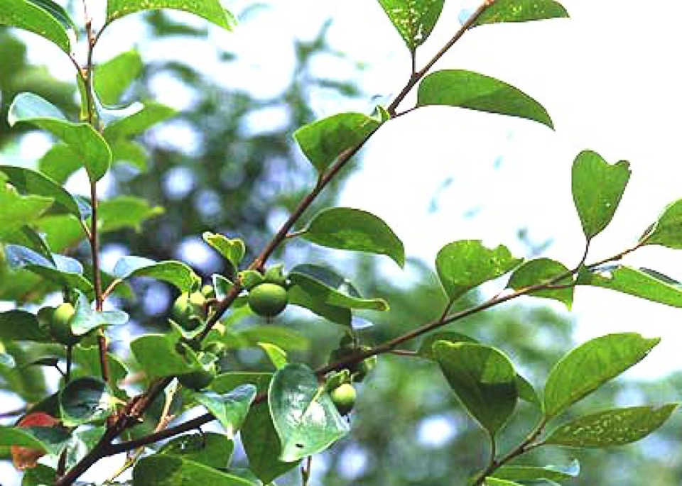
*잎 | 잎: 어긋나기. 드믈게 마주나기 하는 것도 있음 · 홑잎 · 가장자리: 밋밋함*

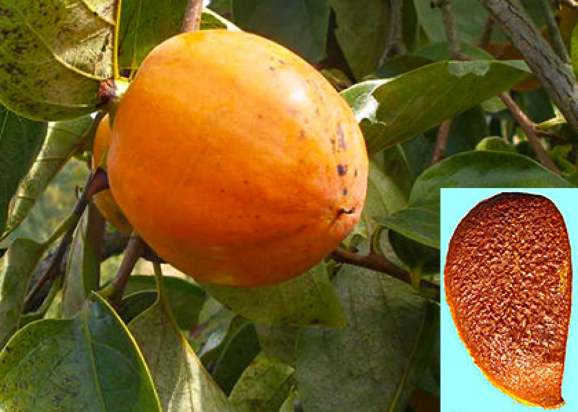
*열매 | 열매: 노란 빨강 열매 · 물열매(장과)*

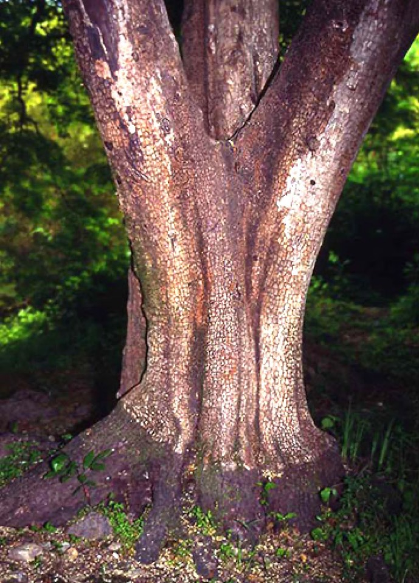
*수형 | 수형: 높이 4~10 m( 높이 27 m 쯤까지 자라고[1-3]), 나무갓은 촘촘함 · 수피: 검은 회색, 회빛 갈색, 다갈색*

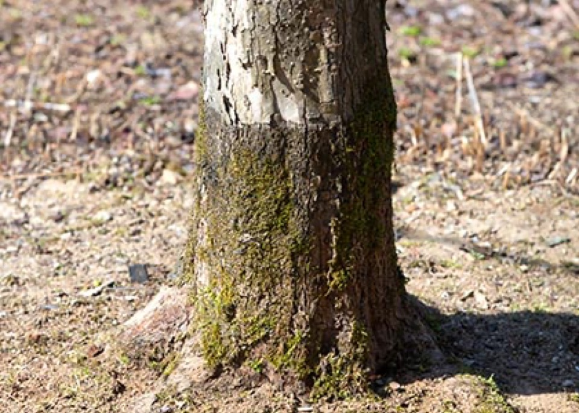
*줄기 | 줄기: 높이 4~10 m( 높이 27 m 쯤까지 자라고[1-3]), 나무갓은 촘촘함 · 수피: 검은 회색, 회빛 갈색, 다갈색*

### 감별 핵심 포인트
- 감 열매와 네 갈래로 남는 큰 꽃받침이 익숙한 단서입니다.
- 작은 황백색 꽃의 꽃받침도 감 꼭지를 떠올리게 합니다.
- 열매가 없는 사진에서는 넓은 잎과 꽃받침을 함께 봅니다.

### 주된 형태 특징 (4대 감별 지표)
- **🌿 잎:** 어긋나기. 드믈게 마주나기 하는 것도 있음 · 홑잎 · 가장자리: 밋밋함 · 깃꼴 그물맥으로 밑부분의 곁맥은 비교적 뚜렷함
- **🌸 꽃:** 노란 하양 꽃 · 암꽃은 한 개씩 잎겨드랑이에 달림 · 암수한그루 또는 드믈게 암수딴그루
- **🍒 열매:** 노란 빨강 열매 · 물열매(장과)
- **🪵 줄기·수형:** 높이 4~10 m( 높이 27 m 쯤까지 자라고[1-3]), 나무갓은 촘촘함 · 수피: 검은 회색, 회빛 갈색, 다갈색

[파이팅혼공 TV 강의](https://www.youtube.com/watch?v=K3PvgTi3eXI&t=310s) · [수목도감(treeworld)](https://treeworld.co.kr/a01_01_02/31073) · [위키백과(한국어)](https://ko.wikipedia.org/wiki/%EA%B0%90%EB%82%98%EB%AC%B4) · [Wikipedia(English)](https://en.wikipedia.org/wiki/Diospyros_kaki)

## 005. 감탕나무
> *Ilex integra Thunb.* · Aquifoliaceae 감탕나무과

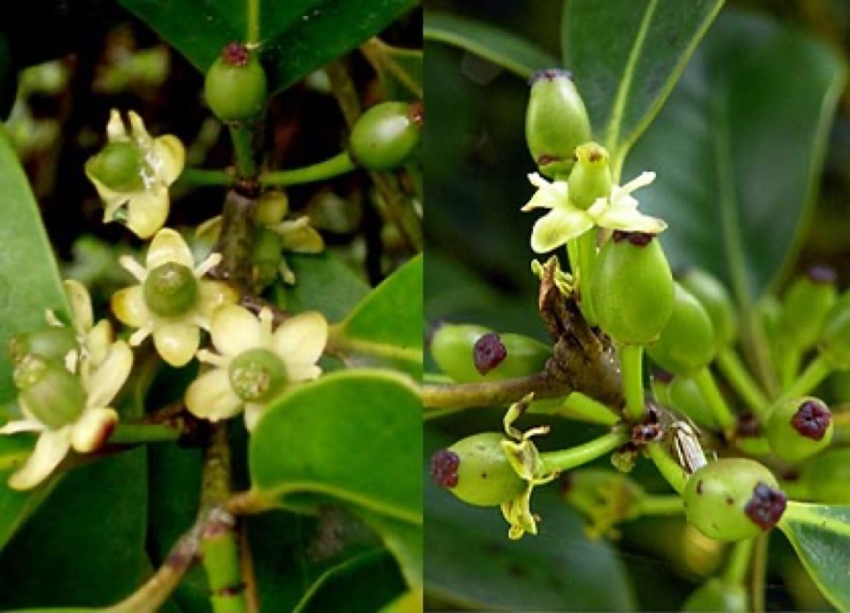
*꽃 | 꽃: 노란 초록 꽃 · 취산꽃차례(취산화서) · 암수딴그루(자웅동주, 이가화)*

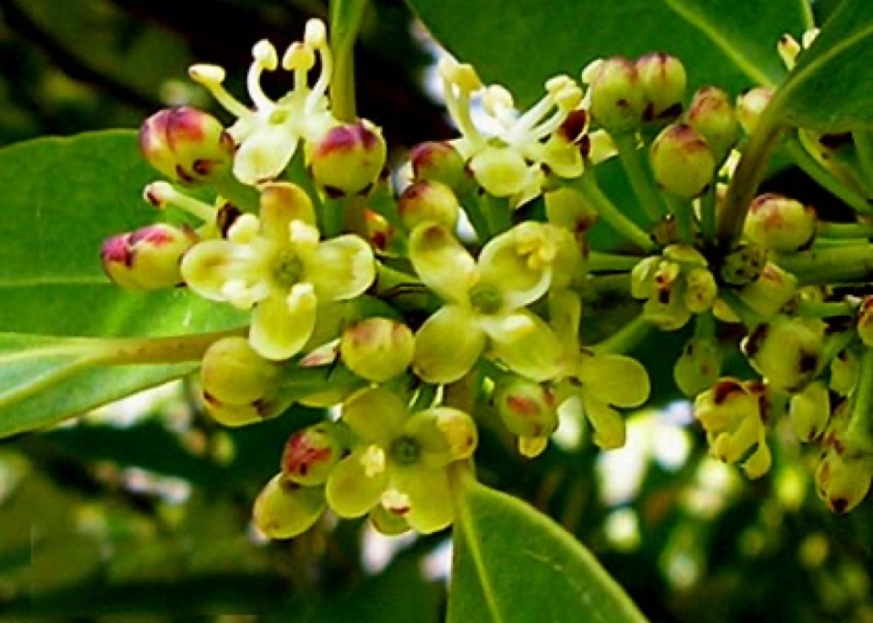
*수형 | 수형: 높이 6~10 m로 곧게 자람(직립성) · 수피: 회빛 하양*

### 감별 핵심 포인트
- 잎은 두껍고 매끈한 타원형으로 광택이 납니다.
- 작은 꽃이 잎겨드랑이에 모여 핍니다.
- 붉게 익는 열매 끝의 어두운 점과 주변 잎을 함께 봅니다.

### 주된 형태 특징 (4대 감별 지표)
- **🌿 잎:** 어긋나기 · 잎몸은 타원형, 긴타원형 또는 긴타원꼴 거꿀달걀형으로 길이 3.5~10 cm, 너비 1,5~4.5 cm · 가장자리: 밋밋함 · 중앙맥은 평평하거나 약간 앞쪽으로 새겨지고, 곁맥은 6~9쌍으로 잎가장자리에서 갈라지거나 합쳐짐
- **🌸 꽃:** 노란 초록 꽃 · 취산꽃차례(취산화서) · 암수딴그루(자웅동주, 이가화)
- **🍒 열매:** 빨강 열매 · 둥근형(구형)이며 지름 1~1.2 cm 이고, 남아있는 꽃받침은 납작하게 퍼지고, 거의 둥근꼴로 얕게 4개로 갈라지며, 씨는 4개 들어있음
- **🪵 줄기·수형:** 높이 6~10 m로 곧게 자람(직립성) · 수피: 회빛 하양

**비교·주의:** 붉은 열매만으로 먼나무 등과 구별하기 어렵습니다. 잎의 형태와 열매가 달린 모습을 비교하세요.

[파이팅혼공 TV 강의](https://www.youtube.com/watch?v=K3PvgTi3eXI&t=350s) · [수목도감(treeworld)](https://treeworld.co.kr/a01_01_02/31063) · [위키백과(한국어)](https://ko.wikipedia.org/wiki/%EA%B0%90%ED%83%95%EB%82%98%EB%AC%B4) · [Wikipedia(English)](https://en.wikipedia.org/wiki/Ilex_integra)

## 006. 개나리
> *Forsythia koreana (Rehder) Nakai* · Oleaceae 물푸레나무과

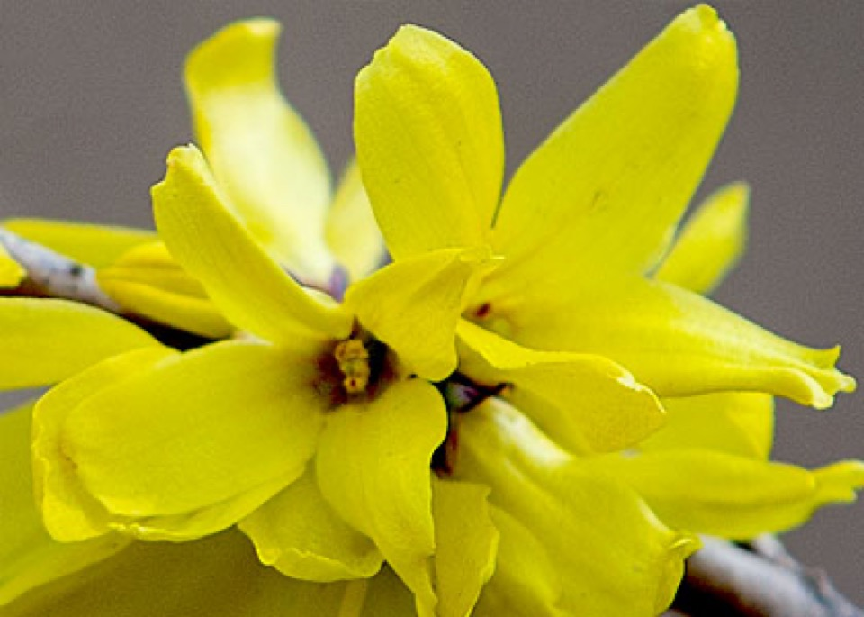
*꽃 | 꽃: 꽃잎은 노랑 꽃 · 1~3개씩 또는 여러 개가 잎겨드랑이에 달림 · 암수딴그루(이기화)?*

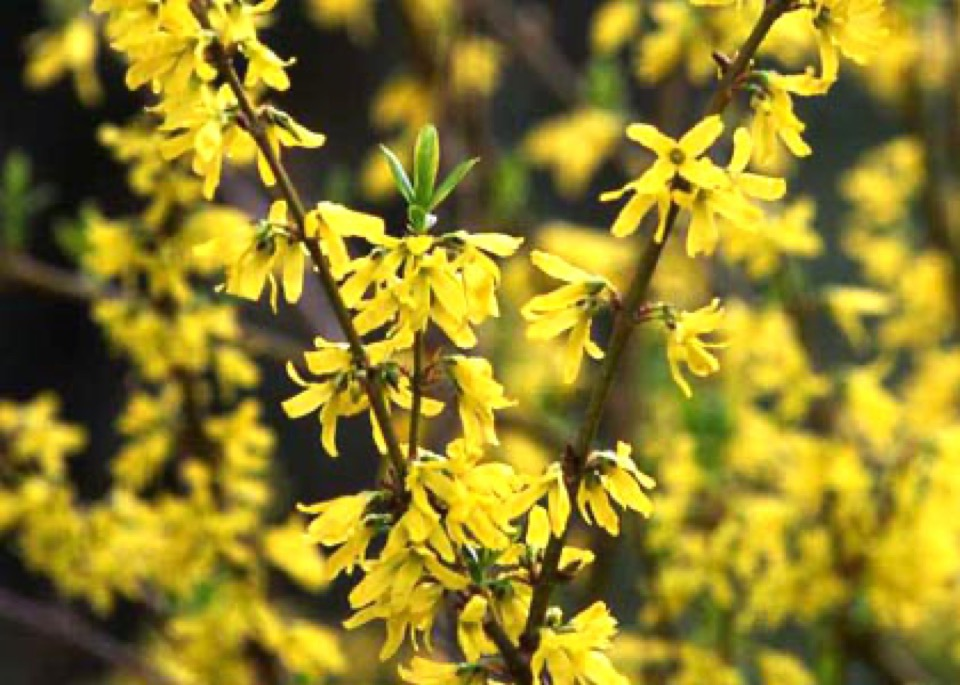
*수형 | 수형: 높이 2~3 m쯤으로 여러 대가 뿌리로부터 자라며, 줄기 끝 부분에서 늘어짐 · 수피: 노란갈색, 검은갈색*

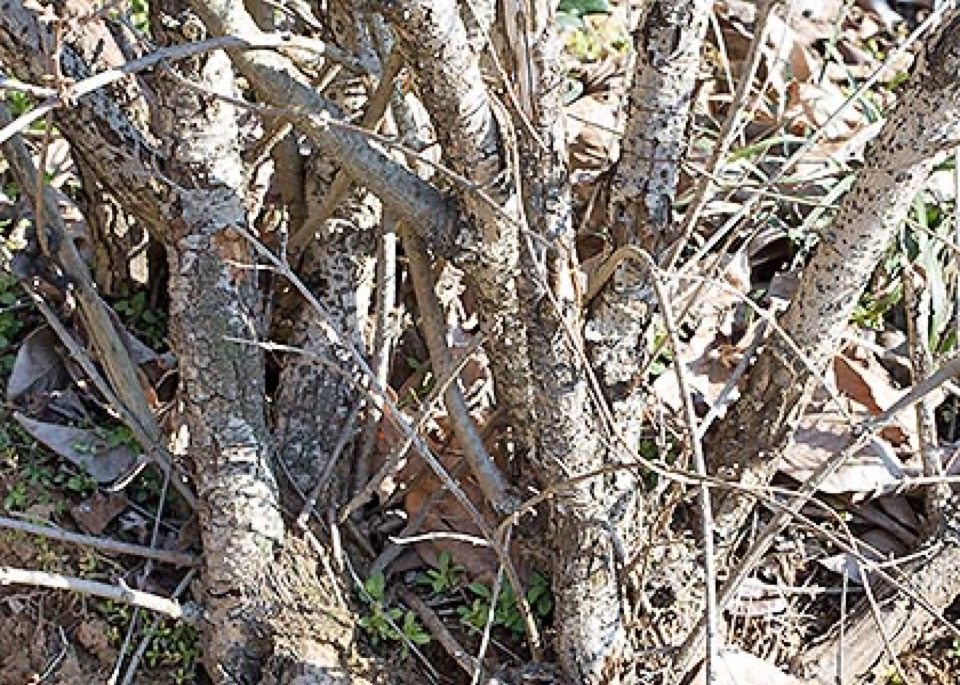
*줄기 | 줄기: 높이 2~3 m쯤으로 여러 대가 뿌리로부터 자라며, 줄기 끝 부분에서 늘어짐 · 수피: 노란갈색, 검은갈색*

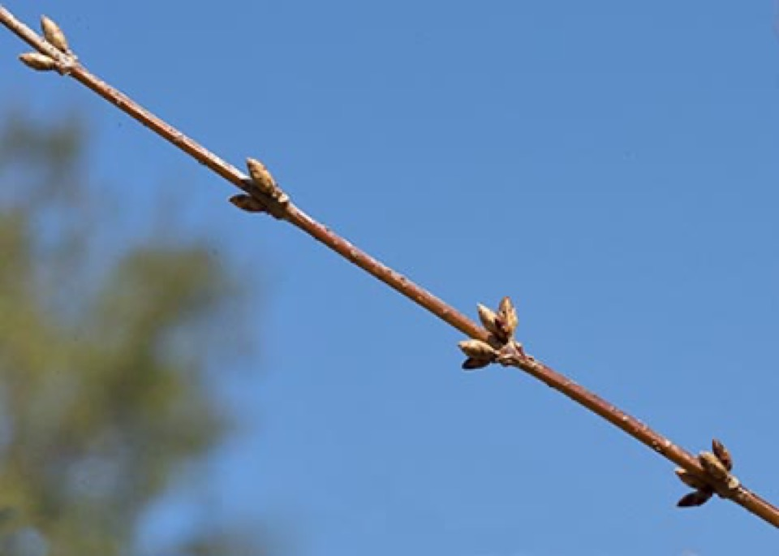
*겨울눈 | 겨울눈: 월동기 눈의 배열과 비늘잎 형태*

### 감별 핵심 포인트
- 노란 꽃이 가지를 따라 풍성하게 핍니다.
- 꽃부리는 끝이 네 갈래로 나뉘어 보입니다.
- 잎이 무성해지기 전 가지를 덮는 노란 꽃을 기억하세요.

### 주된 형태 특징 (4대 감별 지표)
- **🌿 잎:** 마주나기 · 홑잎 · 가장자리: 잎몸의 중간 이상에서 톱니가 있거나 밋밋함 · 곁맥은 3(~5)개로 어긋나게 달림
- **🌸 꽃:** 꽃잎은 노랑 꽃 · 1~3개씩 또는 여러 개가 잎겨드랑이에 달림 · 암수딴그루(이기화)?
- **🍒 열매:** 열매는 진한 갈색 열매 · 튀는열매(삭과)
- **🪵 줄기·수형:** 높이 2~3 m쯤으로 여러 대가 뿌리로부터 자라며, 줄기 끝 부분에서 늘어짐 · 수피: 노란갈색, 검은갈색

[파이팅혼공 TV 강의](https://www.youtube.com/watch?v=K3PvgTi3eXI&t=424s) · [수목도감(treeworld)](https://treeworld.co.kr/a01_01_02/31045) · [위키백과(한국어)](https://ko.wikipedia.org/wiki/%EA%B0%9C%EB%82%98%EB%A6%AC) · [Wikipedia(English)](https://en.wikipedia.org/wiki/Forsythia_koreana)

## 007. 개비자나무
> *Cephalotaxus harringtonii (Knight ex J.Forbes) K.Koch* · Cephalotaxaceae 개비자나무과

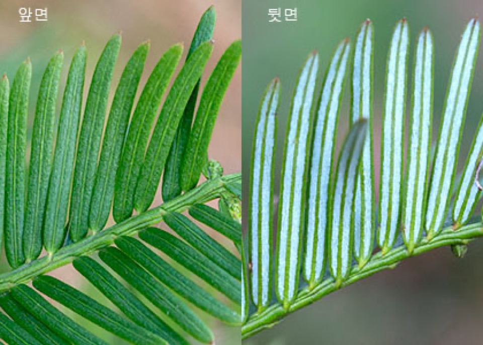
*잎 | 잎: 어긋나기 또는 거의 마주나기로 2줄 배열 · 잎몸은 선형으로 길이 4~6 cm, 너비 3~4 cm이지만 움가지(맹아)의 것은 7.5 cm쯤에 달하는 것도 있고, 열매달린 가지의 것은 길이 2~2.5 cm이며, 4~5 년만에 떨어짐. 낫형으로 굽지않음(일본산 · 가장자리: 밋밋함*

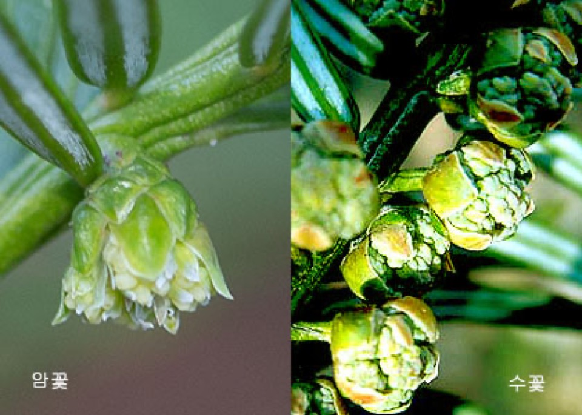
*꽃 | 꽃: 수꽃은 노랑 꽃 · 홀씨주머니이삭 · 암수딴그루*

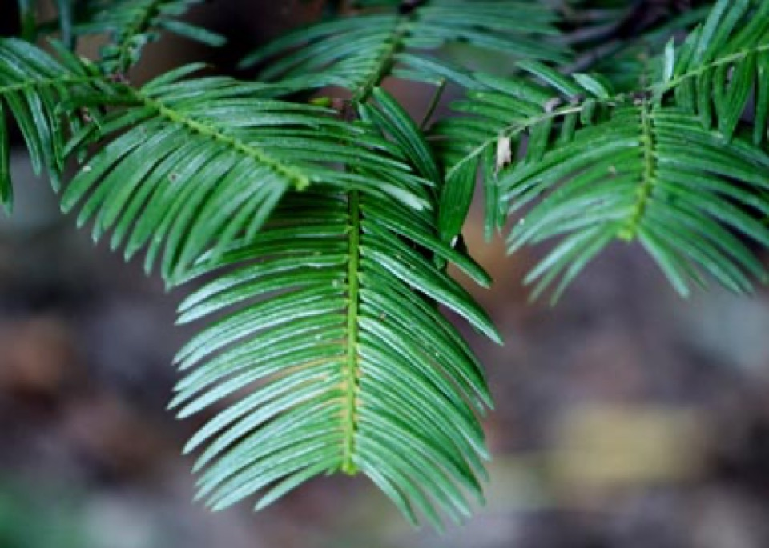
*수형 | 수형: 높이 1~1.5 m(일본산 3~6 m) · 수피: 진한 갈색*

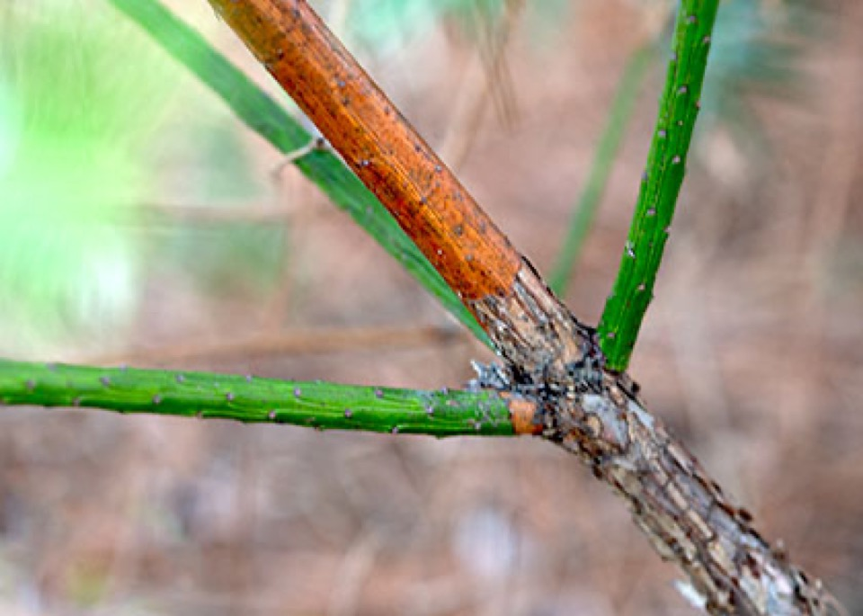
*줄기 | 줄기: 높이 1~1.5 m(일본산 3~6 m) · 수피: 진한 갈색*

### 감별 핵심 포인트
- 납작하고 긴 잎이 가지 양쪽으로 펼쳐져 지네를 닮았습니다.
- 잎 배열을 한자 ‘아닐 비(非)’ 모양과 연결해 기억할 수 있습니다.
- 가지 아래쪽에 모여 달리는 둥근 수꽃도 확인하세요.

### 주된 형태 특징 (4대 감별 지표)
- **🌿 잎:** 어긋나기 또는 거의 마주나기로 2줄 배열 · 잎몸은 선형으로 길이 4~6 cm, 너비 3~4 cm이지만 움가지(맹아)의 것은 7.5 cm쯤에 달하는 것도 있고, 열매달린 가지의 것은 길이 2~2.5 cm이며, 4~5 년만에 떨어짐. 낫형으로 굽지않음(일본산 · 가장자리: 밋밋함 · 중앙맥(중늑, 주맥)은 앞 뒤로 도두라지고, 뒷면 양쪽 가장자리에 2줄로 된 하얀 기공조선이 있음
- **🌸 꽃:** 수꽃은 노랑 꽃 · 홀씨주머니이삭 · 암수딴그루
- **🍒 열매:** 열매는 어릴 때 초록에서 연한 빨강 또는 빨간 갈색으로 변하면서 흰가루가 묻어있으며, 다음해 익으면 갈빛 자주 열매 · 굳은씨열매(핵과)로 다음해에 익음
- **🪵 줄기·수형:** 높이 1~1.5 m(일본산 3~6 m) · 수피: 진한 갈색

**비교·주의:** 메타세쿼이아보다 잎이 두껍고 뻣뻣해 보입니다.

[파이팅혼공 TV 강의](https://www.youtube.com/watch?v=K3PvgTi3eXI&t=430s) · [수목도감(treeworld)](https://treeworld.co.kr/a01_01_02/31010) · [위키백과(한국어)](https://ko.wikipedia.org/wiki/%EA%B0%9C%EB%B9%84%EC%9E%90%EB%82%98%EB%AC%B4) · [Wikipedia(English)](https://en.wikipedia.org/wiki/Cephalotaxus_koreana)

## 008. 개오동
> *Catalpa ovata G. Don* · Bignoniaceae 능소화과

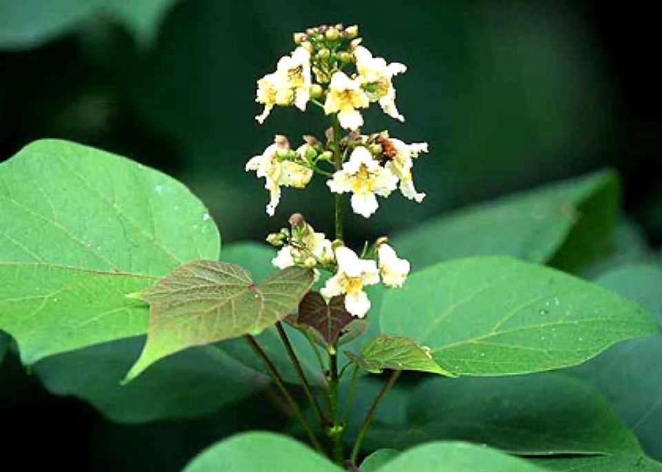
*꽃 | 꽃: 노란 하양 꽃 · 원뿔꽃차례(원추화서) · 암수한꽃*

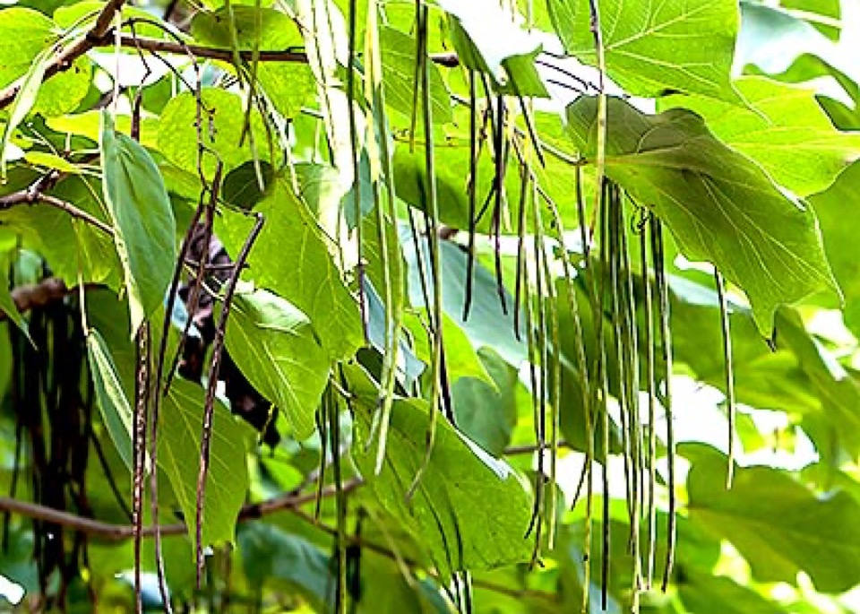
*열매 | 열매: 어두운 갈색 열매 · 튀는열매(朔果)*

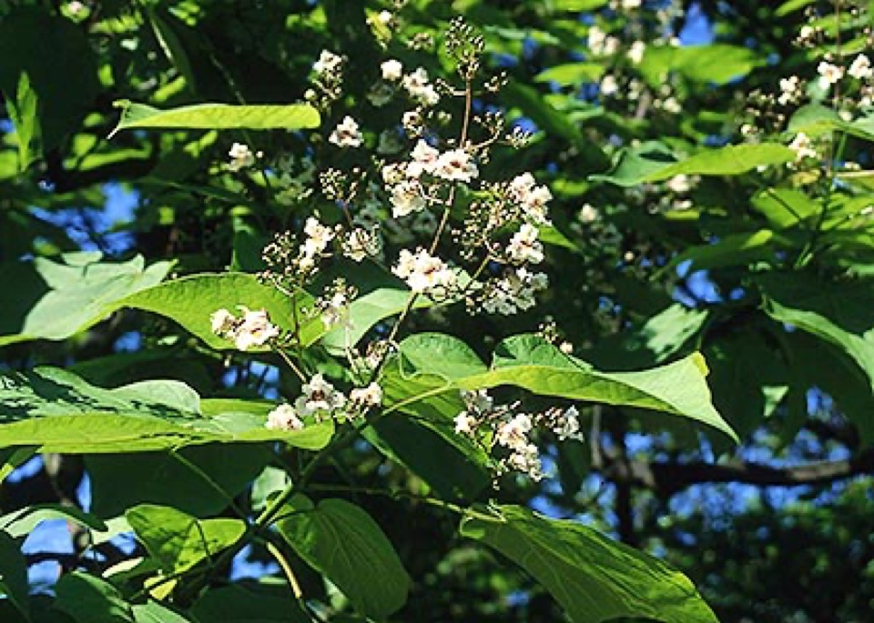
*수형 | 수형: 높이 8~20 m · 수피: 갈색*

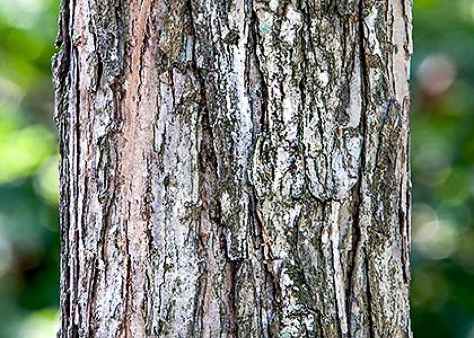
*줄기 | 줄기: 높이 8~20 m · 수피: 갈색*

### 감별 핵심 포인트
- 잎이 크고 넓으며, 흰 꽃이 모여 핍니다.
- 길고 가느다란 열매가 수염처럼 아래로 늘어집니다.
- 넓은 잎과 길게 매달린 열매의 조합이 핵심입니다.

### 주된 형태 특징 (4대 감별 지표)
- **🌿 잎:** 마주나기 또는 3장씩 돌려나기(3윤생) · 홑잎 · 가장자리: 밋밋하거나 1~2쌍의 물결꼴 톱니가 얕게 있음 · 손바닥꼴(장상맥)로 3~5줄로 갈라짐
- **🌸 꽃:** 노란 하양 꽃 · 원뿔꽃차례(원추화서) · 암수한꽃
- **🍒 열매:** 어두운 갈색 열매 · 튀는열매(朔果)
- **🪵 줄기·수형:** 높이 8~20 m · 수피: 갈색

**비교·주의:** 오동나무의 보라색 꽃, 벽오동의 갈라진 잎과 비교하세요.

[파이팅혼공 TV 강의](https://www.youtube.com/watch?v=K3PvgTi3eXI&t=510s) · [수목도감(treeworld)](https://treeworld.co.kr/a01_01_02/30984) · [위키백과(한국어)](https://ko.wikipedia.org/wiki/%EA%B0%9C%EC%98%A4%EB%8F%99) · [Wikipedia(English)](https://en.wikipedia.org/wiki/Catalpa_ovata)

## 009. 계수나무
> *Cercidiphyllum japonicum Siebold & Zucc. ex J.J.Hoffm. & J.H.Schult.bis* · Cercidiphyllaceae 계수나무과

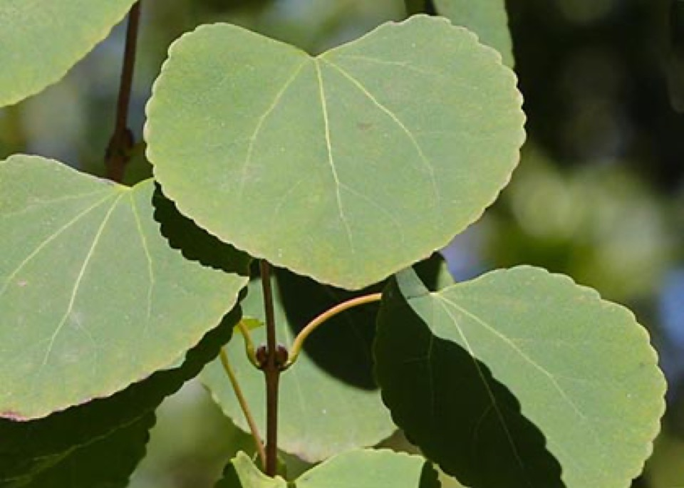
*잎 | 잎: 긴 가지는 보통 마주나기 또는 거의 마주나기 · 이형엽(생김새가 다른 잎이 동시에 달린 잎) · 가장자리: 긴 새순의 가장자리는 밋밋하거나 자잘한 톱니가 있음*

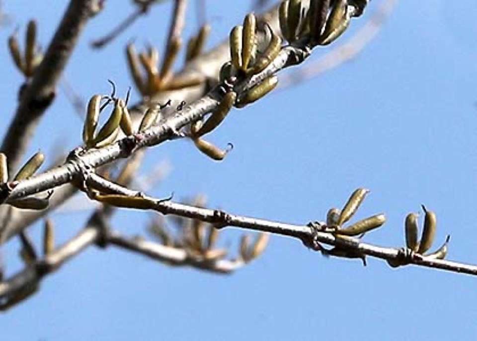
*열매 | 열매: 어두운 자줏빛 갈색 열매 · 골돌*

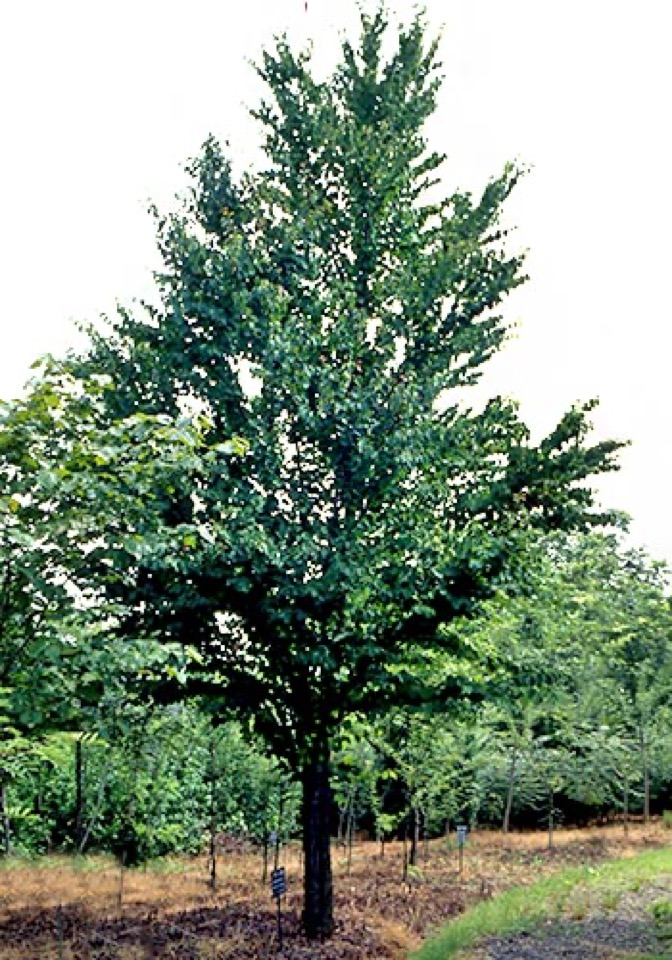
*수형 | 수형: 높이 10~20 m 지름 1~1.3 m(드믈게 2 m) · 수피: 회갈색*

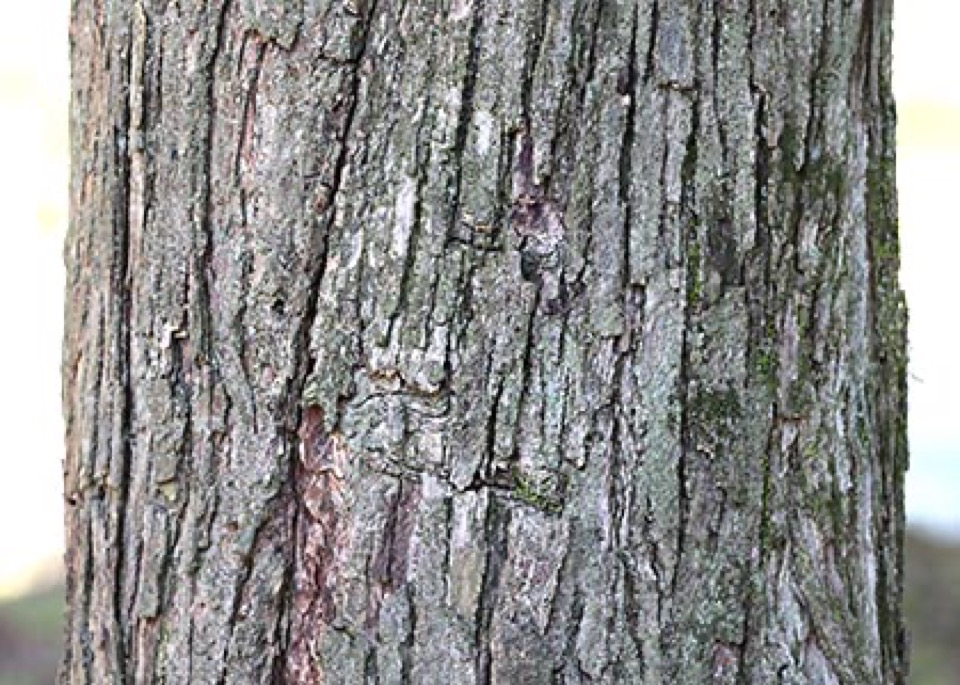
*줄기 | 줄기: 높이 10~20 m 지름 1~1.3 m(드믈게 2 m) · 수피: 회갈색*

### 감별 핵심 포인트
- 잎이 비교적 반듯하고 둥근 하트 모양입니다.
- 잎의 밑부분이 오목하게 들어가고 가장자리는 둥근 톱니를 이룹니다.
- 가늘고 굽은 작은 열매가 모인 모습도 확인하세요.

### 주된 형태 특징 (4대 감별 지표)
- **🌿 잎:** 긴 가지는 보통 마주나기 또는 거의 마주나기 · 이형엽(생김새가 다른 잎이 동시에 달린 잎) · 가장자리: 긴 새순의 가장자리는 밋밋하거나 자잘한 톱니가 있음 · 손바닥꼴맥(장상맥)
- **🌸 꽃:** 암꽃의 암술머리는 빨간 분홍 꽃 · 짧은 가지에 모여나며, 잎 보다 먼저 잎겨드랑이에 1개씩 달림 · 암수딴그루(2가화)
- **🍒 열매:** 어두운 자줏빛 갈색 열매 · 골돌
- **🪵 줄기·수형:** 높이 10~20 m 지름 1~1.3 m(드믈게 2 m) · 수피: 회갈색

**비교·주의:** 박태기나무의 넓은 심장형 잎과 비교하되 꽃과 열매를 함께 봅니다.

[파이팅혼공 TV 강의](https://www.youtube.com/watch?v=K3PvgTi3eXI&t=550s) · [수목도감(treeworld)](https://treeworld.co.kr/a01_01_02/30915) · [위키백과(한국어)](https://ko.wikipedia.org/wiki/%EA%B3%84%EC%88%98%EB%82%98%EB%AC%B4) · [Wikipedia(English)](https://en.wikipedia.org/wiki/Cercidiphyllum_japonicum)

## 010. 골담초
> *Caragana sinica (Buc'hoz) Rehder* · Fabaceae 콩과/ 콩아과

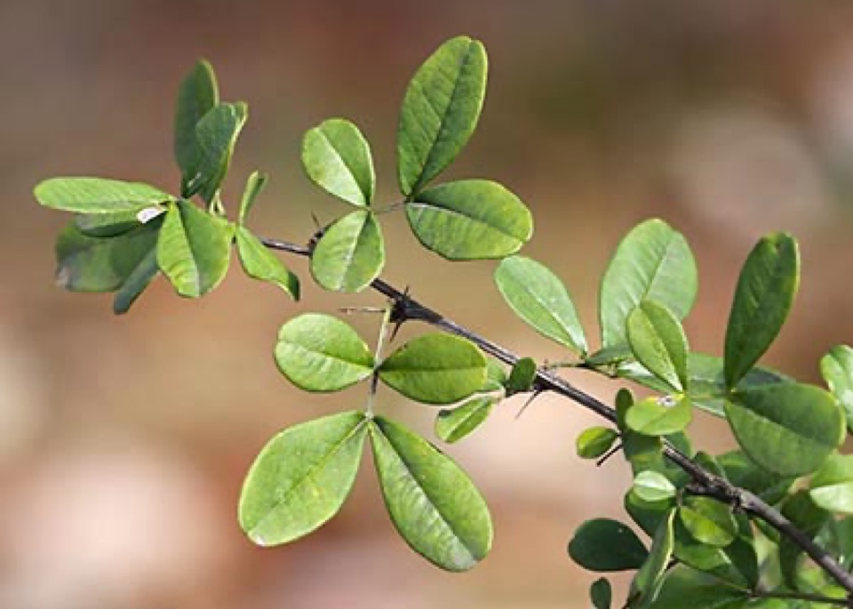
*잎 | 잎: 어긋나기 · 짝수 깃꼴 겹잎(우수우상복엽)으로 2쌍씩 붙어 있거나 손바닥꼴로 4개 · 가장자리: 밋밋함*

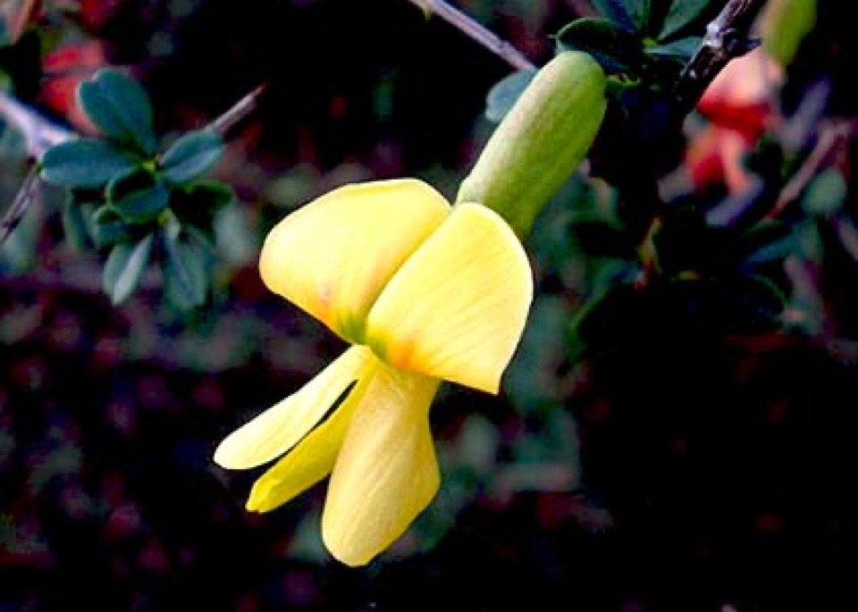
*꽃 | 꽃: 연한 노란 바탕에 빨간 노랑이 있고, 점차 색이 변함 꽃 · 지난해 자란 가지의 잎겨드랑이에 1개씩 달림 · 암수한그루*

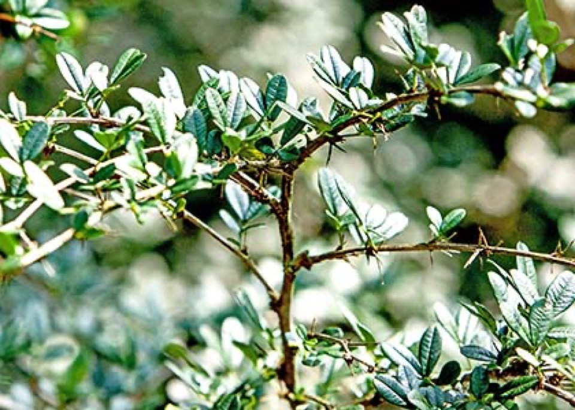
*수형 | 수형: 높이 1~2 m · 수피: 어두운 갈색(암갈색)*

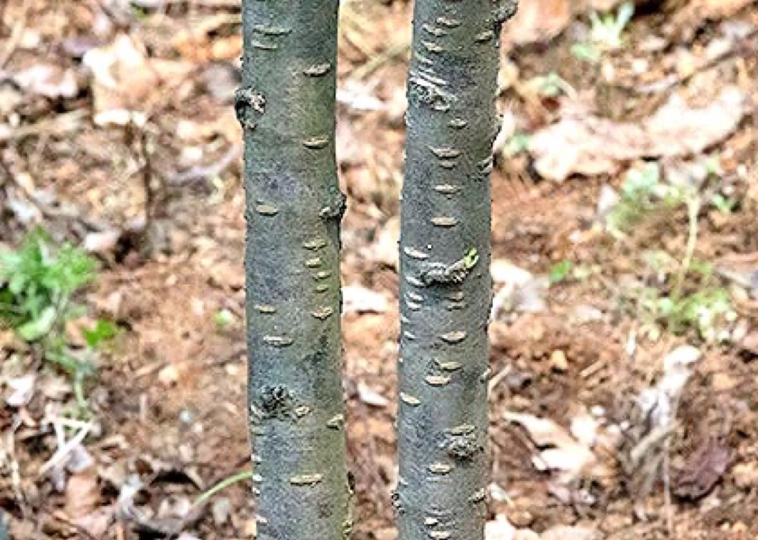
*줄기 | 줄기: 높이 1~2 m · 수피: 어두운 갈색(암갈색)*

### 감별 핵심 포인트
- 노란 꽃이 작은 나비처럼 아래로 매달립니다.
- 작은 잎들이 짝을 이루어 달리는 모습을 살펴보세요.
- 낮게 자라는 관목의 노란 꽃과 잎을 함께 기억하세요.

### 주된 형태 특징 (4대 감별 지표)
- **🌿 잎:** 어긋나기 · 짝수 깃꼴 겹잎(우수우상복엽)으로 2쌍씩 붙어 있거나 손바닥꼴로 4개 · 가장자리: 밋밋함 · 깃꼴맥(우상맥) 때로는 손바닥꼴맥(장상맥)
- **🌸 꽃:** 연한 노란 바탕에 빨간 노랑이 있고, 점차 색이 변함 꽃 · 지난해 자란 가지의 잎겨드랑이에 1개씩 달림 · 암수한그루
- **🍒 열매:** 밝은 붉은빛 갈색 열매 · 꼬투리열매(협과)
- **🪵 줄기·수형:** 높이 1~2 m · 수피: 어두운 갈색(암갈색)

[파이팅혼공 TV 강의](https://www.youtube.com/watch?v=K3PvgTi3eXI&t=610s) · [수목도감(treeworld)](https://treeworld.co.kr/a01_01_02/30875) · [위키백과(한국어)](https://ko.wikipedia.org/wiki/%EA%B3%A8%EB%8B%B4%EC%B4%88) · [Wikipedia(English)](https://en.wikipedia.org/wiki/Caragana_sinica)

## 011. 곰솔
> *Pinus thunbergii Parl.* · Pinaceae 소나무과

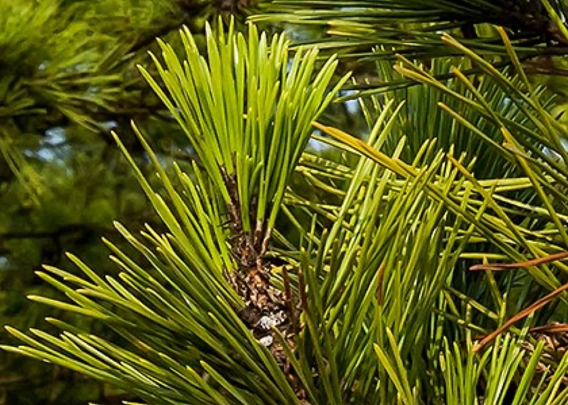
*잎 | 잎: 2잎씩 모아나기(2엽송) · 길이 9~14 cm, 너비 1.5 mm안팎 · 가장자리: 매우 작은 톱니가 있음*

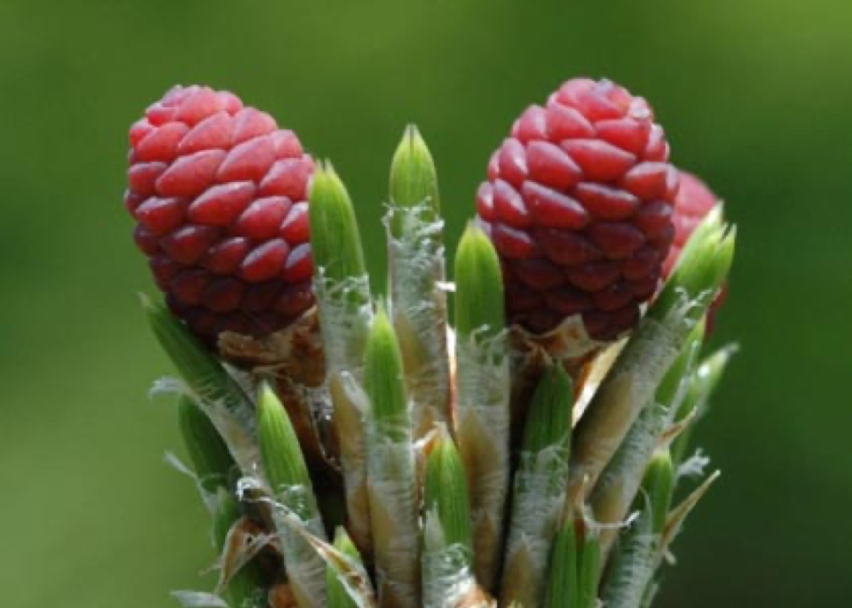
*꽃 | 꽃: 암꽃방울은 연한 빨강 또는 자줏빛 빨강, 수꽃이삭은 노란 갈색 꽃 · 암꽃방울은 햇가지의 끝 가까이에 1~4개가 달림 · 암수한그루*

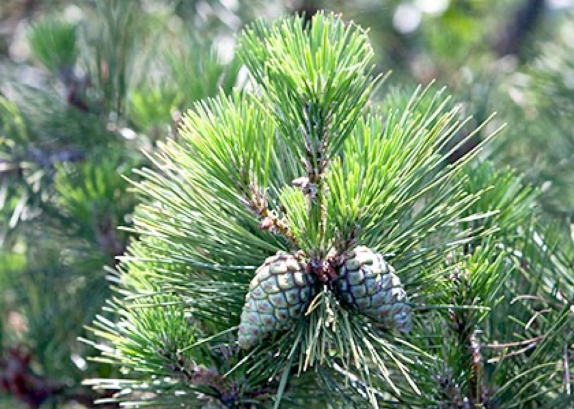
*열매 | 열매: 솔방울은 노란갈색 열매 · 솔방울(구과)은 달걀꼴 긴타원형, 원뿔꼴 타원형으로 길이 4~6 cm, 너비 3~4 cm이고, 씨비늘조각은 많고, 열매자루는 짧음*

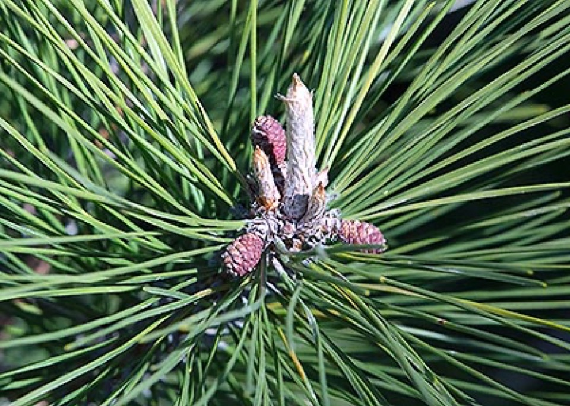
*수형 | 수형: 높이 10~25(40) m, 지름 50~80 cm · 수피: 검은갈색, 회빛 검정*

### 감별 핵심 포인트
- 바닷가 방풍림에서 볼 수 있는 소나무류로, 해송이라고도 합니다.
- 침엽이 두 개씩 모여 나며 수피가 어둡습니다.
- 가지 끝의 새눈과 암꽃·수꽃 모양을 잎과 함께 봅니다.

### 주된 형태 특징 (4대 감별 지표)
- **🌿 잎:** 2잎씩 모아나기(2엽송) · 길이 9~14 cm, 너비 1.5 mm안팎 · 가장자리: 매우 작은 톱니가 있음 · 기공선이 앞뒷면에 있음
- **🌸 꽃:** 암꽃방울은 연한 빨강 또는 자줏빛 빨강, 수꽃이삭은 노란 갈색 꽃 · 암꽃방울은 햇가지의 끝 가까이에 1~4개가 달림 · 암수한그루
- **🍒 열매:** 솔방울은 노란갈색 열매 · 솔방울(구과)은 달걀꼴 긴타원형, 원뿔꼴 타원형으로 길이 4~6 cm, 너비 3~4 cm이고, 씨비늘조각은 많고, 열매자루는 짧음
- **🪵 줄기·수형:** 높이 10~25(40) m, 지름 50~80 cm · 수피: 검은갈색, 회빛 검정

**비교·주의:** 소나무와 함께 2엽입니다. 바닷가 배경만으로 단정하지 말고 수피와 눈도 확인하세요.

[파이팅혼공 TV 강의](https://www.youtube.com/watch?v=K3PvgTi3eXI&t=650s) · [수목도감(treeworld)](https://treeworld.co.kr/a01_01_02/30866) · [위키백과(한국어)](https://ko.wikipedia.org/wiki/%EA%B3%B0%EC%86%94) · [Wikipedia(English)](https://en.wikipedia.org/wiki/Pinus_thunbergii)

## 012. 광나무
> *Ligustrum japonicum Thunb.* · Oleaceae 물푸레나무과

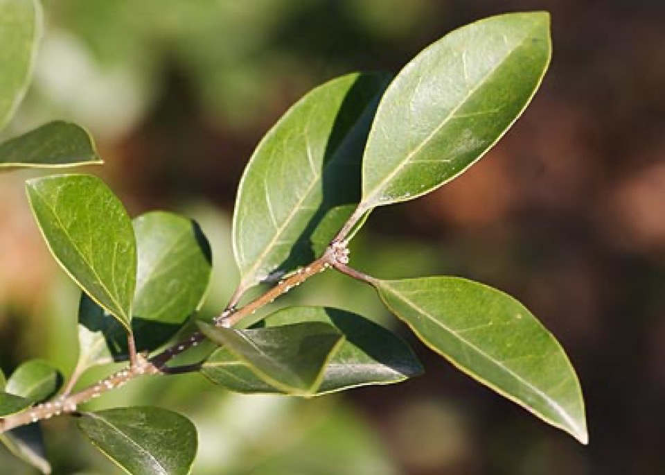
*잎 | 잎: 마주나기하고, 가지 끝에 홑잎이 없음 · 홑잎 · 가장자리: 밋밋함(전연)*

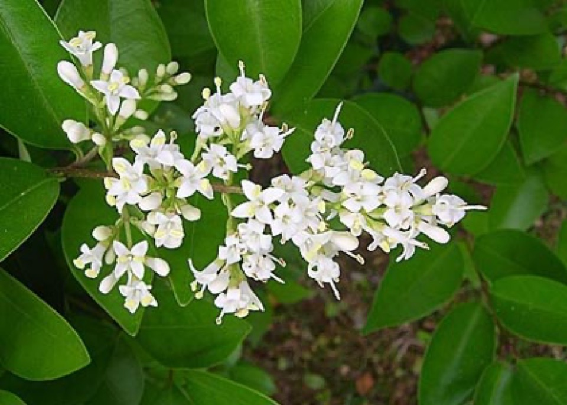
*꽃 | 꽃: 꽃잎은 하양 꽃 · 삼각꼴 원뿔꽃차례 · 갖춘꽃*

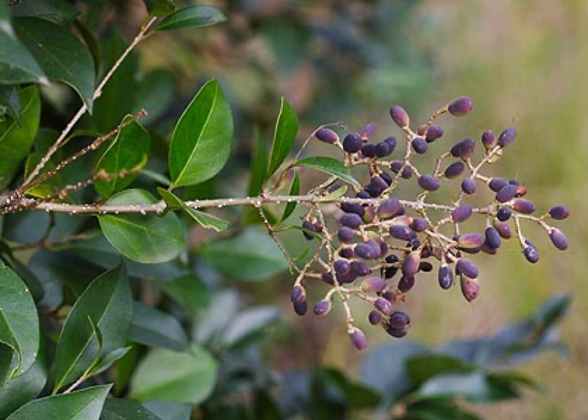
*열매 | 열매: 열매는 보랏빛 검정 열매 · 굳은씨열매(핵과)*

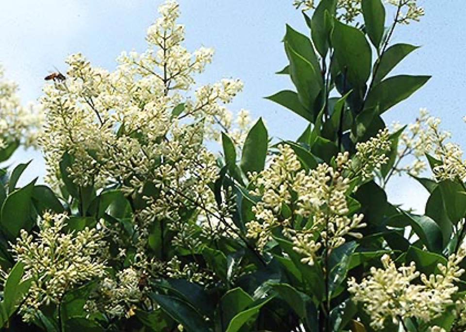
*수형 | 수형: 높이 2~6 m, 너비 2~2.5 m · 수피: 껍질은 회갈색*

### 감별 핵심 포인트
- 타원형 잎이 두껍고 매끈하며 광택이 납니다.
- 작은 흰 꽃이 무리 지어 피고 수술이 꽃 밖으로 보입니다.
- 열매는 검은색으로 익어 모여 달립니다.

### 주된 형태 특징 (4대 감별 지표)
- **🌿 잎:** 마주나기하고, 가지 끝에 홑잎이 없음 · 홑잎 · 가장자리: 밋밋함(전연) · 곁맥은 4~5쌍으로 뚜렷하지 않고, 중앙맥은 윗쪽으로 오목하고, 뒤쪽으로 튀어나오고, 가장자리와 뒤쪽이 때로 연한 빨간 갈색을 띰
- **🌸 꽃:** 꽃잎은 하양 꽃 · 삼각꼴 원뿔꽃차례 · 갖춘꽃
- **🍒 열매:** 열매는 보랏빛 검정 열매 · 굳은씨열매(핵과)
- **🪵 줄기·수형:** 높이 2~6 m, 너비 2~2.5 m · 수피: 껍질은 회갈색

**비교·주의:** 꽝꽝나무의 더 작은 잎, 쥐똥나무의 얇은 잎과 비교하세요.

[파이팅혼공 TV 강의](https://www.youtube.com/watch?v=K3PvgTi3eXI&t=730s) · [수목도감(treeworld)](https://treeworld.co.kr/a01_01_02/30840) · [위키백과(한국어)](https://ko.wikipedia.org/wiki/%EA%B4%91%EB%82%98%EB%AC%B4) · [Wikipedia(English)](https://en.wikipedia.org/wiki/Ligustrum_japonicum)

## 013. 구상나무
> *Abies koreana E.H.Wilson* · Pinaceae소나무과

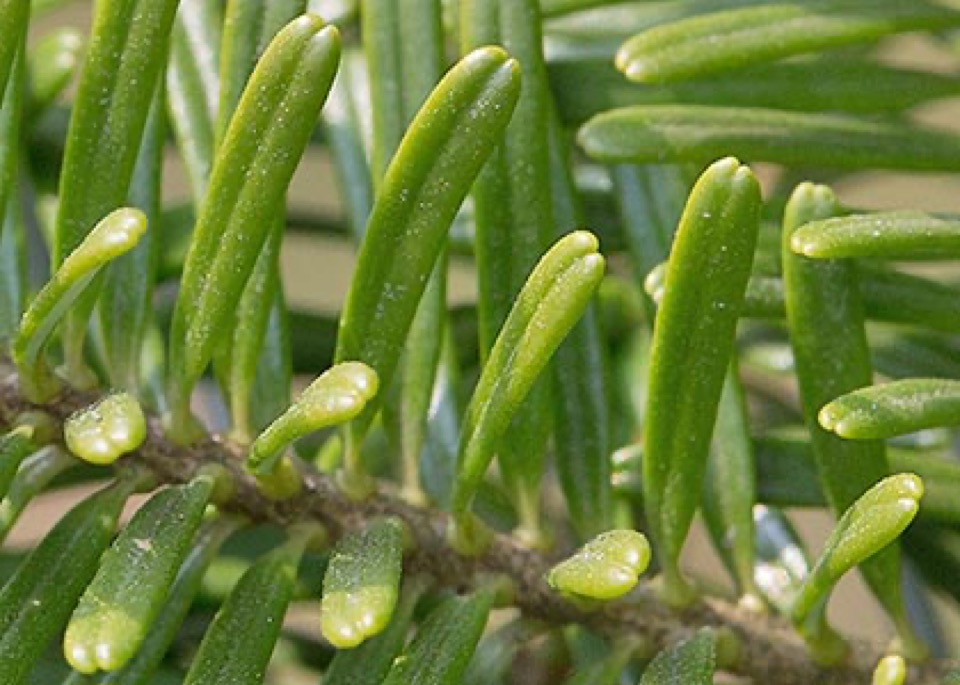
*잎 | 잎: 돌려나기(윤생)로 무리를 이룸 · 거꿀피침꼴 선형으로 길이 1~1.4 cm, 너비 2.1~2.4 mm · 가장자리: 밋밋함*

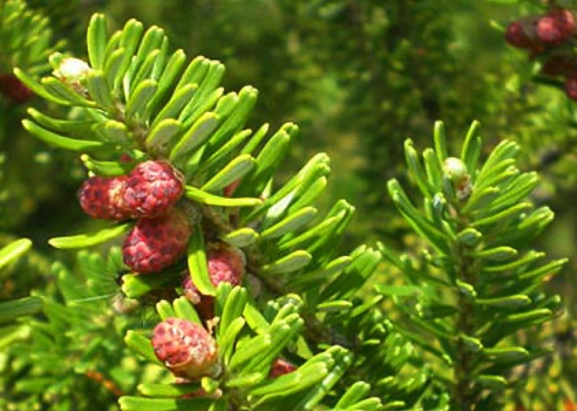
*꽃 | 꽃: 암꽃방울은 보통 자주 꽃 · 앞꽃방울과 수꽃이삭은 지난 해 자란 가지의 끝 부분에 달림 · 암수한그루*

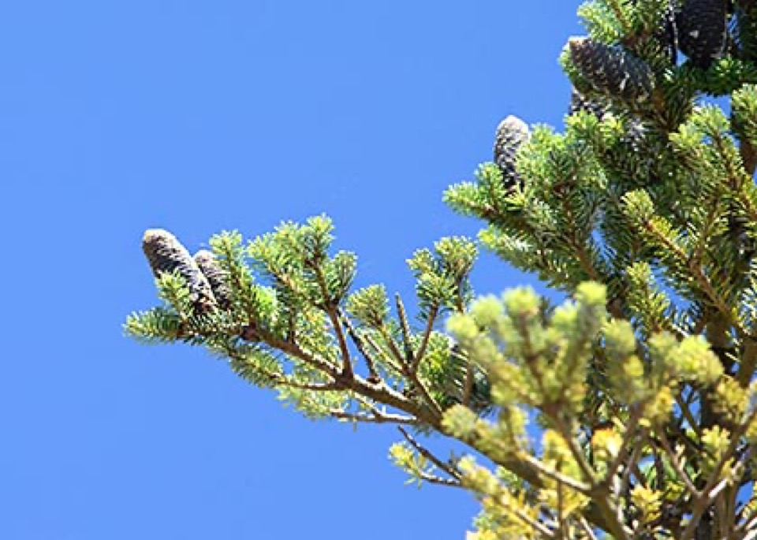
*열매 | 열매: 씨방울은 익기 전에는 보라빛 자주 또는 자줏빛 갈색이지만 나중에는 역시 초록 열매 · 솔방울열매(구과)*

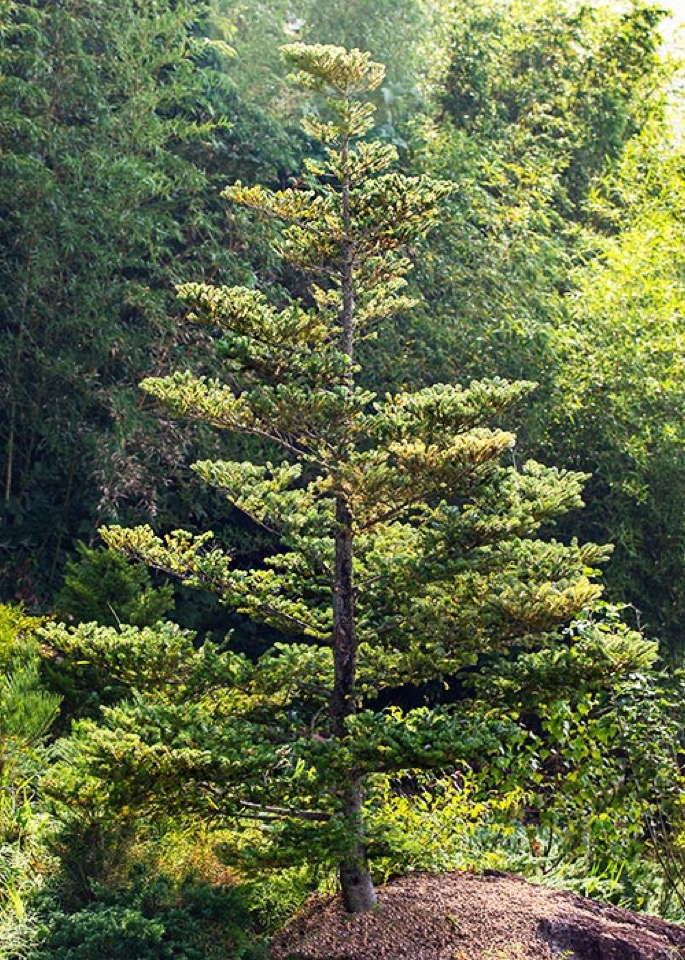
*수형 | 수형: 높이 15~18 m · 수피: 회갈색에서 점차 검은 초록빛 갈색*

### 감별 핵심 포인트
- 짧고 두꺼운 잎이 가지에 촘촘히 붙습니다.
- 솔방울이 가지 위로 곧게 서는 모습이 특징입니다.
- 잎 뒷면의 흰 부분과 잎 끝 모양도 살펴보세요.

### 주된 형태 특징 (4대 감별 지표)
- **🌿 잎:** 돌려나기(윤생)로 무리를 이룸 · 거꿀피침꼴 선형으로 길이 1~1.4 cm, 너비 2.1~2.4 mm · 가장자리: 밋밋함 · 뒤쪽에 중앙맥 외에는 하얀 2줄의 기공선이 있음
- **🌸 꽃:** 암꽃방울은 보통 자주 꽃 · 앞꽃방울과 수꽃이삭은 지난 해 자란 가지의 끝 부분에 달림 · 암수한그루
- **🍒 열매:** 씨방울은 익기 전에는 보라빛 자주 또는 자줏빛 갈색이지만 나중에는 역시 초록 열매 · 솔방울열매(구과)
- **🪵 줄기·수형:** 높이 15~18 m · 수피: 회갈색에서 점차 검은 초록빛 갈색

**비교·주의:** 솔방울이 아래로 처지는 독일가문비와 비교하세요.

[파이팅혼공 TV 강의](https://www.youtube.com/watch?v=K3PvgTi3eXI&t=890s) · [수목도감(treeworld)](https://treeworld.co.kr/a01_01_02/30812) · [위키백과(한국어)](https://ko.wikipedia.org/wiki/%EA%B5%AC%EC%83%81%EB%82%98%EB%AC%B4) · [Wikipedia(English)](https://en.wikipedia.org/wiki/Abies_koreana)

## 014. 금목서
> *Osmanthus fragrans Lour.* · Oleaceae 물푸레나무과

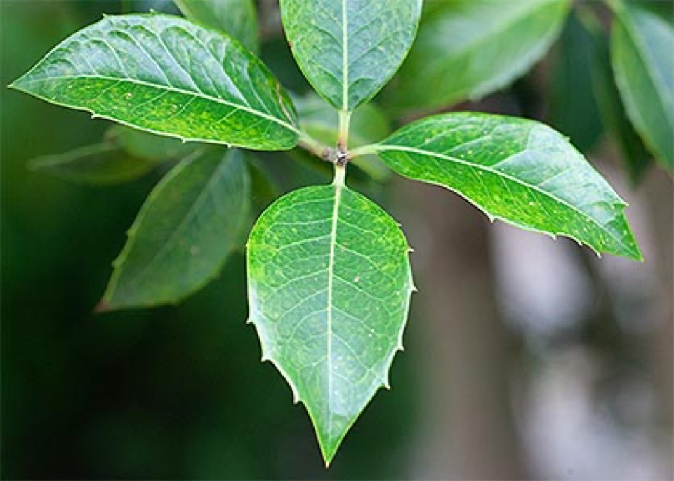
*잎 | 잎: 마주나기(대생) 또는 거의 마주나기(아대생) · 홑잎 · 가장자리: 거의 밋밋하거나 끝을 따라 절반까지 잔톱니가 있음*

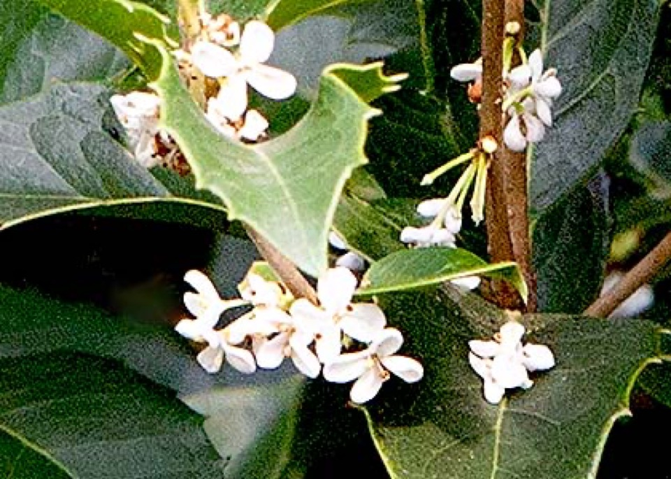
*꽃 | 꽃: 꽃부리는 하양, 크림색, 변종은 노랑, 주황 또는 쥐색 꽃 · 모인꽃차례(취산화서) · 암수딴그루(자웅이주)*

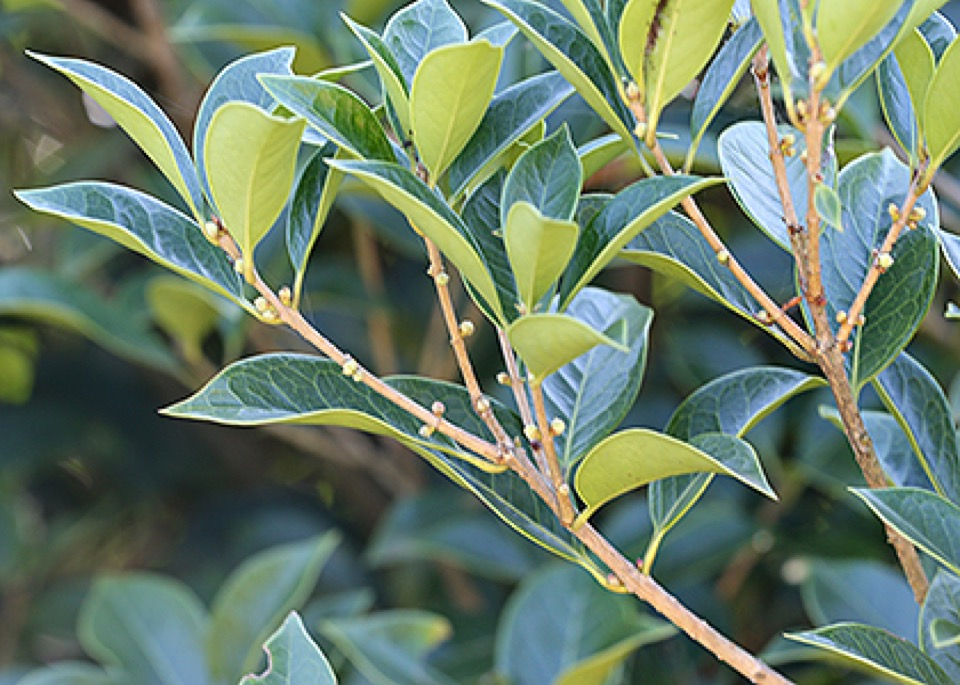
*수형 | 수형: 높이 3~5(12) m · 수피: 회갈색, 회색*

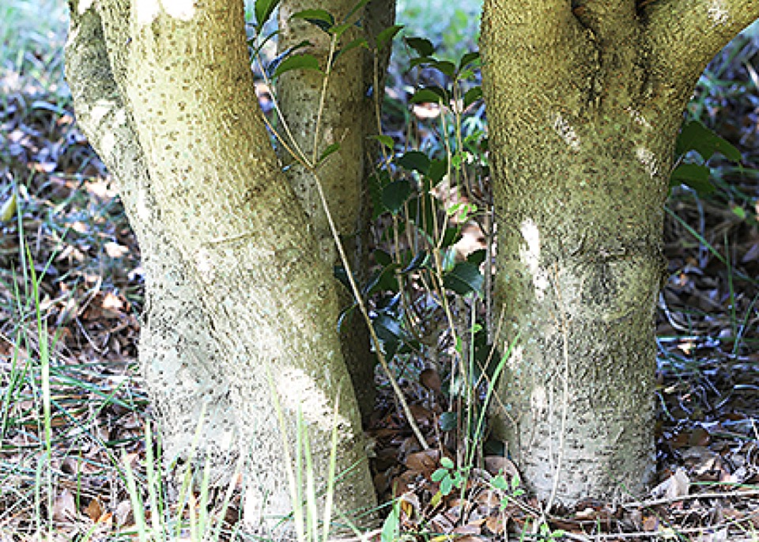
*줄기 | 줄기: 높이 3~5(12) m · 수피: 회갈색, 회색*

### 감별 핵심 포인트
- 두껍고 길쭉한 잎 사이로 작은 황색·주황색 꽃이 모여 핍니다.
- 작은 꽃의 끝이 네 갈래로 나뉩니다.
- 매끈한 잎과 촘촘한 주황빛 꽃의 조합을 기억하세요.

### 주된 형태 특징 (4대 감별 지표)
- **🌿 잎:** 마주나기(대생) 또는 거의 마주나기(아대생) · 홑잎 · 가장자리: 거의 밋밋하거나 끝을 따라 절반까지 잔톱니가 있음 · 깃털꼴 그물맥
- **🌸 꽃:** 꽃부리는 하양, 크림색, 변종은 노랑, 주황 또는 쥐색 꽃 · 모인꽃차례(취산화서) · 암수딴그루(자웅이주)
- **🍒 열매:** 자주빛 검정, 남색 열매 · 굳은씨열매(핵과)
- **🪵 줄기·수형:** 높이 3~5(12) m · 수피: 회갈색, 회색

[파이팅혼공 TV 강의](https://www.youtube.com/watch?v=K3PvgTi3eXI&t=950s) · [수목도감(treeworld)](https://treeworld.co.kr/a01_01_02/29996) · [위키백과(한국어)](https://ko.wikipedia.org/wiki/%EA%B8%88%EB%AA%A9%EC%84%9C) · [Wikipedia(English)](https://en.wikipedia.org/wiki/Osmanthus_fragrans)

## 015. 금송
> *Sciadopitys verticillata (Thunb.) Siebold & Zucc.* · Sciadopityaceae 금송과

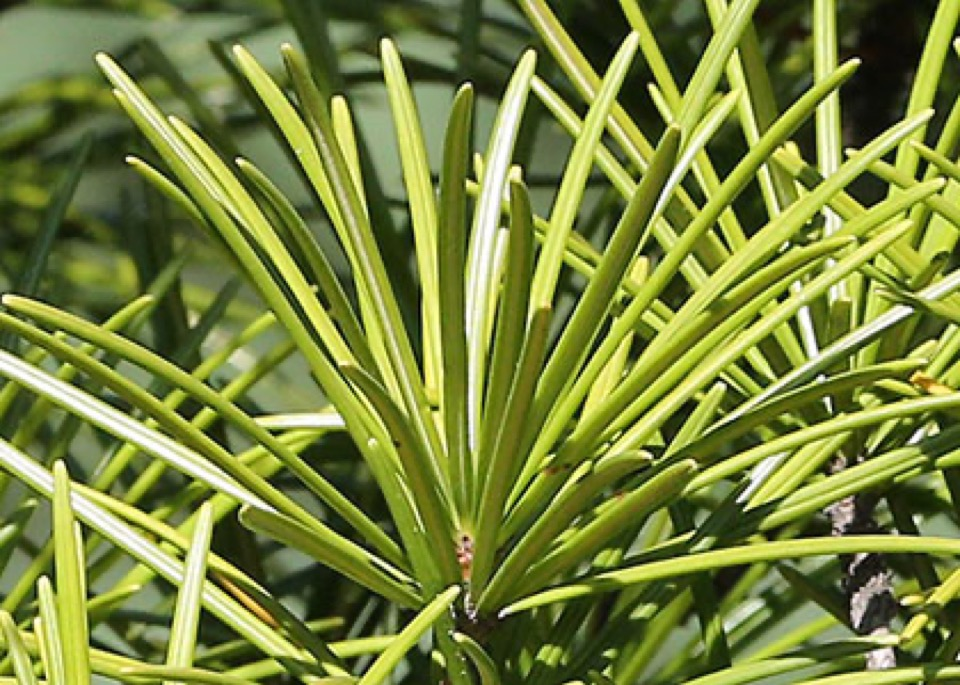
*잎 | 잎: 짧은 가지 끝에 2열 또는 3열로 모아나기 또는 한 마디에 20~45개 몪음으로 돌려나기 함 · 두가지 형태의 잎 · 가장자리: 밋밋함*

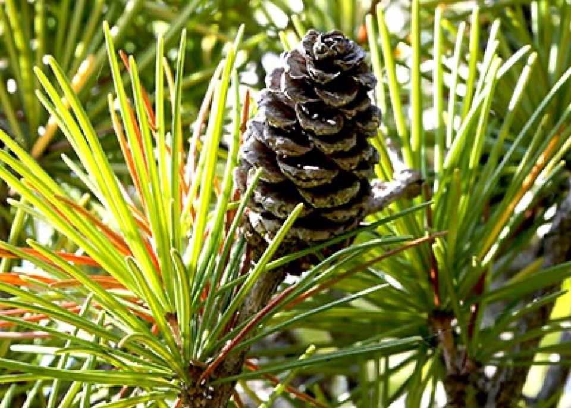
*열매 | 열매: 갈색 열매 · 솔방울은 길이 8~12 cm로서 달걀꼴 타원형이고 곧추섬*

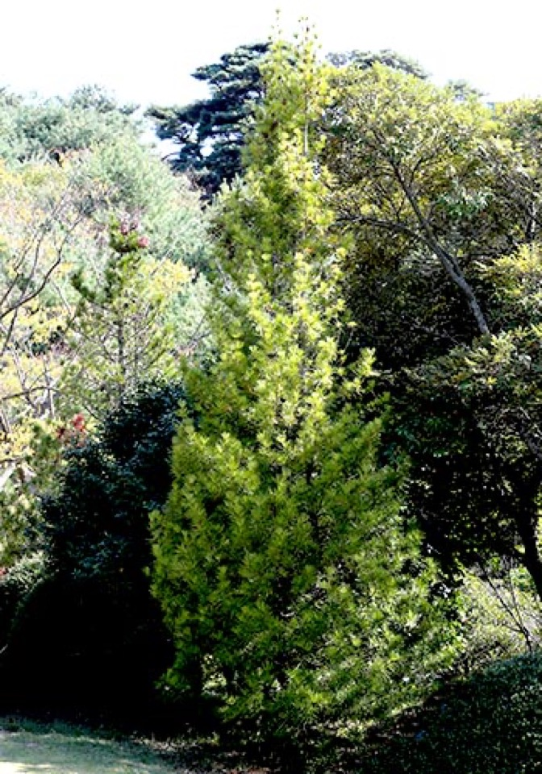
*수형 | 수형: 높이 20~30(35) m, 지름 1(2) m의 곧은 줄기 · 수피: 붉은갈색 또는 회갈색*

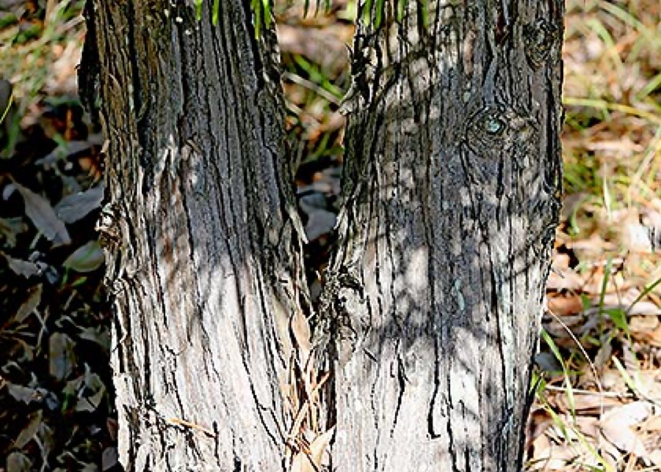
*줄기 | 줄기: 높이 20~30(35) m, 지름 1(2) m의 곧은 줄기 · 수피: 붉은갈색 또는 회갈색*

### 감별 핵심 포인트
- 긴 잎이 가지 끝에 모여 우산살이나 빗자루처럼 퍼집니다.
- 새잎이 위로 모여 올라오는 모습을 봅니다.
- 가지 끝에 모여 있는 수꽃 무리도 감별 단서입니다.

### 주된 형태 특징 (4대 감별 지표)
- **🌿 잎:** 짧은 가지 끝에 2열 또는 3열로 모아나기 또는 한 마디에 20~45개 몪음으로 돌려나기 함 · 두가지 형태의 잎 · 가장자리: 밋밋함 · 곧은맥(직맥, 평행맥의 하나)으로 중앙으로 흰기공대가 있음
- **🌸 꽃:** 암꽃방울과 수꽃방울 모두 갈색에 가까움 꽃 · 암꽃방울은 가지 끝에 1~2개씩 달림 · 암수한그루(1가화)
- **🍒 열매:** 갈색 열매 · 솔방울은 길이 8~12 cm로서 달걀꼴 타원형이고 곧추섬
- **🪵 줄기·수형:** 높이 20~30(35) m, 지름 1(2) m의 곧은 줄기 · 수피: 붉은갈색 또는 회갈색

**비교·주의:** 소나무처럼 두 잎만 묶인 모습과 구별하세요.

[파이팅혼공 TV 강의](https://www.youtube.com/watch?v=K3PvgTi3eXI&t=1010s) · [수목도감(treeworld)](https://treeworld.co.kr/a01_01_02/30731) · [위키백과(한국어)](https://ko.wikipedia.org/wiki/%EA%B8%88%EC%86%A1) · [Wikipedia(English)](https://en.wikipedia.org/wiki/Sciadopitys_verticillata)

## 016. 금식나무
> *Aucuba japonica Thunb.* · Garryaceae 가리아 과

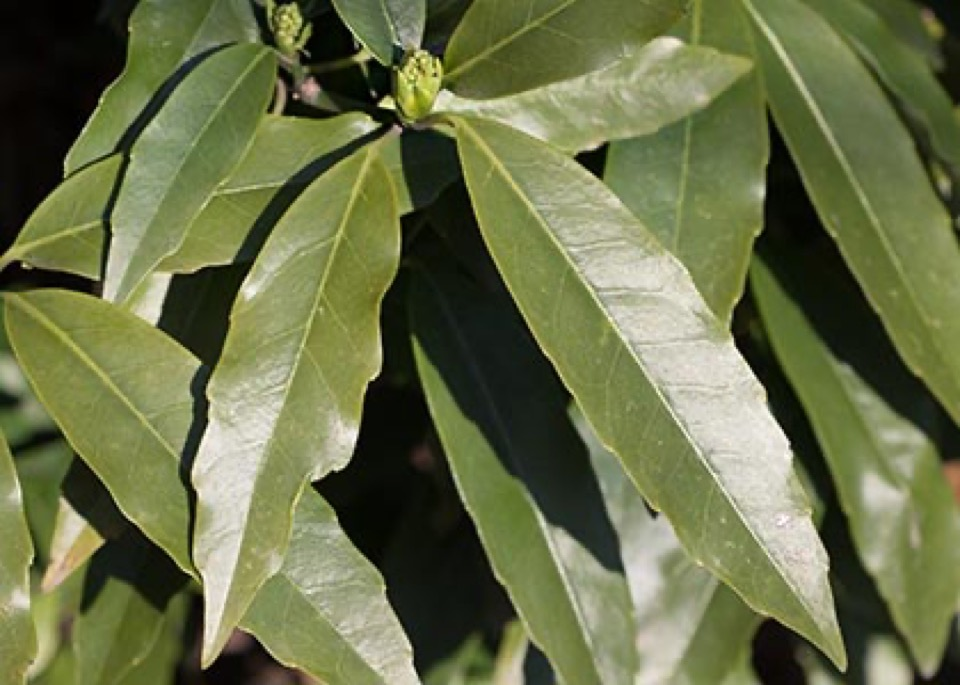
*잎 | 잎: 마주나기 또는 거의 마주나기 · 홑잎 · 가장자리: 윗부분에 2~4(6)쌍의 거친 이빨꼴 톱니가 있거나 또는 밋밋함*

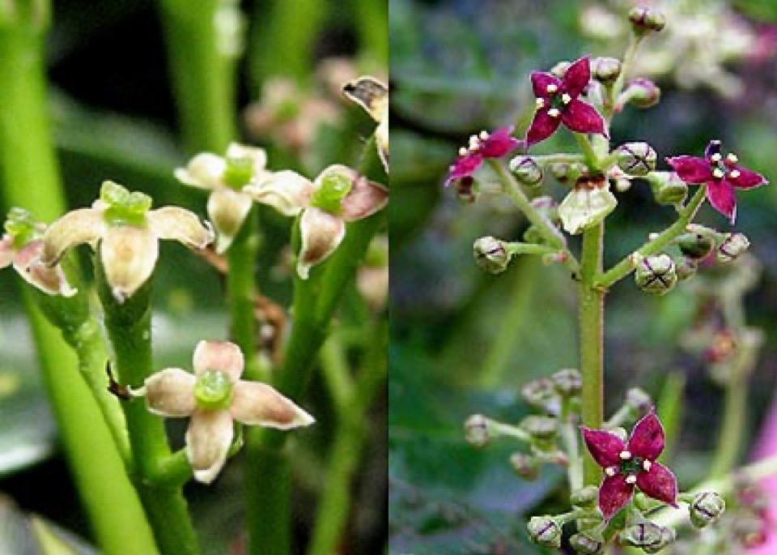
*꽃 | 꽃: 암꽃은 연한 자주 또는 초록 꽃 · 고깔꽃차례(원추화서) · 암수딴그루(이가화)*

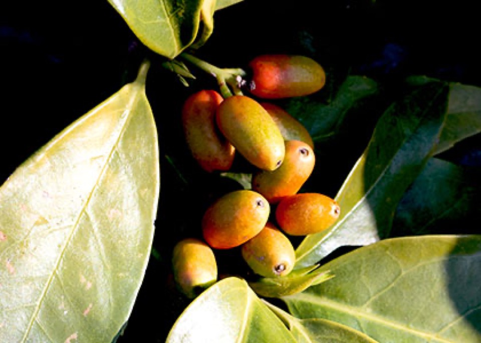
*열매 | 열매: 빨강, 진한 자주 열매 · 굳은씨열매(핵과), 물열매(장과)*

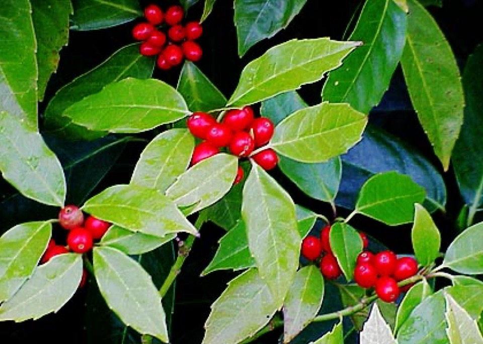
*수형 | 수형: 높이 2~3 m · 수피: 어린나무는 진한초록이고, 오래되면 목질화되면서 회갈색*

### 감별 핵심 포인트
- 초록색 잎에 노란 얼룩무늬가 불규칙하게 나타납니다.
- 잎이 넓고 두꺼우며 가장자리에 톱니가 보입니다.
- 노란 반점이 흩어진 잎이 가장 빠른 감별 단서입니다.

### 주된 형태 특징 (4대 감별 지표)
- **🌿 잎:** 마주나기 또는 거의 마주나기 · 홑잎 · 가장자리: 윗부분에 2~4(6)쌍의 거친 이빨꼴 톱니가 있거나 또는 밋밋함 · 깃꼴 그믈맥으로 중앙맥의 윗면이 오목하게 들어가고, 아랫면은 불록하게 두두러며, 맨 아래의 윗면 역시 두드러짐
- **🌸 꽃:** 암꽃은 연한 자주 또는 초록 꽃 · 고깔꽃차례(원추화서) · 암수딴그루(이가화)
- **🍒 열매:** 빨강, 진한 자주 열매 · 굳은씨열매(핵과), 물열매(장과)
- **🪵 줄기·수형:** 높이 2~3 m · 수피: 어린나무는 진한초록이고, 오래되면 목질화되면서 회갈색

**비교·주의:** 영상의 얼룩무늬 비유는 암기용입니다. 식물이 영양실조에 걸렸다는 뜻은 아닙니다.

[파이팅혼공 TV 강의](https://www.youtube.com/watch?v=K3PvgTi3eXI&t=1090s) · [수목도감(treeworld)](https://treeworld.co.kr/a01_01_02/29193) · [위키백과(한국어)](https://ko.wikipedia.org/wiki/%EC%8B%9D%EB%82%98%EB%AC%B4) · [Wikipedia(English)](https://en.wikipedia.org/wiki/Aucuba_japonica)

## 017. 꽝꽝나무
> *Ilex crenata Thunb.* · Aquifoliaceae 감탕나무과

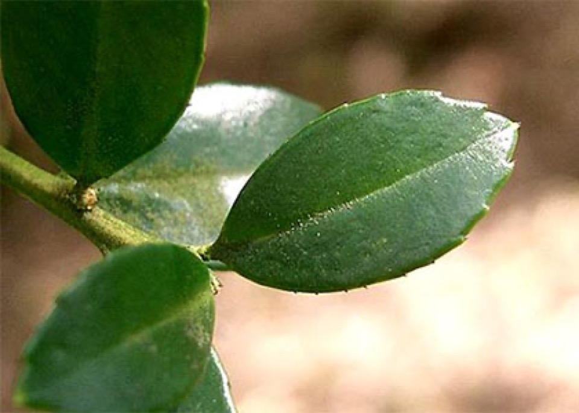
*잎 | 잎: 어긋나기로 모여달림 · 홑잎 · 가장자리: 가는 톱니가 있으며, 위쪽으로 갈수록 날선 톱니(예거치)가 있기도 함*

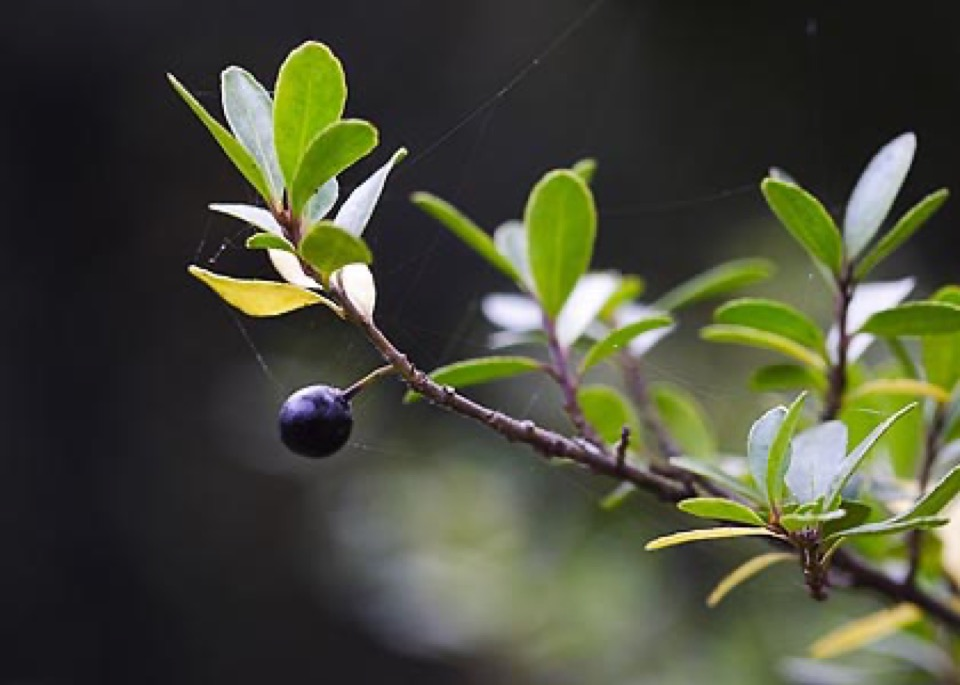
*열매 | 열매: 열매와 씨는 모두 검정 열매 · 굳은씨열매(핵과)*

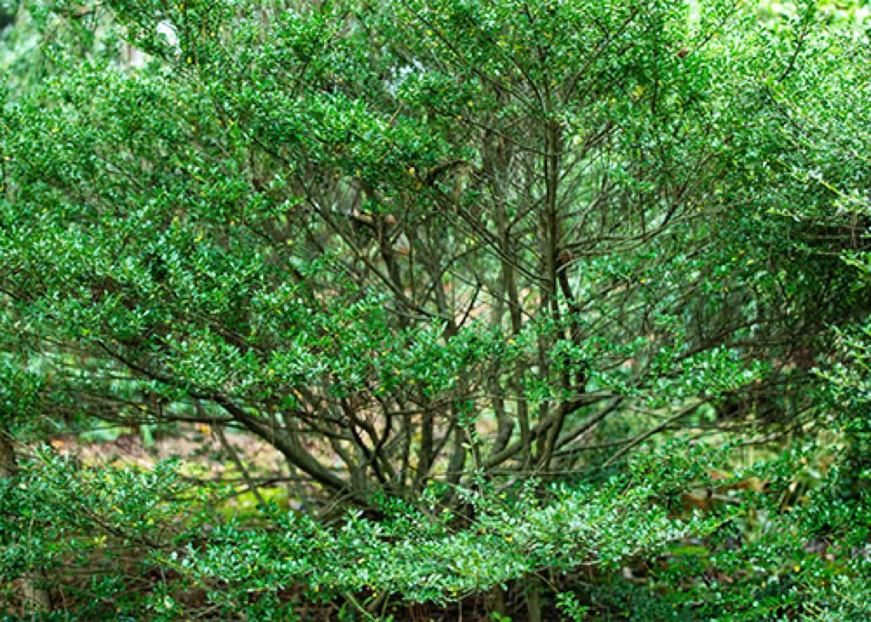
*수형 | 수형: 높이 1.5~3(5) m이지만 더 작은 것도 있음 · 수피: 회빛 하양 또는 어두운 갈색*

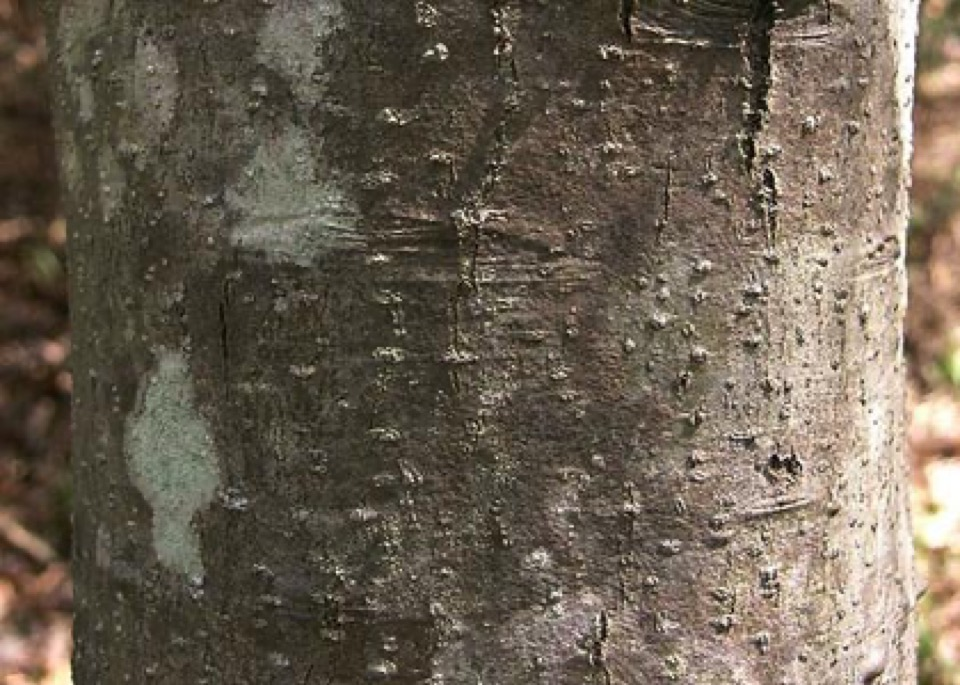
*줄기 | 줄기: 높이 1.5~3(5) m이지만 더 작은 것도 있음 · 수피: 회빛 하양 또는 어두운 갈색*

### 감별 핵심 포인트
- 작고 두꺼운 타원형 잎이 촘촘하게 달립니다.
- 열매는 작고 둥글며 검은색으로 익습니다.
- 작은 잎과 검은 열매를 함께 확인하세요.

### 주된 형태 특징 (4대 감별 지표)
- **🌿 잎:** 어긋나기로 모여달림 · 홑잎 · 가장자리: 가는 톱니가 있으며, 위쪽으로 갈수록 날선 톱니(예거치)가 있기도 함 · 중앙맥은 윗면이 뚜렷하고 뒷면은 높으며, 곁맥은 3~5쌍으로 뚜렷하지 않은 깃꼴 그믈맥
- **🌸 꽃:** 노란 하양 꽃 · 암꽃은 단정꽃차례, 드물게 짧은 산방꽃차례로서 햇가지의 잎겨드랑이 달림 · 암수딴그루
- **🍒 열매:** 열매와 씨는 모두 검정 열매 · 굳은씨열매(핵과)
- **🪵 줄기·수형:** 높이 1.5~3(5) m이지만 더 작은 것도 있음 · 수피: 회빛 하양 또는 어두운 갈색

**비교·주의:** 광나무도 검은 열매가 열리므로 잎의 크기와 형태를 함께 비교합니다.

[파이팅혼공 TV 강의](https://www.youtube.com/watch?v=K3PvgTi3eXI&t=1130s) · [수목도감(treeworld)](https://treeworld.co.kr/a01_01_02/30647) · [위키백과(한국어)](https://ko.wikipedia.org/wiki/%EA%BD%9D%EA%BD%9D%EB%82%98%EB%AC%B4) · [Wikipedia(English)](https://en.wikipedia.org/wiki/Ilex_crenata)

## 018. 낙상홍
> *Ilex serrata Thunb.* · Aquifoliaceae 감탕나무과

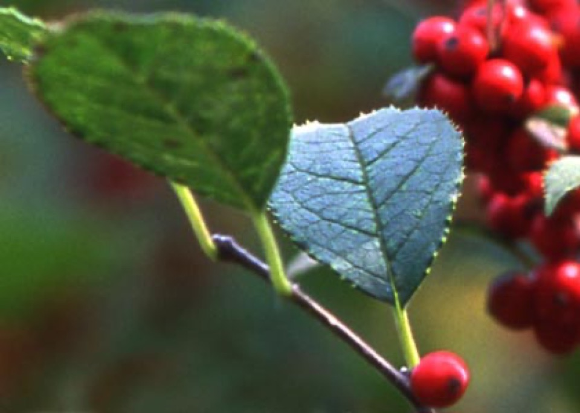
*잎 | 잎: 어긋나기 · 달걀꼴 타원형 또는 긴 타원형 · 가장자리: 날카로운 톱니(예거치)가 있음*

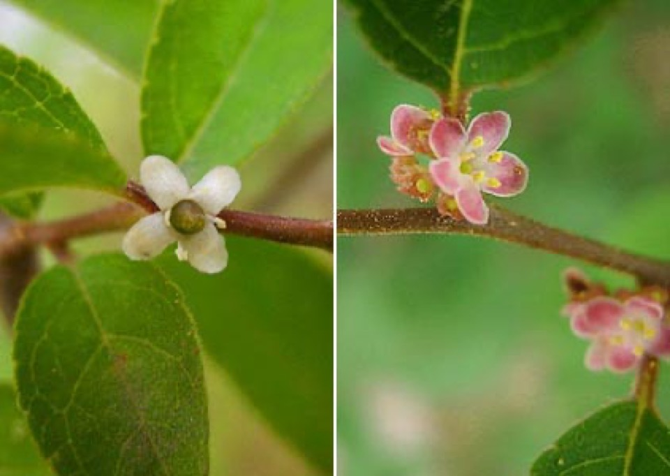
*꽃 | 꽃: 엷은 자주 또는 연분홍(하얀 색에 가까움) 꽃 · 암꽃은 취산꽃차례로 햇가지에 1개 또는 1~3개가 달림 · 암수딴그루(2가화)*

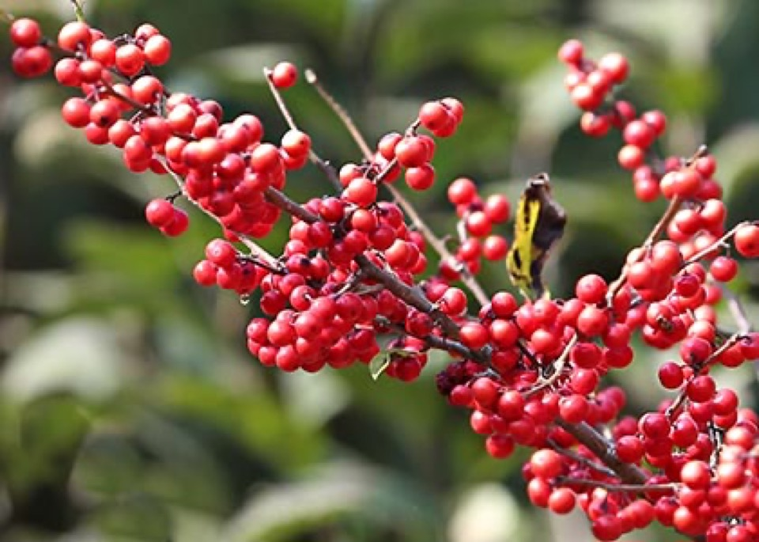
*열매 | 열매: 열매는 빨강 또는 연분홍 열매 · 지름 5 mm쯤의 작은 구슬모양*

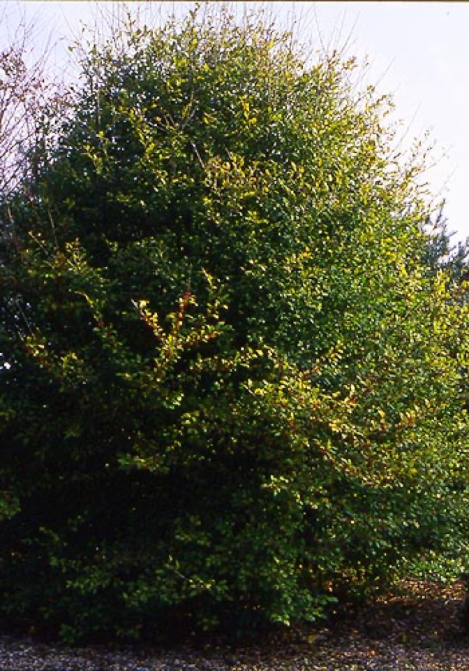
*수형 | 수형: 높이 5 m쯤에 달하나 보통 2~3 m 정도 · 수피: 회색*

### 감별 핵심 포인트
- 가지에 작은 붉은 열매가 촘촘하게 달립니다.
- 잎은 두껍지 않은 타원형이며 가장자리에 톱니가 보입니다.
- 잎이 떨어진 뒤에도 남는 붉은 열매가 눈에 띕니다.

### 주된 형태 특징 (4대 감별 지표)
- **🌿 잎:** 어긋나기 · 달걀꼴 타원형 또는 긴 타원형 · 가장자리: 날카로운 톱니(예거치)가 있음 · 곁맥은 6~8쌍이고, 뚜렷한 그믈맥
- **🌸 꽃:** 엷은 자주 또는 연분홍(하얀 색에 가까움) 꽃 · 암꽃은 취산꽃차례로 햇가지에 1개 또는 1~3개가 달림 · 암수딴그루(2가화)
- **🍒 열매:** 열매는 빨강 또는 연분홍 열매 · 지름 5 mm쯤의 작은 구슬모양
- **🪵 줄기·수형:** 높이 5 m쯤에 달하나 보통 2~3 m 정도 · 수피: 회색

**비교·주의:** 붉은 열매가 맺히는 다른 수목과 혼동하지 않도록 잎과 가지도 살펴보세요.

[파이팅혼공 TV 강의](https://www.youtube.com/watch?v=K3PvgTi3eXI&t=1210s) · [수목도감(treeworld)](https://treeworld.co.kr/a01_01_02/30607) · [위키백과(한국어)](https://ko.wikipedia.org/wiki/%EB%82%99%EC%83%81%ED%99%8D) · [Wikipedia(English)](https://en.wikipedia.org/wiki/Ilex_serrata)

## 019. 남천
> *Nandina domestica Thunb.* · Berberidaceae 매자나무과

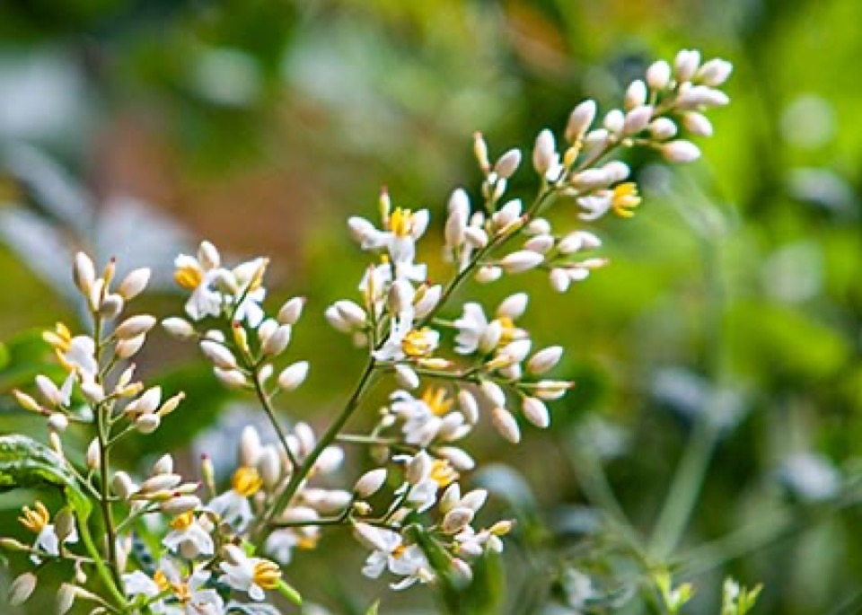
*꽃 | 꽃: 눈이 트일 때는 분홍이지만 나중에는 노란 꽃밥을 가진 하양 꽃 · 원뿔꽃차례(원추화서) · 암수한꽃(양성화)*

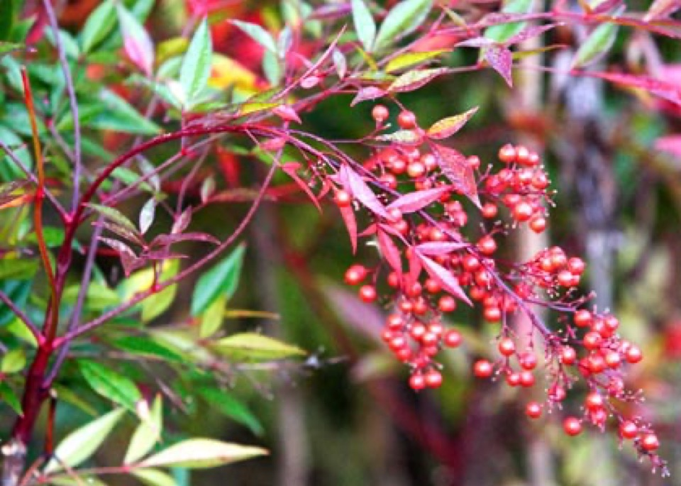
*열매 | 열매: 열매는 연한 초록에서 빨강 또는 자주 열매 · 물열매(장과)*

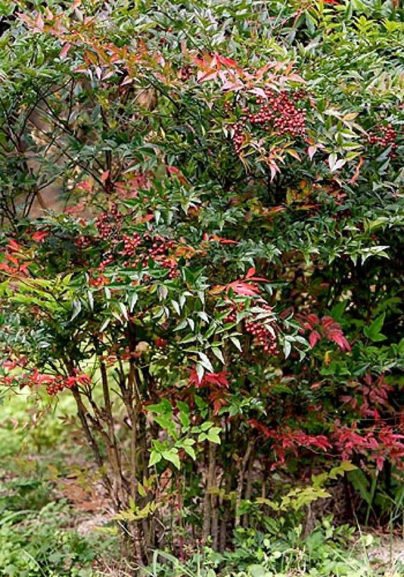
*수형 | 수형: 높이 1~2,5 m, 지름 1~2 cm · 수피: 꼭대기 가까이는 초록빛 회색이고, 밑부분 쪽으로는 노란 갈색에서 갈색*

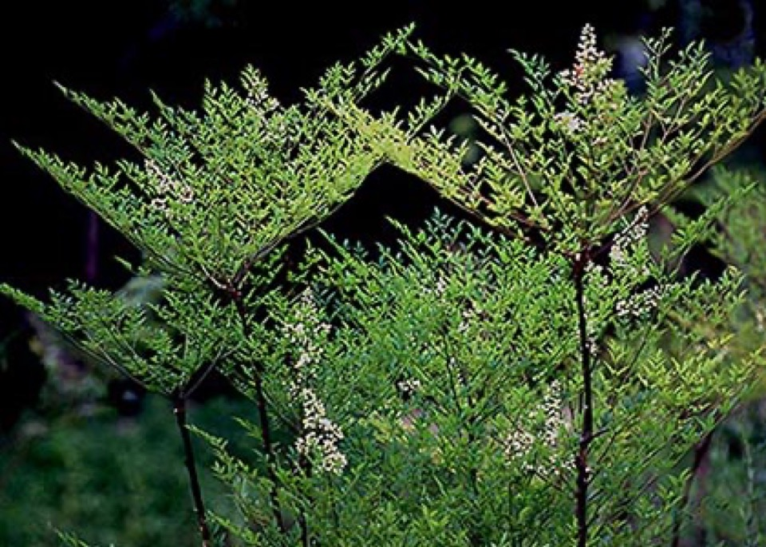
*줄기 | 줄기: 높이 1~2,5 m, 지름 1~2 cm · 수피: 꼭대기 가까이는 초록빛 회색이고, 밑부분 쪽으로는 노란 갈색에서 갈색*

### 감별 핵심 포인트
- 여러 작은 잎으로 이루어진 잎과 붉게 물드는 잎색을 봅니다.
- 작은 흰 꽃이 가지 끝에 모여 핍니다.
- 붉은 열매가 가지 끝에 다발로 달립니다.

### 주된 형태 특징 (4대 감별 지표)
- **🌿 잎:** 큰 잎대는 어긋나게 돌려나기하거나 줄기 끝에 모여달림 · 2~3회 깃꼴겹잎(우상복엽)으로 마디가 있고, 잎이 무성한 가지를 닮은 것처럼 보임 · 가장자리: 톱니가 없음 · 깃꼴맥으로 뚜럿하지 않음
- **🌸 꽃:** 눈이 트일 때는 분홍이지만 나중에는 노란 꽃밥을 가진 하양 꽃 · 원뿔꽃차례(원추화서) · 암수한꽃(양성화)
- **🍒 열매:** 열매는 연한 초록에서 빨강 또는 자주 열매 · 물열매(장과)
- **🪵 줄기·수형:** 높이 1~2,5 m, 지름 1~2 cm · 수피: 꼭대기 가까이는 초록빛 회색이고, 밑부분 쪽으로는 노란 갈색에서 갈색

[파이팅혼공 TV 강의](https://www.youtube.com/watch?v=K3PvgTi3eXI&t=1290s) · [수목도감(treeworld)](https://treeworld.co.kr/a01_01_02/30562) · [위키백과(한국어)](https://ko.wikipedia.org/wiki/%EB%82%A8%EC%B2%9C) · [Wikipedia(English)](https://en.wikipedia.org/wiki/Nandina)

## 020. 노각나무
> *Stewartia pseudocamellia Maxim.* · Theaceae 차나무과

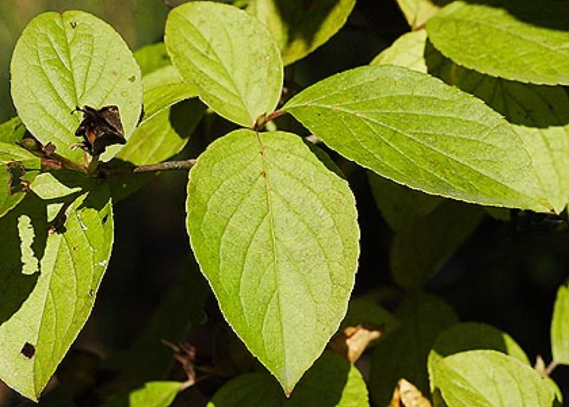
*잎 | 잎: 어긋나기 · 홑잎 · 가장자리: 가장자리를 따라 아주 작은 이빨꼴 톱니가 성기게 있음*

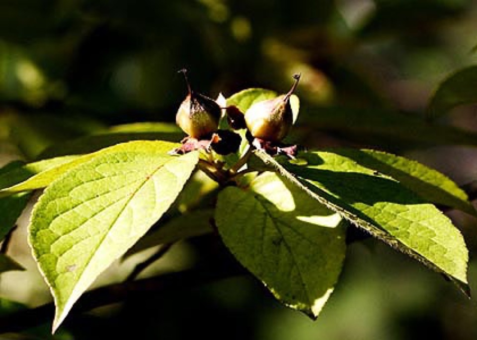
*열매 | 열매: 갈색 또는 노란 빨강 열매 · 튀는 열매(삭과)*

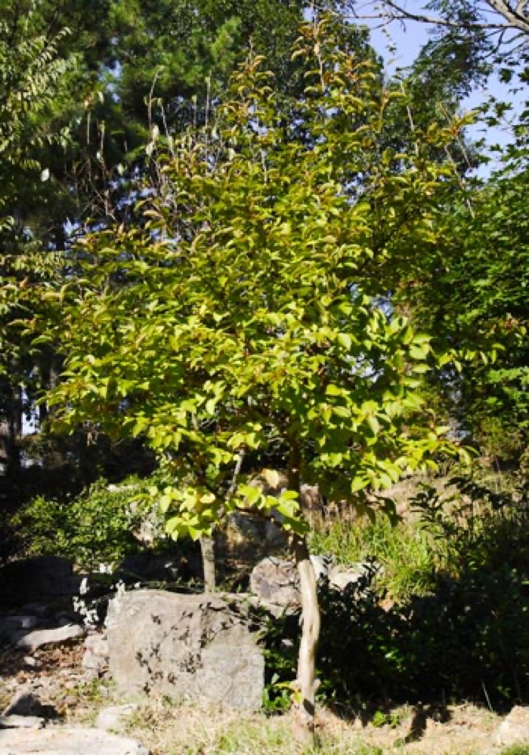
*수형 | 수형: 높이 6~10 m(높이 15 m까지 자랄 수 있음)이고, 곧추 자라며, 때로 아래에 여러 개의 가지가 자람 · 수피: 껍질이 얇게 벗겨지면서 회색, 크림빛 노랑, 주황, 갈색 및 검은 노랑이 섞인 얼룩무늬*

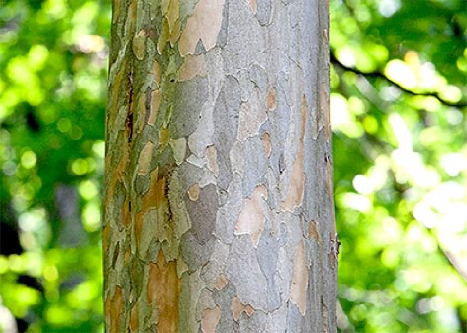
*줄기 | 줄기: 높이 6~10 m(높이 15 m까지 자랄 수 있음)이고, 곧추 자라며, 때로 아래에 여러 개의 가지가 자람 · 수피: 껍질이 얇게 벗겨지면서 회색, 크림빛 노랑, 주황, 갈색 및 검은 노랑이 섞인 얼룩무늬*

### 감별 핵심 포인트
- 흰 꽃 가운데 노란 수술이 풍성하게 모여 있습니다.
- 수피가 벗겨져 얼룩무늬를 이루는 모습이 특징입니다.
- 꽃과 함께 매끈하고 얼룩진 줄기를 기억하세요.

### 주된 형태 특징 (4대 감별 지표)
- **🌿 잎:** 어긋나기 · 홑잎 · 가장자리: 가장자리를 따라 아주 작은 이빨꼴 톱니가 성기게 있음 · 망같은 그믈맥으로 잎가장자리 가까이 이어짐
- **🌸 꽃:** 꽃잎은 하양, 흐린 노랑, 회색이고, 중앙에 크게 노랑으로 물들음( 노란 수술대) 꽃 · 한송이 · 암수한그루
- **🍒 열매:** 갈색 또는 노란 빨강 열매 · 튀는 열매(삭과)
- **🪵 줄기·수형:** 높이 6~10 m(높이 15 m까지 자랄 수 있음)이고, 곧추 자라며, 때로 아래에 여러 개의 가지가 자람 · 수피: 껍질이 얇게 벗겨지면서 회색, 크림빛 노랑, 주황, 갈색 및 검은 노랑이 섞인 얼룩무늬

[파이팅혼공 TV 강의](https://www.youtube.com/watch?v=K3PvgTi3eXI&t=1350s) · [수목도감(treeworld)](https://treeworld.co.kr/a01_01_02/30525) · [위키백과(한국어)](https://ko.wikipedia.org/wiki/%EB%85%B8%EA%B0%81%EB%82%98%EB%AC%B4) · [Wikipedia(English)](https://en.wikipedia.org/wiki/Stewartia_pseudocamellia)

## 021. 노랑말채나무
> *Cornus alba L.* · Cornaceae 층층나무과

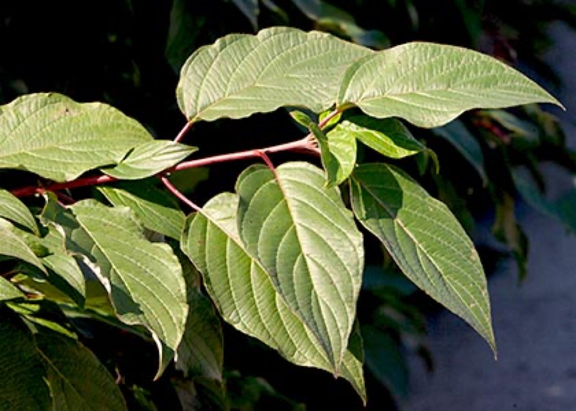
*잎 | 잎: 마주나기 · 홑잎 · 가장자리: 밋밋하거나 약간 뒤로 젖혀짐*

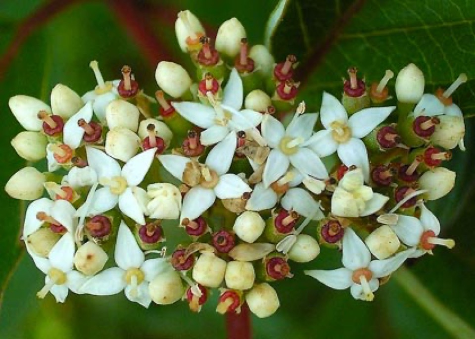
*꽃 | 꽃: 꽃잎은 하양 또는 노란 하양 꽃 · 고른살 모인꽃차례(산방꼴 취산화서) · 꽃대는 길이 2~2.5cm, 너비 3 cm까지 이고, 작은꽃은 길이 약 3 mm, 지름 6~8.2 mm 이며, 작은꽃자루는 가늘고 길이 5~10 mm*

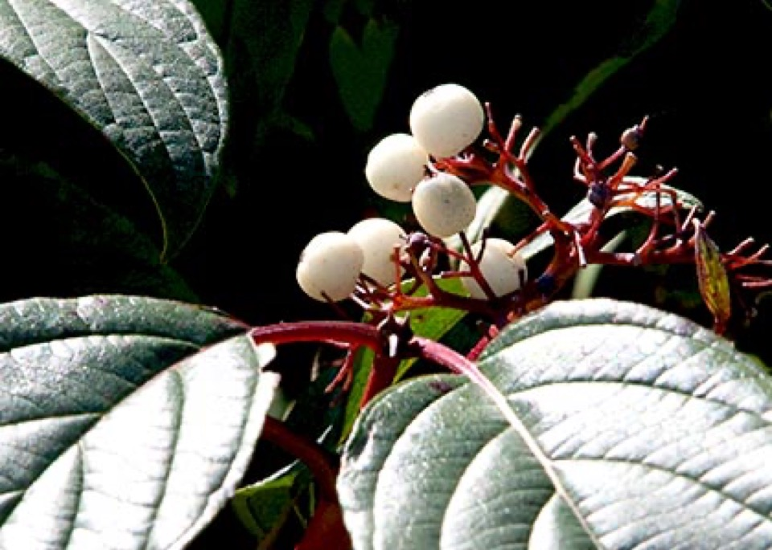
*열매 | 열매: 크림빛 하양 또는 성숙하면 푸른빛 하양 열매 · 굳은씨열매(핵과)*

*수형 | 수형: 높이 2.3~3 m, 너비 1.5~3 m · 수피: 여름에는 껍질이 초록빛 갈색이지만 가을과 겨울에는 자줏빛 빨강*

### 감별 핵심 포인트
- 어린 가지가 노란색을 띠는 것이 중요한 특징입니다.
- 잎맥이 잎 끝을 향해 휘어 올라가는 모습을 봅니다.
- 작은 흰 꽃이 모여 피는 관목입니다.

### 주된 형태 특징 (4대 감별 지표)
- **🌿 잎:** 마주나기 · 홑잎 · 가장자리: 밋밋하거나 약간 뒤로 젖혀짐 · 곁맥은 (4)5~6쌍
- **🌸 꽃:** 꽃잎은 하양 또는 노란 하양 꽃 · 고른살 모인꽃차례(산방꼴 취산화서) · 꽃대는 길이 2~2.5cm, 너비 3 cm까지 이고, 작은꽃은 길이 약 3 mm, 지름 6~8.2 mm 이며, 작은꽃자루는 가늘고 길이 5~10 mm
- **🍒 열매:** 크림빛 하양 또는 성숙하면 푸른빛 하양 열매 · 굳은씨열매(핵과)
- **🪵 줄기·수형:** 높이 2.3~3 m, 너비 1.5~3 m · 수피: 여름에는 껍질이 초록빛 갈색이지만 가을과 겨울에는 자줏빛 빨강

**비교·주의:** 붉은 가지의 흰말채나무, 큰 나무로 자라는 말채나무와 구별하세요.

[파이팅혼공 TV 강의](https://www.youtube.com/watch?v=K3PvgTi3eXI&t=1390s) · [수목도감(treeworld)](https://treeworld.co.kr/a01_01_02/28128) · [위키백과(한국어)](https://ko.wikipedia.org/wiki/%ED%9D%B0%EB%A7%90%EC%B1%84%EB%82%98%EB%AC%B4) · [Wikipedia(English)](https://en.wikipedia.org/wiki/Cornus_alba)

## 022. 녹나무
> *Cinnamomum camphora (L.) J.Presl* · Lauraceae 녹나무과

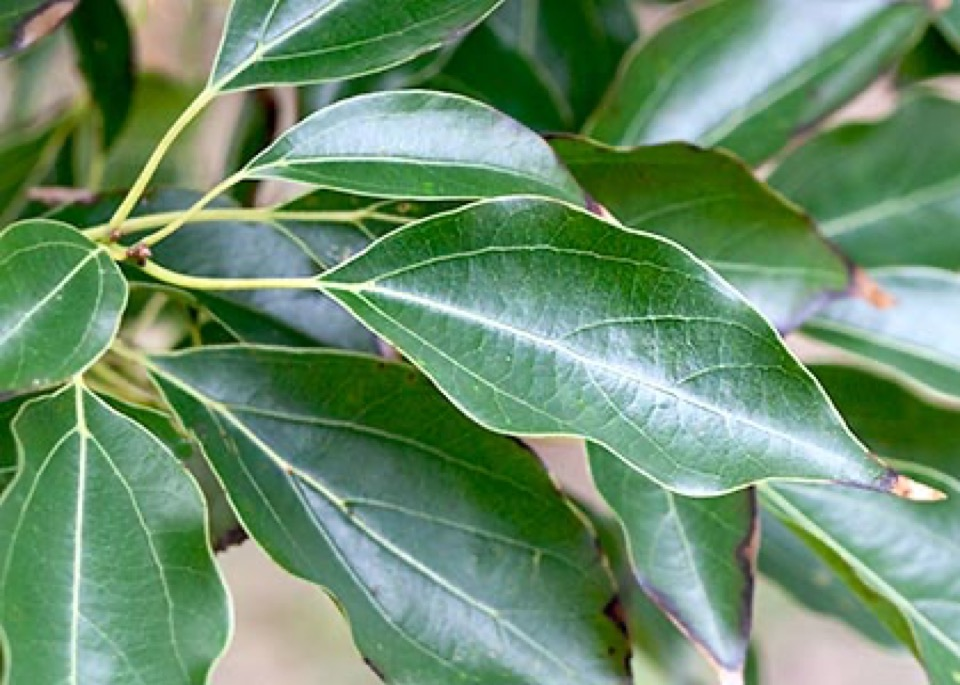
*잎 | 잎: 어긋나기 · 잎몸은 달걀형, 달걀꼴 타원형 · 가장자리: 밋밋하거나 때로 물결꼴*

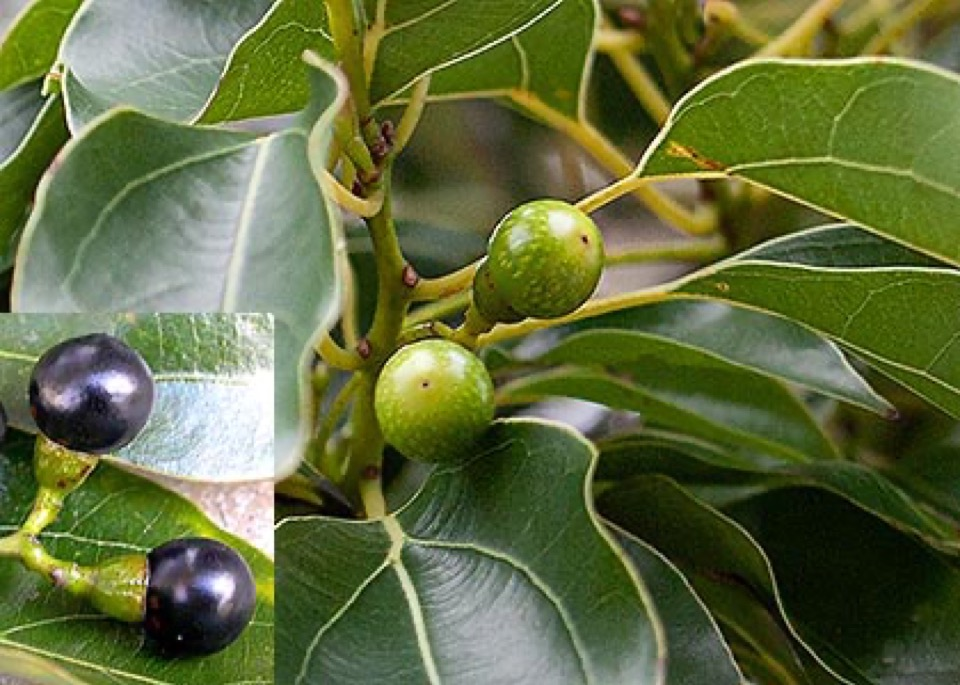
*열매 | 열매: 검은 자주 열매 · 물열매(장과)*

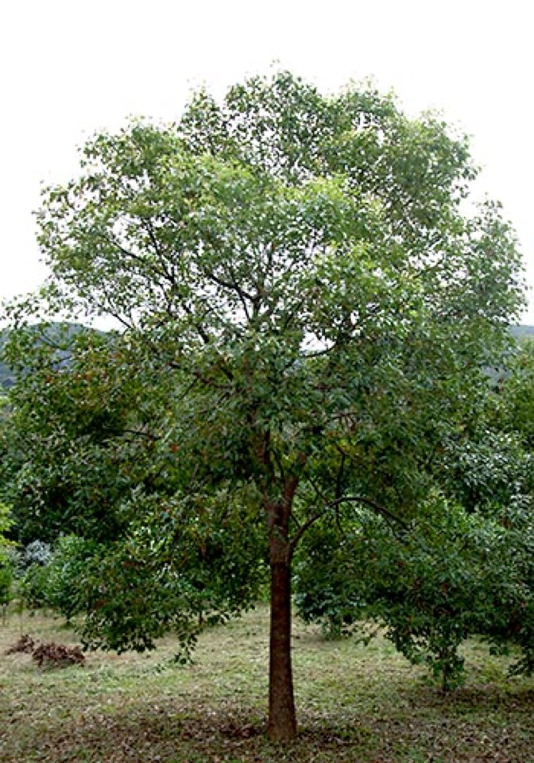
*수형 | 수형: 높이 6~20 (30) m, 지름 2~3 m · 수피: 진한 갈색, 노란갈색*

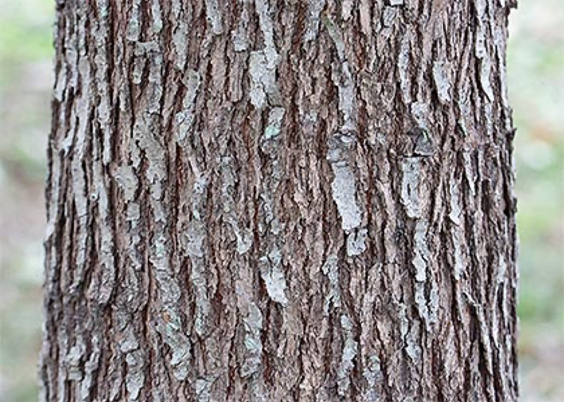
*줄기 | 줄기: 높이 6~20 (30) m, 지름 2~3 m · 수피: 진한 갈색, 노란갈색*

### 감별 핵심 포인트
- 잎이 매끈하고 어린 가지가 녹색을 띱니다.
- 작고 옅은 색의 꽃이 여러 개 모여 핍니다.
- 나무 전체가 크게 자라므로 잎과 어린 가지를 함께 확인합니다.

### 주된 형태 특징 (4대 감별 지표)
- **🌿 잎:** 어긋나기 · 잎몸은 달걀형, 달걀꼴 타원형 · 가장자리: 밋밋하거나 때로 물결꼴 · 3출맥 또는 때로 뚜렷하지 않게 5출맥이고, 중앙맥은 앞뒷면에 뚜렷하고, 곁맥은 1~5(7)쌍 이고, 기본맥은 바깥쪽으로 몇개의 부맥을 갖이고, 측맥의 축과 뚜렷하게 돔형의 맥이 있고, 앞쪽으로 3출맥의 분기점에 보통 2개의 작은 샘돌기(소낭,일종의 腺點))가 있음
- **🌸 꽃:** 초록빛 하양에서 노랑으로 바꾸어짐 꽃 · 원뿔꽃차례(원추화서) · 암수한꽃
- **🍒 열매:** 검은 자주 열매 · 물열매(장과)
- **🪵 줄기·수형:** 높이 6~20 (30) m, 지름 2~3 m · 수피: 진한 갈색, 노란갈색

**비교·주의:** 작은 흰 꽃만으로 광나무 등과 구별하기 어렵습니다.

[파이팅혼공 TV 강의](https://www.youtube.com/watch?v=K3PvgTi3eXI&t=1430s) · [수목도감(treeworld)](https://treeworld.co.kr/a01_01_02/30494) · [위키백과(한국어)](https://ko.wikipedia.org/wiki/%EB%85%B9%EB%82%98%EB%AC%B4) · [Wikipedia(English)](https://en.wikipedia.org/wiki/Camphora_officinarum)

## 023. 눈향나무
> *Juniperus chinensis L.* · Cupressaceae 측백나무과

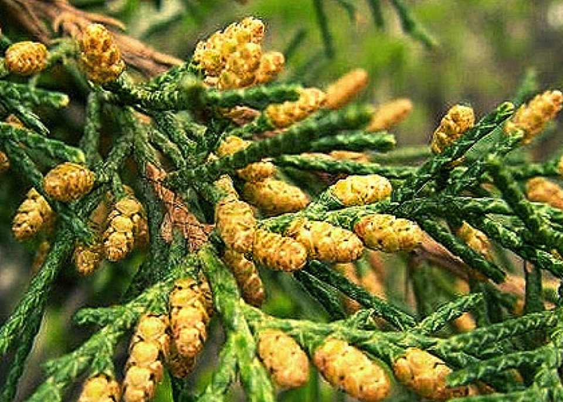
*꽃 | 꽃: 암꽃방울(종자방울)은 연한 보라빛 초록이고, 익으면 갈색 꽃 · 1개씩 달리며, 암꽃대와 수꽃대 모두 지난 해 자란 비늘잎 가지끝 위에 달림 · 암수딴그루(자웅이주, 2가화), 드믈게 암수한그루(자웅동주, 1가화)*

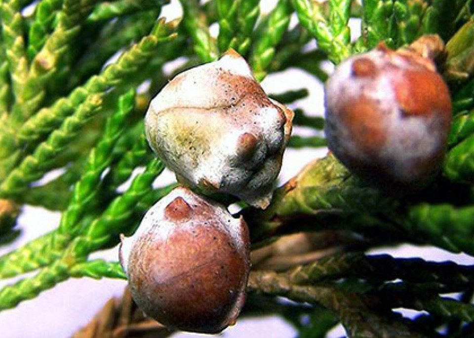
*열매 | 열매: 씨방울은 자줏빛 검정으로 보통은 하얀가루가 있음 열매 · 씨방울열매(구과)*

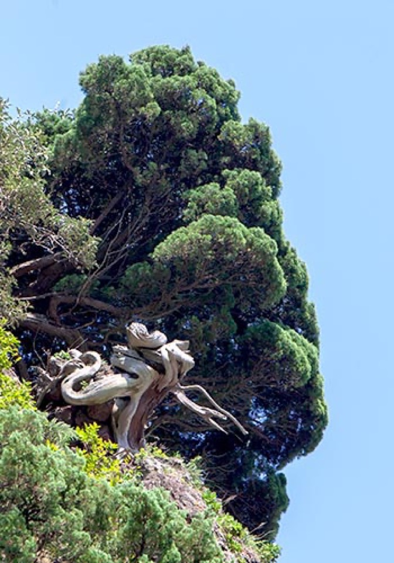
*수형 | 수형: 높이 20~25 m, 지름 0.8 m 쯤이고, 넓거나 불규칙함. 늙은 줄기는 껍질이 세로로 갈라지면서 가는 조각처럼 벗겨짐 · 수피: 회갈색, 빨간 갈색,*

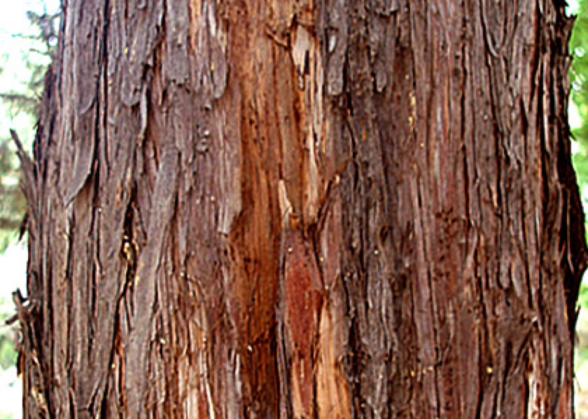
*줄기 | 줄기: 높이 20~25 m, 지름 0.8 m 쯤이고, 넓거나 불규칙함. 늙은 줄기는 껍질이 세로로 갈라지면서 가는 조각처럼 벗겨짐 · 수피: 회갈색, 빨간 갈색,*

### 감별 핵심 포인트
- 땅을 기듯 낮게 퍼지는 수형이 특징입니다.
- 향나무류의 바늘 모양·비늘 모양 잎을 확인하세요.
- 위로 높게 자라는 모습보다 지면을 덮는 가지를 기억합니다.

### 주된 형태 특징 (4대 감별 지표)
- **🌿 잎:** 4~6줄로 배열 · 바늘잎(침엽)과 비늘잎(인엽)의 2종류 잎(二型葉)이 달리지만 주로 비늘잎이 주로 달림 · 가장자리: 비늘잎은 하얀색으로 밋밋함 · 중앙맥(증륵)은 도두라짐
- **🌸 꽃:** 암꽃방울(종자방울)은 연한 보라빛 초록이고, 익으면 갈색 꽃 · 1개씩 달리며, 암꽃대와 수꽃대 모두 지난 해 자란 비늘잎 가지끝 위에 달림 · 암수딴그루(자웅이주, 2가화), 드믈게 암수한그루(자웅동주, 1가화)
- **🍒 열매:** 씨방울은 자줏빛 검정으로 보통은 하얀가루가 있음 열매 · 씨방울열매(구과)
- **🪵 줄기·수형:** 높이 20~25 m, 지름 0.8 m 쯤이고, 넓거나 불규칙함. 늙은 줄기는 껍질이 세로로 갈라지면서 가는 조각처럼 벗겨짐 · 수피: 회갈색, 빨간 갈색,

**비교·주의:** 향나무와 잎이 비슷하므로 수형이 보이는 사진이 중요합니다.

[파이팅혼공 TV 강의](https://www.youtube.com/watch?v=K3PvgTi3eXI&t=1510s) · [수목도감(treeworld)](https://treeworld.co.kr/a01_01_02/28088) · [위키백과(한국어)](https://ko.wikipedia.org/wiki/%ED%96%A5%EB%82%98%EB%AC%B4) · [Wikipedia(English)](https://en.wikipedia.org/wiki/Juniperus_chinensis)

## 024. 느티나무
> *Zelkova serrata (Thunb.) Makino* · Ulmaceae 느릅나무과

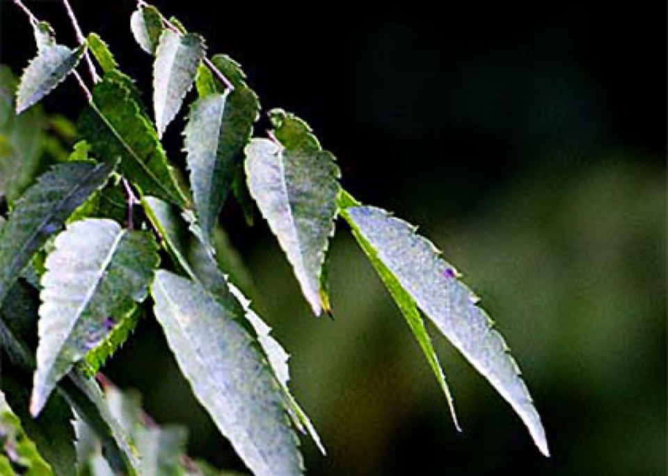
*잎 | 잎: 어긋나기 · 긴타원형. 타원형 또는 달걀형 · 가장자리: 짧은 톱니(단거치), 무딘톱니가 있음*

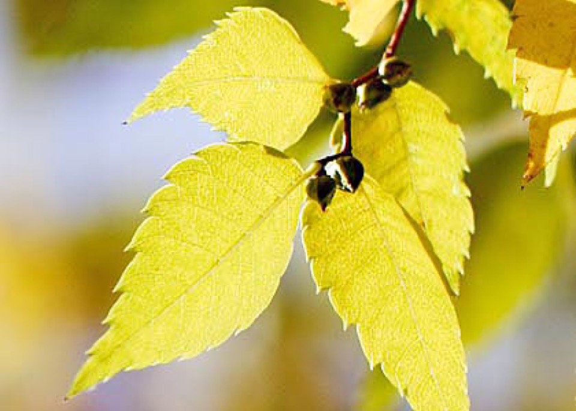
*열매 | 열매: 연한 초록에서 갈색으로 익음 열매 · 굳은씨열매(핵과)*

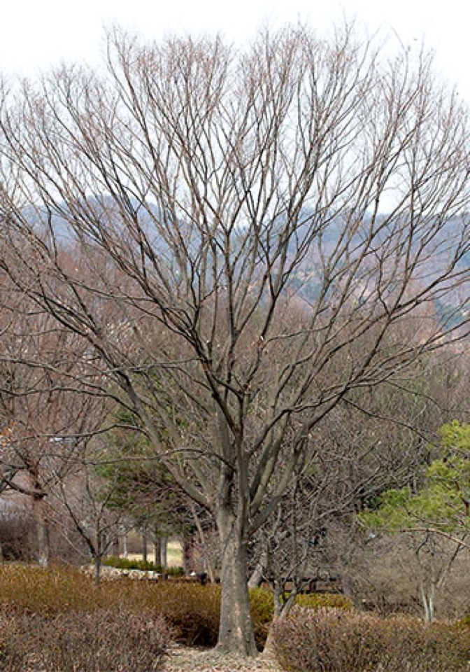
*수형 | 수형: 높이 30~40 m, 너비 1~2 m · 수피: 회갈색, 회백색*

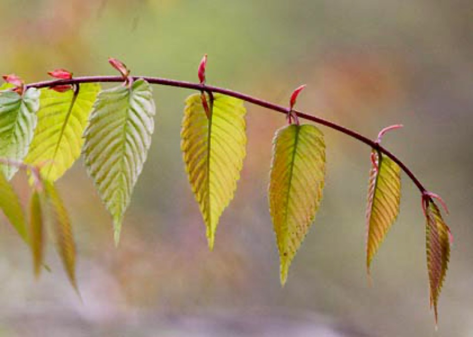
*새순 | 새순: 봄철 새로 돋아나는 잎과 가지*

### 감별 핵심 포인트
- 잎 끝이 뾰족하고 가장자리에 선명한 톱니가 있습니다.
- 잎맥이 옆으로 가지런히 뻗는 모습을 봅니다.
- 넓게 퍼지는 큰 나무의 수형과 잎을 함께 확인하세요.

### 주된 형태 특징 (4대 감별 지표)
- **🌿 잎:** 어긋나기 · 긴타원형. 타원형 또는 달걀형 · 가장자리: 짧은 톱니(단거치), 무딘톱니가 있음 · 곁맥 8 ~14쌍
- **🌸 꽃:** 암꽃은 노란 초록으로 반질거리지 않음 꽃 · 취산꽃차례(가운데 꽃이 먼저 핀 다음에 뒤이어 주위의 꽃들이 피는 차례) · 암수한그루(자웅동주, 일가화)
- **🍒 열매:** 연한 초록에서 갈색으로 익음 열매 · 굳은씨열매(핵과)
- **🪵 줄기·수형:** 높이 30~40 m, 너비 1~2 m · 수피: 회갈색, 회백색

[파이팅혼공 TV 강의](https://www.youtube.com/watch?v=K3PvgTi3eXI&t=1570s) · [수목도감(treeworld)](https://treeworld.co.kr/a01_01_02/30456) · [위키백과(한국어)](https://ko.wikipedia.org/wiki/%EB%8A%90%ED%8B%B0%EB%82%98%EB%AC%B4) · [Wikipedia(English)](https://en.wikipedia.org/wiki/Zelkova_serrata)

## 025. 능소화
> *Campsis grandiflora (Thunb.) K.Schum.* · Bignoniaceae 능소화과

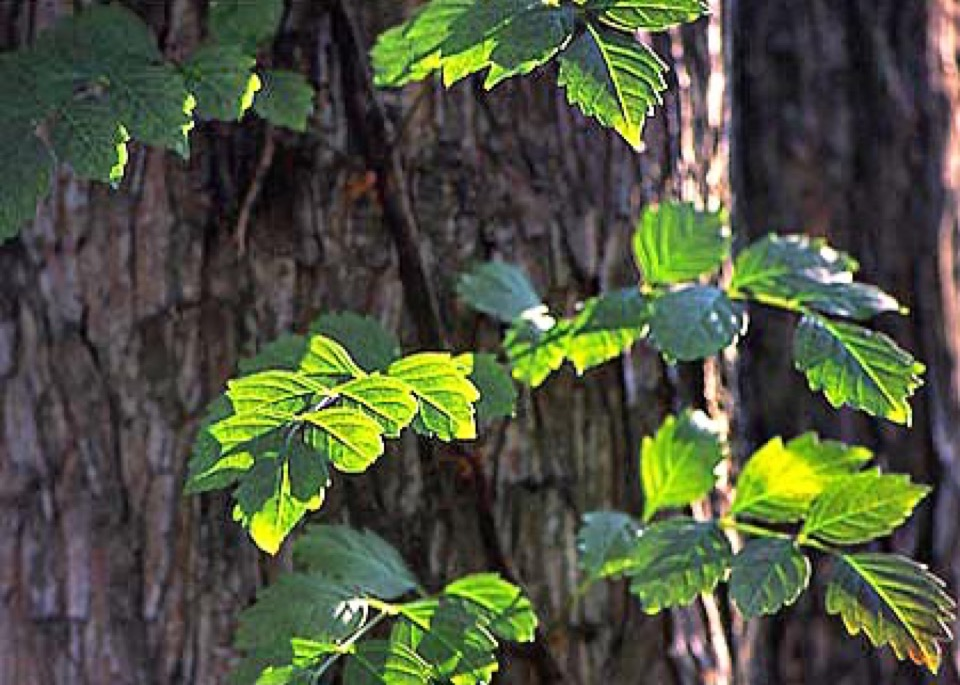
*잎 | 잎: 마주나기 · 홀수 1회 깃꼴 겹잎(기수1회우상복엽) · 가장자리: 거친 톱니가 있음*

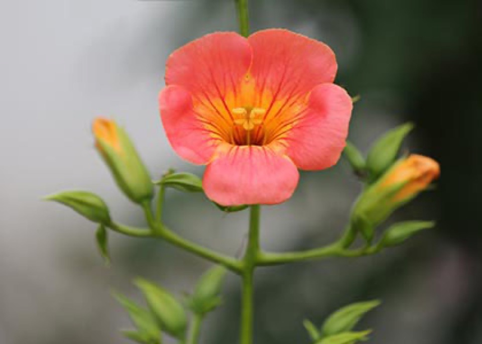
*꽃 | 꽃: 꽃잎은 노란 빨강이지만 겉은 붉은 노랑 꽃 · 모인꽃차례(취산화서)가 모여 고깔꽃차례(원추화서)를 이룸 · 꽃대는 길이 15~20 cm, 지름 6~8 cm*

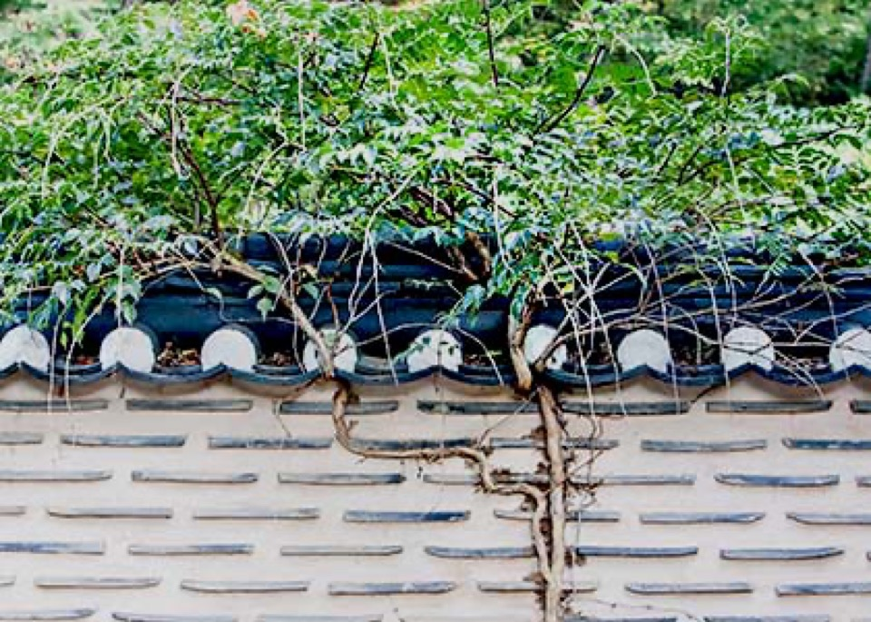
*수형 | 수형: 길이 9~10 m · 수피: 회갈색*

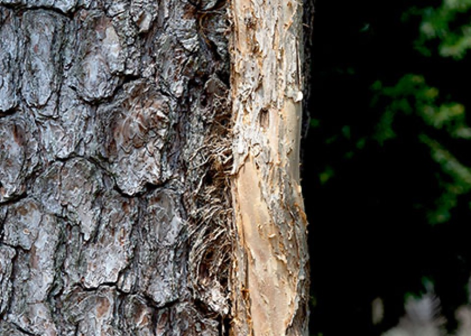
*줄기 | 줄기: 길이 9~10 m · 수피: 회갈색*

### 감별 핵심 포인트
- 덩굴로 타고 올라가며 주황빛 나팔 모양 꽃이 핍니다.
- 꽃의 입구가 넓게 벌어지고 끝이 다섯 갈래로 나뉩니다.
- 여러 작은 잎이 나란히 달린 잎과 큰 꽃을 함께 봅니다.

### 주된 형태 특징 (4대 감별 지표)
- **🌿 잎:** 마주나기 · 홀수 1회 깃꼴 겹잎(기수1회우상복엽) · 가장자리: 거친 톱니가 있음 · 곁맥은 6~7쌍
- **🌸 꽃:** 꽃잎은 노란 빨강이지만 겉은 붉은 노랑 꽃 · 모인꽃차례(취산화서)가 모여 고깔꽃차례(원추화서)를 이룸 · 꽃대는 길이 15~20 cm, 지름 6~8 cm
- **🍒 열매:** 갈색 열매 · 튀는열매(삭과)
- **🪵 줄기·수형:** 길이 9~10 m · 수피: 회갈색

[파이팅혼공 TV 강의](https://www.youtube.com/watch?v=K3PvgTi3eXI&t=1610s) · [수목도감(treeworld)](https://treeworld.co.kr/a01_01_02/30445) · [위키백과(한국어)](https://ko.wikipedia.org/wiki/%EB%8A%A5%EC%86%8C%ED%99%94) · [Wikipedia(English)](https://en.wikipedia.org/wiki/Campsis_grandiflora)

## 026. 단풍나무
> *Acer palmatum Thunb.* · Sapindaceae 무환자나무과

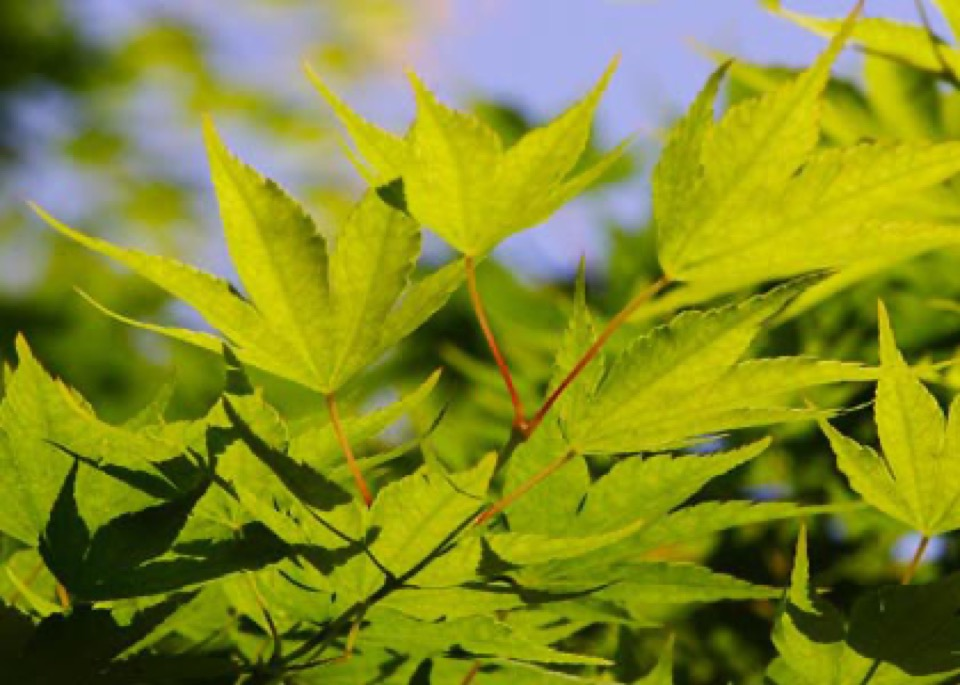
*잎 | 잎: 마주나기 · 홑잎 · 가장자리: 불규칙하게 겹톱니가 있음*

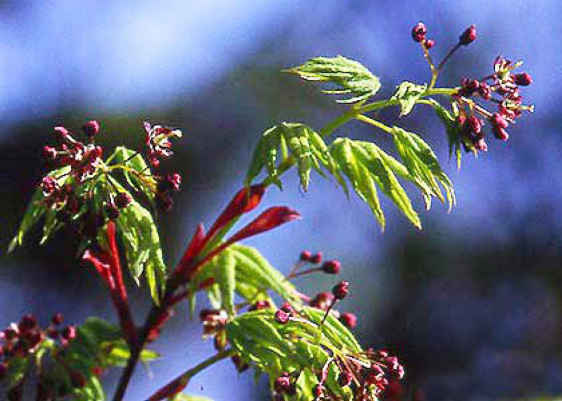
*꽃 | 꽃: 꽃잎은 연한 노랑 또는 분홍빛 하양 꽃 · 산방꼴 원뿔꽃차례 · 암수한그루*

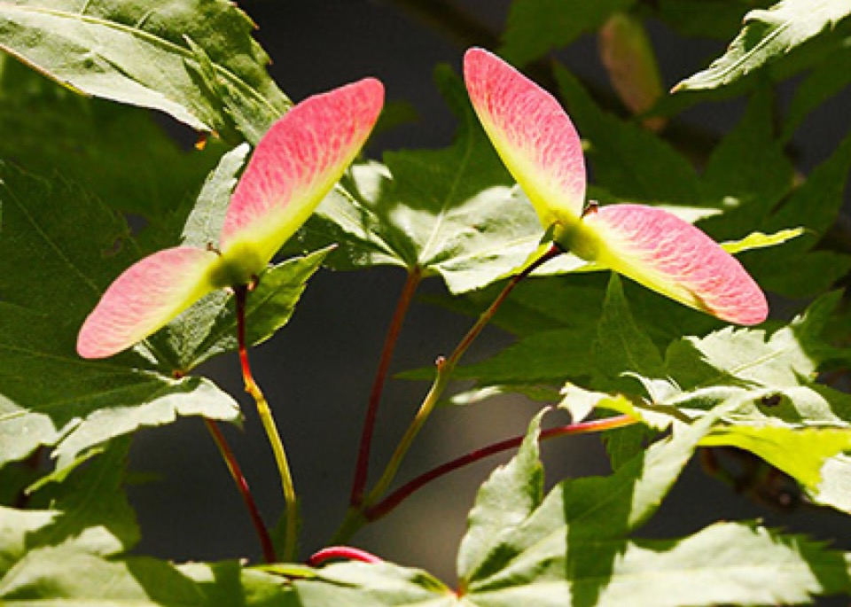
*열매 | 열매: 노란갈색 열매 · 날개열매(시과)*

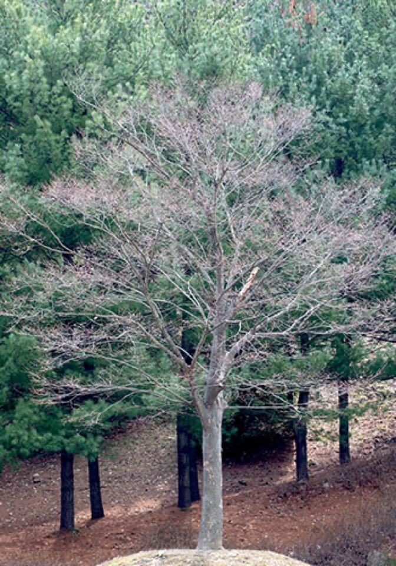
*수형 | 수형: 높이 6~10(15) m, 지름 80 cm 안팎으로 껍질은 매끄러움 · 수피: 초록빛 회색, 연한 갈색*

### 감별 핵심 포인트
- 잎이 손바닥처럼 여러 갈래로 깊게 갈라집니다.
- 작은 붉은 꽃이 아래를 향해 모여 피기도 합니다.
- 두 날개가 달린 열매인 시과가 특징입니다.

### 주된 형태 특징 (4대 감별 지표)
- **🌿 잎:** 마주나기 · 홑잎 · 가장자리: 불규칙하게 겹톱니가 있음 · 그믈맥
- **🌸 꽃:** 꽃잎은 연한 노랑 또는 분홍빛 하양 꽃 · 산방꼴 원뿔꽃차례 · 암수한그루
- **🍒 열매:** 노란갈색 열매 · 날개열매(시과)
- **🪵 줄기·수형:** 높이 6~10(15) m, 지름 80 cm 안팎으로 껍질은 매끄러움 · 수피: 초록빛 회색, 연한 갈색

**비교·주의:** 중국단풍은 잎이 크게 세 갈래로 갈라집니다. 잎 갈래 수와 깊이를 비교하세요.

[파이팅혼공 TV 강의](https://www.youtube.com/watch?v=K3PvgTi3eXI&t=1690s) · [수목도감(treeworld)](https://treeworld.co.kr/a01_01_02/30405) · [위키백과(한국어)](https://ko.wikipedia.org/wiki/%EB%8B%A8%ED%92%8D%EB%82%98%EB%AC%B4) · [Wikipedia(English)](https://en.wikipedia.org/wiki/Acer_palmatum)

## 027. 담쟁이덩굴
> *Parthenocissus tricuspidata (Siebold & Zucc.) Planch.* · Vitaceae 포도과

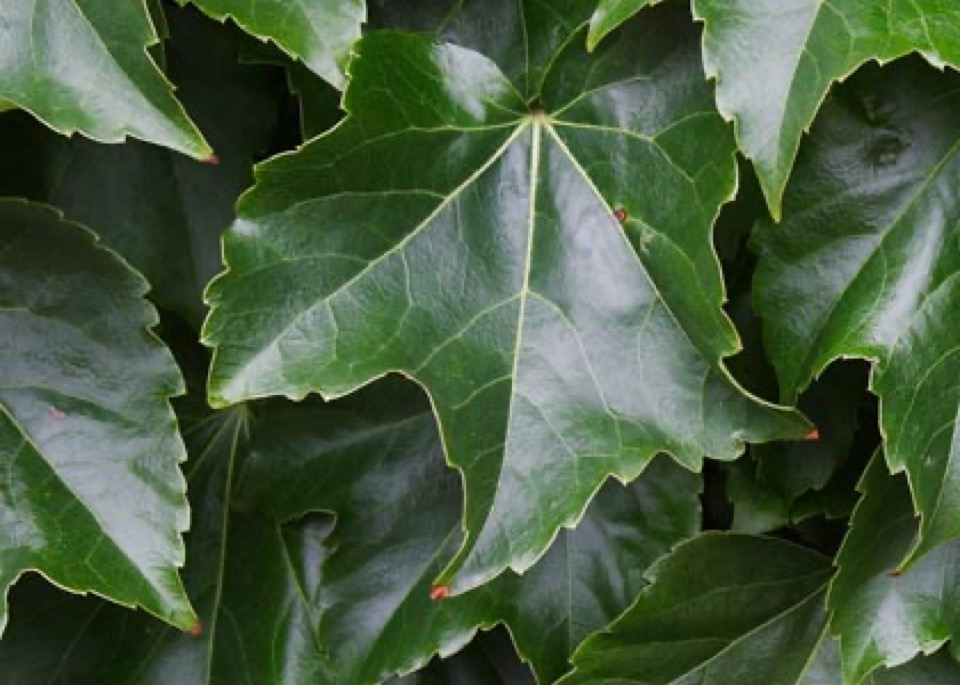
*잎 | 잎: 어긋나기 · 여러가지 생김새의 잎꼴이 나타남(다형성 잎) · 가장자리: 불규칙한 거친 톱니가 있음*

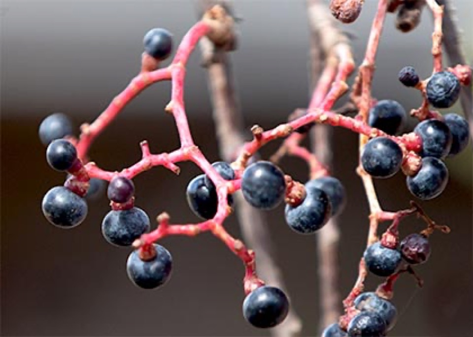
*열매 | 열매: 열매는 자주빛 검정 열매 · 물열매(장과)*

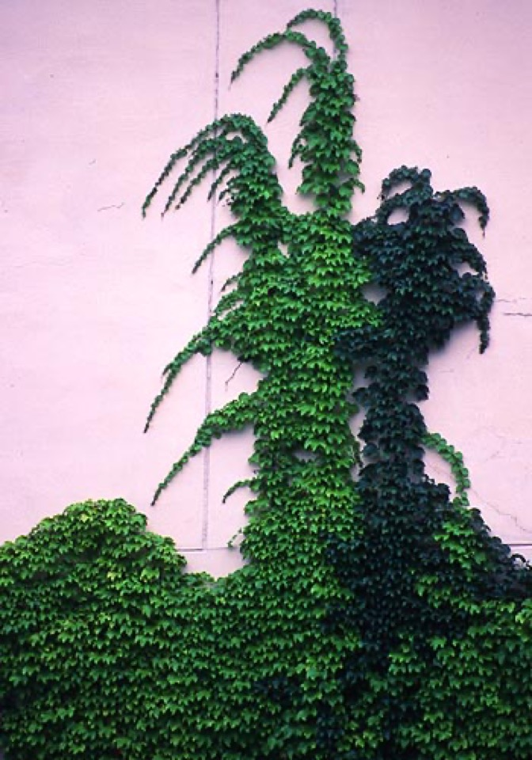
*수형 | 수형: 길이 10~18(30) m · 수피: 회갈색, 검은갈색*

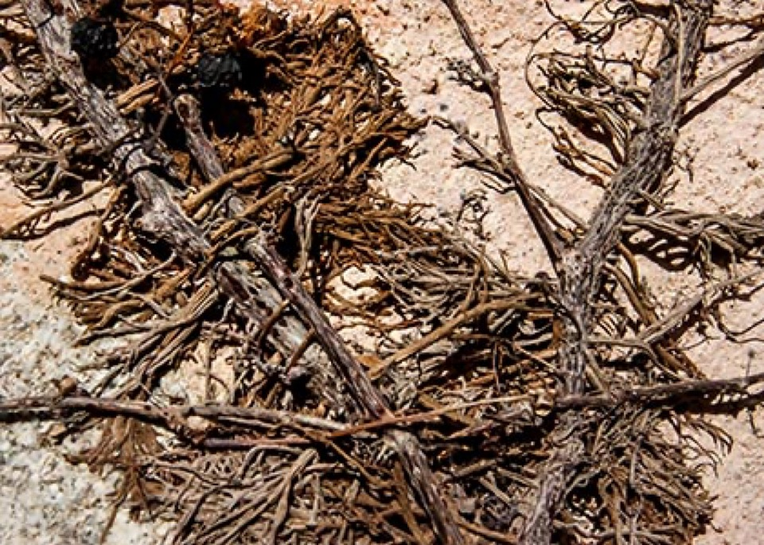
*줄기 | 줄기: 길이 10~18(30) m · 수피: 회갈색, 검은갈색*

### 감별 핵심 포인트
- 담이나 나무를 타고 붙어 자라는 덩굴식물입니다.
- 넓은 잎이 갈라져 있고 가을에는 붉게 물듭니다.
- 덩굴의 부착 모습과 잎을 함께 봅니다.

### 주된 형태 특징 (4대 감별 지표)
- **🌿 잎:** 어긋나기 · 여러가지 생김새의 잎꼴이 나타남(다형성 잎) · 가장자리: 불규칙한 거친 톱니가 있음 · 기본맥은 5개이고, 곁맥은 4~7쌍
- **🌸 꽃:** 노란초록(황녹색), 초록 꽃 · 취산꽃차례( 복산형화서 ; 각각의 꽃대에 3개 이상의 곁꽃대(側軸)가 생김) · 암수한꽃
- **🍒 열매:** 열매는 자주빛 검정 열매 · 물열매(장과)
- **🪵 줄기·수형:** 길이 10~18(30) m · 수피: 회갈색, 검은갈색

**비교·주의:** 답안 연습은 영상의 표기인 ‘담쟁이덩굴’로 하세요.

[파이팅혼공 TV 강의](https://www.youtube.com/watch?v=K3PvgTi3eXI&t=1810s) · [수목도감(treeworld)](https://treeworld.co.kr/a01_01_02/30385) · [위키백과(한국어)](https://ko.wikipedia.org/wiki/%EB%8B%B4%EC%9F%81%EC%9D%B4%EB%8D%A9%EA%B5%B4) · [Wikipedia(English)](https://en.wikipedia.org/wiki/Parthenocissus_tricuspidata)

## 028. 당매자나무
> *Berberis poiretii C.K.Schneid.* · Berberidaceae 매자나무과

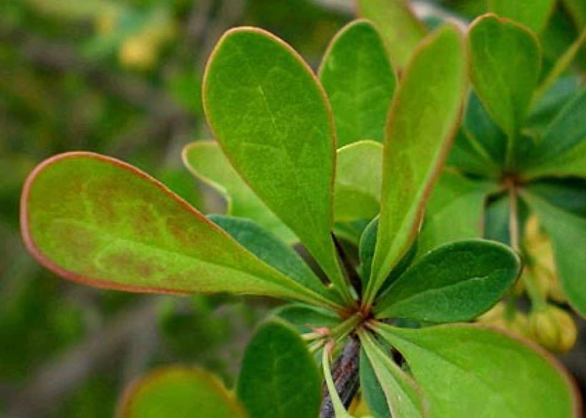
*잎 | 잎: 어린가지에서는 어긋나고(호생)하고, 짧은 가지에서는 모아나기(총생) · 잎몸은 거꿀피침형(도피침형), 좁은 거꿀피침형, 때로 피침꼴 주걱형으로 길이 1.5~4 cm, 너비 5~10 mm · 가장자리: 밋밋함(톱니가 없음)*

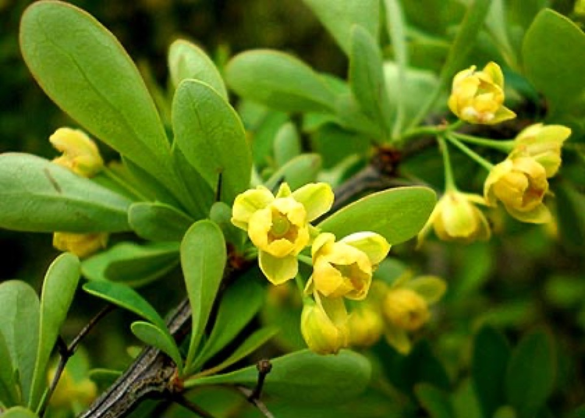
*꽃 | 꽃: 노랑이지만 겉면은 붉은 빛이 돔 꽃 · 이삭꼴 총상꽃차례 · 암수한그루*

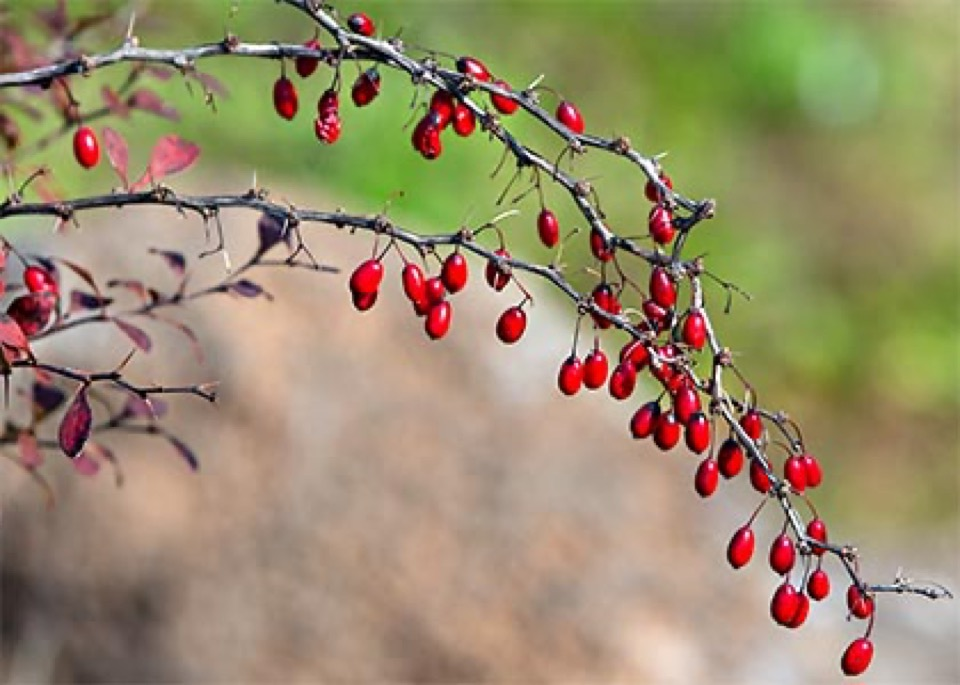
*열매 | 열매: 빨강 열매 · 물열매(장과)*

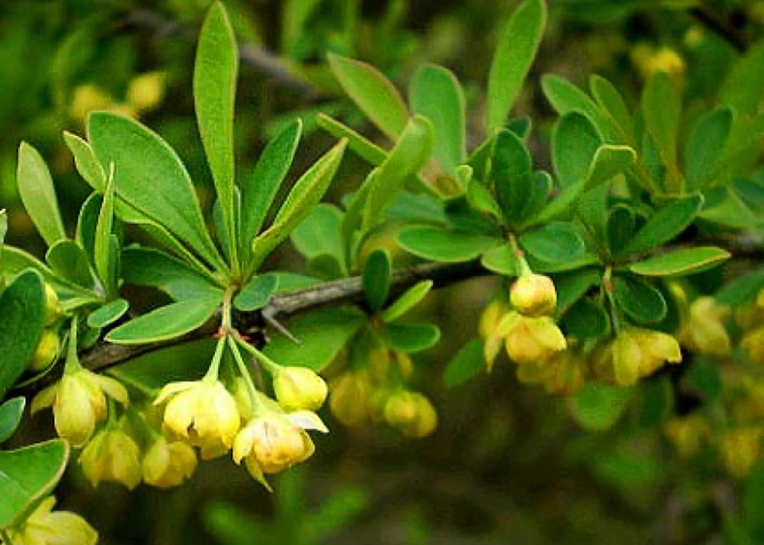
*수형 | 수형: 높이 1~2 m · 수피: 자줏빛 갈색*

### 감별 핵심 포인트
- 작은 잎이 모여 달리고 노란 꽃이 핍니다.
- 열매는 붉고 길쭉한 타원형입니다.
- 작은 잎과 붉은 타원형 열매의 조합을 확인하세요.

### 주된 형태 특징 (4대 감별 지표)
- **🌿 잎:** 어린가지에서는 어긋나고(호생)하고, 짧은 가지에서는 모아나기(총생) · 잎몸은 거꿀피침형(도피침형), 좁은 거꿀피침형, 때로 피침꼴 주걱형으로 길이 1.5~4 cm, 너비 5~10 mm · 가장자리: 밋밋함(톱니가 없음) · 뒷쪽으로 높은 중앙맥, 뚜렷한 곁맥과 그믈맥을 갖이며, 앞쪽으로는 인상깊은 (impressed) 중앙맥을 갖임
- **🌸 꽃:** 노랑이지만 겉면은 붉은 빛이 돔 꽃 · 이삭꼴 총상꽃차례 · 암수한그루
- **🍒 열매:** 빨강 열매 · 물열매(장과)
- **🪵 줄기·수형:** 높이 1~2 m · 수피: 자줏빛 갈색

**비교·주의:** 주목·산수유 등도 붉은 열매가 있으므로 잎 모양이 중요합니다.

[파이팅혼공 TV 강의](https://www.youtube.com/watch?v=K3PvgTi3eXI&t=1850s) · [수목도감(treeworld)](https://treeworld.co.kr/a01_01_02/30352) · [위키백과(한국어)](https://ko.wikipedia.org/wiki/%EB%A7%A4%EC%9E%90%EB%82%98%EB%AC%B4%EC%86%8D) · [Wikipedia(English)](https://en.wikipedia.org/wiki/Berberis)

## 029. 대추나무
> *Ziziphus jujuba Mill.* · Rhamnaceae 갈매나무과

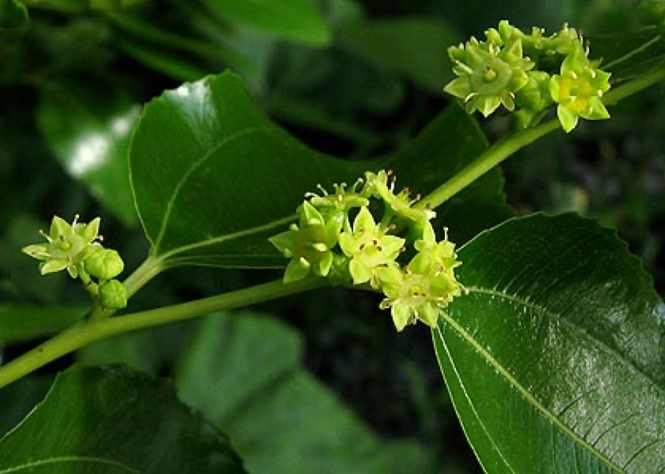
*꽃 | 꽃: 연한 노란초록 꽃 · 짧은 취산꽃차례 · 암수한꽃(양성화)*

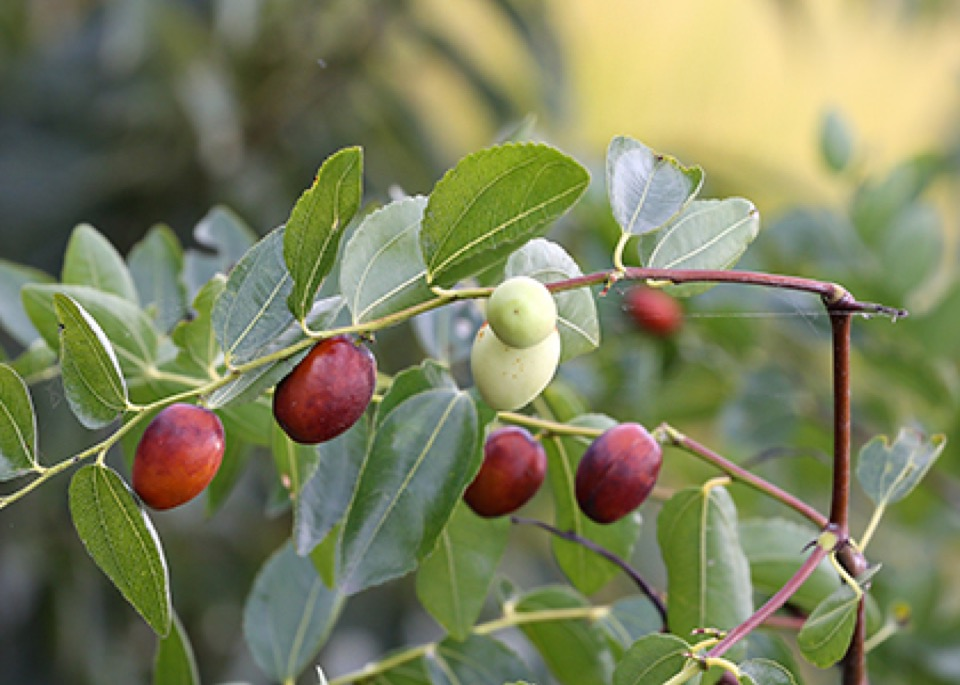
*열매 | 열매: 익으면 빨간갈색 또는 어두운 빨강 열매 · 굳은씨열매(핵과)*

*수형 | 수형: 높이 7~10 m · 수피: 갈색, 회갈색*

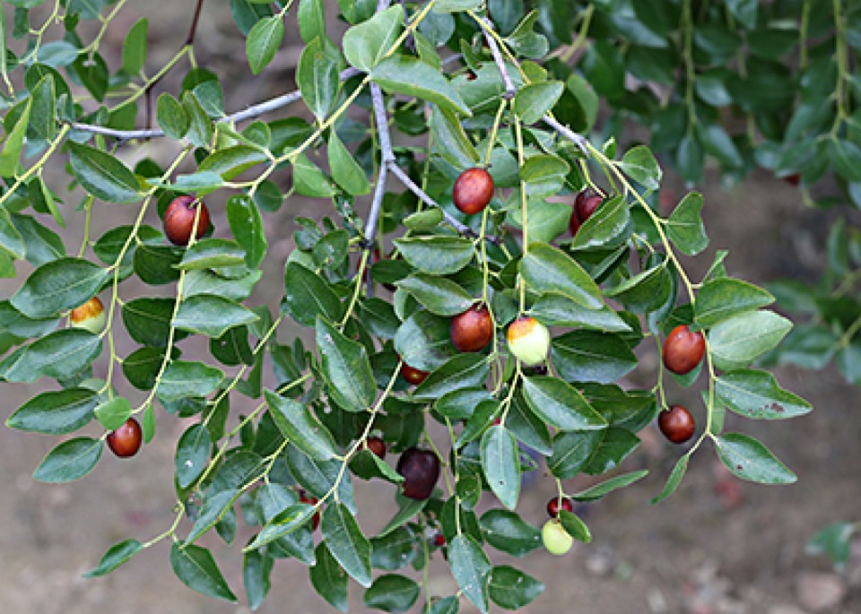
*기타1 | 기타1: 대추나무의 고유 형태*

### 감별 핵심 포인트
- 잎 밑에서 시작하는 굵은 잎맥이 위로 길게 이어집니다.
- 작고 연두빛인 꽃과 타원형 대추 열매를 확인하세요.
- 열매가 없을 때는 참외 무늬를 떠올리게 하는 잎맥이 단서입니다.

### 주된 형태 특징 (4대 감별 지표)
- **🌿 잎:** 어긋나기 · 달걀형 · 가장자리: 무딘 톱니가 있음 · 잎몸의 밑부분(기부)에서 3개의 중앙맥(주맥)이 발달
- **🌸 꽃:** 연한 노란초록 꽃 · 짧은 취산꽃차례 · 암수한꽃(양성화)
- **🍒 열매:** 익으면 빨간갈색 또는 어두운 빨강 열매 · 굳은씨열매(핵과)
- **🪵 줄기·수형:** 높이 7~10 m · 수피: 갈색, 회갈색

[파이팅혼공 TV 강의](https://www.youtube.com/watch?v=K3PvgTi3eXI&t=1910s) · [수목도감(treeworld)](https://treeworld.co.kr/a01_01_02/30336) · [위키백과(한국어)](https://ko.wikipedia.org/wiki/%EB%8C%80%EC%B6%94%EB%82%98%EB%AC%B4) · [Wikipedia(English)](https://en.wikipedia.org/wiki/Jujube)

## 030. 독일가문비
> *Picea jezoensis (Siebold & Zucc.) Carriere* · Pinaceae 소나무과

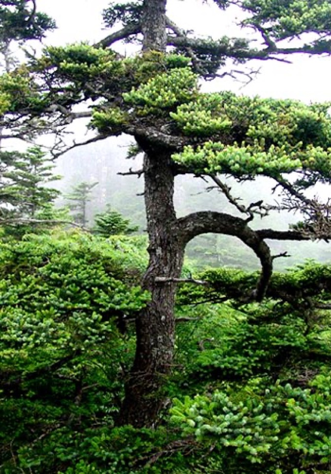
*수형 | 수형: 높이 35~50 m, 지름 1~1.5 m이고, 외줄기로 곧게 뻗고, 줄기 아래와 위의 굵기의 차이가 적으며, 나무갓은 원뿔형으로 끝은 뾰족함 · 수피: 처음에는 갈색으로 부드럽지만 나이가 들면서 검은갈색 또는 분홍빛 회갈색*

### 감별 핵심 포인트
- 짧은 침엽이 가지에 촘촘하게 붙습니다.
- 길쭉한 솔방울이 아래로 매달립니다.
- 원뿔형 수형과 처지는 가지도 함께 살펴보세요.

### 주된 형태 특징 (4대 감별 지표)
- **🌿 잎:** 어긋나게 돌려나기 · 잎몸은 편평한 선형으로 길이 1~2.5 cm, 너비1.5~2 mm이고, 밑부분이 뒤틀리고 있어 앞면에 공기구멍(기공)있는 듯이 보이고 있으며, 햇가지 윗부분에서는 직접 앞쪽으로 내밀고 있음 · 가장자리: 밋밋함 · 잎의 뒷면에 흰색 기공선을 갖임
- **🌸 꽃:** 암꽃방울은 연한 자주 꽃 · 지난해 자란 가지 끝에 암꽃대는 1개, 수꽃대는 잎겨드랑이에 1~3개가 달림 · 암수한그루
- **🍒 열매:** 씨방울은 초록, 붉은색 또는 분홍빛 갈색으로 성숙하면 갈색 또는 노란갈색(꽃가루받이 뒤 4~8개월이 걸림) 열매 · 씨방울열매(구과)
- **🪵 줄기·수형:** 높이 35~50 m, 지름 1~1.5 m이고, 외줄기로 곧게 뻗고, 줄기 아래와 위의 굵기의 차이가 적으며, 나무갓은 원뿔형으로 끝은 뾰족함 · 수피: 처음에는 갈색으로 부드럽지만 나이가 들면서 검은갈색 또는 분홍빛 회갈색

**비교·주의:** 구상나무는 솔방울이 위로 서므로 방향을 비교하면 좋습니다.

[파이팅혼공 TV 강의](https://www.youtube.com/watch?v=K3PvgTi3eXI&t=1970s) · [수목도감(treeworld)](https://treeworld.co.kr/a01_01_02/31135) · [위키백과(한국어)](https://ko.wikipedia.org/wiki/%EA%B0%80%EB%AC%B8%EB%B9%84%EB%82%98%EB%AC%B4) · [Wikipedia(English)](https://en.wikipedia.org/wiki/Picea_abies)

## 031. 돈나무
> *Pittosporum tobira (Thunb.) W.T.Aiton* · Pittosporaceae 돈나무과

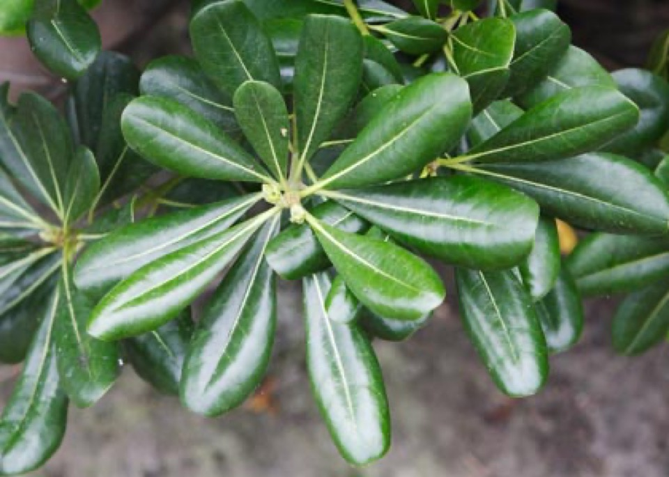
*잎 | 잎: 어긋나기 · 긴거꿀달걀형 또는 거꿀달걀꼴 피침형 · 가장자리: 밋밋함*

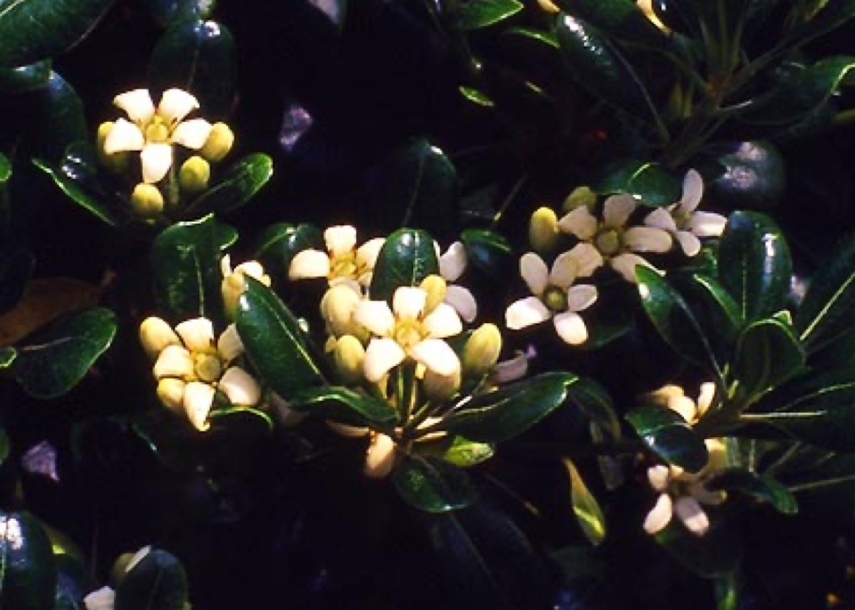
*꽃 | 꽃: 하양에서 노랑으로 변색 꽃 · 우산꼴 또는 산방꼴 취산꽃차례 · 암수딴그루*

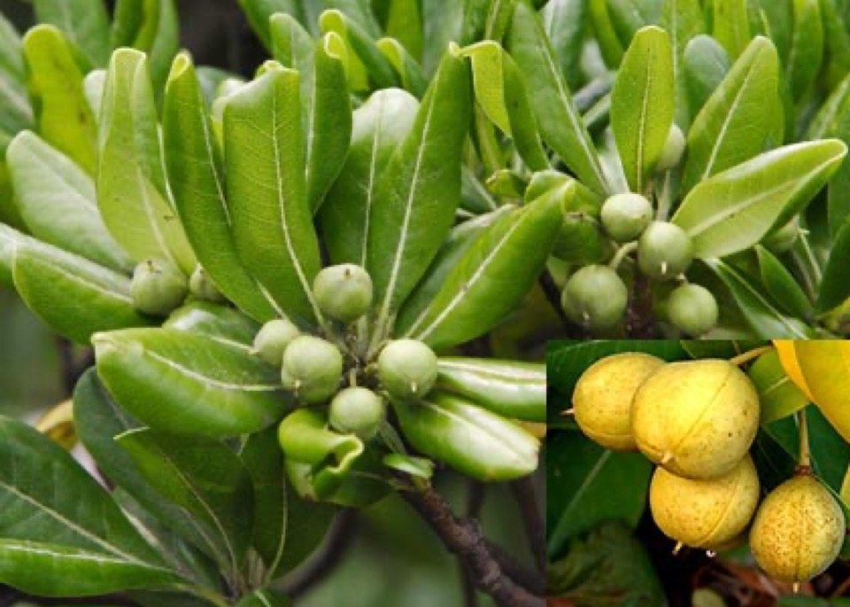
*열매 | 열매: 열매는 연한 초록으로 익므면 노랑으로 바뀜 열매 · 튀는열매(삭과)*

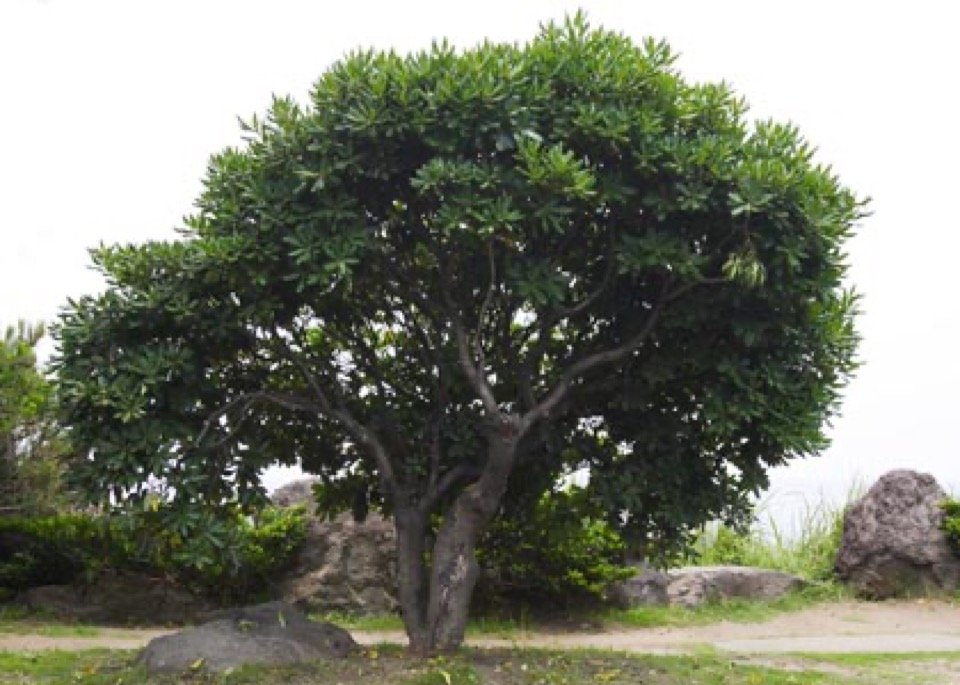
*수형 | 수형: 높이 2~6 m(보통 2~3 m) · 수피: 회갈색, 검은 갈색*

### 감별 핵심 포인트
- 잎은 두껍고 윤기가 나며 끝이 둥글게 퍼집니다.
- 흰 꽃은 다섯 갈래의 별 모양으로 모여 핍니다.
- 열매 껍질이 갈라지며 붉은 씨가 드러나는 모습이 특징입니다.

### 주된 형태 특징 (4대 감별 지표)
- **🌿 잎:** 어긋나기 · 긴거꿀달걀형 또는 거꿀달걀꼴 피침형 · 가장자리: 밋밋함 · 곁맥은 6~8 쌍 이고, 가운데 중앙맥(주맥)은 뚜렷하며, 가장자리까지 이어짐
- **🌸 꽃:** 하양에서 노랑으로 변색 꽃 · 우산꼴 또는 산방꼴 취산꽃차례 · 암수딴그루
- **🍒 열매:** 열매는 연한 초록으로 익므면 노랑으로 바뀜 열매 · 튀는열매(삭과)
- **🪵 줄기·수형:** 높이 2~6 m(보통 2~3 m) · 수피: 회갈색, 검은 갈색

[파이팅혼공 TV 강의](https://www.youtube.com/watch?v=K3PvgTi3eXI&t=2050s) · [수목도감(treeworld)](https://treeworld.co.kr/a01_01_02/30298) · [위키백과(한국어)](https://ko.wikipedia.org/wiki/%EB%8F%88%EB%82%98%EB%AC%B4) · [Wikipedia(English)](https://en.wikipedia.org/wiki/Pittosporum_tobira)

## 032. 동백나무
> *Camellia japonica L.* · Theaceae 차나무과

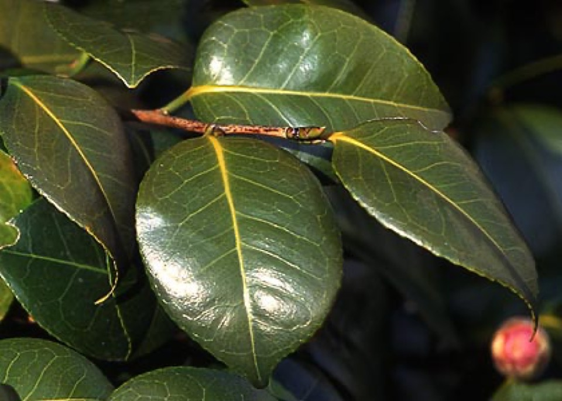
*잎 | 잎: 어긋나기 · 잎몸은 타원형, 달걀꼴 타원형, 긴타원형으로 길이 5~12 cm, 너비 3~7 cm · 가장자리: 잔톱니 또는 물결꼴 잔톱니가 있음*

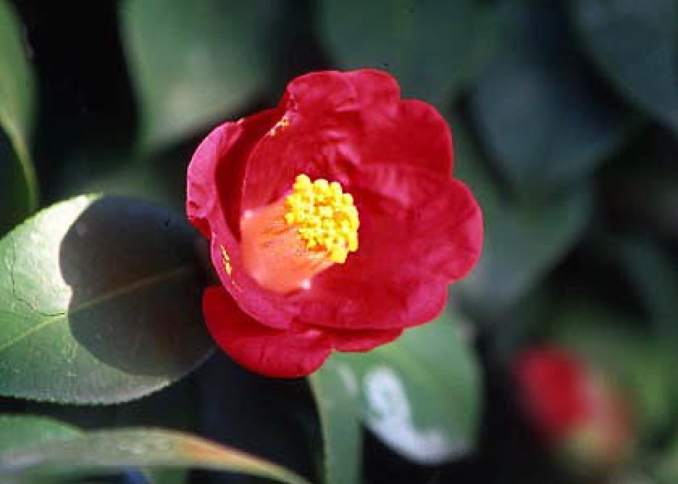
*꽃 | 꽃: 꽃잎은 빨강 또는 하양, 꽃밥은 노랑 꽃 · 단정꽃차례 · 암수한꽃(양성화)*

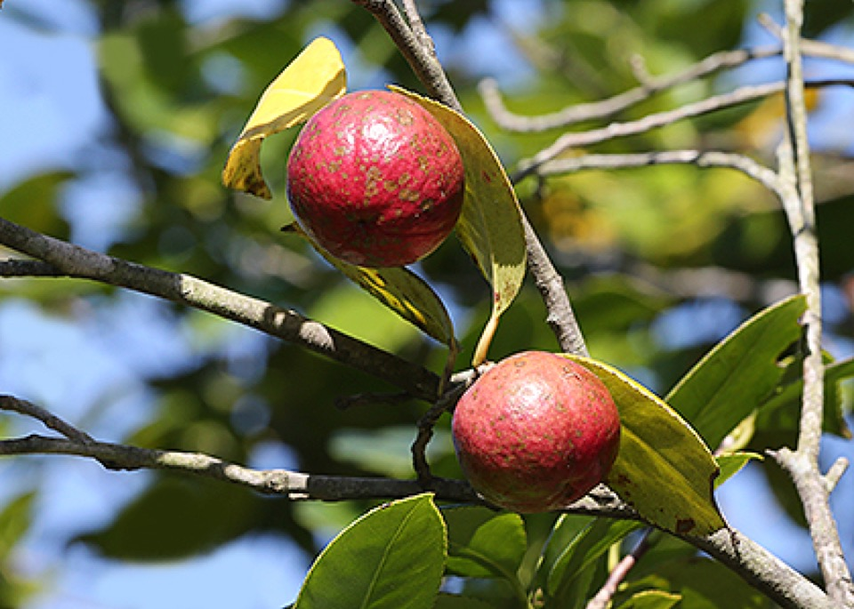
*열매 | 열매: 열매는 초록빛 갈색 열매 · 튀는 열매(삭과)*

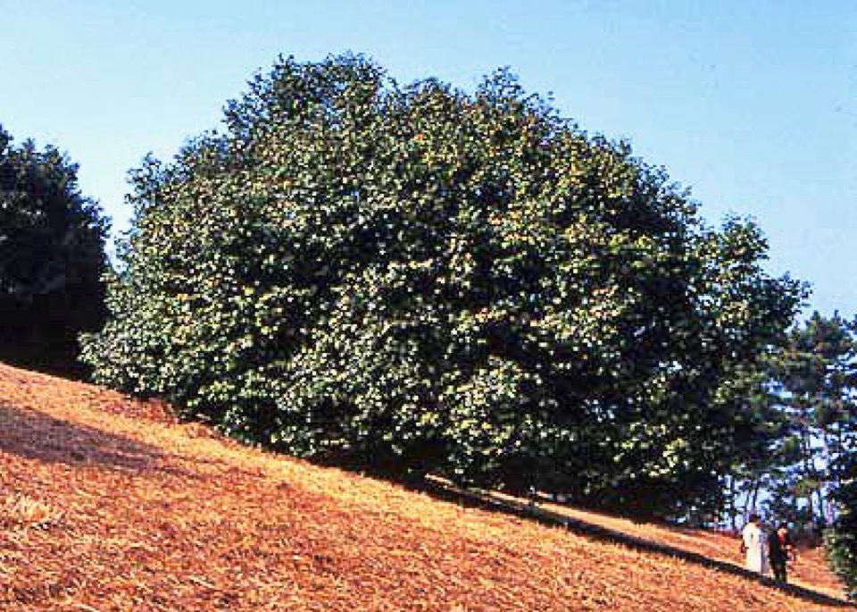
*수형 | 수형: 높이 5~6(11) m, 지름 20~30 cm · 수피: 회빛 갈색, 회빛 하양*

### 감별 핵심 포인트
- 붉은 꽃 가운데 노란 수술이 빽빽하게 모여 있습니다.
- 잎은 짙은 녹색으로 두껍고 윤기가 납니다.
- 꽃과 매끈한 잎의 조합을 기억하세요.

### 주된 형태 특징 (4대 감별 지표)
- **🌿 잎:** 어긋나기 · 잎몸은 타원형, 달걀꼴 타원형, 긴타원형으로 길이 5~12 cm, 너비 3~7 cm · 가장자리: 잔톱니 또는 물결꼴 잔톱니가 있음 · 중앙맥은 뚜렷하고, 두껍고, 곁맥은 6~9개이며, 가늘고, 앞뒷면에서 볼 수 있음
- **🌸 꽃:** 꽃잎은 빨강 또는 하양, 꽃밥은 노랑 꽃 · 단정꽃차례 · 암수한꽃(양성화)
- **🍒 열매:** 열매는 초록빛 갈색 열매 · 튀는 열매(삭과)
- **🪵 줄기·수형:** 높이 5~6(11) m, 지름 20~30 cm · 수피: 회빛 갈색, 회빛 하양

**비교·주의:** 이름이 비슷한 쪽동백나무와는 잎과 꽃이 크게 다릅니다.

[파이팅혼공 TV 강의](https://www.youtube.com/watch?v=K3PvgTi3eXI&t=2130s) · [수목도감(treeworld)](https://treeworld.co.kr/a01_01_02/30271) · [위키백과(한국어)](https://ko.wikipedia.org/wiki/%EB%8F%99%EB%B0%B1%EB%82%98%EB%AC%B4) · [Wikipedia(English)](https://en.wikipedia.org/wiki/Camellia_japonica)

## 033. 등
> *Wisteria floribunda (Willd.) DC.* · Fabaceae 콩과/ 콩아과

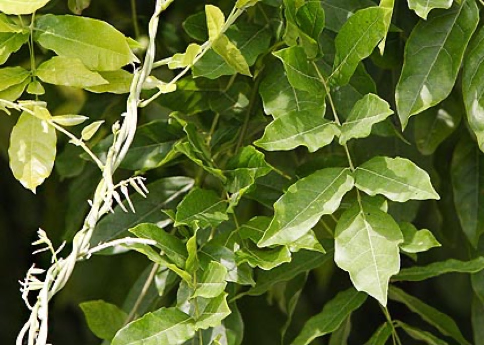
*잎 | 잎: 겹눈은 어긋나기 · 홀수일회깃꼴겹잎 · 가장자리: 밋밋하며, 물결꼴*

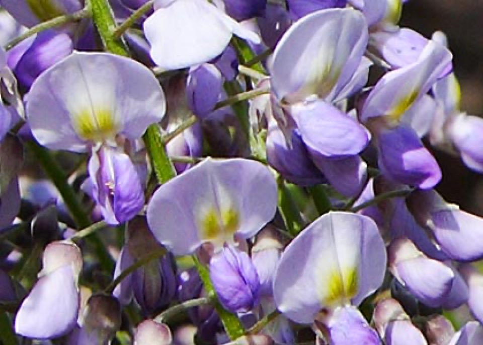
*꽃 | 꽃: 연자주색, 또 그 밑으로 황록색이 돌고 안쪽으로는 짙은 자주색 꽃 · 총상꽃차례 · 꽃대는 다 자라면 30cm 정도로 흰털이 촘촘하게 나있음*

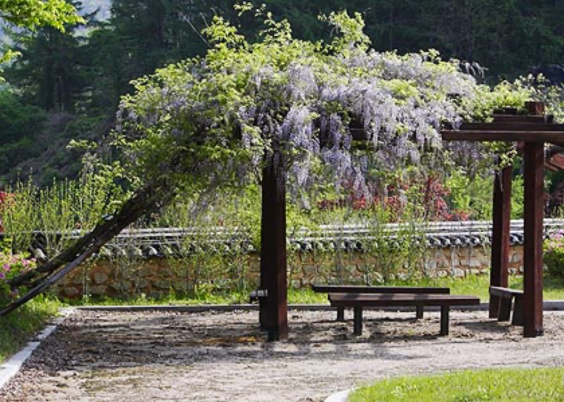
*수형 | 수형: 덩굴이 되어 길게 뻗어 10m 쯤 자람 · 수피: 회백색 또는 회갈색*

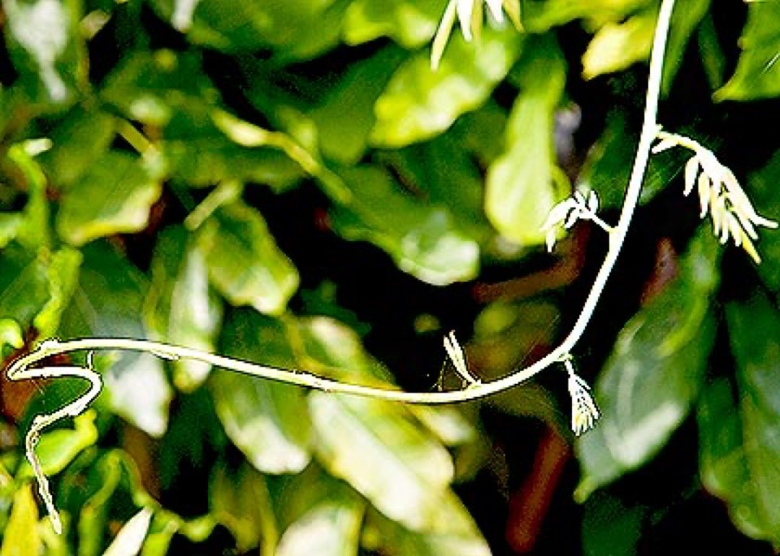
*새순 | 새순: 봄철 새로 돋아나는 잎과 가지*

### 감별 핵심 포인트
- 보라색 꽃차례가 포도송이처럼 길게 늘어집니다.
- 여러 작은 잎이 양쪽으로 달린 겹잎을 봅니다.
- 콩깍지처럼 생긴 열매가 달리는 덩굴식물입니다.

### 주된 형태 특징 (4대 감별 지표)
- **🌿 잎:** 겹눈은 어긋나기 · 홀수일회깃꼴겹잎 · 가장자리: 밋밋하며, 물결꼴 · 깃꼴 그믈맥
- **🌸 꽃:** 연자주색, 또 그 밑으로 황록색이 돌고 안쪽으로는 짙은 자주색 꽃 · 총상꽃차례 · 꽃대는 다 자라면 30cm 정도로 흰털이 촘촘하게 나있음
- **🍒 열매:** 갈색 열매 · 협과
- **🪵 줄기·수형:** 덩굴이 되어 길게 뻗어 10m 쯤 자람 · 수피: 회백색 또는 회갈색

**비교·주의:** 답안 이름은 영상 표기인 ‘등’을 기준으로 연습합니다.

[파이팅혼공 TV 강의](https://www.youtube.com/watch?v=K3PvgTi3eXI&t=2150s) · [수목도감(treeworld)](https://treeworld.co.kr/a01_01_02/30243) · [위키백과(한국어)](https://ko.wikipedia.org/wiki/%EB%93%B1) · [Wikipedia(English)](https://en.wikipedia.org/wiki/Wisteria_floribunda)

## 034. 때죽나무
> *Styrax japonicus Siebold & Zucc.* · Styracaceae 때죽나무과

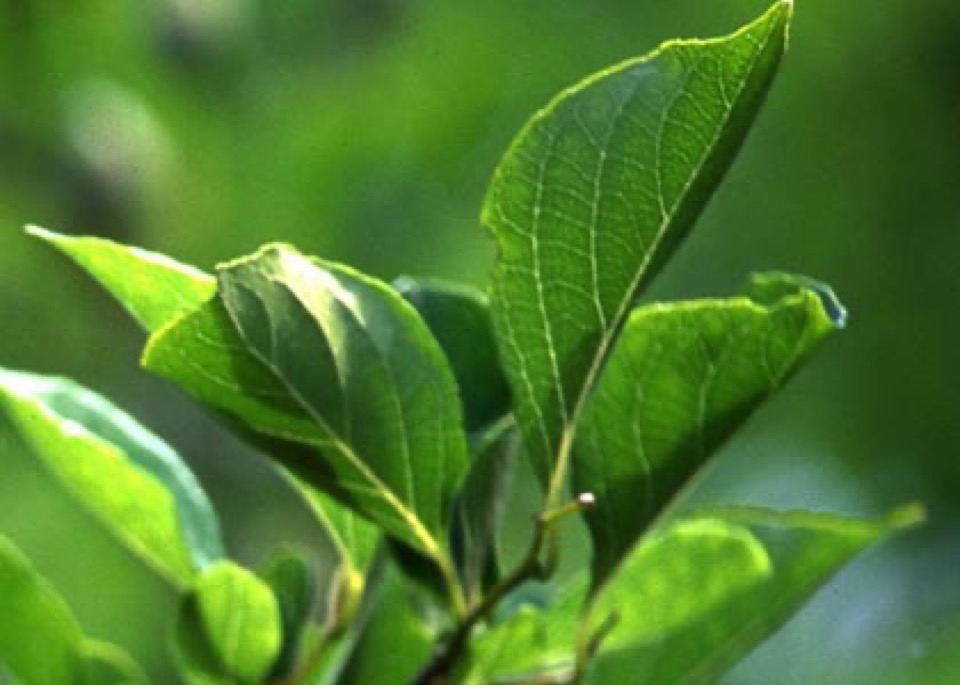
*잎 | 잎: 어긋나기 · 홑잎 · 가장자리: 뾰족한 톱니가 얕게 약간 있으나 뚜렷하지 않으며, 이빨꼴의 톱니가 약간 있거나 없음*

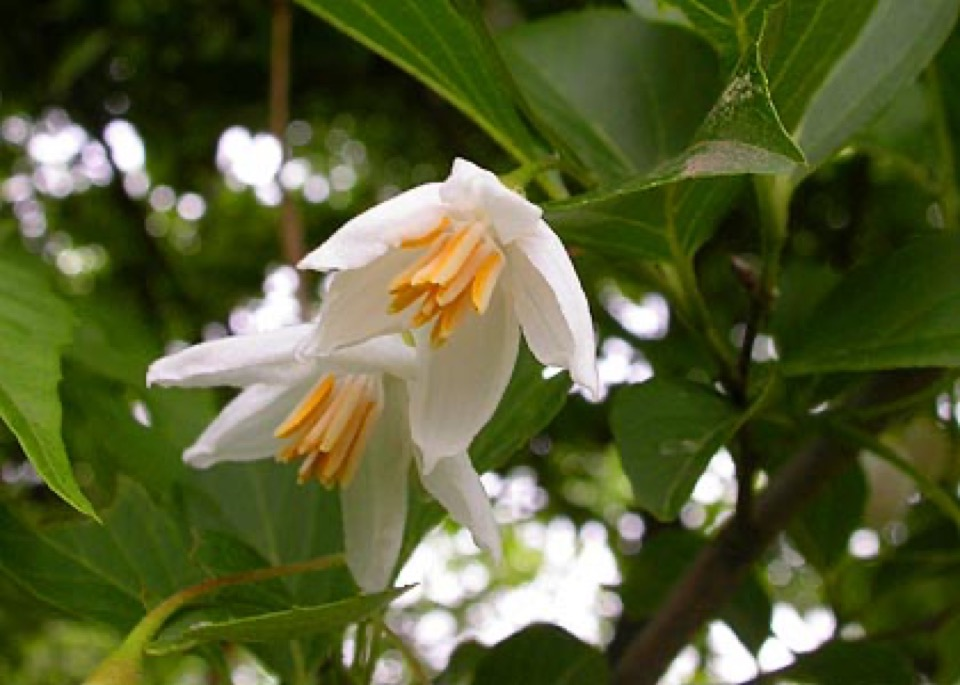
*꽃 | 꽃: 꽃잎은 하양, 크림색, 회색 꽃 · 짧은 총상꽃차례 · 암수한꽃*

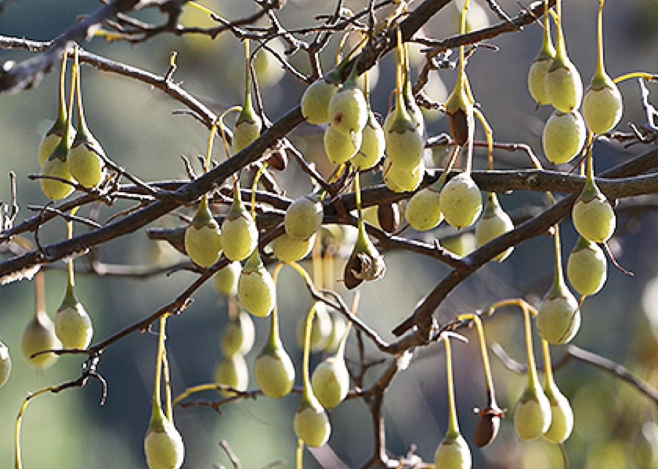
*열매 | 열매: 열매는 초록에서 회빛 하양 열매 · 굳은씨열매(핵과)*

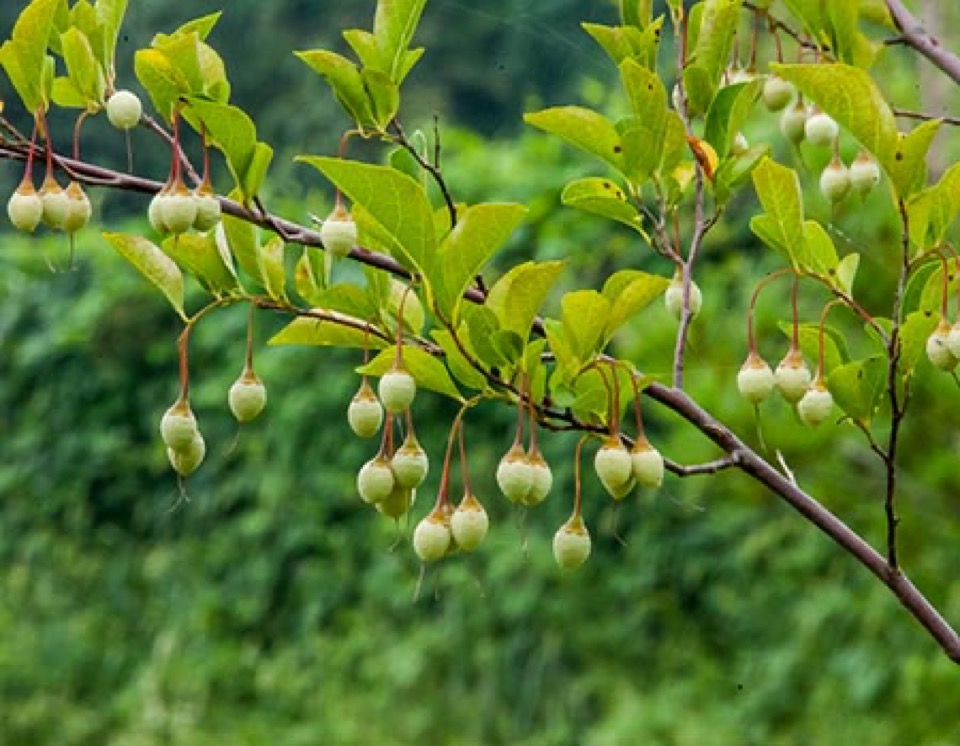
*수형 | 수형: 높이 4~8(10) m · 수피: 어두운 자줏빛 갈색, 연한 검정, 회빛 갈색*

### 감별 핵심 포인트
- 흰 꽃이 아래를 향해 작은 종처럼 매달립니다.
- 꽃 가운데 노란 수술이 보이고 꽃잎은 다섯 갈래입니다.
- 둥근 열매도 아래로 매달리는 모습을 확인하세요.

### 주된 형태 특징 (4대 감별 지표)
- **🌿 잎:** 어긋나기 · 홑잎 · 가장자리: 뾰족한 톱니가 얕게 약간 있으나 뚜렷하지 않으며, 이빨꼴의 톱니가 약간 있거나 없음 · 곁맥은 4~5쌍
- **🌸 꽃:** 꽃잎은 하양, 크림색, 회색 꽃 · 짧은 총상꽃차례 · 암수한꽃
- **🍒 열매:** 열매는 초록에서 회빛 하양 열매 · 굳은씨열매(핵과)
- **🪵 줄기·수형:** 높이 4~8(10) m · 수피: 어두운 자줏빛 갈색, 연한 검정, 회빛 갈색

**비교·주의:** 쪽동백나무는 더 큰 잎과 길게 이어진 꽃차례를 함께 비교하세요.

[파이팅혼공 TV 강의](https://www.youtube.com/watch?v=K3PvgTi3eXI&t=2230s) · [수목도감(treeworld)](https://treeworld.co.kr/a01_01_02/30210) · [위키백과(한국어)](https://ko.wikipedia.org/wiki/%EB%95%8C%EC%A3%BD%EB%82%98%EB%AC%B4) · [Wikipedia(English)](https://en.wikipedia.org/wiki/Styrax_japonicus)

## 035. 떡갈나무
> *Quercus dentata Thunb.* · Fagaceae 참나무과(너도밤나무과)

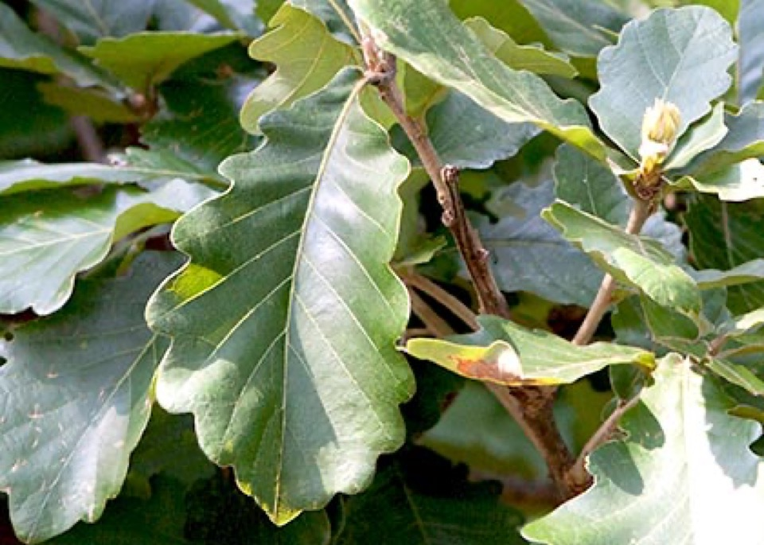
*잎 | 잎: 어긋나기 · 거꿀달걀형(도란형) · 가장자리: 물결꼴로 갈라지고, 갈래조각은 꼭대기에서 둥근끝*

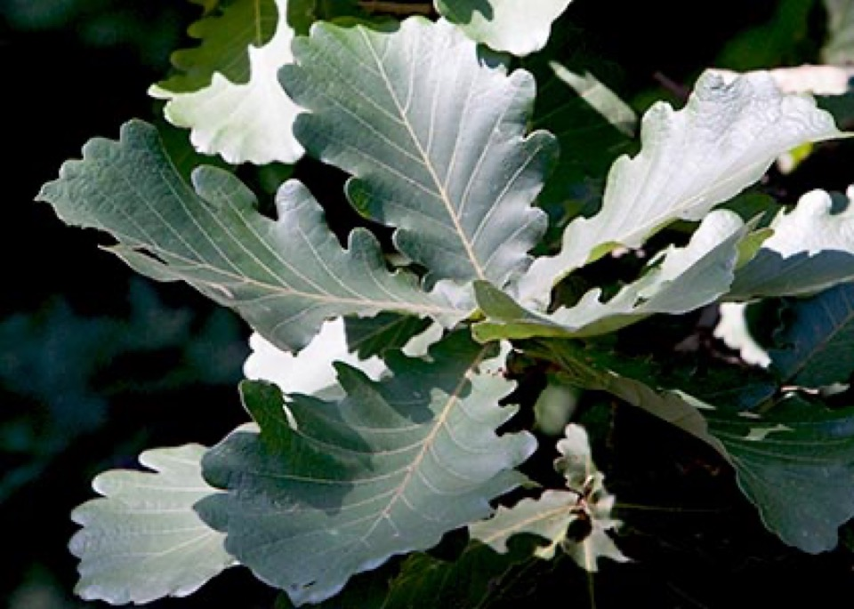
*수형 | 수형: 높이 20~25 m, 지름 70 cm쯤으로 껍질은 두텁고, 코르크질이고, 깊게 갈라짐 · 수피: 회갈색, 어두운 갈색*

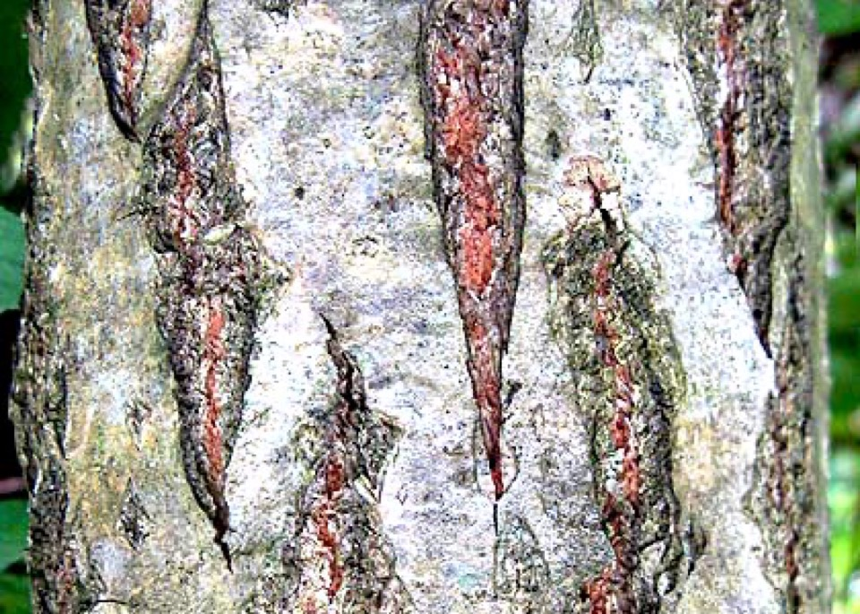
*줄기 | 줄기: 높이 20~25 m, 지름 70 cm쯤으로 껍질은 두텁고, 코르크질이고, 깊게 갈라짐 · 수피: 회갈색, 어두운 갈색*

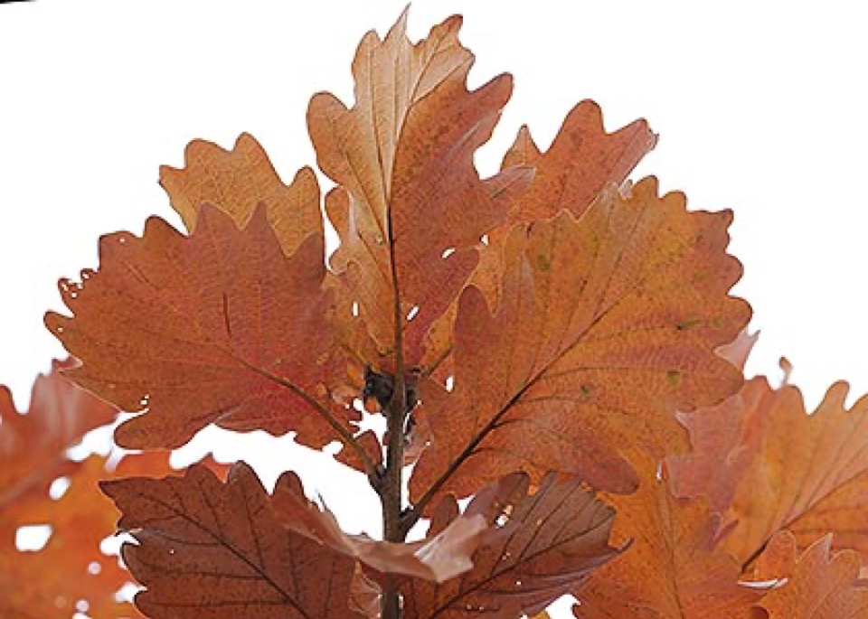
*겨울눈 | 겨울눈: 원뿔꼴 달걀형, 둥근형으로 4~10 mm이고, 각이 지며, 털이 촘촘하게 있음*

### 감별 핵심 포인트
- 잎이 크고 끝 쪽으로 넓어지며 둥근 톱니가 있습니다.
- 잎자루가 매우 짧아 가지에 붙어 보입니다.
- 도토리의 모자 부분에 털 같은 조각이 거칠게 덮입니다.

### 주된 형태 특징 (4대 감별 지표)
- **🌿 잎:** 어긋나기 · 거꿀달걀형(도란형) · 가장자리: 물결꼴로 갈라지고, 갈래조각은 꼭대기에서 둥근끝 · 곁맥 4 ~10쌍
- **🌸 꽃:** 노란 초록 꽃 · 암꽃이삭은 위에서 곧게 나옴 · 암수한그루(일가화)
- **🍒 열매:** 갈색 열매 · 굳은껍질열매(견과, 도토리)
- **🪵 줄기·수형:** 높이 20~25 m, 지름 70 cm쯤으로 껍질은 두텁고, 코르크질이고, 깊게 갈라짐 · 수피: 회갈색, 어두운 갈색

**비교·주의:** 갈참나무·신갈나무와 잎 밑부분, 잎자루, 도토리 모자를 함께 비교하세요.

[파이팅혼공 TV 강의](https://www.youtube.com/watch?v=K3PvgTi3eXI&t=2330s) · [수목도감(treeworld)](https://treeworld.co.kr/a01_01_02/30205) · [위키백과(한국어)](https://ko.wikipedia.org/wiki/%EB%96%A1%EA%B0%88%EB%82%98%EB%AC%B4) · [Wikipedia(English)](https://en.wikipedia.org/wiki/Quercus_dentata)

## 036. 마가목
> *Sorbus commixta Hedl.* · Rosaceae 장미과

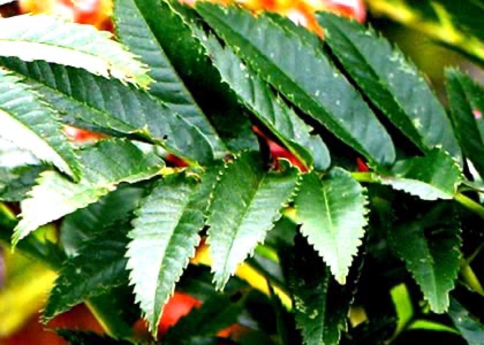
*잎 | 잎: 큰잎은 어긋나기하고 작은잎은 마주나기 · 홀수깃꼴겹잎 · 가장자리: 길고 뾰족한 겹톱니 또는 홑톱니가 있음*

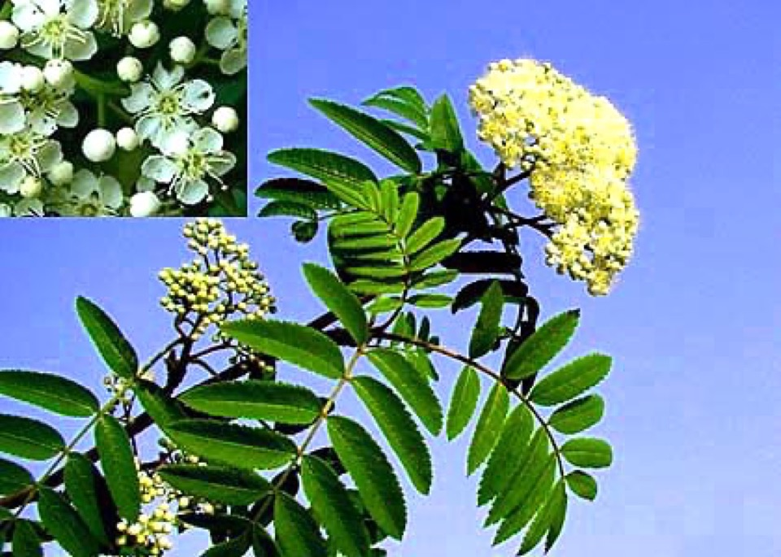
*꽃 | 꽃: 하양 꽃 · 겹고른꽃차례(복산방꽃차례) · 꽃이 무리지어 피고, 작은꽃은 지름 8~12 cm로서 털이 없음*

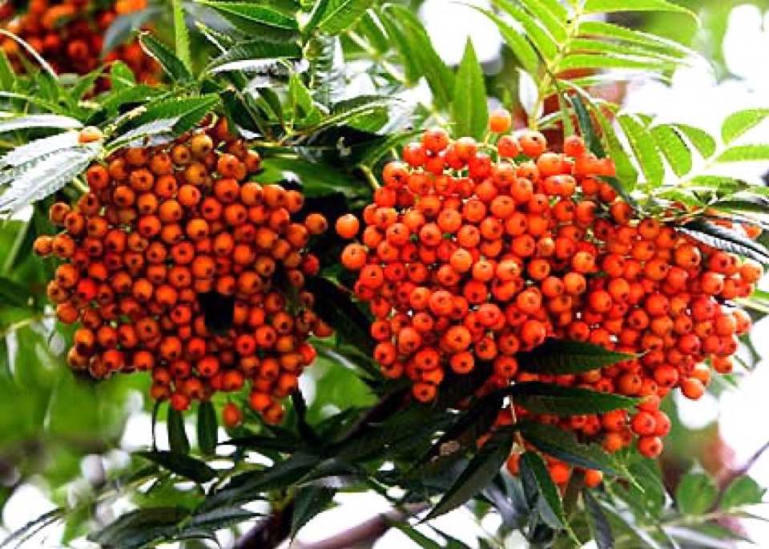
*열매 | 열매: 빨강 열매 · 배열매(이과)*

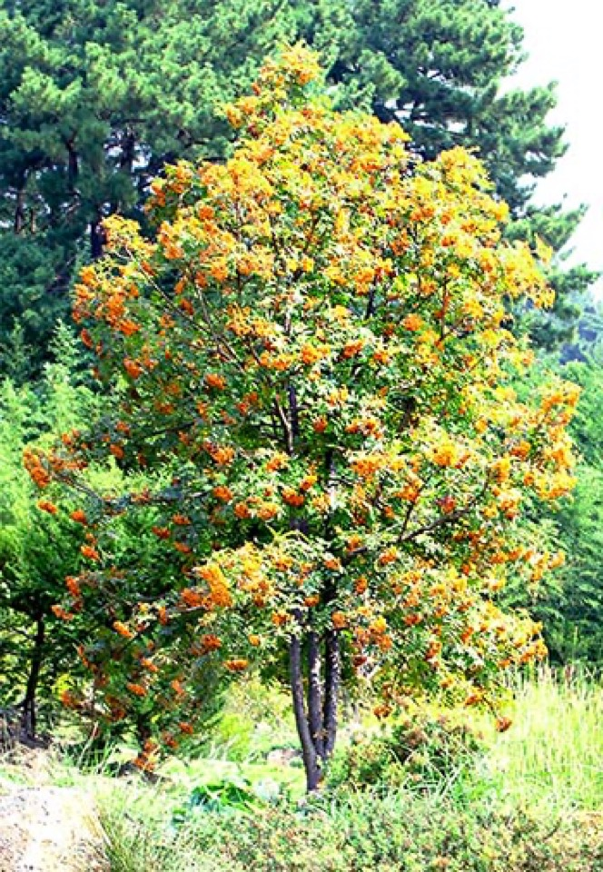
*수형 | 수형: 높이 6~12 m(드믈게 18 m), 너비 4~8 m이고, 곧게 자라며, 크면 세로방향으로 얕게 갈라짐 · 수피: 갈색, 은빛 갈색, 어두운 갈색*

### 감별 핵심 포인트
- 길쭉하고 톱니가 있는 작은 잎들이 양쪽으로 배열됩니다.
- 작은 흰 꽃이 넓게 무리 지어 핍니다.
- 붉은 열매가 다발로 모여 달립니다.

### 주된 형태 특징 (4대 감별 지표)
- **🌿 잎:** 큰잎은 어긋나기하고 작은잎은 마주나기 · 홀수깃꼴겹잎 · 가장자리: 길고 뾰족한 겹톱니 또는 홑톱니가 있음 · 깃꼴 그믈맥
- **🌸 꽃:** 하양 꽃 · 겹고른꽃차례(복산방꽃차례) · 꽃이 무리지어 피고, 작은꽃은 지름 8~12 cm로서 털이 없음
- **🍒 열매:** 빨강 열매 · 배열매(이과)
- **🪵 줄기·수형:** 높이 6~12 m(드믈게 18 m), 너비 4~8 m이고, 곧게 자라며, 크면 세로방향으로 얕게 갈라짐 · 수피: 갈색, 은빛 갈색, 어두운 갈색

**비교·주의:** 쉬땅나무와 잎이 비슷하지만 마가목은 큰 나무로 자라고 붉은 열매가 특징입니다.

[파이팅혼공 TV 강의](https://www.youtube.com/watch?v=K3PvgTi3eXI&t=2410s) · [수목도감(treeworld)](https://treeworld.co.kr/a01_01_02/30178) · [위키백과(한국어)](https://ko.wikipedia.org/wiki/%EB%A7%88%EA%B0%80%EB%AA%A9) · [Wikipedia(English)](https://en.wikipedia.org/wiki/Sorbus_commixta)

## 037. 말채나무
> *Cornus walteri Wangerin* · Cornaceae 층층나무과

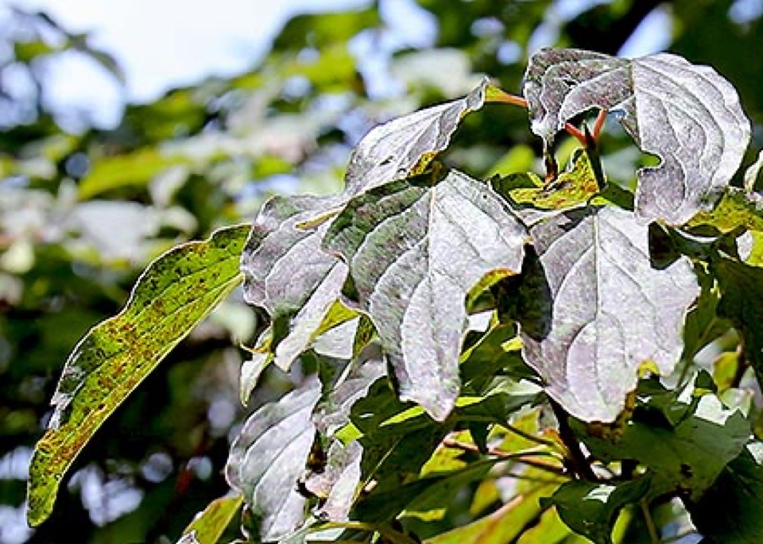
*잎 | 잎: 마주나기 또는 거의 마주나기 · 홑잎 · 가장자리: 밋밋하지만 물결꼴을 갖기도 함*

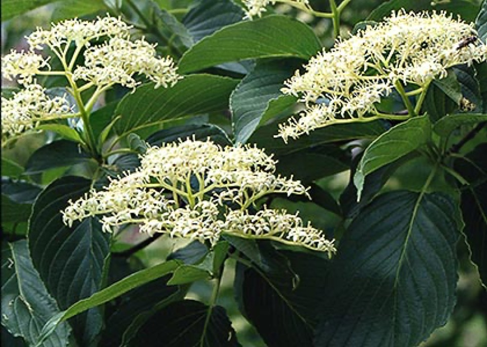
*꽃 | 꽃: 꽃잎은 하양 꽃 · 산방꼴 취산꽃차례 · 꽃대는 지름 5~7 cm, 길이 1.5~2.5 cm이고, 거센털(강모, 조모)이 있으며, 작은꽃자루는 길이 0.8~2.7 mm*

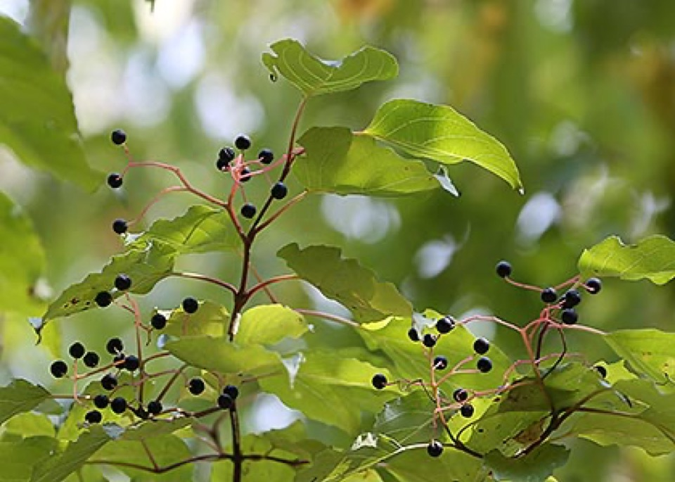
*열매 | 열매: 열매는 검정, 열매자루는 연한 빨강 열매 · 굳은씨열매(핵과)*

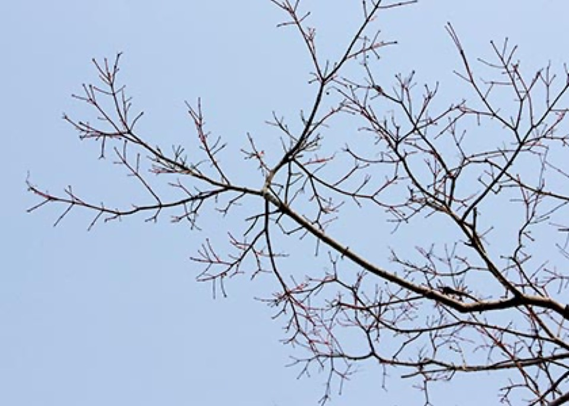
*수형 | 수형: 높이 6~15 m, 지름 30~50 cm · 수피: 어두운 갈색, 검은갈색*

### 감별 핵심 포인트
- 넓은 잎의 잎맥이 잎 끝 방향으로 휘어집니다.
- 작은 흰 꽃이 무리 지어 피고 꽃잎은 네 갈래입니다.
- 크게 자라는 나무로, 잎의 마주나는 배열을 확인하세요.

### 주된 형태 특징 (4대 감별 지표)
- **🌿 잎:** 마주나기 또는 거의 마주나기 · 홑잎 · 가장자리: 밋밋하지만 물결꼴을 갖기도 함 · 곁맥은 3~4(5)쌍이고, 작은 맥은 뚜렷하지 않은 그믈맥
- **🌸 꽃:** 꽃잎은 하양 꽃 · 산방꼴 취산꽃차례 · 꽃대는 지름 5~7 cm, 길이 1.5~2.5 cm이고, 거센털(강모, 조모)이 있으며, 작은꽃자루는 길이 0.8~2.7 mm
- **🍒 열매:** 열매는 검정, 열매자루는 연한 빨강 열매 · 굳은씨열매(핵과)
- **🪵 줄기·수형:** 높이 6~15 m, 지름 30~50 cm · 수피: 어두운 갈색, 검은갈색

**비교·주의:** 노랑말채나무·흰말채나무는 가지 색을, 층층나무는 어긋나는 잎을 비교하세요.

[파이팅혼공 TV 강의](https://www.youtube.com/watch?v=K3PvgTi3eXI&t=2590s) · [수목도감(treeworld)](https://treeworld.co.kr/a01_01_02/30137) · [위키백과(한국어)](https://ko.wikipedia.org/wiki/%EB%A7%90%EC%B1%84%EB%82%98%EB%AC%B4) · [Wikipedia(English)](https://en.wikipedia.org/wiki/Cornus_walteri)

## 038. 매화나무
> *Prunus mume Siebold & Zucc.* · Rosaceae 장미과

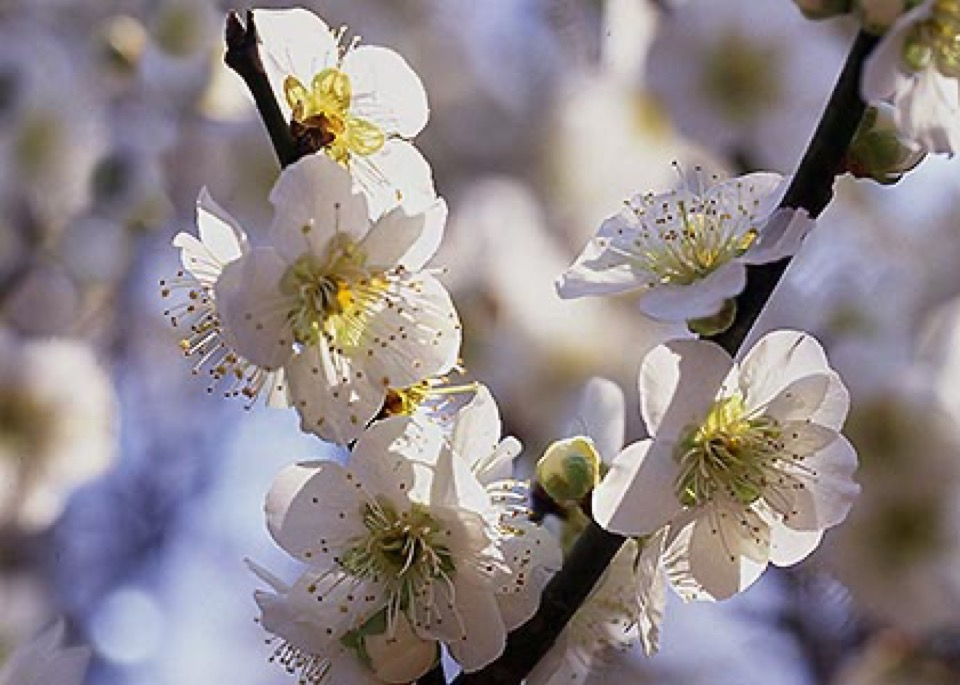
*꽃 | 꽃: 하양, 분홍, 연한 빨강(담홍색) 꽃 · 1개의 꽃((단정화) 또는 작은 다발 속에 2(~3)개의 꽃 · 홑꽃 또는 겹꽃*

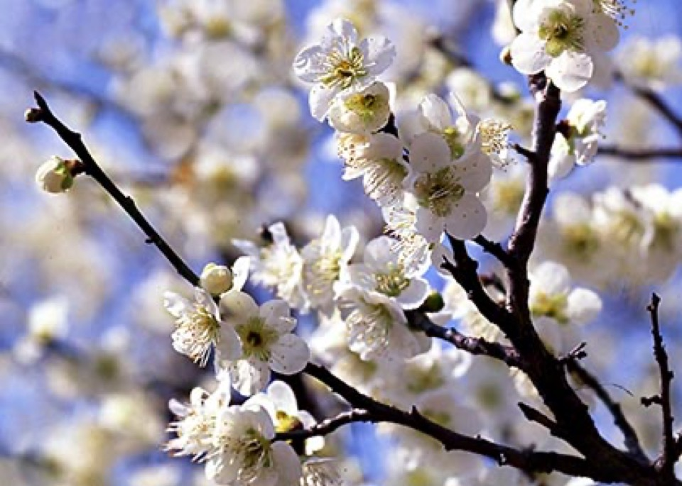
*수형 | 수형: 높이 4~6 m, 지름 60 cm쯤으로 우산형 · 수피: 회색, 초록빛 회색, 어두운 검정*

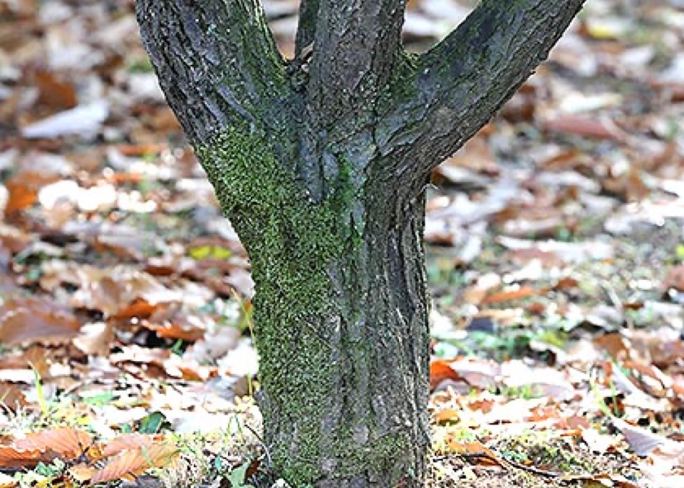
*줄기 | 줄기: 높이 4~6 m, 지름 60 cm쯤으로 우산형 · 수피: 회색, 초록빛 회색, 어두운 검정*

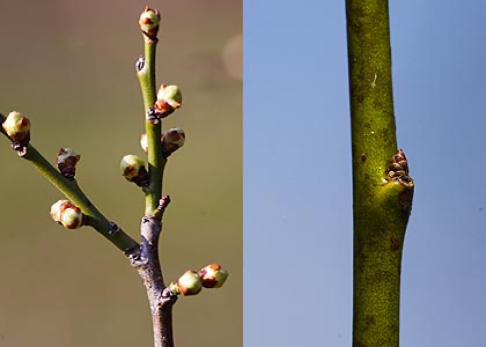
*겨울눈 | 겨울눈: 월동기 눈의 배열과 비늘잎 형태*

### 감별 핵심 포인트
- 잎이 나오기 전에 흰색 또는 분홍빛 꽃이 핍니다.
- 꽃잎은 다섯 장이고 중앙에 여러 수술이 모여 있습니다.
- 둥근 매실 열매와 끝이 길게 뾰족한 잎을 함께 봅니다.

### 주된 형태 특징 (4대 감별 지표)
- **🌿 잎:** 어긋나기 · 달걀형 또는 타원형 · 가장자리: 보통 날카로운 겹톱니가 있음 · 뒷쪽 맥 위에 갈색 털이 있음
- **🌸 꽃:** 하양, 분홍, 연한 빨강(담홍색) 꽃 · 1개의 꽃((단정화) 또는 작은 다발 속에 2(~3)개의 꽃 · 홑꽃 또는 겹꽃
- **🍒 열매:** 파랑에서 노랑으로 익음 열매 · 굳은씨열매(핵과)
- **🪵 줄기·수형:** 높이 4~6 m, 지름 60 cm쯤으로 우산형 · 수피: 회색, 초록빛 회색, 어두운 검정

**비교·주의:** 영상에는 ‘매화나무 / 매실나무’로 함께 표기되어 두 이름을 정답으로 인정합니다.

[파이팅혼공 TV 강의](https://www.youtube.com/watch?v=K3PvgTi3eXI&t=2710s) · [수목도감(treeworld)](https://treeworld.co.kr/a01_01_02/30112) · [위키백과(한국어)](https://ko.wikipedia.org/wiki/%EB%A7%A4%EC%8B%A4%EB%82%98%EB%AC%B4) · [Wikipedia(English)](https://en.wikipedia.org/wiki/Prunus_mume)

## 039. 먼나무
> *Ilex rotunda Thunb.* · Aquifoliaceae 감탕나무과

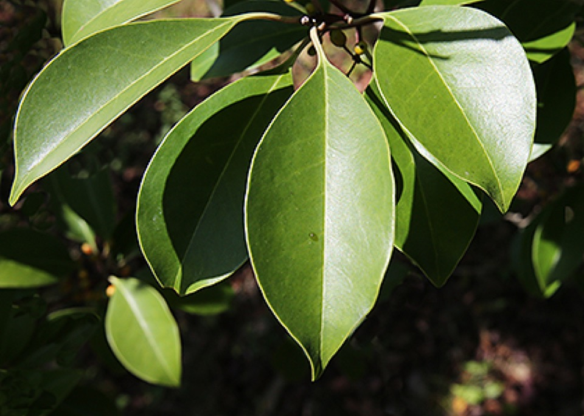
*잎 | 잎: 어긋나기 · 타원형, 달걀형 또는 거꿀달걀형 · 가장자리: 밋밋하며 마르면 갈색으로 됨*

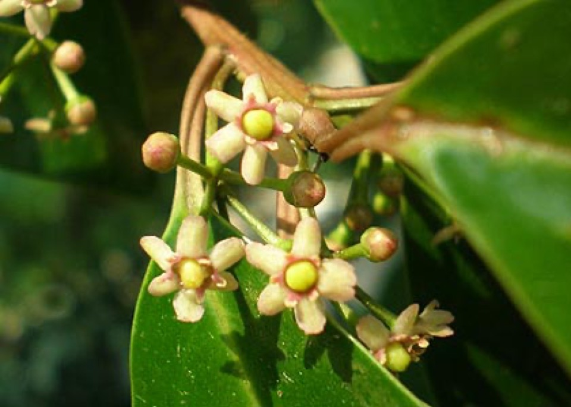
*꽃 | 꽃: 암꽃과 수꽃은 모두 연한 노랑색, 연한 자주색 꽃 · 취산꽃차례 · 암수딴그루(이가화)*

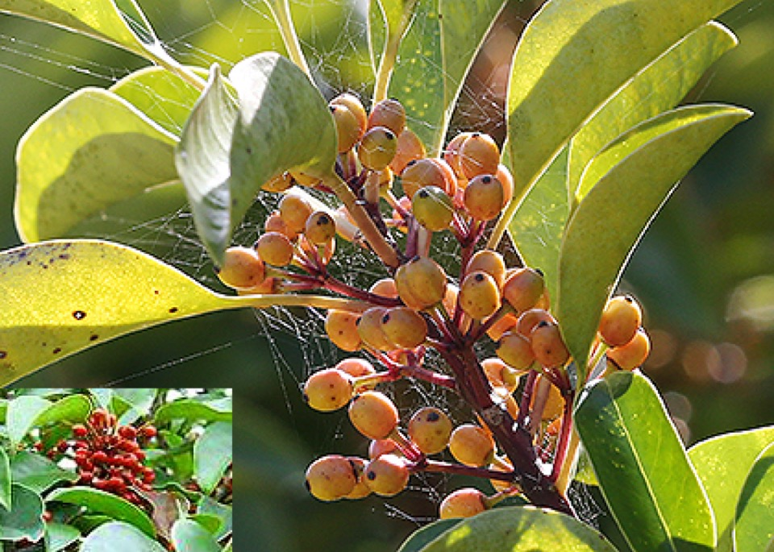
*열매 | 열매: 붉은색 열매 · 핵과*

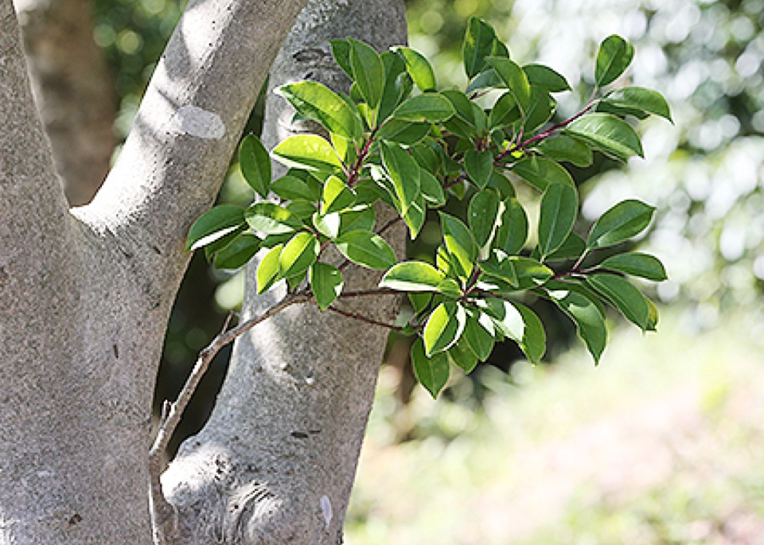
*수형 | 수형: 높이 5~10(20)m, 가슴높이 지름 1m · 수피: 녹갈색, 회색, 흑회색*

### 감별 핵심 포인트
- 작고 둥근 붉은 열매가 구슬처럼 다발로 달립니다.
- 잎은 타원형으로 두껍고 윤기가 납니다.
- 잎 가운데의 굵은 맥과 둥근 열매를 함께 확인하세요.

### 주된 형태 특징 (4대 감별 지표)
- **🌿 잎:** 어긋나기 · 타원형, 달걀형 또는 거꿀달걀형 · 가장자리: 밋밋하며 마르면 갈색으로 됨 · 곁맥은 6~9쌍
- **🌸 꽃:** 암꽃과 수꽃은 모두 연한 노랑색, 연한 자주색 꽃 · 취산꽃차례 · 암수딴그루(이가화)
- **🍒 열매:** 붉은색 열매 · 핵과
- **🪵 줄기·수형:** 높이 5~10(20)m, 가슴높이 지름 1m · 수피: 녹갈색, 회색, 흑회색

**비교·주의:** 감탕나무 등과 비교할 때 열매가 달리는 방식과 잎을 같이 봅니다.

[파이팅혼공 TV 강의](https://www.youtube.com/watch?v=K3PvgTi3eXI&t=2790s) · [수목도감(treeworld)](https://treeworld.co.kr/a01_01_02/30081) · [위키백과(한국어)](https://ko.wikipedia.org/wiki/%EB%A8%BC%EB%82%98%EB%AC%B4) · [Wikipedia(English)](https://en.wikipedia.org/wiki/Ilex_rotunda)

## 040. 메타세쿼이아
> *Metasequoia glyptostroboides Hu & W.C. Cheng* · Cupressaceae 측백나무과

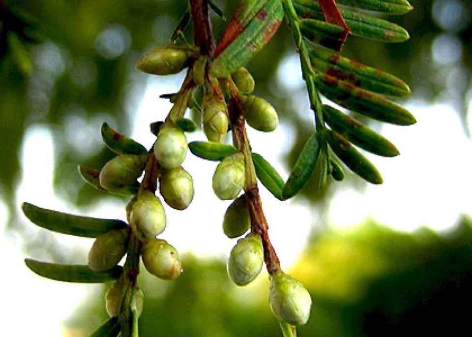
*잎 | 잎: 마주나기 · 깃꼴겹잎 또는 홑잎 · 가장자리: 밋밋함*

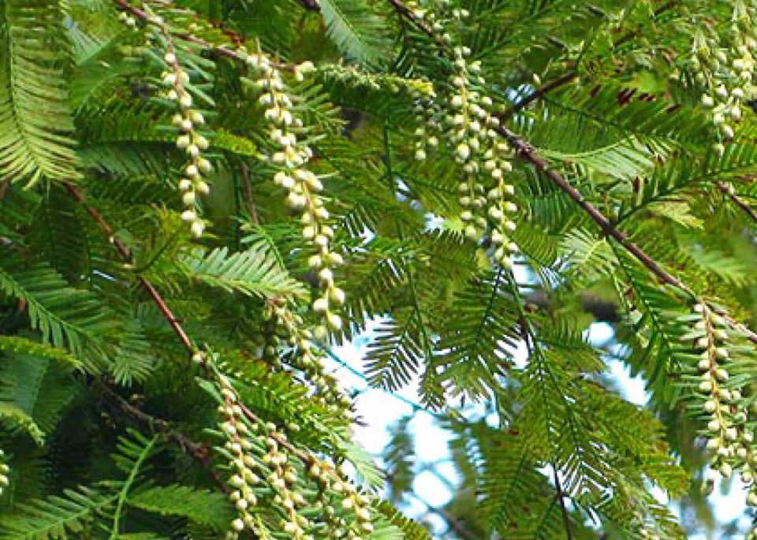
*꽃 | 꽃: 어린 씨방울은 분홍빛 검정 꽃 · 암꽃방울은 가지끝에 한개씩 달리며 아래로 처짐 · 일가화(암수한그루)*

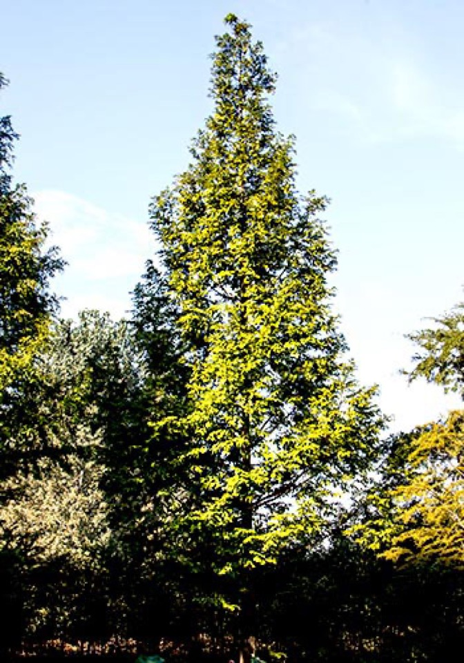
*수형 | 수형: 높이 21~35 m (산지 50 m) , 지름 2 m( 2.5 m)쯤으로 밑부분에서 버팀목이 된 줄기는 울퉁불퉁함 · 수피: 주황빛 갈색이지만 나이들면 빨간 갈색, 회빛 갈색*

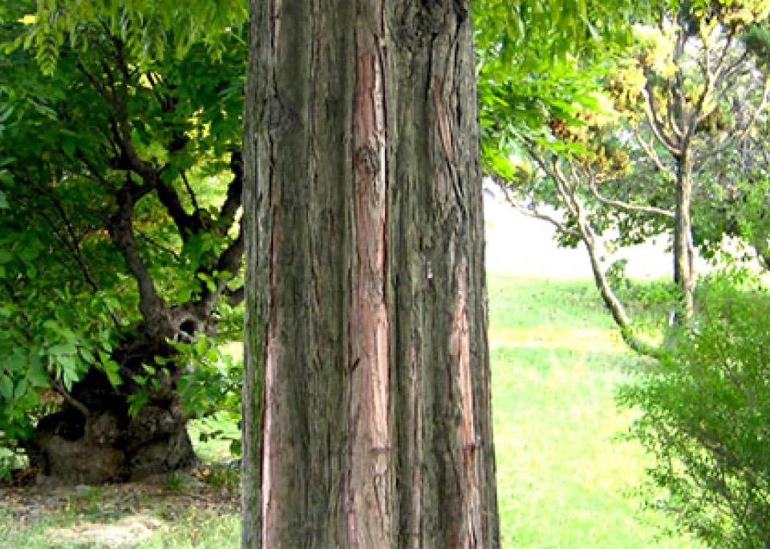
*줄기 | 줄기: 높이 21~35 m (산지 50 m) , 지름 2 m( 2.5 m)쯤으로 밑부분에서 버팀목이 된 줄기는 울퉁불퉁함 · 수피: 주황빛 갈색이지만 나이들면 빨간 갈색, 회빛 갈색*

### 감별 핵심 포인트
- 가늘고 부드러운 잎이 가지 양쪽으로 가지런히 마주납니다.
- 작고 둥근 솔방울이 달립니다.
- 곧게 자라는 수형과 세로로 거친 수피도 확인하세요.

### 주된 형태 특징 (4대 감별 지표)
- **🌿 잎:** 마주나기 · 깃꼴겹잎 또는 홑잎 · 가장자리: 밋밋함 · 곧은맥(직맥)으로 홈이 패인 기공선의 폭은 0.4~0.6 mm
- **🌸 꽃:** 어린 씨방울은 분홍빛 검정 꽃 · 암꽃방울은 가지끝에 한개씩 달리며 아래로 처짐 · 일가화(암수한그루)
- **🍒 열매:** 어릴 때는 푸른 초록에서 성숙하면 갈색 또는 어두운 갈색으로 바뀜 열매 · 씨방울열매(구과)
- **🪵 줄기·수형:** 높이 21~35 m (산지 50 m) , 지름 2 m( 2.5 m)쯤으로 밑부분에서 버팀목이 된 줄기는 울퉁불퉁함 · 수피: 주황빛 갈색이지만 나이들면 빨간 갈색, 회빛 갈색

**비교·주의:** 개비자나무보다 잎이 가늘고 부드러워 보입니다.

[파이팅혼공 TV 강의](https://www.youtube.com/watch?v=K3PvgTi3eXI&t=2890s) · [수목도감(treeworld)](https://treeworld.co.kr/a01_01_02/30063) · [위키백과(한국어)](https://ko.wikipedia.org/wiki/%EB%A9%94%ED%83%80%EC%84%B8%EC%BF%BC%EC%9D%B4%EC%95%84) · [Wikipedia(English)](https://en.wikipedia.org/wiki/Metasequoia_glyptostroboides)

## 041. 모감주나무
> *Koelreuteria paniculata Laxm.* · Sapindaceae 무환자나무과

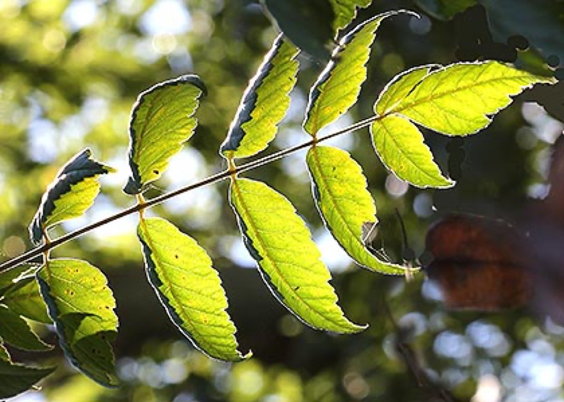
*잎 | 잎: 큰 잎대는 어긋나기 · 불원전하게 마주난 깃꼴 홀수1회깃꼴겹잎으로 작은잎은 (7)11~18쌍이고, 길이 25~35 cm · 가장자리: 불규칙하게 무딘 톱니*

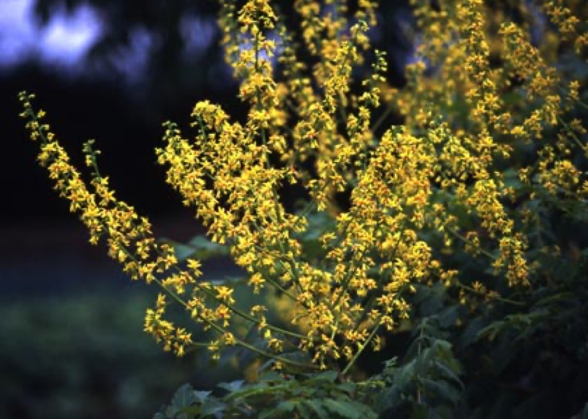
*꽃 | 꽃: 연한 노랑 꽃 · 원뿔꽃차례 · 가지가 길게 자라 끝에 총상으로 3~6개의 꽃이 촘촘하게 달림*

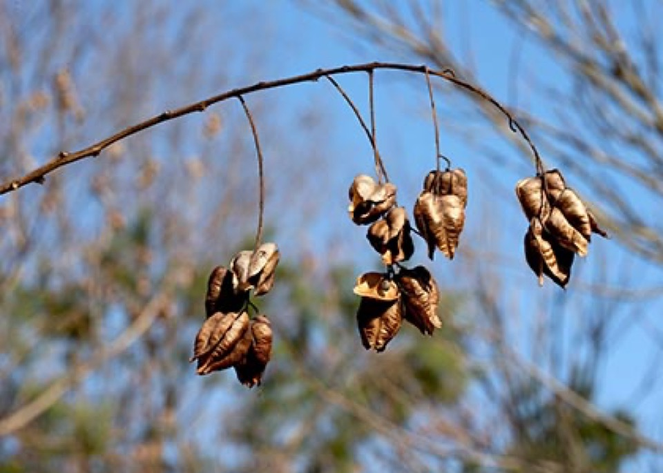
*열매 | 열매: 열매는 갈색, 노란갈색 열매 · 튀는 열매(삭과)*

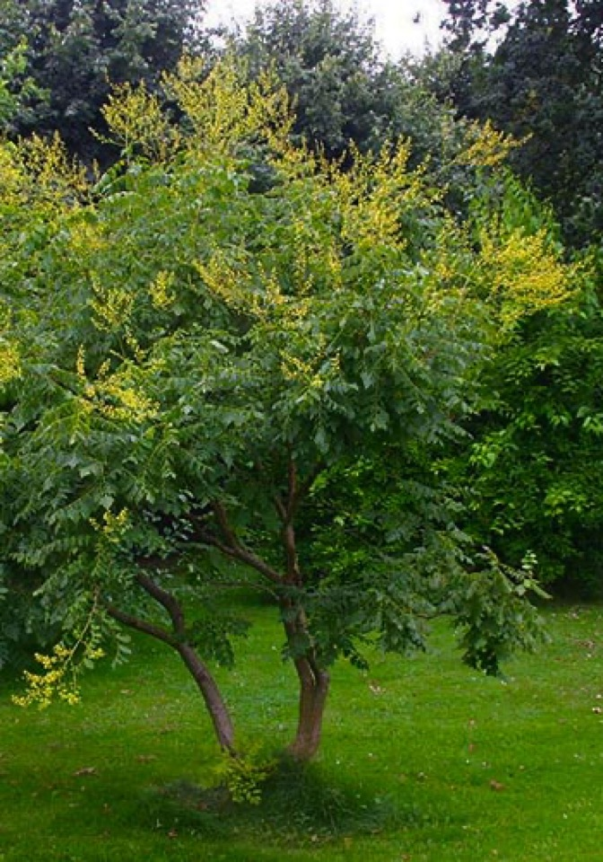
*수형 | 수형: 높이 8~10 m , 지름 30 cm 안팎 · 수피: 회빛 갈색 또는 검정*

### 감별 핵심 포인트
- 노란 꽃이 가지 끝에 큰 무리로 핍니다.
- 작은 잎 가장자리에 불규칙한 톱니가 보입니다.
- 꽈리나 작은 주머니 같은 열매가 가장 뚜렷한 단서입니다.

### 주된 형태 특징 (4대 감별 지표)
- **🌿 잎:** 큰 잎대는 어긋나기 · 불원전하게 마주난 깃꼴 홀수1회깃꼴겹잎으로 작은잎은 (7)11~18쌍이고, 길이 25~35 cm · 가장자리: 불규칙하게 무딘 톱니 · 앞뒷면에 털이 없거나 뒷면 잎맥을 따라 털이 있음
- **🌸 꽃:** 연한 노랑 꽃 · 원뿔꽃차례 · 가지가 길게 자라 끝에 총상으로 3~6개의 꽃이 촘촘하게 달림
- **🍒 열매:** 열매는 갈색, 노란갈색 열매 · 튀는 열매(삭과)
- **🪵 줄기·수형:** 높이 8~10 m , 지름 30 cm 안팎 · 수피: 회빛 갈색 또는 검정

[파이팅혼공 TV 강의](https://www.youtube.com/watch?v=K3PvgTi3eXI&t=2990s) · [수목도감(treeworld)](https://treeworld.co.kr/a01_01_02/30041) · [위키백과(한국어)](https://ko.wikipedia.org/wiki/%EB%AA%A8%EA%B0%90%EC%A3%BC%EB%82%98%EB%AC%B4) · [Wikipedia(English)](https://en.wikipedia.org/wiki/Koelreuteria_paniculata)

## 042. 모과나무
> *Pseudocydonia sinensis (Thouin) C. K. Schneid.* · Rosaceae 장미과

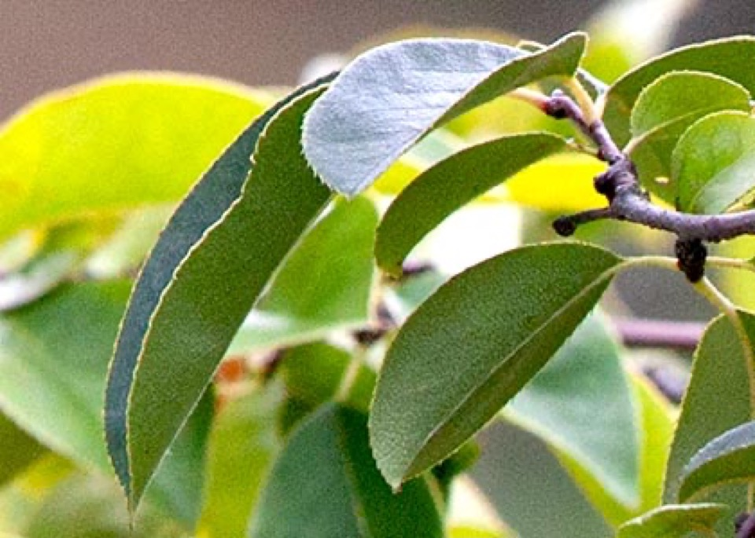
*잎 | 잎: 어긋나기 · 타원꼴 달걀형, 타원꼴 긴타원형 드믈게 거꿀달걀형으로 길이 5~8 cm, 너비 3.5~5.5 cm · 가장자리: 송곳꼴이거나 날카로운 잔톱니가 있음*

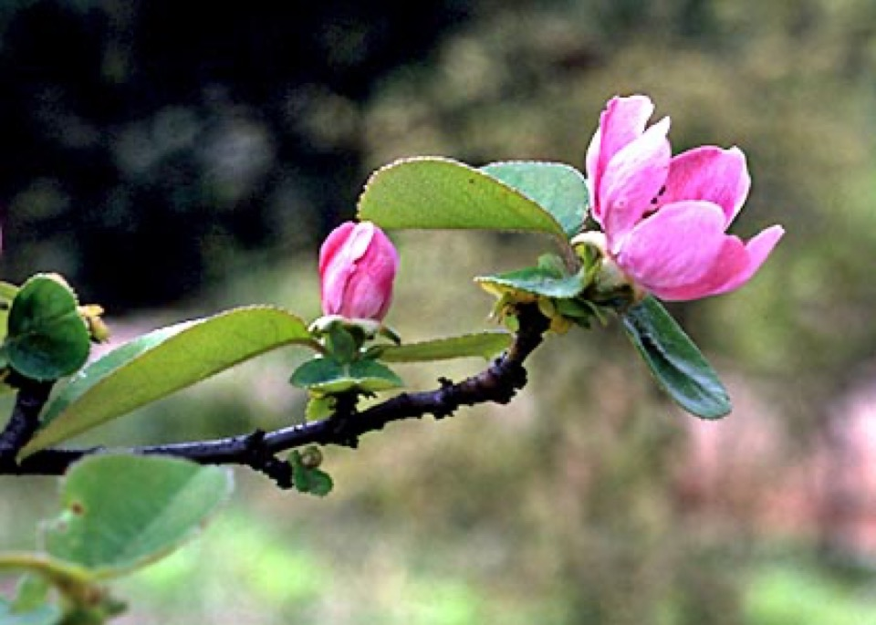
*꽃 | 꽃: 꽃잎은 밝은 빨강, 분홍, 하양 꽃 · 가지끝에 1개씩 달림 · 꽃은 지름 2.5~3 cm*

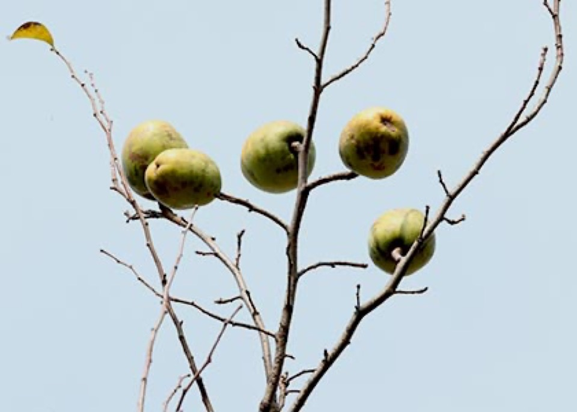
*열매 | 열매: 열매는 진한 노랑 열매 · 배열매(梨果)*

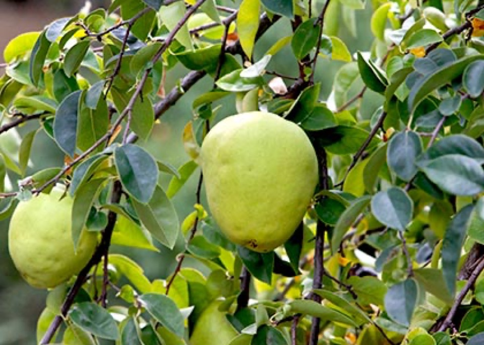
*수형 | 수형: 높이 5~10 m · 수피: 초록빛 갈색, 연한 초록색, 회갈색, 주황색*

### 감별 핵심 포인트
- 분홍색 꽃과 매끈하고 광택 있는 잎을 봅니다.
- 모과 열매가 크고 길쭉하게 달립니다.
- 수피가 얼룩지며 벗겨지는 모습도 확인하세요.

### 주된 형태 특징 (4대 감별 지표)
- **🌿 잎:** 어긋나기 · 타원꼴 달걀형, 타원꼴 긴타원형 드믈게 거꿀달걀형으로 길이 5~8 cm, 너비 3.5~5.5 cm · 가장자리: 송곳꼴이거나 날카로운 잔톱니가 있음 · 깃꼴 그믈맥
- **🌸 꽃:** 꽃잎은 밝은 빨강, 분홍, 하양 꽃 · 가지끝에 1개씩 달림 · 꽃은 지름 2.5~3 cm
- **🍒 열매:** 열매는 진한 노랑 열매 · 배열매(梨果)
- **🪵 줄기·수형:** 높이 5~10 m · 수피: 초록빛 갈색, 연한 초록색, 회갈색, 주황색

[파이팅혼공 TV 강의](https://www.youtube.com/watch?v=K3PvgTi3eXI&t=3110s) · [수목도감(treeworld)](https://treeworld.co.kr/a01_01_02/30034) · [위키백과(한국어)](https://ko.wikipedia.org/wiki/%EB%AA%A8%EA%B3%BC%EB%82%98%EB%AC%B4) · [Wikipedia(English)](https://en.wikipedia.org/wiki/Pseudocydonia_sinensis)

## 043. 무궁화
> *Hibiscus syriacus L.* · Malvaceae 아욱과

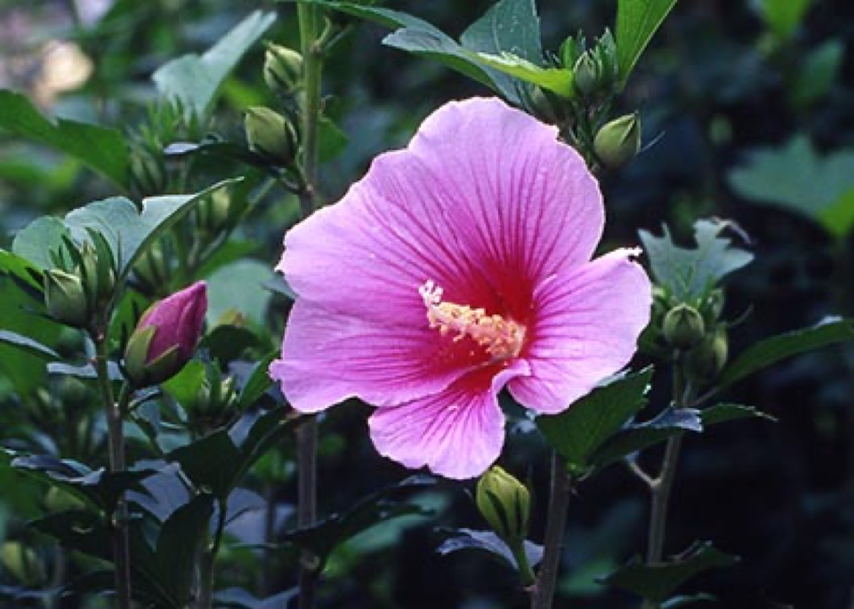
*꽃 | 꽃: 분홍 안쪽에 진한 빨강 꽃 · 단정꽃차례 · 홑꽃은 큰 꽃잎 5개가 서로 반쯤 겹치기로 펼쳐져 작은 주먹 정도에 이르며, 반겹꽃, 겹꽃 등 다양한 생김새를 갖임*

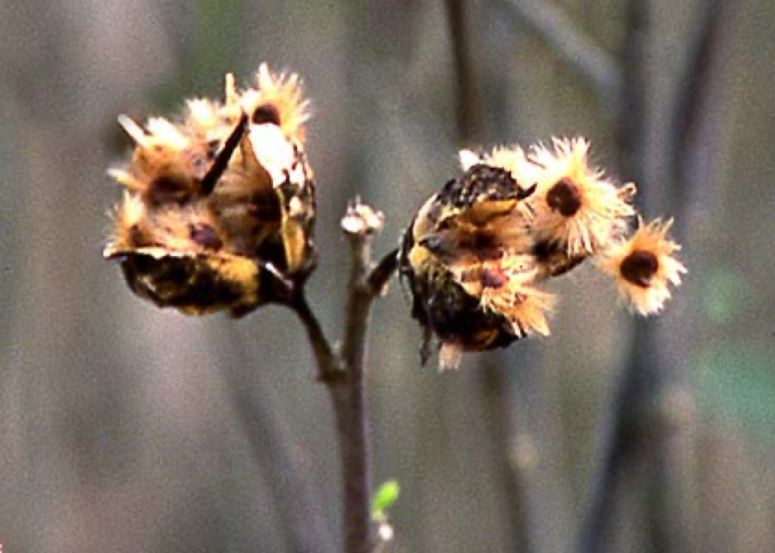
*열매 | 열매: 열매는 노란갈색 열매 · 튀는열매(삭과)*

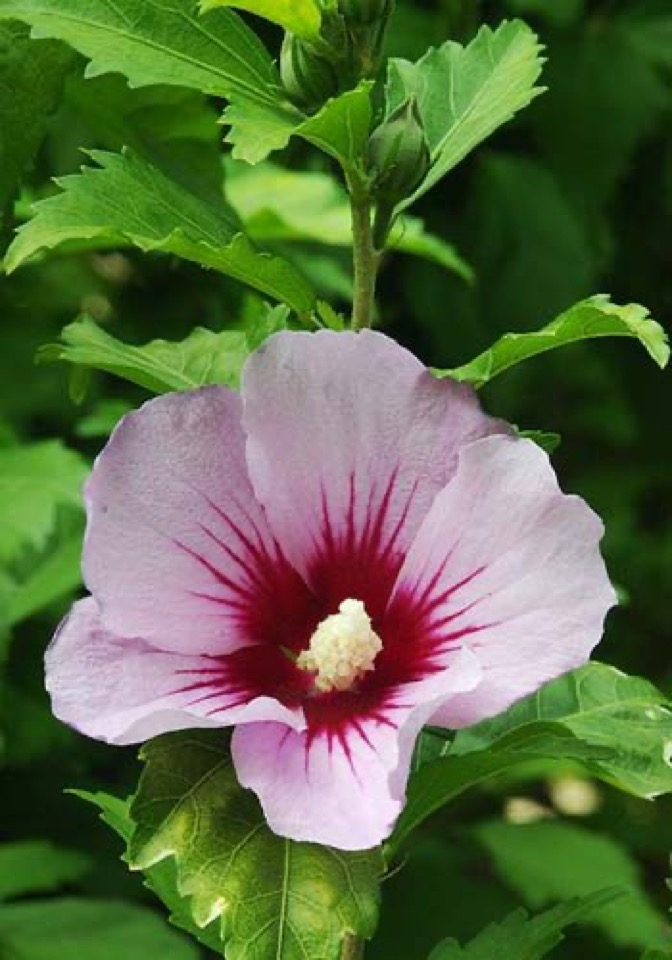
*수형 | 수형: 높이 1~4 m · 수피: 회색, 회빛 하양*

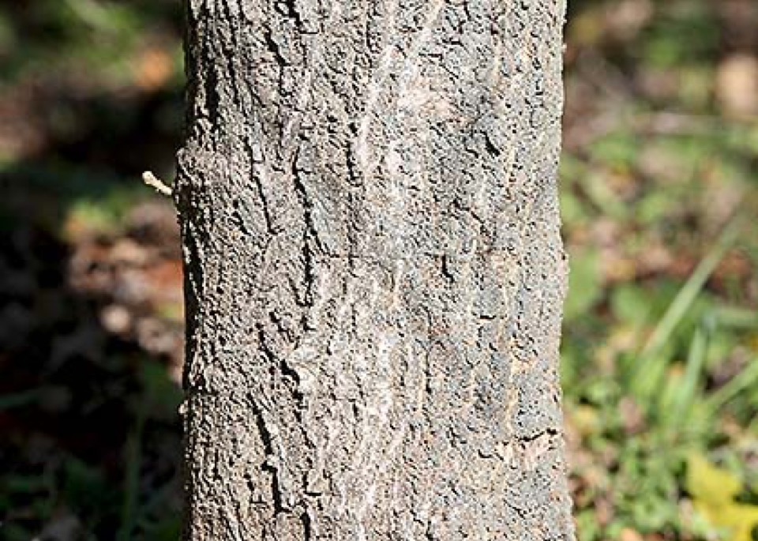
*줄기 | 줄기: 높이 1~4 m · 수피: 회색, 회빛 하양*

### 감별 핵심 포인트
- 큰 꽃의 중앙에 수술이 기둥처럼 모여 있습니다.
- 잎이 얕게 갈라지고 가장자리에 톱니가 보입니다.
- 익숙한 꽃 모양에 잎의 형태도 함께 연결해 기억하세요.

### 주된 형태 특징 (4대 감별 지표)
- **🌿 잎:** 어긋나기 · 잎몸은 삼각꼴 달걀형, 마름모꼴 달걀형, 넓은 피침형으로 길이 3~10 cm, 너비 2~5 cm 이고, 다양한 3갈래 또는 밋밋함 · 가장자리: 불규칙하게 째지거나 무딘 톱니, 날카로운 톱니가 있음 · 기본맥 3~5개가 있음
- **🌸 꽃:** 분홍 안쪽에 진한 빨강 꽃 · 단정꽃차례 · 홑꽃은 큰 꽃잎 5개가 서로 반쯤 겹치기로 펼쳐져 작은 주먹 정도에 이르며, 반겹꽃, 겹꽃 등 다양한 생김새를 갖임
- **🍒 열매:** 열매는 노란갈색 열매 · 튀는열매(삭과)
- **🪵 줄기·수형:** 높이 1~4 m · 수피: 회색, 회빛 하양

[파이팅혼공 TV 강의](https://www.youtube.com/watch?v=K3PvgTi3eXI&t=3170s) · [수목도감(treeworld)](https://treeworld.co.kr/a01_01_02/29986) · [위키백과(한국어)](https://ko.wikipedia.org/wiki/%EB%AC%B4%EA%B6%81%ED%99%94) · [Wikipedia(English)](https://en.wikipedia.org/wiki/Hibiscus_syriacus)

## 044. 물푸레나무
> *Fraxinus chinensis subsp. rhynchophylla (Hance) A.E.Murray* · Oleaceae 물푸레나무과

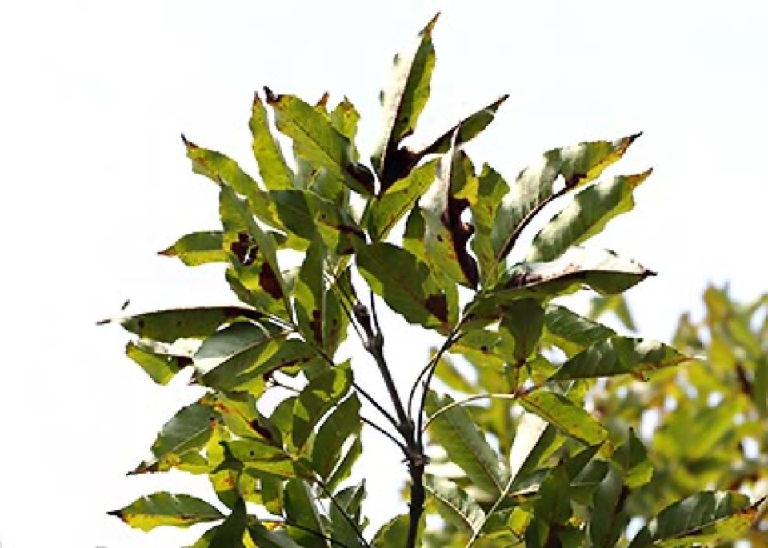
*잎 | 잎: 마주나기 · 홀수 1회 깃꼴 겹잎으로 잎대는 길이 12~35 cm · 가장자리: 물결꼴 톱니가 있거나 밋밋함*

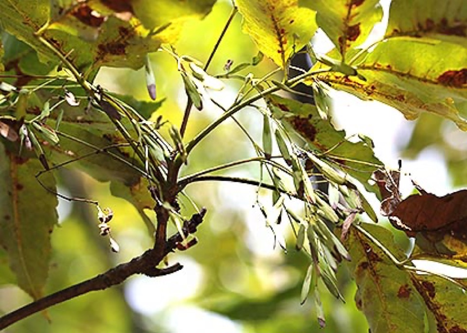
*열매 | 열매: 노란 갈색 열매 · 날개열매(시과)*

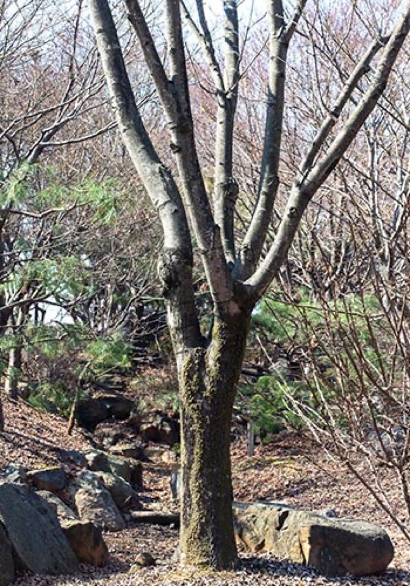
*수형 | 수형: 높이 3~20 m( 보틍은 10 m), 지름 50 cm쯤이고, 곧은 줄기꼴이지만 갈라지는 것도 있으며, 껍질은 세로로 갈라지는데 하얀 가로 무늬가 있음 · 수피: 검은 회색, 갈빛 회색*

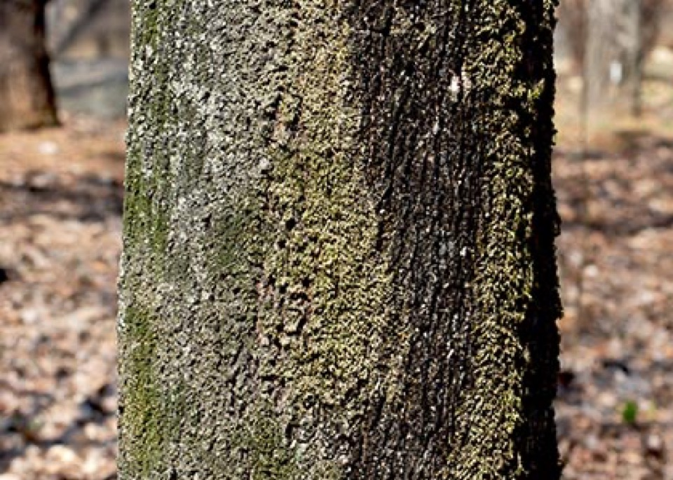
*줄기 | 줄기: 높이 3~20 m( 보틍은 10 m), 지름 50 cm쯤이고, 곧은 줄기꼴이지만 갈라지는 것도 있으며, 껍질은 세로로 갈라지는데 하얀 가로 무늬가 있음 · 수피: 검은 회색, 갈빛 회색*

### 감별 핵심 포인트
- 여러 길쭉한 작은 잎이 양쪽에 나란히 달린 겹잎입니다.
- 끝에 작은 잎 하나가 더 있는 홀수깃모양 잎을 봅니다.
- 길쭉한 날개가 달린 열매가 여러 개 모여 달립니다.

### 주된 형태 특징 (4대 감별 지표)
- **🌿 잎:** 마주나기 · 홀수 1회 깃꼴 겹잎으로 잎대는 길이 12~35 cm · 가장자리: 물결꼴 톱니가 있거나 밋밋함 · 곁맥 6(5)~9쌍
- **🌸 꽃:** 하양 꽃 · 원뿔꽃차례(원추화서) 또는 겹송이꽃차례(총상화서) · 암수딴그루, 때로는 암수한꽃도 섞여 있음
- **🍒 열매:** 노란 갈색 열매 · 날개열매(시과)
- **🪵 줄기·수형:** 높이 3~20 m( 보틍은 10 m), 지름 50 cm쯤이고, 곧은 줄기꼴이지만 갈라지는 것도 있으며, 껍질은 세로로 갈라지는데 하얀 가로 무늬가 있음 · 수피: 검은 회색, 갈빛 회색

**비교·주의:** 수피 사진만으로 판단하기보다 잎과 날개 열매를 함께 확인합니다.

[파이팅혼공 TV 강의](https://www.youtube.com/watch?v=K3PvgTi3eXI&t=3190s) · [수목도감(treeworld)](https://treeworld.co.kr/a01_01_02/29937) · [위키백과(한국어)](https://ko.wikipedia.org/wiki/%EB%AC%BC%ED%91%B8%EB%A0%88%EB%82%98%EB%AC%B4) · [Wikipedia(English)](https://en.wikipedia.org/wiki/Fraxinus_chinensis)

## 045. 미선나무
> *Abeliophyllum distichum Nakai* · Oleaceae 물푸레나무과

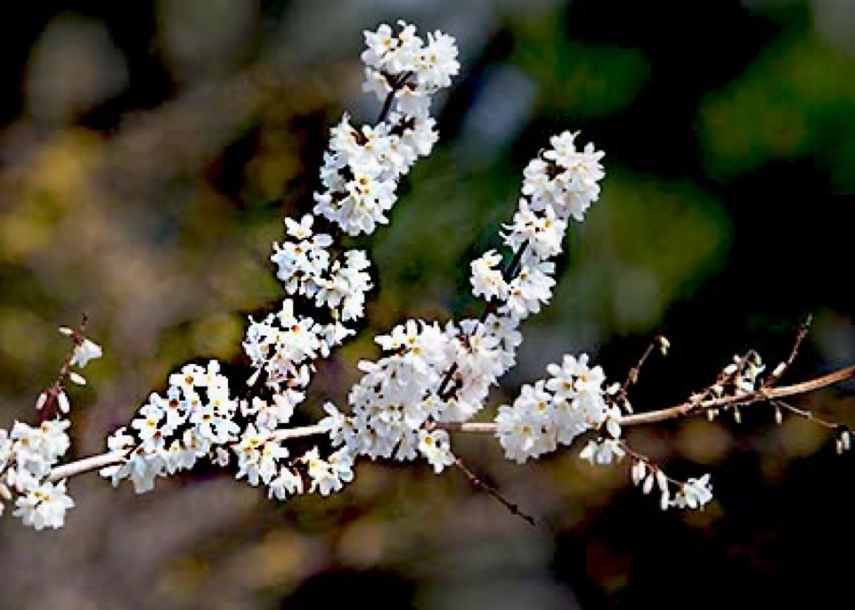
*꽃 | 꽃: 하양, 분홍, 연한 노랑 또는 연한 빨강 등의 여러가지 색깔이 나타남 꽃 · 총상꽃차례 · 암수한꽃*

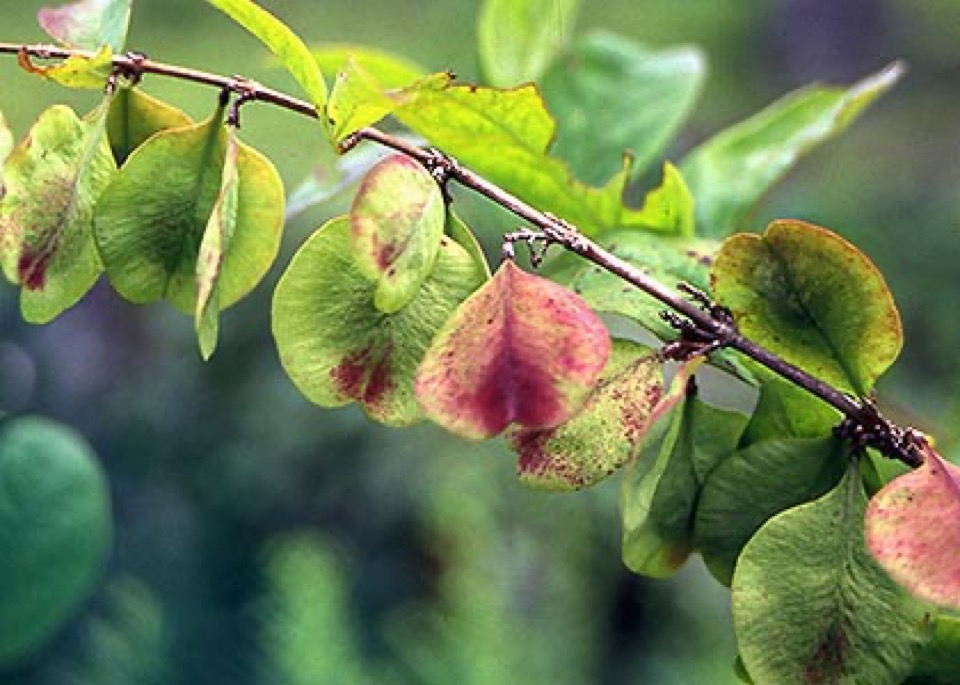
*열매 | 열매: 주황 열매 · 날개열매(시과)*

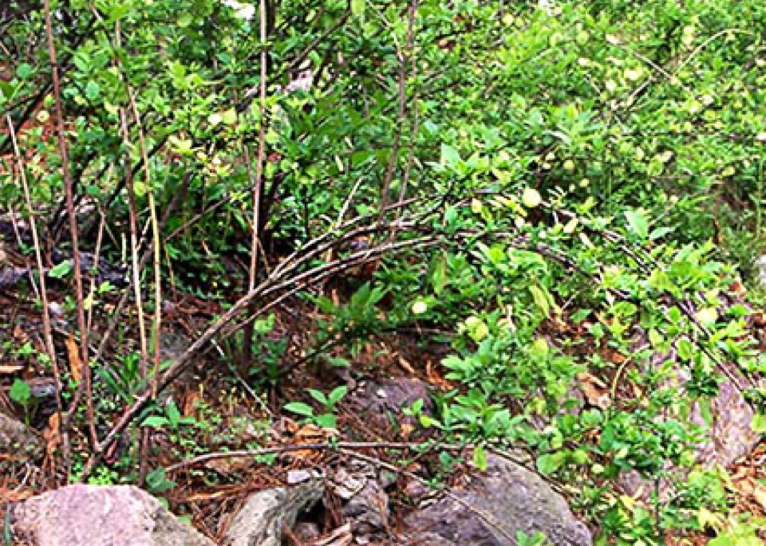
*수형 | 수형: 높이 1~1.5 m이고, 줄기를 많이 냄(종종 제멋대로 자람) · 수피: 회갈색*

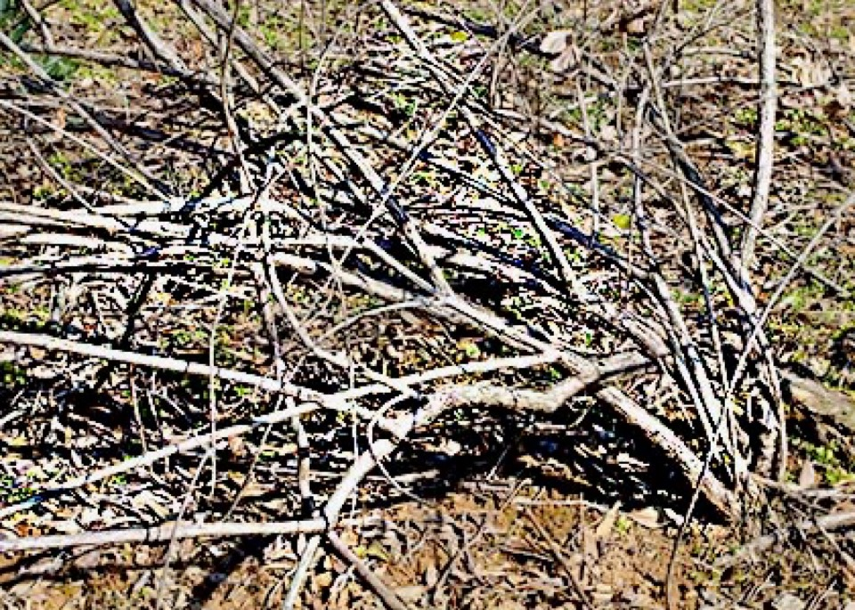
*줄기 | 줄기: 높이 1~1.5 m이고, 줄기를 많이 냄(종종 제멋대로 자람) · 수피: 회갈색*

### 감별 핵심 포인트
- 잎보다 먼저 흰 꽃이 가지에 모여 핍니다.
- 꽃부리는 네 갈래로 나뉘며 갈래가 비교적 길어 보입니다.
- 둥근 부채 모양의 열매도 중요한 감별 단서입니다.

### 주된 형태 특징 (4대 감별 지표)
- **🌿 잎:** 마주나기 · 홑잎 · 가장자리: 밋밋함(전연) · 어긋나게 달림
- **🌸 꽃:** 하양, 분홍, 연한 노랑 또는 연한 빨강 등의 여러가지 색깔이 나타남 꽃 · 총상꽃차례 · 암수한꽃
- **🍒 열매:** 주황 열매 · 날개열매(시과)
- **🪵 줄기·수형:** 높이 1~1.5 m이고, 줄기를 많이 냄(종종 제멋대로 자람) · 수피: 회갈색

**비교·주의:** 다른 흰 꽃 수목과 비교할 때 꽃의 갈래와 열매를 함께 봅니다.

[파이팅혼공 TV 강의](https://www.youtube.com/watch?v=K3PvgTi3eXI&t=3310s) · [수목도감(treeworld)](https://treeworld.co.kr/a01_01_02/29919) · [위키백과(한국어)](https://ko.wikipedia.org/wiki/%EB%AF%B8%EC%84%A0%EB%82%98%EB%AC%B4) · [Wikipedia(English)](https://en.wikipedia.org/wiki/Abeliophyllum_distichum)

## 046. 박태기나무
> *Cercis chinensis Bunge* · Fabaceae 콩과

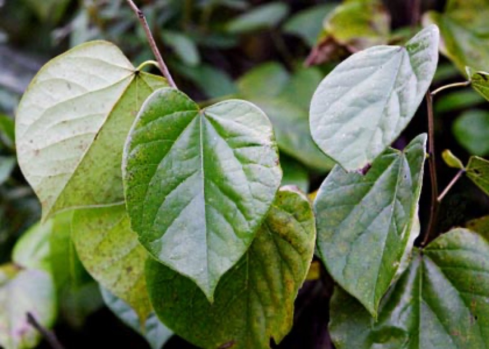
*잎 | 잎: 어긋나기 · 홑잎 · 가장자리: 잎 둘레가 투명함*

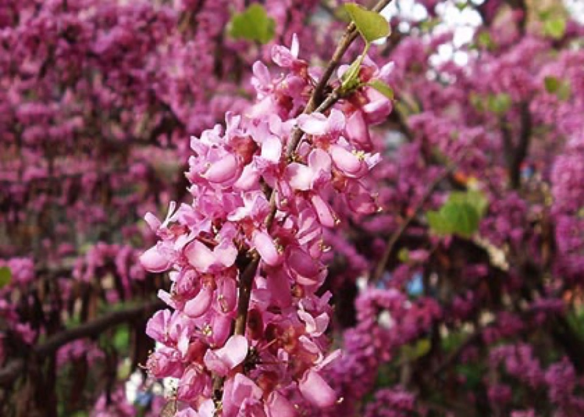
*꽃 | 꽃: 꽃잎은 빨간 자주 또는 하양 꽃 · 우산형꽃차례 · 꽃대가 따로 없고, 작은꽃자루는 길이 6~15 mm로서 털이 없음*

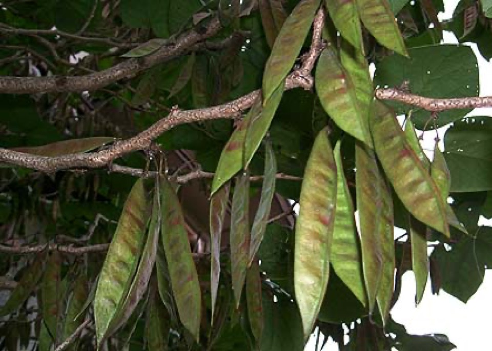
*열매 | 열매: 열매는 초록에서 익으면 연한 노랑 또는 갈색 열매 · 꼬투리(협과)*

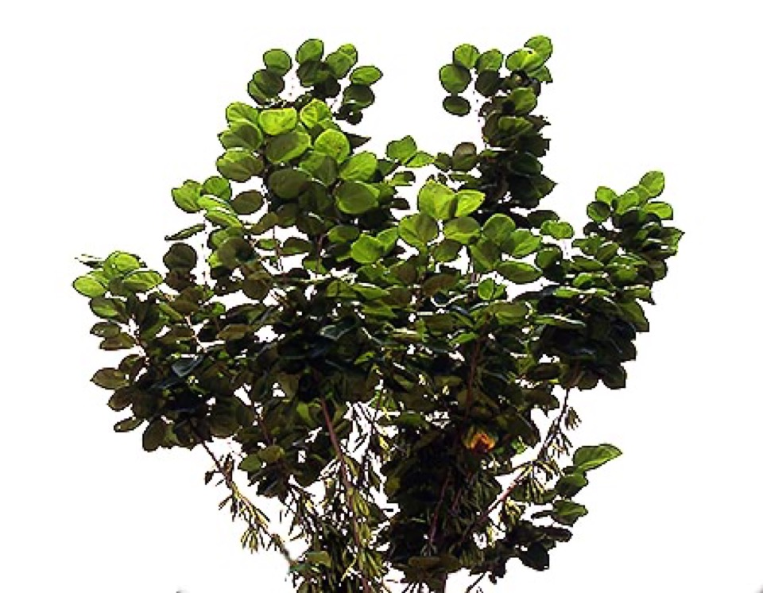
*수형 | 수형: 높이 2~5(8) m · 수피: 회갈색*

### 감별 핵심 포인트
- 잎이 나오기 전에 진한 분홍색 꽃이 가지에 다닥다닥 붙습니다.
- 잎은 크고 넓은 하트 모양입니다.
- 콩깍지 같은 납작한 열매가 달립니다.

### 주된 형태 특징 (4대 감별 지표)
- **🌿 잎:** 어긋나기 · 홑잎 · 가장자리: 잎 둘레가 투명함 · 잎몸 아래에서 부터 기본맥이 5개(5출맥)로 갈라지고, 가장자리에 가까운 둘레에 있는 또하나의 맥으로 이어지거나 끊김
- **🌸 꽃:** 꽃잎은 빨간 자주 또는 하양 꽃 · 우산형꽃차례 · 꽃대가 따로 없고, 작은꽃자루는 길이 6~15 mm로서 털이 없음
- **🍒 열매:** 열매는 초록에서 익으면 연한 노랑 또는 갈색 열매 · 꼬투리(협과)
- **🪵 줄기·수형:** 높이 2~5(8) m · 수피: 회갈색

**비교·주의:** 계수나무의 하트 모양 잎과 혼동하면 가지에 붙은 분홍 꽃을 떠올리세요.

[파이팅혼공 TV 강의](https://www.youtube.com/watch?v=K3PvgTi3eXI&t=3370s) · [수목도감(treeworld)](https://treeworld.co.kr/a01_01_02/29882) · [위키백과(한국어)](https://ko.wikipedia.org/wiki/%EB%B0%95%ED%83%9C%EA%B8%B0%EB%82%98%EB%AC%B4) · [Wikipedia(English)](https://en.wikipedia.org/wiki/Cercis_chinensis)

## 047. 반송
> *Pinus densiflora Siebold & Zucc.* · Pinaceae 소나무과

*잎 | 잎: 짧은 가지에 2 잎씩 모아나기(2엽송) · 바늘잎(針形) 또는 좁은 피침형으로 길이 7∼12 cm, 너비 0.7~1.5 mm · 가장자리: 밋밋하거나(全緣) 아주 자잘한 톱니(미거치)가 있음*

*꽃 | 꽃: 씨방울은 연한 빨강, 꽃가루방울은 연한 노랑 꽃 · 암꽃방울은 햇가지 끝에 1~3(그 이상)개가 달리고, 수꽃이삭은 햇가지 아래 부분 잎자리에 소포자잎 20~30개(때로는 이 보다 많음)씩 모여달림 · 암수한그루(자웅동주, 일가화)*

*열매 | 열매: 솔방울은 노란 갈색 열매 · 솔방울열매(구과)*

*수형 | 수형: 높이 20~35 m, 지름1.5~1.8 m · 수피: 빨간 갈색*

### 감별 핵심 포인트
- 땅 가까이에서 여러 줄기가 갈라져 둥글고 넓게 퍼집니다.
- 침엽은 소나무와 비슷하게 길게 모여 납니다.
- 개별 잎보다 전체 수형이 중요한 감별 단서입니다.

### 주된 형태 특징 (4대 감별 지표)
- **🌿 잎:** 짧은 가지에 2 잎씩 모아나기(2엽송) · 바늘잎(針形) 또는 좁은 피침형으로 길이 7∼12 cm, 너비 0.7~1.5 mm · 가장자리: 밋밋하거나(全緣) 아주 자잘한 톱니(미거치)가 있음 · 흐릿한 기공선이 앞뒷면에 있음
- **🌸 꽃:** 씨방울은 연한 빨강, 꽃가루방울은 연한 노랑 꽃 · 암꽃방울은 햇가지 끝에 1~3(그 이상)개가 달리고, 수꽃이삭은 햇가지 아래 부분 잎자리에 소포자잎 20~30개(때로는 이 보다 많음)씩 모여달림 · 암수한그루(자웅동주, 일가화)
- **🍒 열매:** 솔방울은 노란 갈색 열매 · 솔방울열매(구과)
- **🪵 줄기·수형:** 높이 20~35 m, 지름1.5~1.8 m · 수피: 빨간 갈색

**비교·주의:** 잎만 나온 사진에서는 소나무와 구별이 어렵습니다.

[파이팅혼공 TV 강의](https://www.youtube.com/watch?v=K3PvgTi3eXI&t=3450s) · [수목도감(treeworld)](https://treeworld.co.kr/a01_01_02/29305) · [위키백과(한국어)](https://ko.wikipedia.org/wiki/%EB%B0%98%EC%86%A1) · [Wikipedia(English)](https://en.wikipedia.org/wiki/Pinus_densiflora)

## 048. 배롱나무
> *Lagerstroemia indica L.* · Lythraceae 부처꽃과

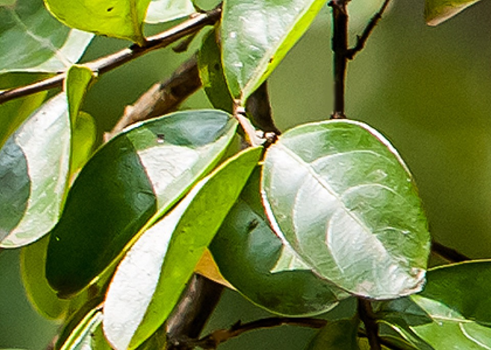
*잎 | 잎: 마주나기 또는 거의 마주나기(때로 윗쪽의 것은 어긋나기) · 홑잎 · 가장자리: 톱니가 없음*

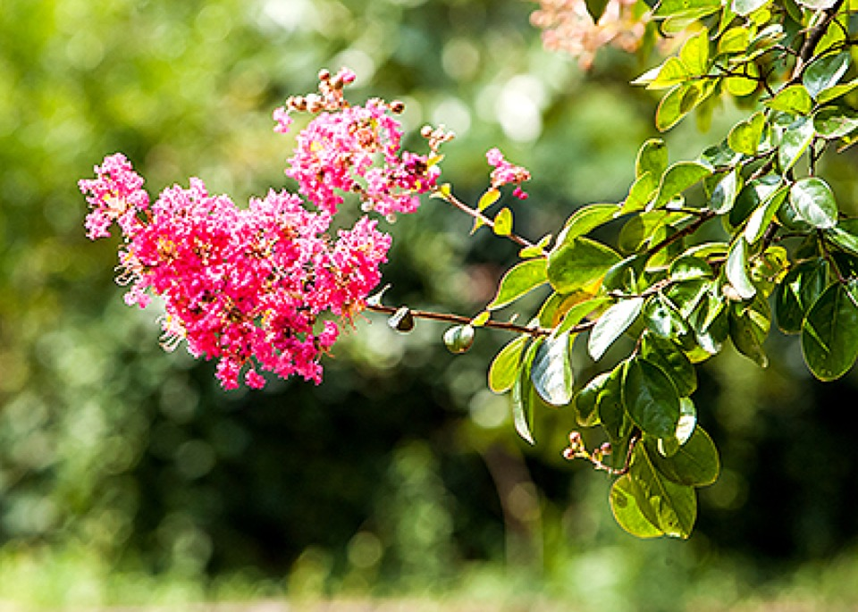
*꽃 | 꽃: 진한 분홍, 빨간 자주 꽃 · 원뿔꽃차례 · 암수한꽃(양성화)*

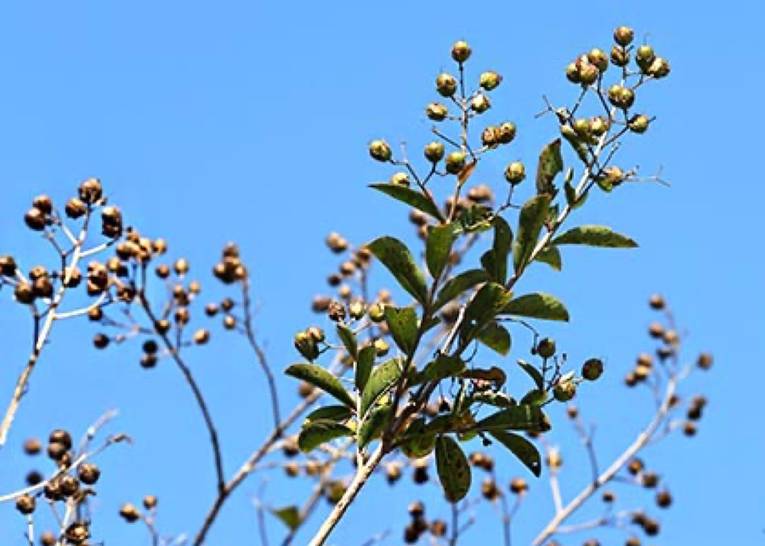
*열매 | 열매: 갈색 또는 검정 열매 · 튀는열매(삭과)*

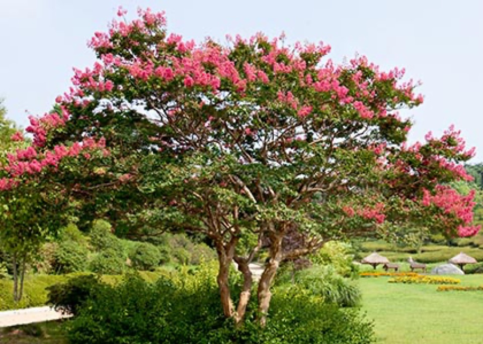
*수형 | 수형: 높이 5~7 m · 수피: 갈색에서 연한 빨강이며, 하얀 둥근얼룩이 생김*

### 감별 핵심 포인트
- 붉은색·분홍색 꽃잎이 잘게 주름져 보입니다.
- 잎은 숟가락처럼 끝 쪽이 넓고 둥글게 보입니다.
- 매끈하고 얼룩진 수피, 갈라지는 마른 열매도 봅니다.

### 주된 형태 특징 (4대 감별 지표)
- **🌿 잎:** 마주나기 또는 거의 마주나기(때로 윗쪽의 것은 어긋나기) · 홑잎 · 가장자리: 톱니가 없음 · 깃꼴맥으로 곁맥는 3~7쌍
- **🌸 꽃:** 진한 분홍, 빨간 자주 꽃 · 원뿔꽃차례 · 암수한꽃(양성화)
- **🍒 열매:** 갈색 또는 검정 열매 · 튀는열매(삭과)
- **🪵 줄기·수형:** 높이 5~7 m · 수피: 갈색에서 연한 빨강이며, 하얀 둥근얼룩이 생김

[파이팅혼공 TV 강의](https://www.youtube.com/watch?v=K3PvgTi3eXI&t=3530s) · [수목도감(treeworld)](https://treeworld.co.kr/a01_01_02/29864) · [위키백과(한국어)](https://ko.wikipedia.org/wiki/%EB%B0%B0%EB%A1%B1%EB%82%98%EB%AC%B4) · [Wikipedia(English)](https://en.wikipedia.org/wiki/Lagerstroemia_indica)

## 049. 백당나무
> *Viburnum sargentii Koehne* · Adoxaceae 연복초과

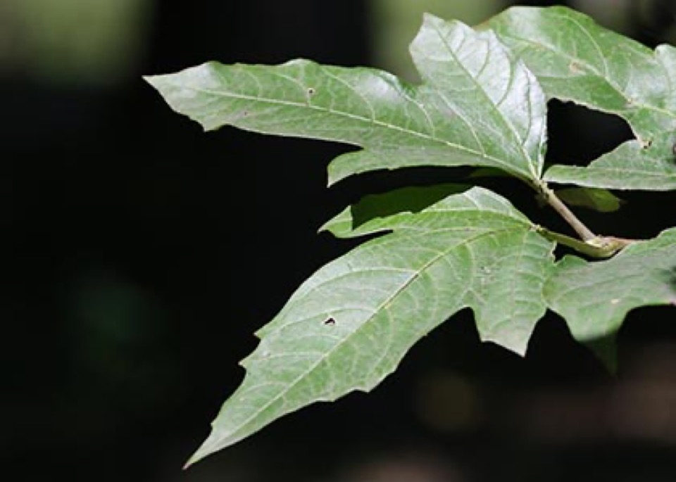
*잎 | 잎: 마주나기 · 홑잎 · 가장자리: 중앙 근처에서 3개로 갈라지거나 드믈게 밋밋함*

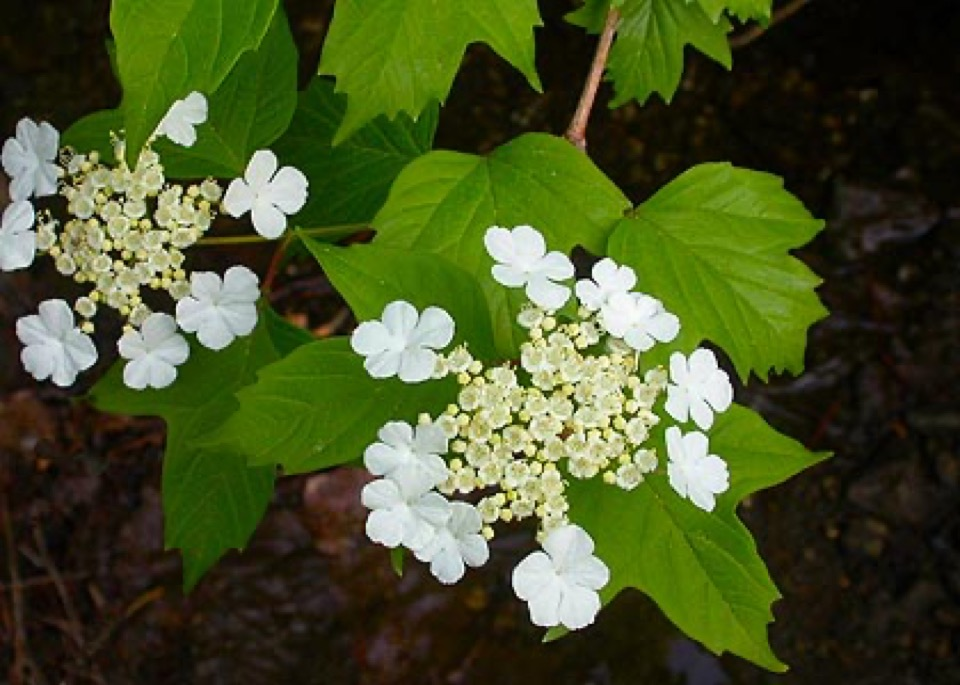
*꽃 | 꽃: 불임의 꽃잎은 하양 또는 크림빛 하양 꽃 · 겹우산꼴(복산형상) 고른꽃차례(산방화서) · 유성화와 무성화가 함께 달림*

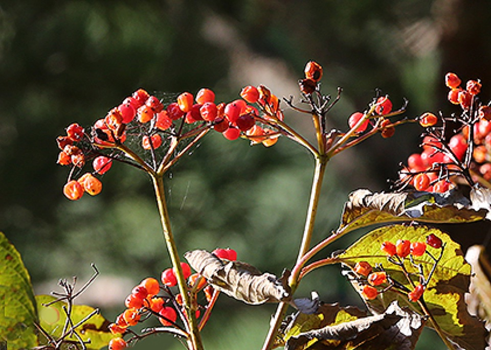
*열매 | 열매: 연한 빨강 열매 · 물열매꼴 굳은씨열매(핵과)*

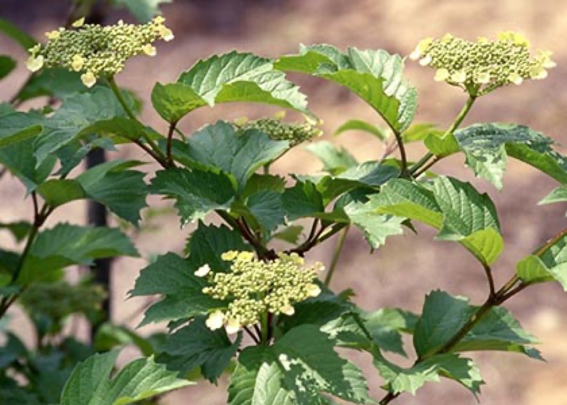
*수형 | 수형: 높이 2~3(6) m · 수피: 갈색*

### 감별 핵심 포인트
- 꽃무리 바깥쪽에 큰 흰 헛꽃이 둘러 있고 가운데 작은 꽃이 모입니다.
- 잎은 크게 세 갈래로 갈라진 모습이 특징입니다.
- 붉고 둥근 열매가 무리 지어 달립니다.

### 주된 형태 특징 (4대 감별 지표)
- **🌿 잎:** 마주나기 · 홑잎 · 가장자리: 중앙 근처에서 3개로 갈라지거나 드믈게 밋밋함 · 손바닥꼴로 3~5개의 깃꼴맥이 있음
- **🌸 꽃:** 불임의 꽃잎은 하양 또는 크림빛 하양 꽃 · 겹우산꼴(복산형상) 고른꽃차례(산방화서) · 유성화와 무성화가 함께 달림
- **🍒 열매:** 연한 빨강 열매 · 물열매꼴 굳은씨열매(핵과)
- **🪵 줄기·수형:** 높이 2~3(6) m · 수피: 갈색

**비교·주의:** 수국의 둥근 꽃덩이와 비교하되 바깥·안쪽 꽃의 차이를 보세요.

[파이팅혼공 TV 강의](https://www.youtube.com/watch?v=K3PvgTi3eXI&t=3610s) · [수목도감(treeworld)](https://treeworld.co.kr/a01_01_02/29849) · [위키백과(한국어)](https://ko.wikipedia.org/wiki/%EB%B0%B1%EB%8B%B9%EB%82%98%EB%AC%B4) · [Wikipedia(English)](https://en.wikipedia.org/wiki/Viburnum_sargentii)

## 050. 백목련
> *Magnolia denudata Desr.* · Magnoliaceae 목련과

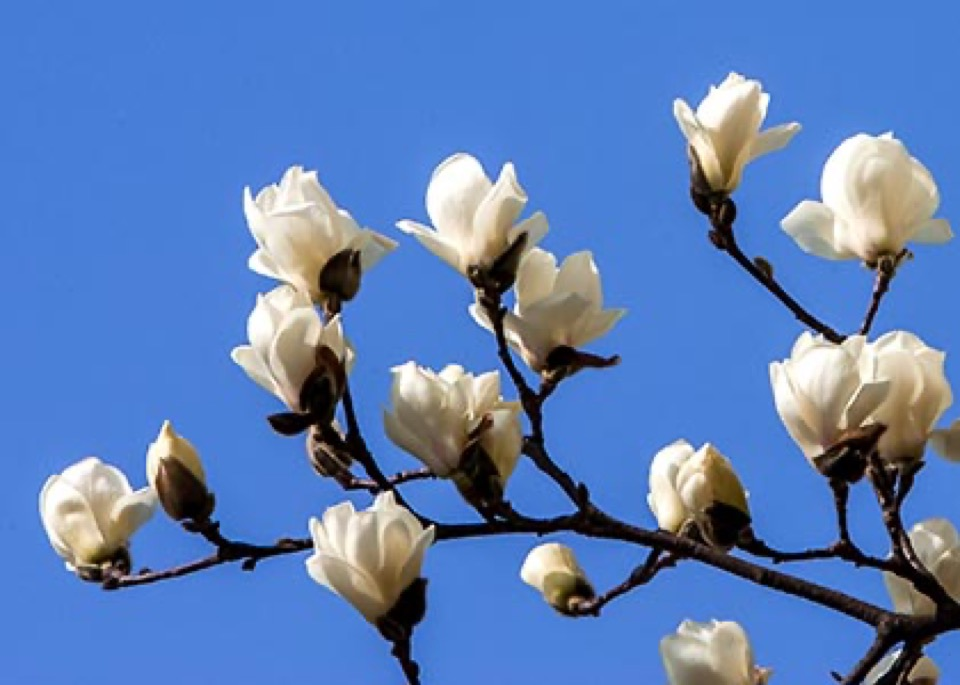
*꽃 | 꽃: 하양 꽃 · 단정꽃차례 · 암수한꽃(양성화)*

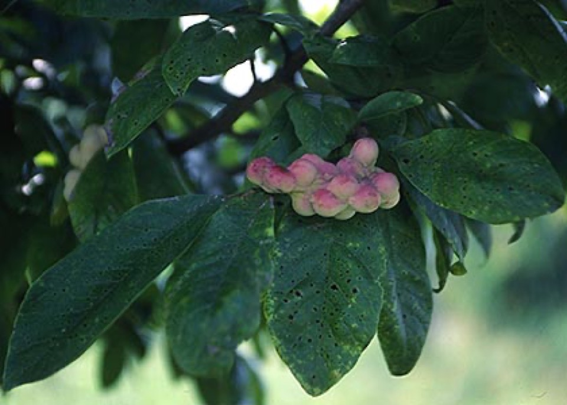
*열매 | 열매: 갈색, 빨간 갈색 열매 · 쪽꼬투리열매(대과, 골돌)*

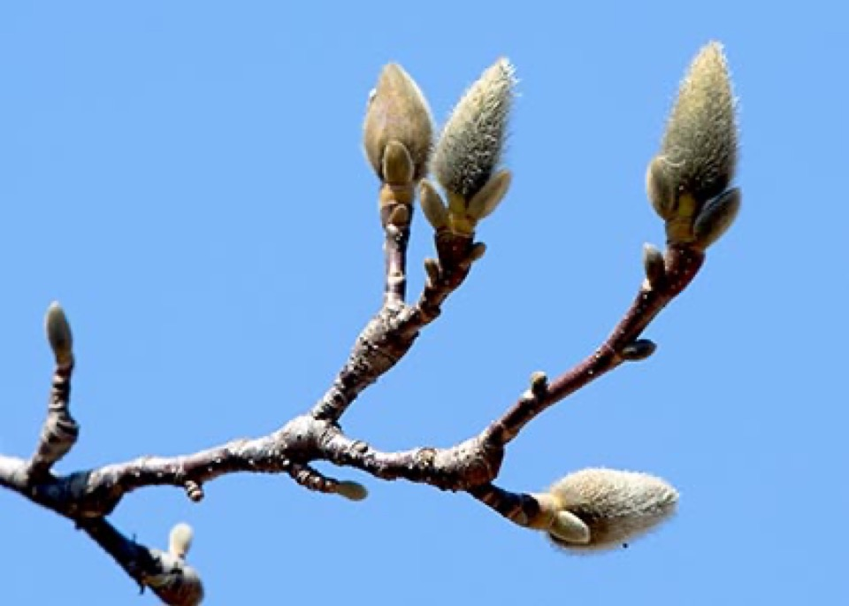
*수형 | 수형: 높이 10~15 m · 수피: 회백색*

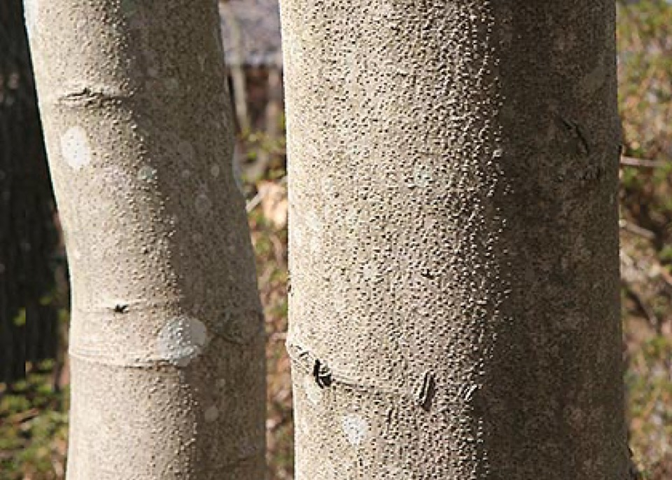
*줄기 | 줄기: 높이 10~15 m · 수피: 회백색*

### 감별 핵심 포인트
- 잎보다 먼저 크고 풍성한 흰 꽃이 핍니다.
- 꽃잎이 위로 모여 서는 모양을 기억하세요.
- 잎은 크고 끝 쪽으로 넓어지는 모습을 보입니다.

### 주된 형태 특징 (4대 감별 지표)
- **🌿 잎:** 어긋나기 · 홑잎 · 가장자리: 밋밋함 · 깃꼴그믈맥으로 잎의 아래 면은 돌출되어 눈에 잘 띰
- **🌸 꽃:** 하양 꽃 · 단정꽃차례 · 암수한꽃(양성화)
- **🍒 열매:** 갈색, 빨간 갈색 열매 · 쪽꼬투리열매(대과, 골돌)
- **🪵 줄기·수형:** 높이 10~15 m · 수피: 회백색

**비교·주의:** 일본목련은 잎이 난 다음 꽃이 피는 모습을 비교하세요.

[파이팅혼공 TV 강의](https://www.youtube.com/watch?v=K3PvgTi3eXI&t=3690s) · [수목도감(treeworld)](https://treeworld.co.kr/a01_01_02/29836) · [위키백과(한국어)](https://ko.wikipedia.org/wiki/%EB%B0%B1%EB%AA%A9%EB%A0%A8) · [Wikipedia(English)](https://en.wikipedia.org/wiki/Magnolia_denudata)

## 051. 백송
> *Pinus bungeana Zucc. ex Endl.* · Pinaceae 소나무과

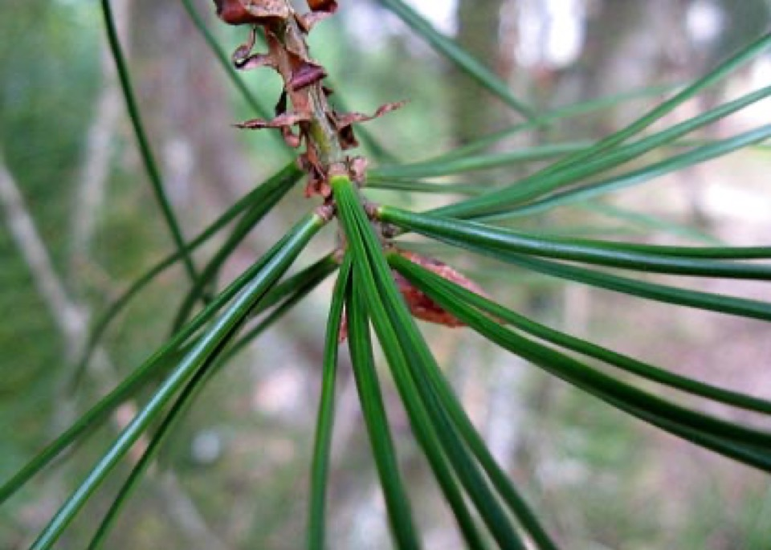
*잎 | 잎: 3개씩 모아나기(속생) · 잎몸은 바늘꼴로 길이 5~10 cm, 너비 0.5~2 mm이고, 약간 뻣뻣하고, 편평함 · 가장자리: 밋밋하게 보이지만 자잘한 톱니가 있음*

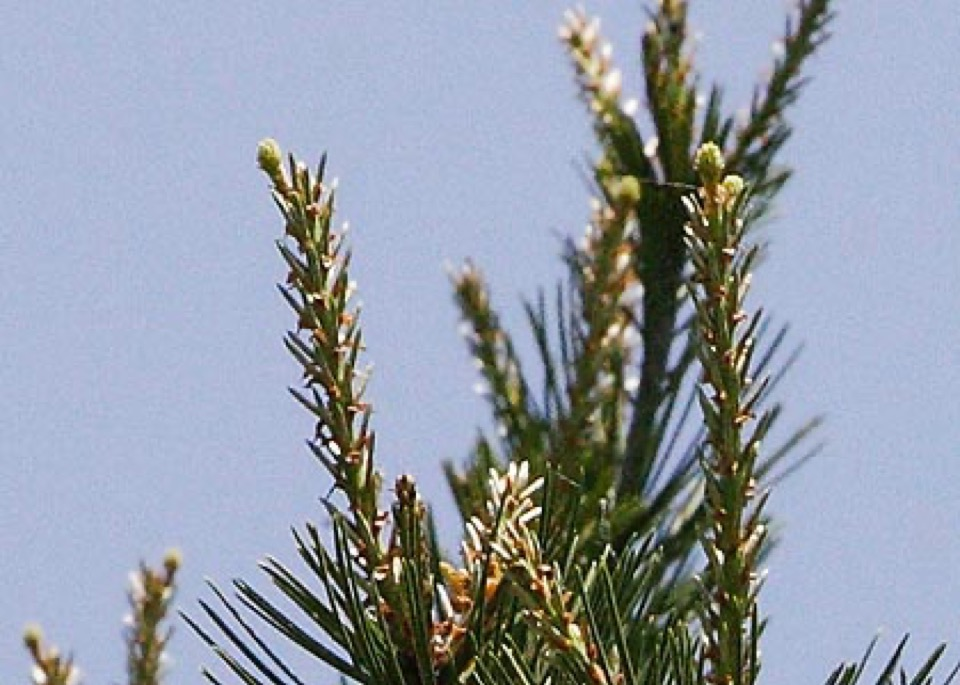
*꽃 | 꽃: 암꽃방울은 연한 초록이나 성숙하면 노란갈색 꽃 · 암꽃방울은 햇가지 끝에 한개씩 달리거나 거의 끝부분 잎겨드랑이에 쌍으로 달리지만 종종 여름의 새순의 생장으로 곁에서도 나타남 · 암수한그루*

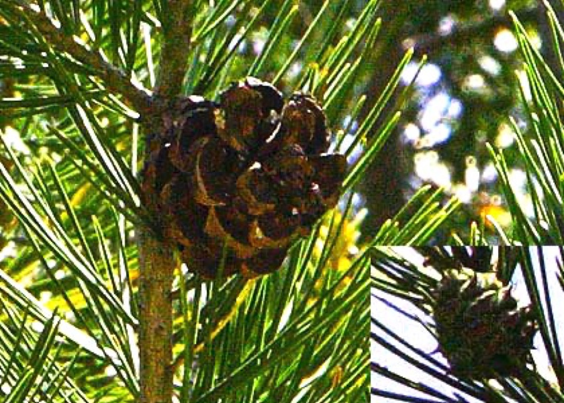
*열매 | 열매: 열매는 노란 갈색 열매 · 솔방울은 달걀형으로 길이 5~6 cm, 너비 4~5 cm*

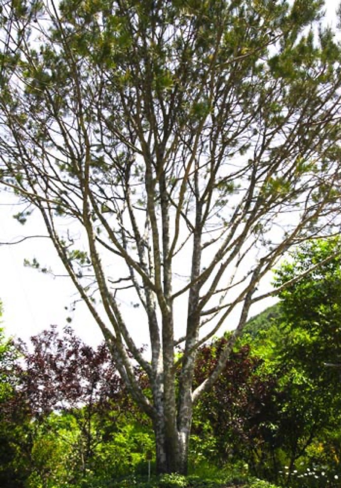
*수형 | 수형: 높이 15~30 m, 지름 1~1.5 m · 수피: 어린 나무의 껍질은 연한 초록, 늙은나무의 껍질은 회빛 하양 또는 회빛 갈색(줄기가 10 cm쯤에 이르렀을 때부터 껍질 색이 시작됨*

### 감별 핵심 포인트
- 수피가 회백색으로 벗겨지며 얼룩무늬를 만듭니다.
- 침엽은 세 개씩 모여 납니다.
- 밝은 수피와 3엽의 조합을 기억하세요.

### 주된 형태 특징 (4대 감별 지표)
- **🌿 잎:** 3개씩 모아나기(속생) · 잎몸은 바늘꼴로 길이 5~10 cm, 너비 0.5~2 mm이고, 약간 뻣뻣하고, 편평함 · 가장자리: 밋밋하게 보이지만 자잘한 톱니가 있음 · 곧은맥
- **🌸 꽃:** 암꽃방울은 연한 초록이나 성숙하면 노란갈색 꽃 · 암꽃방울은 햇가지 끝에 한개씩 달리거나 거의 끝부분 잎겨드랑이에 쌍으로 달리지만 종종 여름의 새순의 생장으로 곁에서도 나타남 · 암수한그루
- **🍒 열매:** 열매는 노란 갈색 열매 · 솔방울은 달걀형으로 길이 5~6 cm, 너비 4~5 cm
- **🪵 줄기·수형:** 높이 15~30 m, 지름 1~1.5 m · 수피: 어린 나무의 껍질은 연한 초록, 늙은나무의 껍질은 회빛 하양 또는 회빛 갈색(줄기가 10 cm쯤에 이르렀을 때부터 껍질 색이 시작됨

**비교·주의:** 소나무·곰솔의 2엽, 잣나무류의 5엽과 구별합니다.

[파이팅혼공 TV 강의](https://www.youtube.com/watch?v=K3PvgTi3eXI&t=3770s) · [수목도감(treeworld)](https://treeworld.co.kr/a01_01_02/29826) · [위키백과(한국어)](https://ko.wikipedia.org/wiki/%EB%B0%B1%EC%86%A1) · [Wikipedia(English)](https://en.wikipedia.org/wiki/Pinus_bungeana)

## 052. 버드나무
> *Salix pierotii Miq.* · Salicaceae 버드나무과

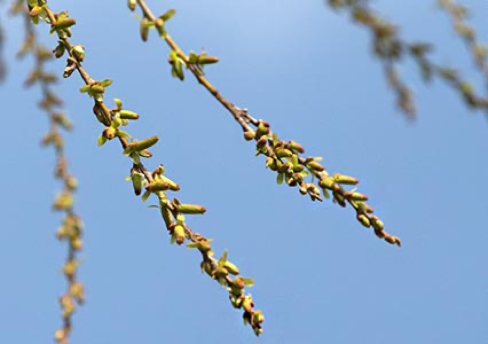
*꽃 | 꽃: 꽃싸개는 연한 노랑(담황색) 꽃 · 꼬리꽃차례(미상화서) · 암수딴그루(이가화)*

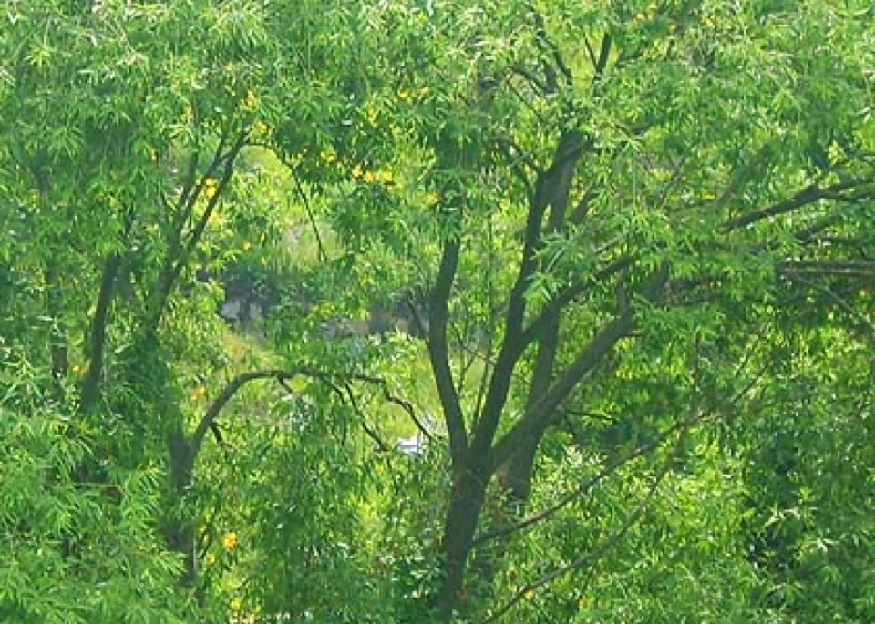
*수형 | 수형: 높이 15~20 m, 지름 80 cm 안팎 · 수피: 어두운 갈색*

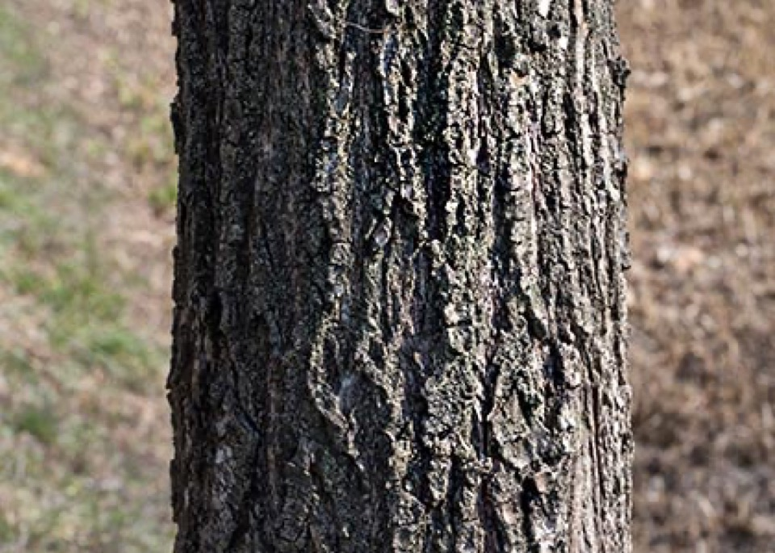
*줄기 | 줄기: 높이 15~20 m, 지름 80 cm 안팎 · 수피: 어두운 갈색*

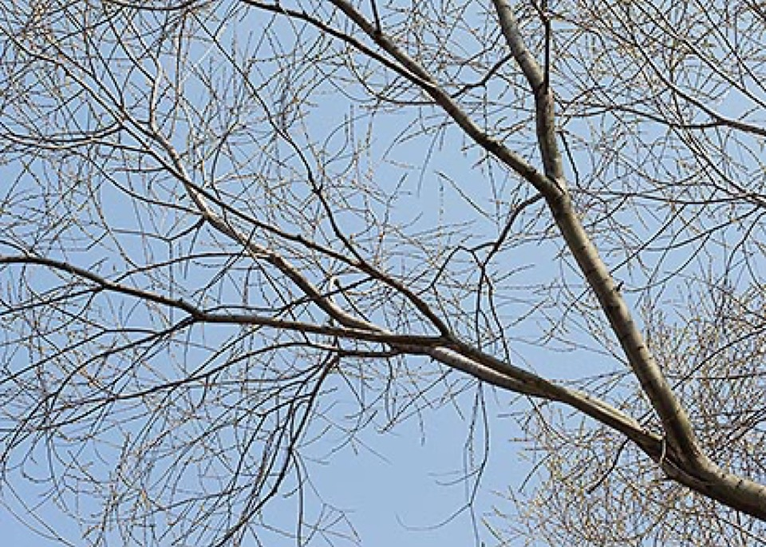
*가지 | 가지: *

### 감별 핵심 포인트
- 길고 좁은 잎을 가진 버드나무류입니다.
- 잎이 무성해지기 전 작은 꽃들이 이삭처럼 모여 핍니다.
- 씨가 날릴 때의 솜털과 가지·잎 모습을 함께 봅니다.

### 주된 형태 특징 (4대 감별 지표)
- **🌿 잎:** 어긋나기 · 잎몸은 좁은 피침형 또는 피침형으로 길이 5~12cm, 너비 7~20 mm · 가장자리: 안으로 향한 톱니 · 중앙맥(중륵) 위에 털이 있으나 점차 없어짐
- **🌸 꽃:** 꽃싸개는 연한 노랑(담황색) 꽃 · 꼬리꽃차례(미상화서) · 암수딴그루(이가화)
- **🍒 열매:** 노란 갈색 열매 · 튀는열매(삭과)
- **🪵 줄기·수형:** 높이 15~20 m, 지름 80 cm 안팎 · 수피: 어두운 갈색

[파이팅혼공 TV 강의](https://www.youtube.com/watch?v=K3PvgTi3eXI&t=3830s) · [수목도감(treeworld)](https://treeworld.co.kr/a01_01_02/29806) · [위키백과(한국어)](https://ko.wikipedia.org/wiki/%EB%B2%84%EB%93%9C%EB%82%98%EB%AC%B4) · [Wikipedia(English)](https://en.wikipedia.org/wiki/Salix_pierotii)

## 053. 벽오동
> *Firmiana simplex (L.) W.F.Wight* · Malvaceae 아욱과

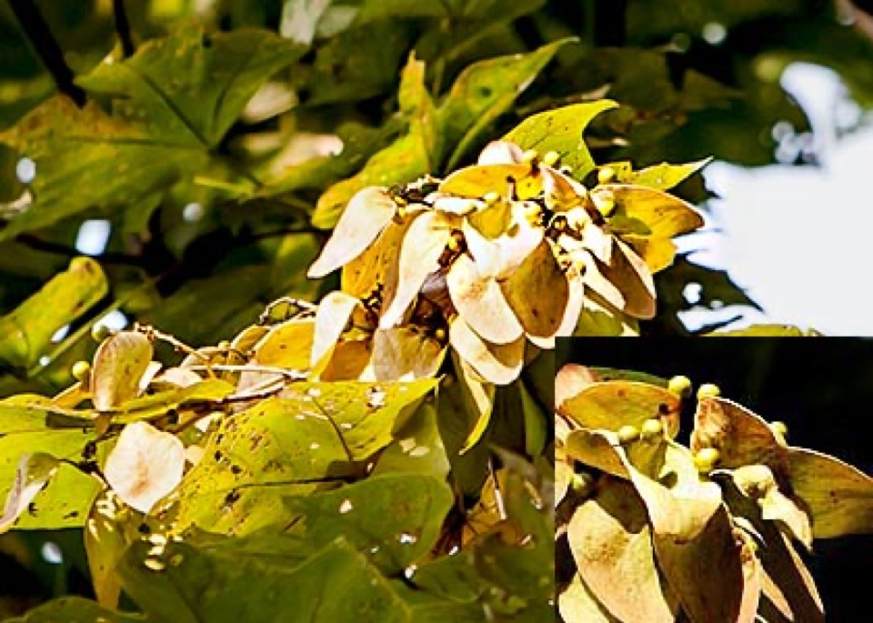
*열매 | 열매: 연한 갈색 열매 · 튀는열매(삭과)*

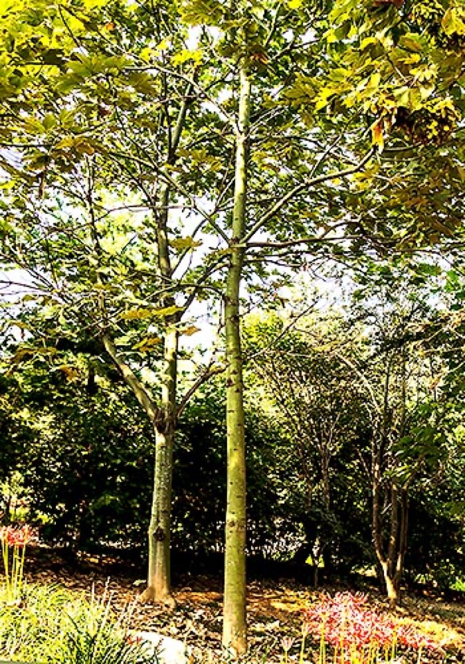
*수형 | 수형: 높이 15~16 m 이고, 곧게 섬 · 수피: 어린나무는 파란 초록, 파랑*

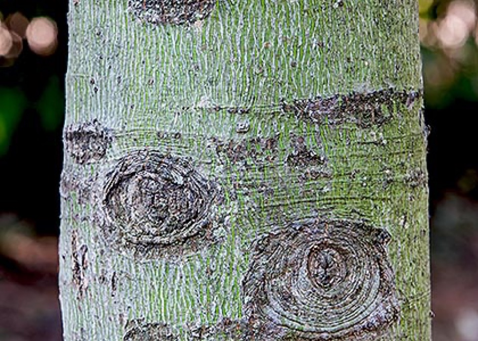
*줄기 | 줄기: 높이 15~16 m 이고, 곧게 섬 · 수피: 어린나무는 파란 초록, 파랑*

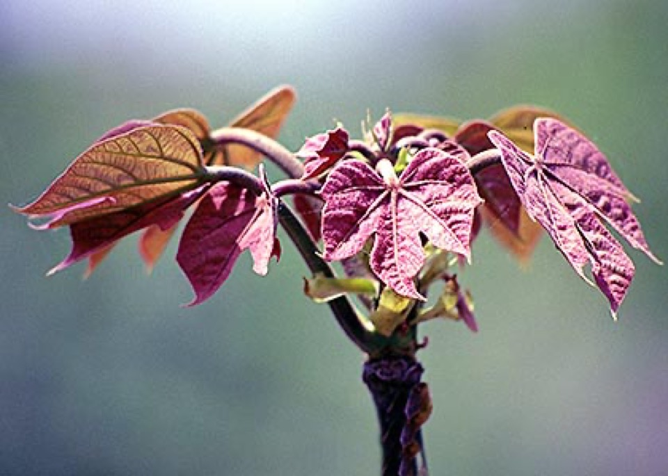
*새순 | 새순: 봄철 새로 돋아나는 잎과 가지*

### 감별 핵심 포인트
- 잎이 넓고 손바닥처럼 크게 갈라집니다.
- 줄기와 가지의 녹색 수피가 특징입니다.
- 열매 껍질이 벌어지며 가장자리에 씨가 붙은 모습을 봅니다.

### 주된 형태 특징 (4대 감별 지표)
- **🌿 잎:** 어긋나기 · 홑잎 · 가장자리: 밋밋함 · 잎밑에서 기본 맥은 7개( 6~8개)로 갈라지는 손바닥꼴 그믈맥으로 맥이 뚜렷함
- **🌸 꽃:** 연한 노랑 또는 초록빛 노랑, 하양 꽃 · 원뿔꽃차례 · 암수한그루
- **🍒 열매:** 연한 갈색 열매 · 튀는열매(삭과)
- **🪵 줄기·수형:** 높이 15~16 m 이고, 곧게 섬 · 수피: 어린나무는 파란 초록, 파랑

**비교·주의:** 오동나무의 보라색 꽃, 개오동의 가늘고 긴 열매와 구별하세요.

[파이팅혼공 TV 강의](https://www.youtube.com/watch?v=K3PvgTi3eXI&t=3870s) · [수목도감(treeworld)](https://treeworld.co.kr/a01_01_02/29790) · [위키백과(한국어)](https://ko.wikipedia.org/wiki/%EB%B2%BD%EC%98%A4%EB%8F%99) · [Wikipedia(English)](https://en.wikipedia.org/wiki/Firmiana_simplex)

## 054. 병꽃나무
> *Weigela subsessilis (Nakai) L.H.Bailey* · Caprifoliaceae 인동과

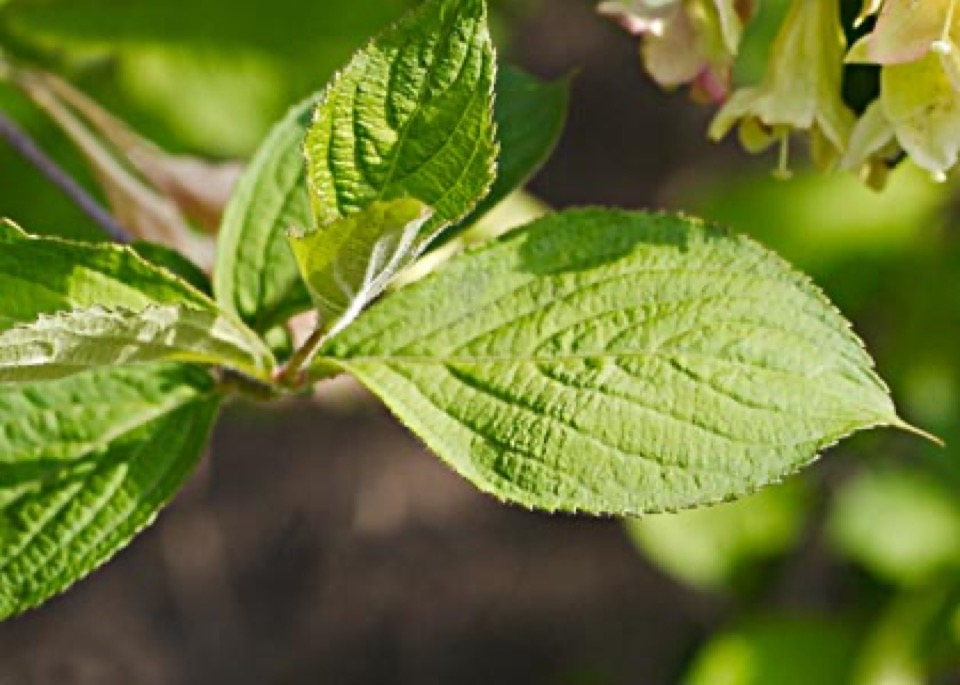
*잎 | 잎: 마주나기 · 홑잎 · 가장자리: 잔톱니가 있음*

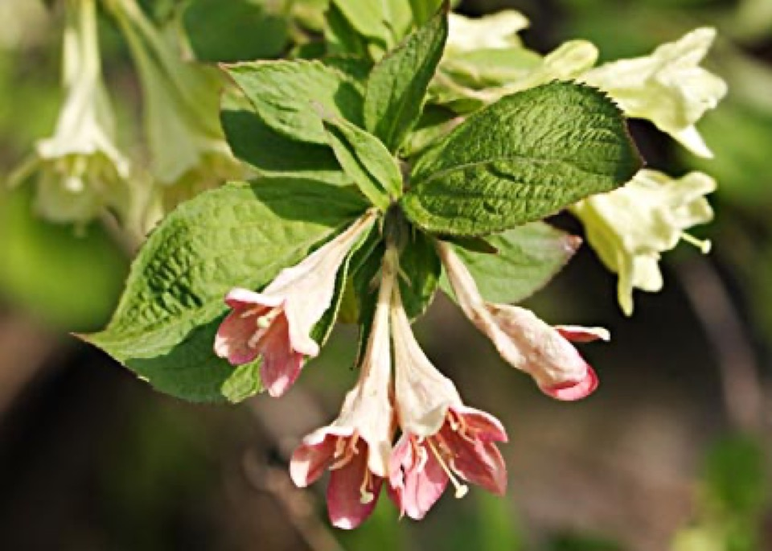
*꽃 | 꽃: 연한 노란초록이 들지만 빨강으로 변함 꽃 · 1~2개씩 잎겨드랑이에 달림 · 병을 거꾸로 세운 형 또는 깔때기형으로 길이 3~4 cm*

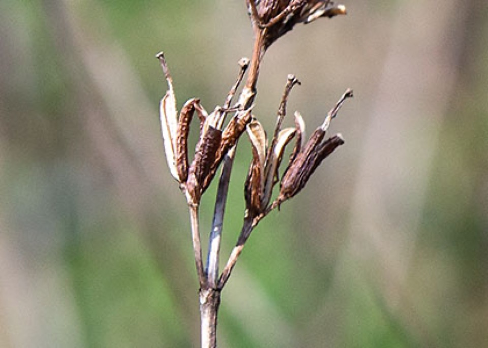
*열매 | 열매:  열매 · 튀는열매(삭과)*

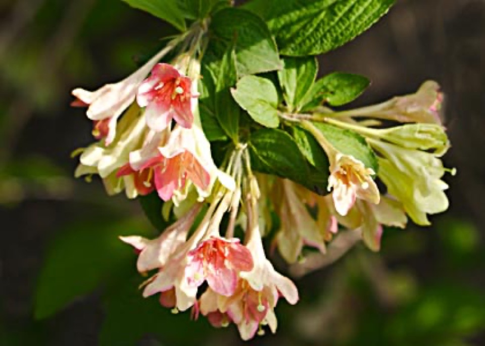
*수형 | 수형: 높이 2~3 m · 수피: 회갈색이지만 얼룩무늬가 있음*

### 감별 핵심 포인트
- 길쭉한 통 모양 꽃이 가지에 달립니다.
- 꽃은 처음 황록색을 띠다가 붉은색으로 변합니다.
- 광택이 적고 잔톱니가 있는 잎을 함께 확인하세요.

### 주된 형태 특징 (4대 감별 지표)
- **🌿 잎:** 마주나기 · 홑잎 · 가장자리: 잔톱니가 있음 · 깃꼴 그물맥
- **🌸 꽃:** 연한 노란초록이 들지만 빨강으로 변함 꽃 · 1~2개씩 잎겨드랑이에 달림 · 병을 거꾸로 세운 형 또는 깔때기형으로 길이 3~4 cm
- **🍒 열매:**  열매 · 튀는열매(삭과)
- **🪵 줄기·수형:** 높이 2~3 m · 수피: 회갈색이지만 얼룩무늬가 있음

**비교·주의:** 꽃의 색이 달라졌다고 곧바로 다른 수목으로 판단하지 마세요.

[파이팅혼공 TV 강의](https://www.youtube.com/watch?v=K3PvgTi3eXI&t=3950s) · [수목도감(treeworld)](https://treeworld.co.kr/a01_01_02/29785) · [위키백과(한국어)](https://ko.wikipedia.org/wiki/%EB%B3%91%EA%BD%83%EB%82%98%EB%AC%B4) · [Wikipedia(English)](https://en.wikipedia.org/wiki/Weigela_subsessilis)

## 055. 보리수나무
> *Elaeagnus umbellata Thunb.* · Elaeagnaceae 보리수나무과

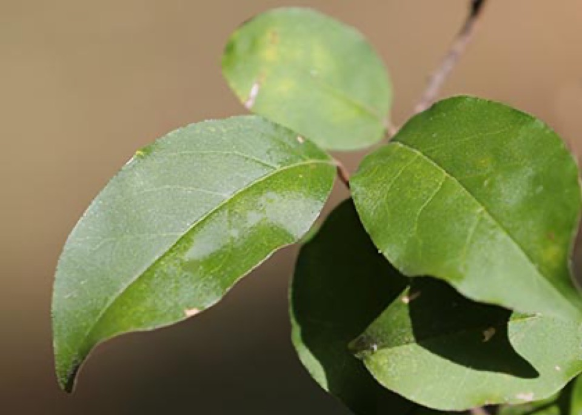
*잎 | 잎: 어긋나기 · 홑잎 · 가장자리: 밋밋하고, 물결꼴로 앞 뒤 젖혀짐이 있음*

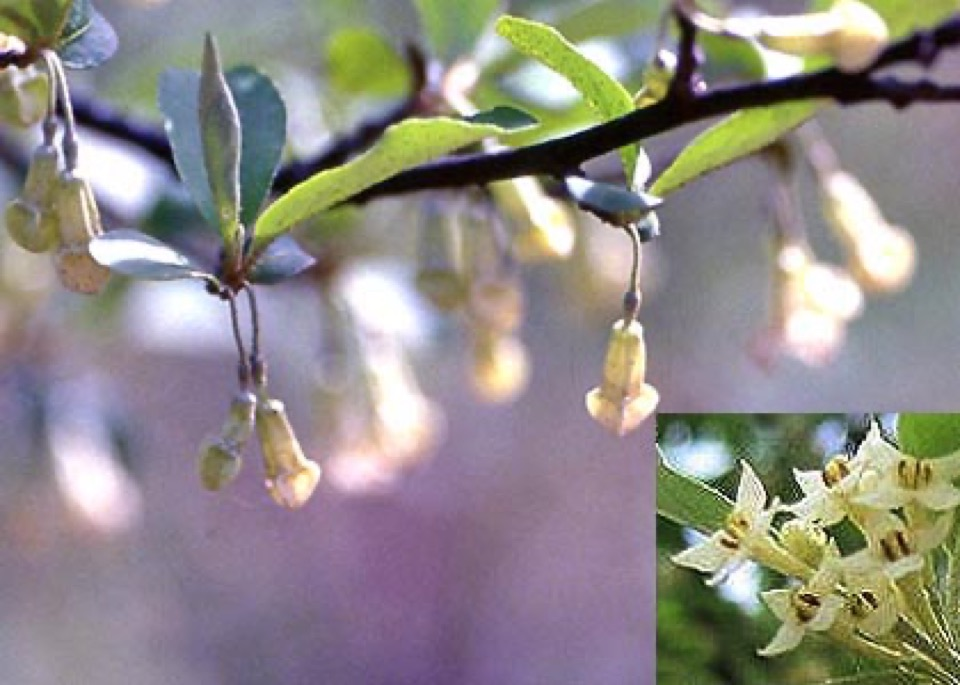
*꽃 | 꽃: 하양에서 차츰 연한 노랑 꽃 · 우산꼴꽃차례(산형화서) · 꽃대에 1~7개의 작은 꽃이 모여 피며, 작은 나팔 같은 꽃송이를 이룸*

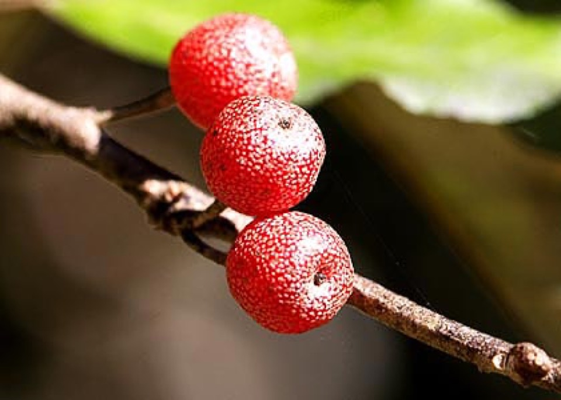
*열매 | 열매: 빨강 열매 · 굳은씨열매(핵과), 물열매(장과), 헛열매(위과, 가과)*

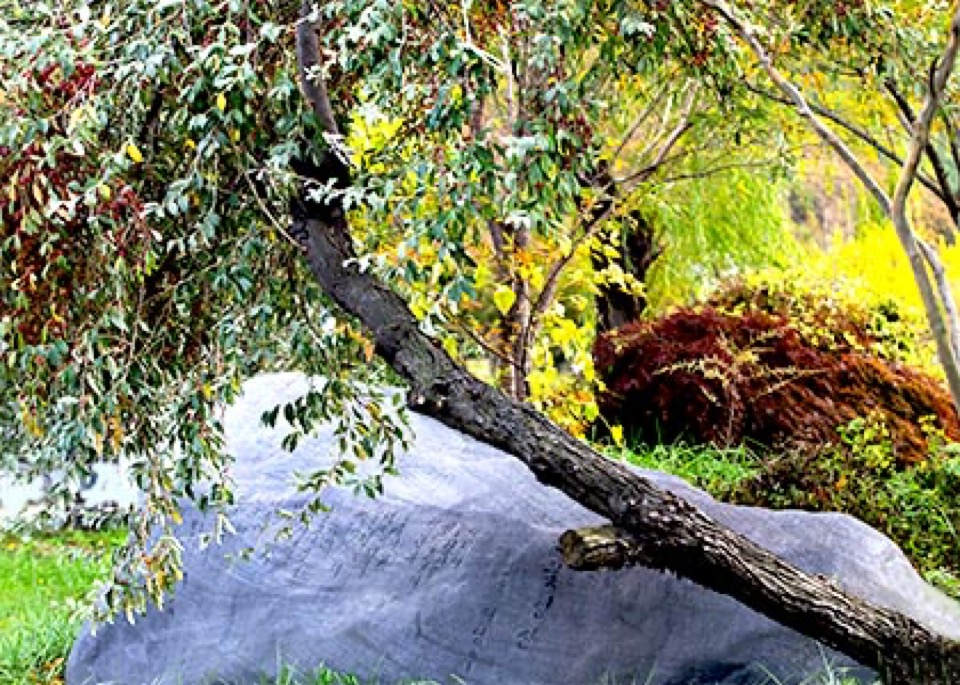
*수형 | 수형: 높이 2~4 m, 큰 것은 높이 5 m, 지름 20 cm 쯤인 것도 있음 · 수피: 껍질은 회빛 검은갈색, 회빛 하양*

### 감별 핵심 포인트
- 작은 흰 꽃이 아래를 향해 피며 끝이 네 갈래로 벌어집니다.
- 붉은 열매 표면에 작은 점이 보입니다.
- 잎과 어린 가지의 은빛 비늘 같은 질감도 확인하세요.

### 주된 형태 특징 (4대 감별 지표)
- **🌿 잎:** 어긋나기 · 홑잎 · 가장자리: 밋밋하고, 물결꼴로 앞 뒤 젖혀짐이 있음 · 어긋나게 달리는 깃털꼴
- **🌸 꽃:** 하양에서 차츰 연한 노랑 꽃 · 우산꼴꽃차례(산형화서) · 꽃대에 1~7개의 작은 꽃이 모여 피며, 작은 나팔 같은 꽃송이를 이룸
- **🍒 열매:** 빨강 열매 · 굳은씨열매(핵과), 물열매(장과), 헛열매(위과, 가과)
- **🪵 줄기·수형:** 높이 2~4 m, 큰 것은 높이 5 m, 지름 20 cm 쯤인 것도 있음 · 수피: 껍질은 회빛 검은갈색, 회빛 하양

**비교·주의:** 붉은 열매 무리만 보지 말고 열매의 점과 잎을 함께 비교합니다.

[파이팅혼공 TV 강의](https://www.youtube.com/watch?v=K3PvgTi3eXI&t=4010s) · [수목도감(treeworld)](https://treeworld.co.kr/a01_01_02/29760) · [위키백과(한국어)](https://ko.wikipedia.org/wiki/%EB%B3%B4%EB%A6%AC%EC%88%98%EB%82%98%EB%AC%B4) · [Wikipedia(English)](https://en.wikipedia.org/wiki/Elaeagnus_umbellata)

## 056. 복사나무
> *Prunus persica(L.) Batsch* · Rosaceae 장미과

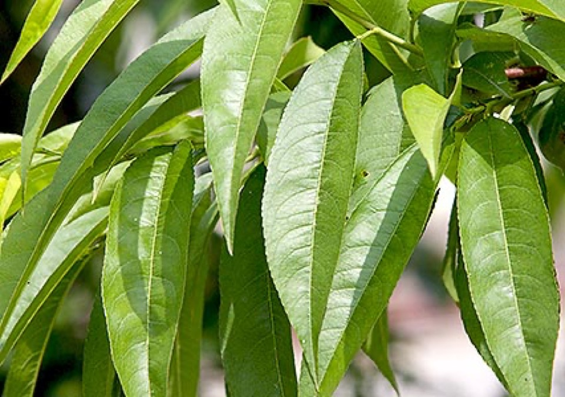
*잎 | 잎: 어긋나기 · 홑잎 · 가장자리: 무딘 잔톱니가 있음*

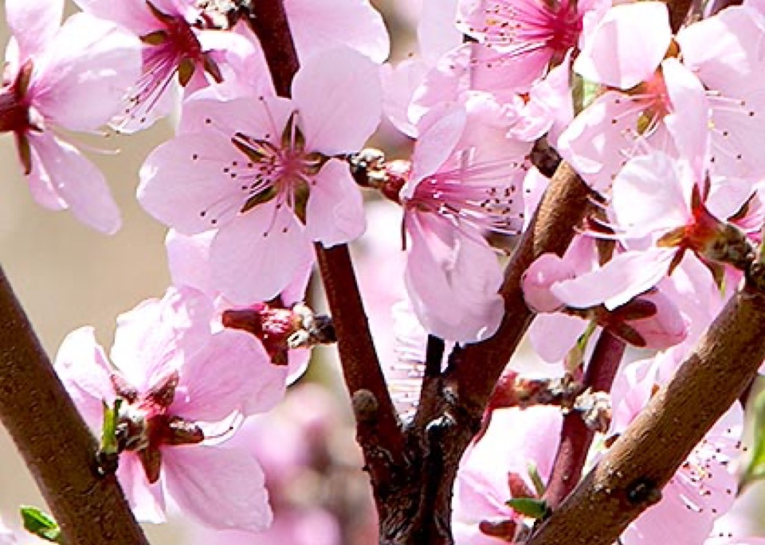
*꽃 | 꽃: 꽃잎은 연한 빨강 꽃 · 1개 또는 2개씩 쌍으로 달림 · 지름 2.5~3.3 cm*

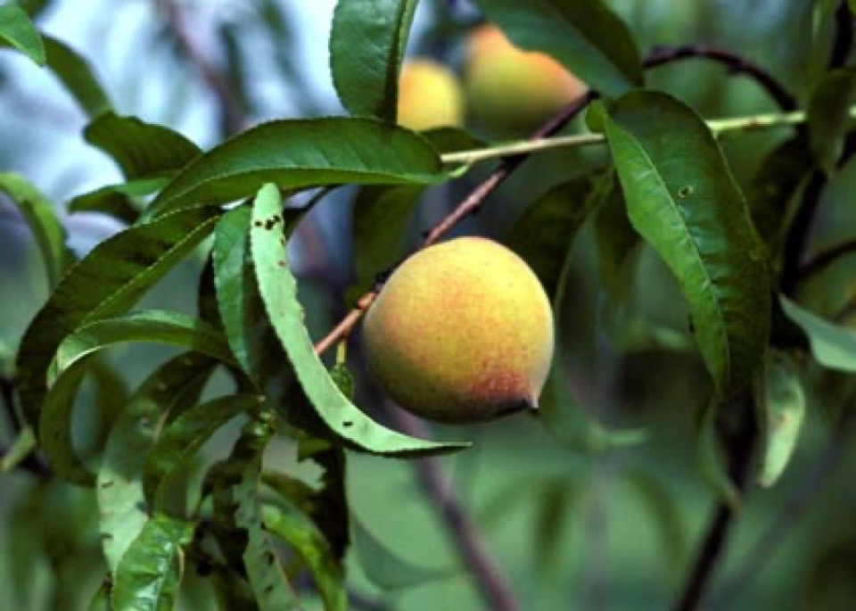
*열매 | 열매: 붉은빛 노랑( 초록빛 하양, 주황빛 노랑으로 다양하지만 드러난 면에 빨간색이 있음) 열매 · 굳은씨열매(핵과)*

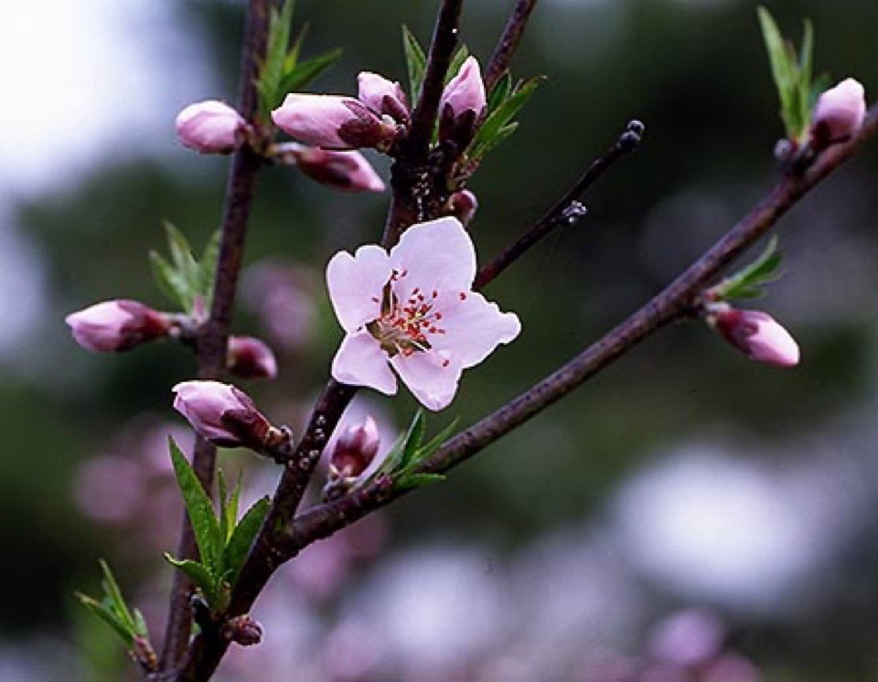
*수형 | 수형: 높이 4~10 m · 수피: 껍질은 검은 갈색 또는 자줏빛 갈색*

### 감별 핵심 포인트
- 복숭아가 열리는 나무로, 분홍색 꽃이 잎보다 먼저 핍니다.
- 꽃자루가 짧아 꽃이 가지에 가깝게 붙어 보입니다.
- 잎은 길쭉하고 가장자리에 잔톱니가 있습니다.

### 주된 형태 특징 (4대 감별 지표)
- **🌿 잎:** 어긋나기 · 홑잎 · 가장자리: 무딘 잔톱니가 있음 · 깃꼴맥
- **🌸 꽃:** 꽃잎은 연한 빨강 꽃 · 1개 또는 2개씩 쌍으로 달림 · 지름 2.5~3.3 cm
- **🍒 열매:** 붉은빛 노랑( 초록빛 하양, 주황빛 노랑으로 다양하지만 드러난 면에 빨간색이 있음) 열매 · 굳은씨열매(핵과)
- **🪵 줄기·수형:** 높이 4~10 m · 수피: 껍질은 검은 갈색 또는 자줏빛 갈색

**비교·주의:** 영상 답안 표기는 ‘복사나무’입니다. 산벚나무의 긴 꽃자루와 비교하세요.

[파이팅혼공 TV 강의](https://www.youtube.com/watch?v=K3PvgTi3eXI&t=4250s) · [수목도감(treeworld)](https://treeworld.co.kr/a01_01_02/29737) · [위키백과(한국어)](https://ko.wikipedia.org/wiki/%EB%B3%B5%EC%88%AD%EC%95%84) · [Wikipedia(English)](https://en.wikipedia.org/wiki/Peach)

## 057. 복자기
> *Acer triflorum Kom.* · Sapindaceae 무환자나무과

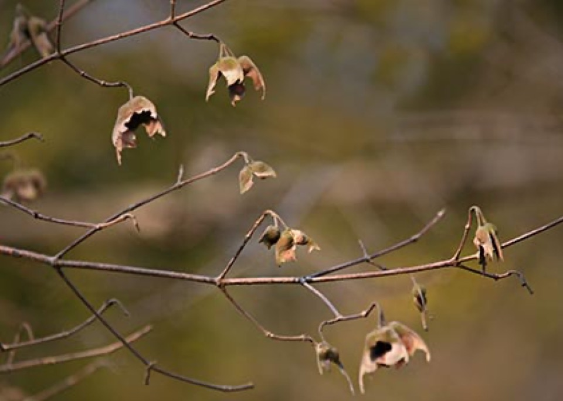
*열매 | 열매: 회빛 하양, 초록빛 노랑 열매 · 날개열매(시과)*

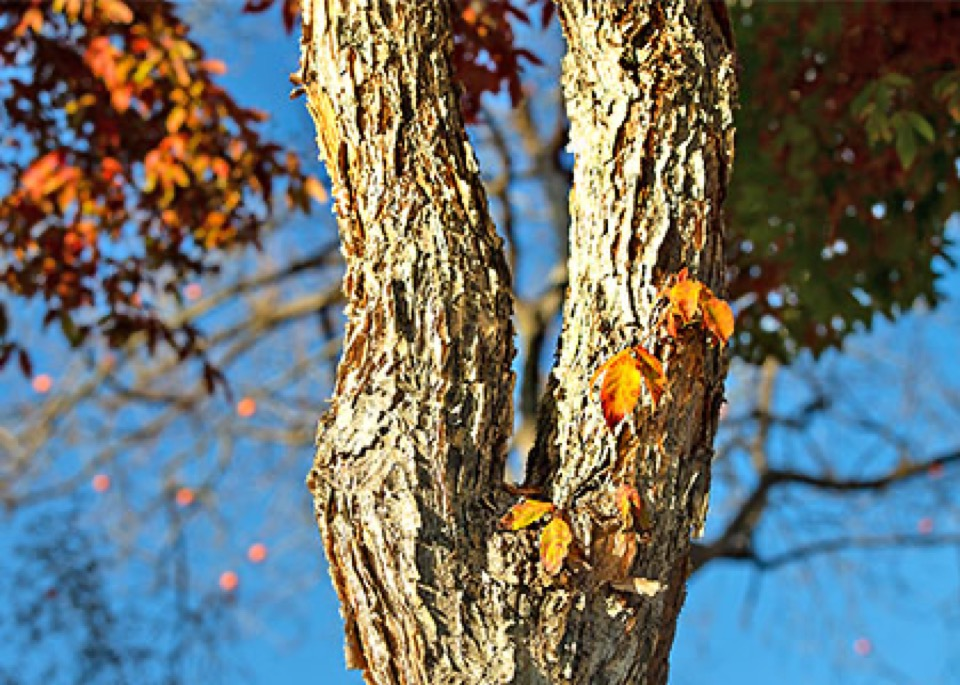
*수형 | 수형: 높이 20~25 m · 수피: 회백색 또는 노란 갈색*

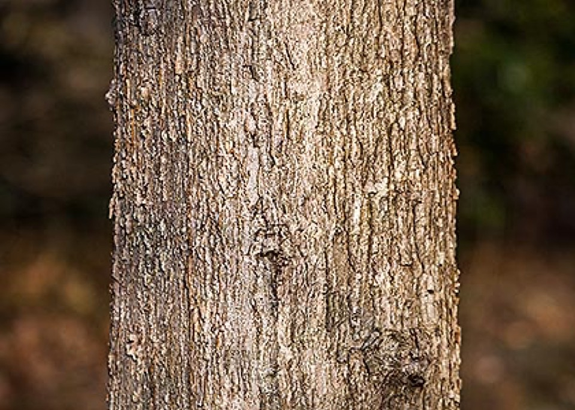
*줄기 | 줄기: 높이 20~25 m · 수피: 회백색 또는 노란 갈색*

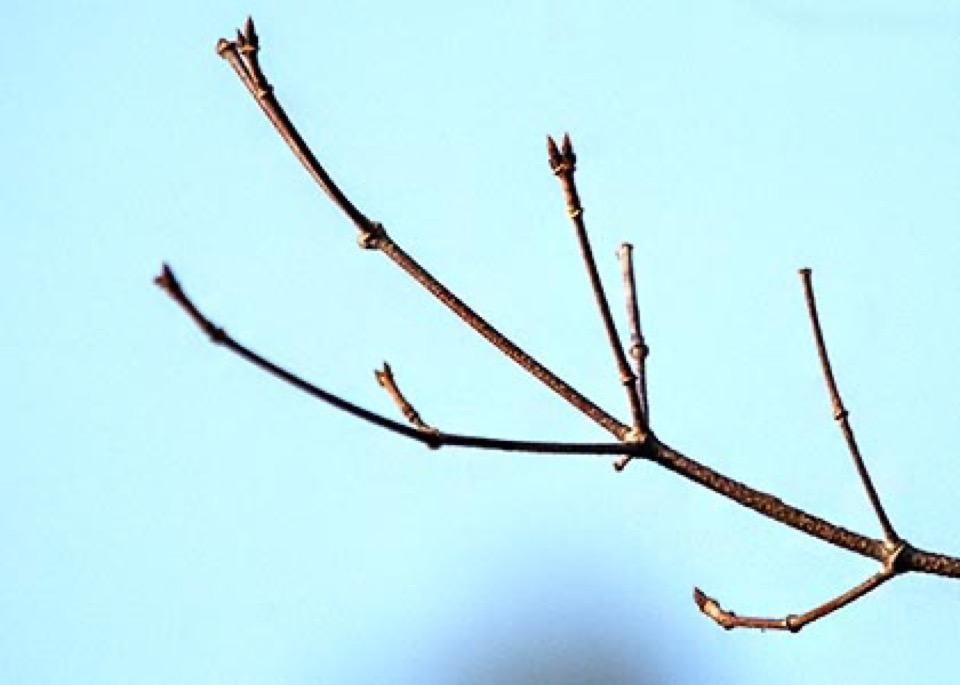
*겨울눈 | 겨울눈: 달걀형으로 작음*

### 감별 핵심 포인트
- 작은 잎 세 장이 한 세트를 이루는 모습이 특징입니다.
- 옅은 황록색 꽃과 날개가 달린 열매를 봅니다.
- 수피가 거칠게 벗겨지며 일어나는 모습도 나타납니다.

### 주된 형태 특징 (4대 감별 지표)
- **🌿 잎:** 마주나기 · 3출엽 · 가장자리: 톱니가 없으나 끝부분 가까이에 2~4개의 큰 톱니가 있음 · 곁맥은 11~13쌍
- **🌸 꽃:** 꽃잎은 연한 노랑 꽃 · 산방꽃차례 · 암수딴그루 또는 암수한그루로서 수꽃과 암수한꽃이 함께 달림(andromonoecious)
- **🍒 열매:** 회빛 하양, 초록빛 노랑 열매 · 날개열매(시과)
- **🪵 줄기·수형:** 높이 20~25 m · 수피: 회백색 또는 노란 갈색

**비교·주의:** 세 장으로 이루어진 잎이 가장 먼저 볼 단서입니다.

[파이팅혼공 TV 강의](https://www.youtube.com/watch?v=K3PvgTi3eXI&t=4310s) · [수목도감(treeworld)](https://treeworld.co.kr/a01_01_02/29728) · [위키백과(한국어)](https://ko.wikipedia.org/wiki/%EB%B3%B5%EC%9E%90%EA%B8%B0) · [Wikipedia(English)](https://en.wikipedia.org/wiki/Acer_triflorum)

## 058. 붉가시나무
> *Quercus acuta Thunb.* · Fagaceae 참나무과(너도밤나무과)

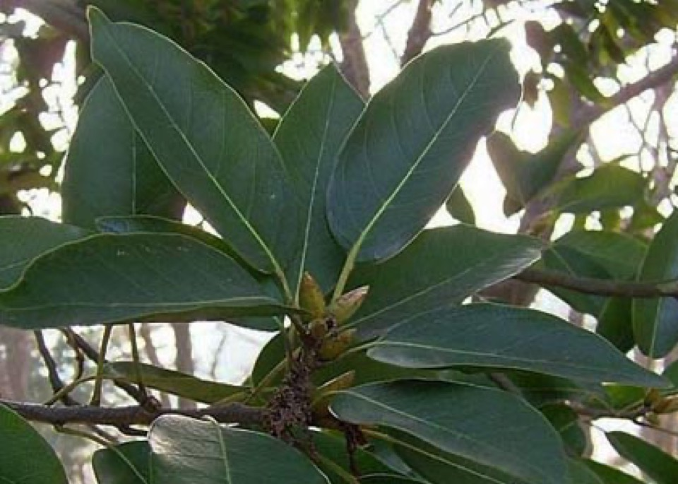
*수형 | 수형: 높이 10 m, 지름 30 cm에 이르지만, 재배종은 종종 더 작기도 함 · 수피: 진한 회색. 검은 회초록색*

*겨울눈 | 겨울눈: 원뿔형*

### 감별 핵심 포인트
- 잎이 두껍고 매끈하며 가장자리에 톱니가 없습니다.
- 빗살처럼 이어지는 잎맥이 비교적 뚜렷합니다.
- 아래로 늘어지는 수꽃차례와 도토리를 함께 봅니다.

### 주된 형태 특징 (4대 감별 지표)
- **🌿 잎:** 어긋나기 · 홑잎 · 가장자리: 밋밋하지만(全椽) 윗부분에 물결꼴 톱니가 약간 있는 것도 있음 · 곁맥 8~13쌍이고, 윗쪽의 중앙맥(중늑)은 그다지 인상적이지 못함
- **🌸 꽃:** 암꽃 및 수꽃은 모두 노랑 꽃 · 암꽃차례는 윗부분에서 곧추 나옴 · 암수한그루(일가화)
- **🍒 열매:** 주황빛 갈색 열매 · 굳은껍질열매(견과, 도토리)
- **🪵 줄기·수형:** 높이 10 m, 지름 30 cm에 이르지만, 재배종은 종종 더 작기도 함 · 수피: 진한 회색. 검은 회초록색

**비교·주의:** 가시나무의 잎 톱니와 비교하세요.

[파이팅혼공 TV 강의](https://www.youtube.com/watch?v=K3PvgTi3eXI&t=4410s) · [수목도감(treeworld)](https://treeworld.co.kr/a01_01_02/29702) · [위키백과(한국어)](https://ko.wikipedia.org/wiki/%EB%B6%89%EA%B0%80%EC%8B%9C%EB%82%98%EB%AC%B4) · [Wikipedia(English)](https://en.wikipedia.org/wiki/Quercus_acuta)

## 059. 사철나무
> *Euonymus japonicus Thunb.* · Celastraceae 노박덩굴과

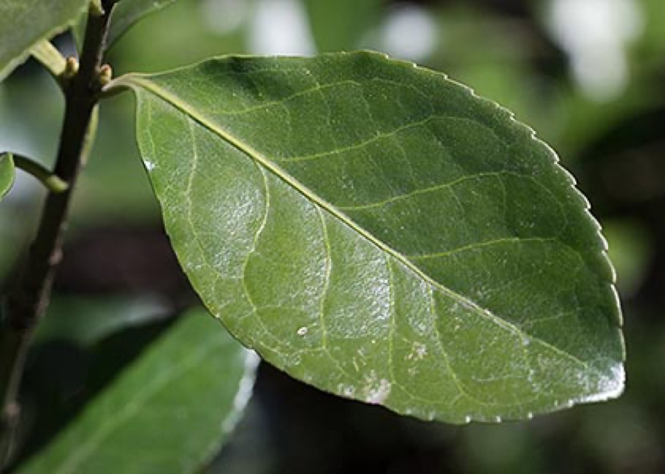
*잎 | 잎: 마주나기 · 거꿀달걀형 또는 좁은 타원형 · 가장자리: 무딘 톱니(둔거치) 또는 밑부분 말고는 쐐기꼴 톱니가 있음*

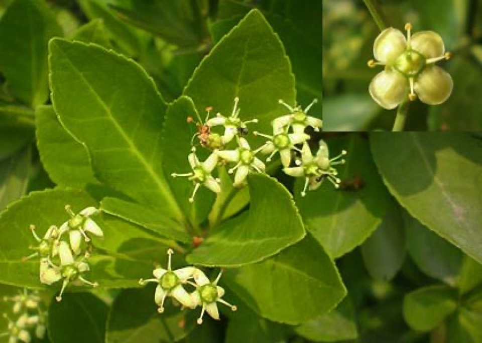
*꽃 | 꽃: 연한 황록색 꽃 · 취산꽃차례 · 꽃대는 3~7 cm, 꽃자루는 길이 2~5 cm, 작은꽃자루는 길이 3~5 mm로 밑에 작은 꽃턱잎을 달고, 5~12송이가 위를 향해 달림*

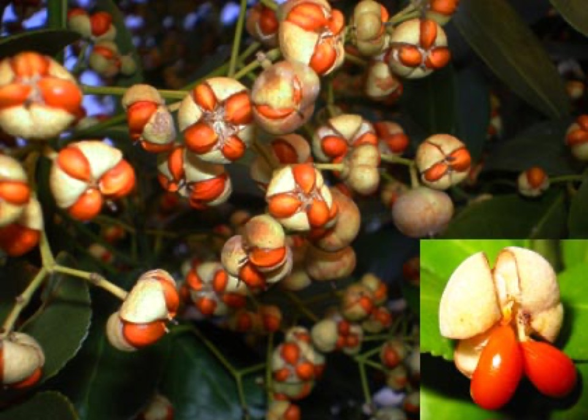
*열매 | 열매: 익으면 분홍색 또는 홍갈색 열매 · 삭과*

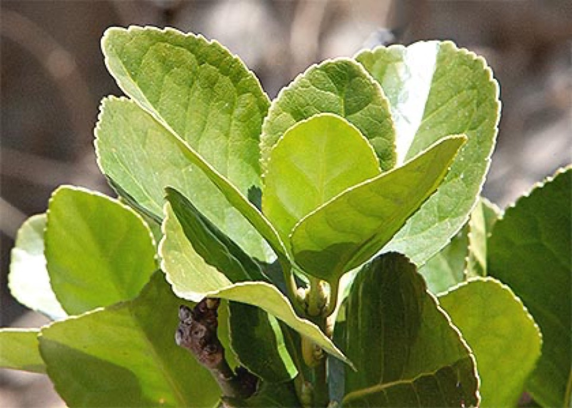
*수형 | 수형: 높이 1~6m, 너비 20 cm 정도 · 수피: 회갈색 또는 회흑색*

### 감별 핵심 포인트
- 타원형 잎이 두껍고 윤기가 납니다.
- 작은 황록색 꽃이 네 갈래로 벌어집니다.
- 열매 껍질이 갈라지며 주황빛 씨가 드러납니다.

### 주된 형태 특징 (4대 감별 지표)
- **🌿 잎:** 마주나기 · 거꿀달걀형 또는 좁은 타원형 · 가장자리: 무딘 톱니(둔거치) 또는 밑부분 말고는 쐐기꼴 톱니가 있음 · 거의 마주난 깃꼴 그믈맥
- **🌸 꽃:** 연한 황록색 꽃 · 취산꽃차례 · 꽃대는 3~7 cm, 꽃자루는 길이 2~5 cm, 작은꽃자루는 길이 3~5 mm로 밑에 작은 꽃턱잎을 달고, 5~12송이가 위를 향해 달림
- **🍒 열매:** 익으면 분홍색 또는 홍갈색 열매 · 삭과
- **🪵 줄기·수형:** 높이 1~6m, 너비 20 cm 정도 · 수피: 회갈색 또는 회흑색

[파이팅혼공 TV 강의](https://www.youtube.com/watch?v=K3PvgTi3eXI&t=4510s) · [수목도감(treeworld)](https://treeworld.co.kr/a01_01_02/29552) · [위키백과(한국어)](https://ko.wikipedia.org/wiki/%EC%82%AC%EC%B2%A0%EB%82%98%EB%AC%B4) · [Wikipedia(English)](https://en.wikipedia.org/wiki/Euonymus_japonicus)

## 060. 산딸나무
> *Cornus kousa F.Buerger ex Hance* · Cornaceae 층층나무과

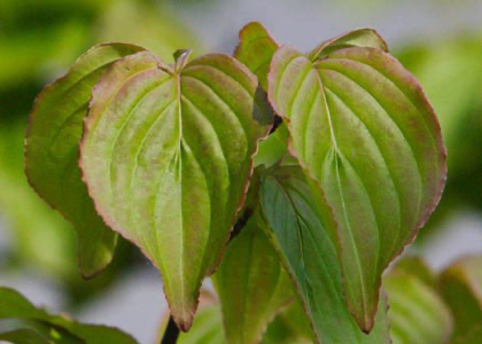
*잎 | 잎: 마주나기 · 달걀형, 둥근형 또는 타원꼴 달걀형 · 가장자리: 밋밋하거나 물결꼴 톱니가 약간 있음*

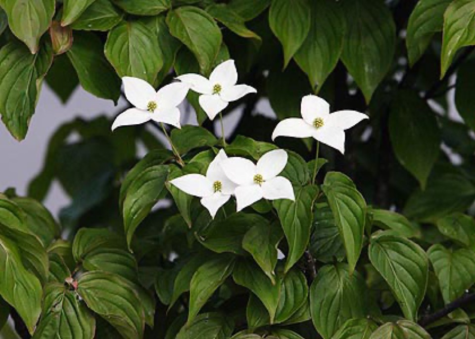
*꽃 | 꽃: 큰꽃싸개(총포, 꽃싼잎)는 처음에는 연한 초록이나 나중에는 하양 또는 드믈게 빨강 꽃 · 머리꼴꽃차례(두상화서) · 암수한그루*

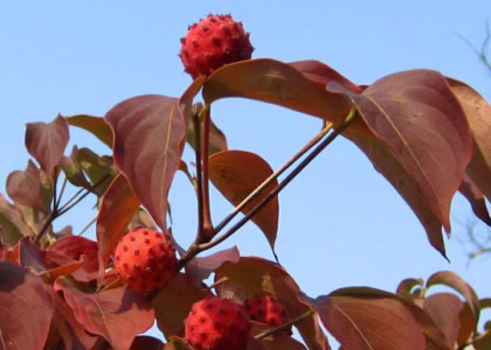
*열매 | 열매: 빨간 갈색 열매 · 모인열매(집합과, 집과, 聚果; 꽃싸개조각이 육질로 되고 많은 작은 굳은씨열매로 구성)이고, 둥근형으로 지름 1.5~2.5 cm이고, 각 육질의 꽃받침통 중앙에 암술대가 남아있음*

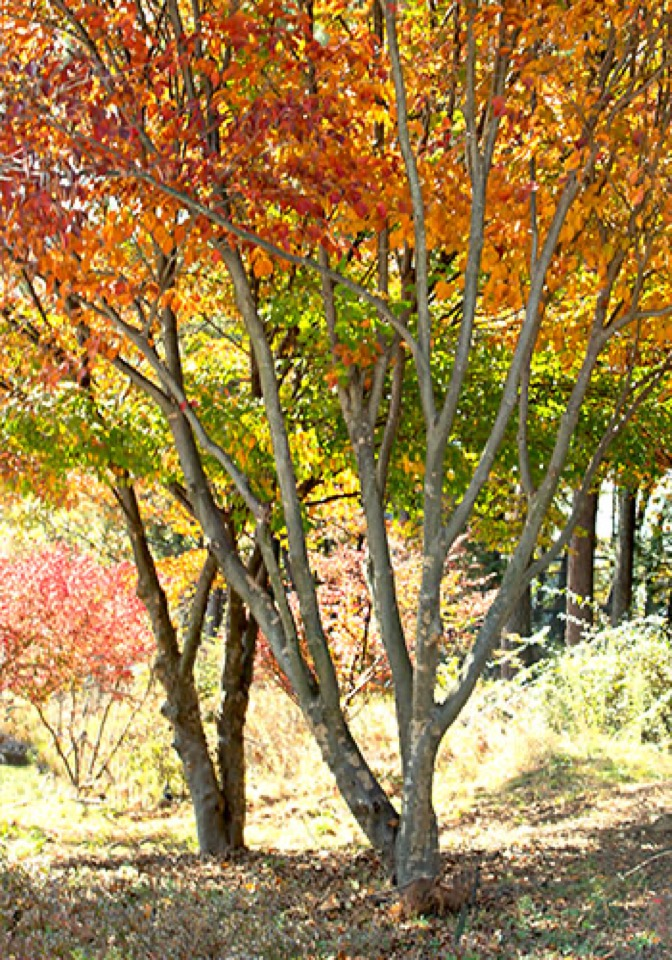
*수형 | 수형: 높이 7~15 m, 지름 약 50 cm · 수피: 진한 회갈색*

### 감별 핵심 포인트
- 꽃처럼 보이는 큰 흰 포엽 네 장이 십자 모양을 이룹니다.
- 붉은 열매는 표면이 울퉁불퉁하여 딸기처럼 보입니다.
- 잎맥이 끝을 향해 휘는 잎과 함께 봅니다.

### 주된 형태 특징 (4대 감별 지표)
- **🌿 잎:** 마주나기 · 달걀형, 둥근형 또는 타원꼴 달걀형 · 가장자리: 밋밋하거나 물결꼴 톱니가 약간 있음 · 곁맥은 4~5쌍으로 활처럼 굽어짐
- **🌸 꽃:** 큰꽃싸개(총포, 꽃싼잎)는 처음에는 연한 초록이나 나중에는 하양 또는 드믈게 빨강 꽃 · 머리꼴꽃차례(두상화서) · 암수한그루
- **🍒 열매:** 빨간 갈색 열매 · 모인열매(집합과, 집과, 聚果; 꽃싸개조각이 육질로 되고 많은 작은 굳은씨열매로 구성)이고, 둥근형으로 지름 1.5~2.5 cm이고, 각 육질의 꽃받침통 중앙에 암술대가 남아있음
- **🪵 줄기·수형:** 높이 7~15 m, 지름 약 50 cm · 수피: 진한 회갈색

**비교·주의:** 산수유의 매끈하고 길쭉한 열매와 대비해 기억하세요.

[파이팅혼공 TV 강의](https://www.youtube.com/watch?v=K3PvgTi3eXI&t=4590s) · [수목도감(treeworld)](https://treeworld.co.kr/a01_01_02/29539) · [위키백과(한국어)](https://ko.wikipedia.org/wiki/%EC%82%B0%EB%94%B8%EB%82%98%EB%AC%B4) · [Wikipedia(English)](https://en.wikipedia.org/wiki/Cornus_kousa)

## 061. 산벚나무
> *Prunus sargentii Rehder* · Rosaceae 장미과

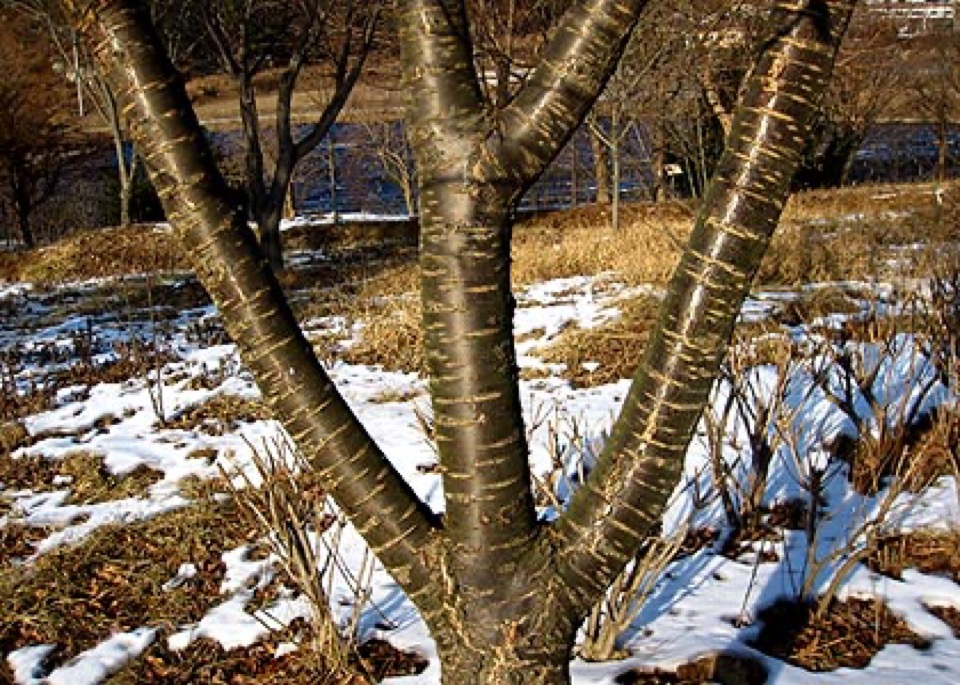
*수형 | 수형: 높이 10~20 m, 지름 90 cm쯤으로 통직하고, 많은 가지를 냄 · 수피: 진한 자줏빛 갈색*

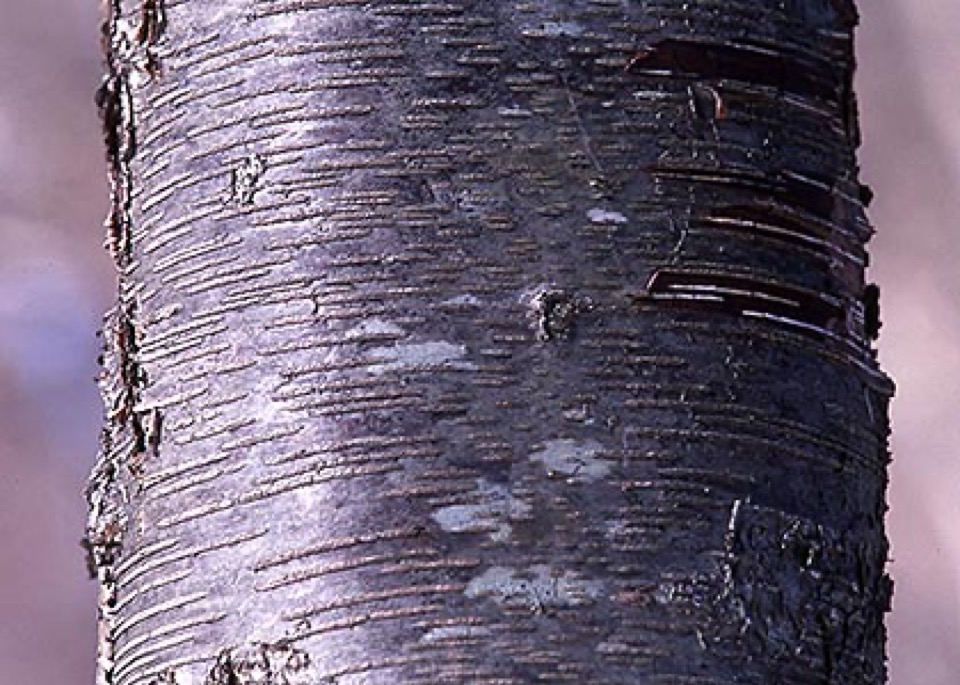
*줄기 | 줄기: 높이 10~20 m, 지름 90 cm쯤으로 통직하고, 많은 가지를 냄 · 수피: 진한 자줏빛 갈색*

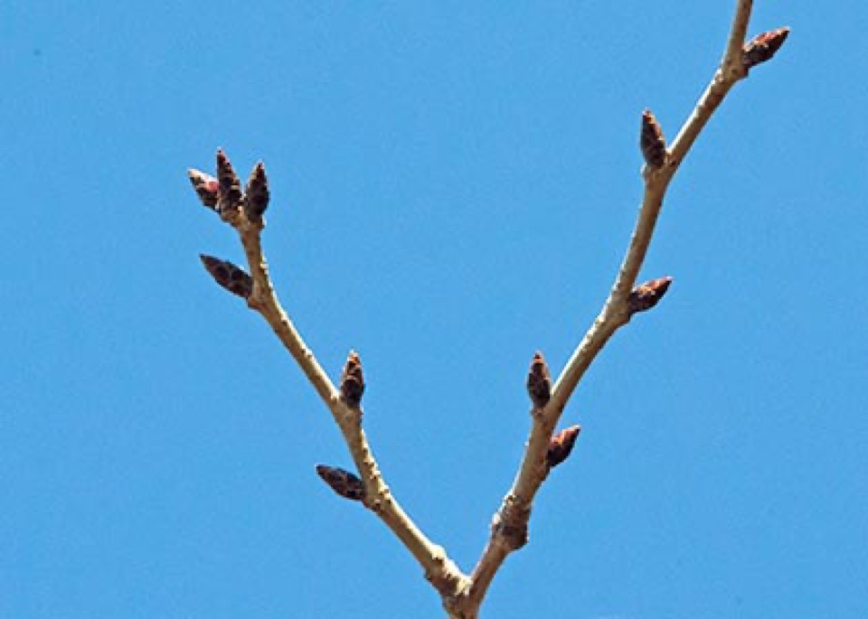
*겨울눈 | 겨울눈: 월동기 눈의 배열과 비늘잎 형태*

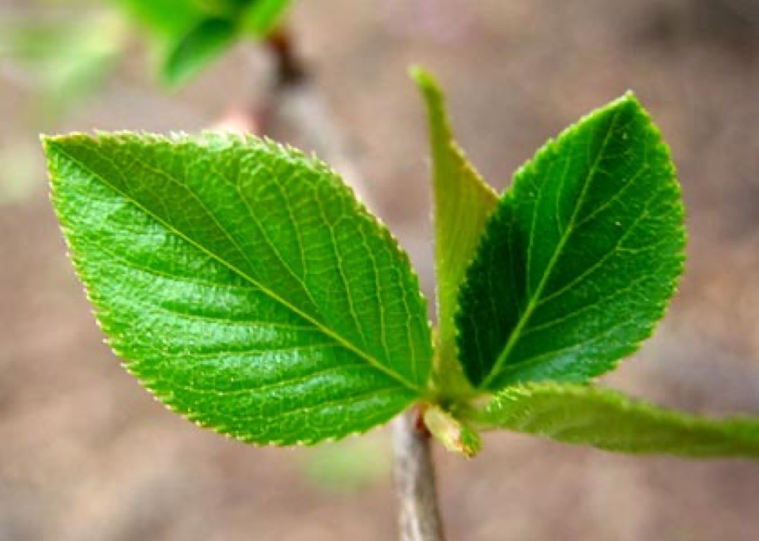
*새순 | 새순: 봄철 새로 돋아나는 잎과 가지*

### 감별 핵심 포인트
- 흰색 또는 옅은 분홍색 꽃의 꽃잎 끝이 살짝 갈라집니다.
- 꽃자루가 길고 꽃이 잎과 함께 보이는 모습을 확인하세요.
- 수피에는 가로로 난 껍질눈이 보입니다.

### 주된 형태 특징 (4대 감별 지표)
- **🌿 잎:** 어긋나기 · 홑잎 · 가장자리: 겹톱니가 일부 있음 · 깃꼴맥
- **🌸 꽃:** 연한 빨강 드믈게 하양 꽃 · 산형꽃차례 또는 짧은 산방꽃차례 · 홑꽃
- **🍒 열매:** 빨강에서 검은갈색 열매 · 굳은씨열매(핵과)
- **🪵 줄기·수형:** 높이 10~20 m, 지름 90 cm쯤으로 통직하고, 많은 가지를 냄 · 수피: 진한 자줏빛 갈색

**비교·주의:** 왕벚나무와는 꽃뿐 아니라 잎이 나오는 시기와 꽃자루도 함께 비교하세요.

[파이팅혼공 TV 강의](https://www.youtube.com/watch?v=K3PvgTi3eXI&t=4690s) · [수목도감(treeworld)](https://treeworld.co.kr/a01_01_02/29532) · [위키백과(한국어)](https://ko.wikipedia.org/wiki/%EC%82%B0%EB%B2%9A%EB%82%98%EB%AC%B4) · [Wikipedia(English)](https://en.wikipedia.org/wiki/Prunus_sargentii)

## 062. 산사나무
> *Crataegus pinnatifida Bunge* · Rosaceae 장미과

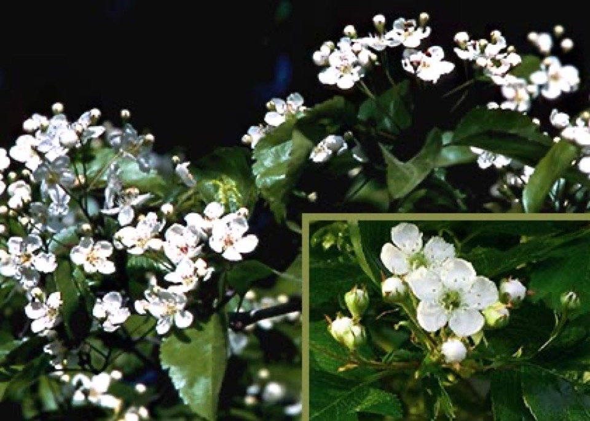
*꽃 | 꽃: 꽃잎은 하양 또는 연한 빨강 꽃 · 산방꽃차례 · 꽃대는 지름 4~8 cm이고, 많은 꽃이 달림*

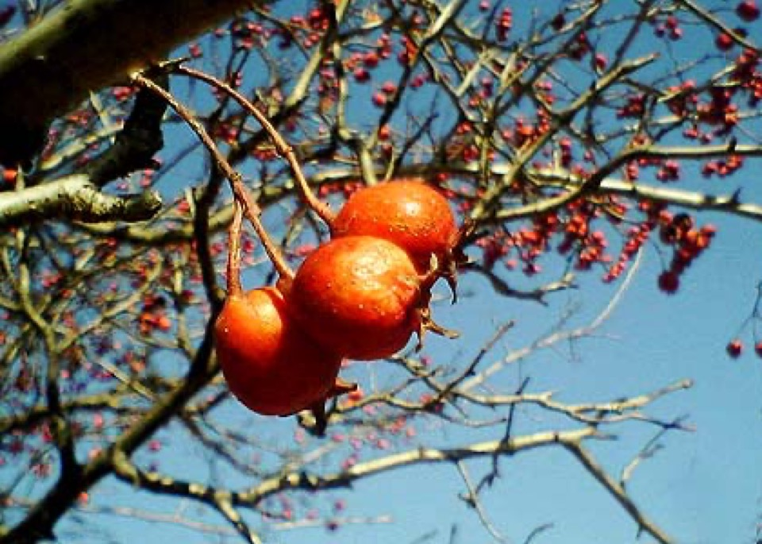
*열매 | 열매: 진한 빨강 또는 노랑 열매 · 배열매(梨果)*

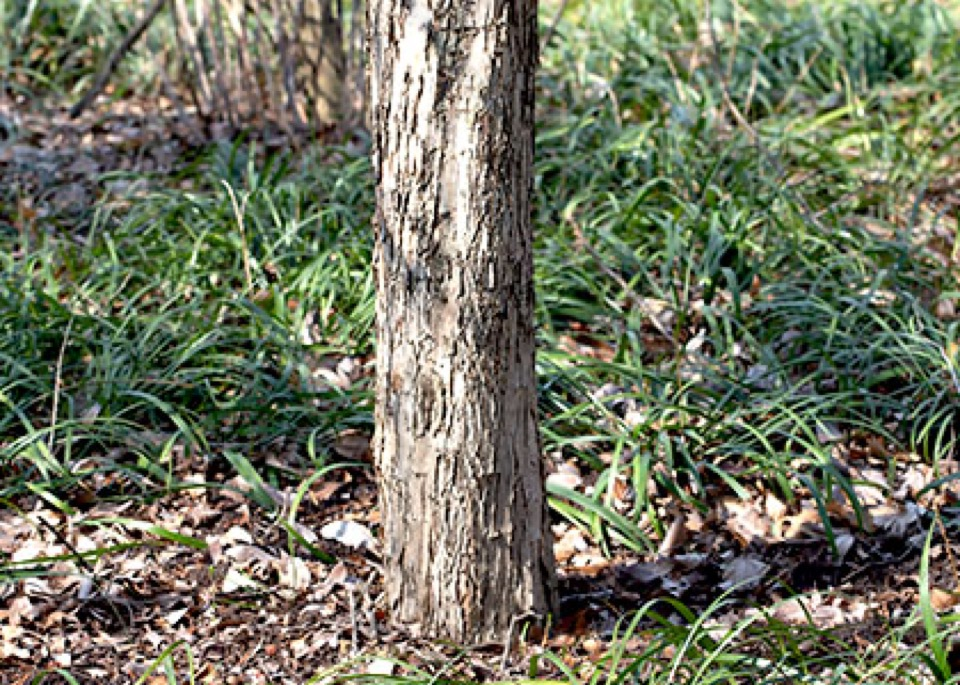
*수형 | 수형: 높이 5~10 m · 수피: 회색, 회갈색*

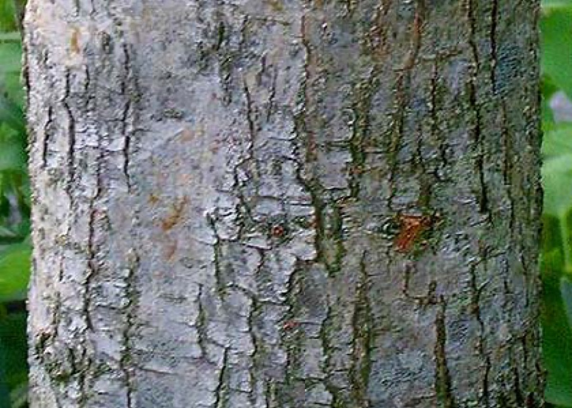
*줄기 | 줄기: 높이 5~10 m · 수피: 회색, 회갈색*

### 감별 핵심 포인트
- 잎이 여러 갈래로 깊게 갈라지고 가장자리에 톱니가 있습니다.
- 흰 꽃이 무리 지어 피며 붉은 열매가 달립니다.
- 작은 사과 같은 열매와 독특하게 갈라진 잎을 함께 기억하세요.

### 주된 형태 특징 (4대 감별 지표)
- **🌿 잎:** 어긋나기 · 넓은 달걀형, 삼각꼴 달걀형, 드믈게 마름모꼴 달걀형 · 가장자리: 날카롭고 불규칙하게 겹톱니가 있고, 끝은 짧게 점차 뾰족함 · 곁맥은 6~10쌍이고, 보통 갈래조각의 끝까지 이어짐
- **🌸 꽃:** 꽃잎은 하양 또는 연한 빨강 꽃 · 산방꽃차례 · 꽃대는 지름 4~8 cm이고, 많은 꽃이 달림
- **🍒 열매:** 진한 빨강 또는 노랑 열매 · 배열매(梨果)
- **🪵 줄기·수형:** 높이 5~10 m · 수피: 회색, 회갈색

**비교·주의:** 붉은 열매만으로는 구별하기 어렵습니다. 잎이 핵심입니다.

[파이팅혼공 TV 강의](https://www.youtube.com/watch?v=K3PvgTi3eXI&t=4770s) · [수목도감(treeworld)](https://treeworld.co.kr/a01_01_02/29523) · [위키백과(한국어)](https://ko.wikipedia.org/wiki/%EC%82%B0%EC%82%AC%EB%82%98%EB%AC%B4) · [Wikipedia(English)](https://en.wikipedia.org/wiki/Crataegus_pinnatifida)

## 063. 산수유
> *Cornus officinalis Siebold & Zucc.* · Cornaceae 층층나무과

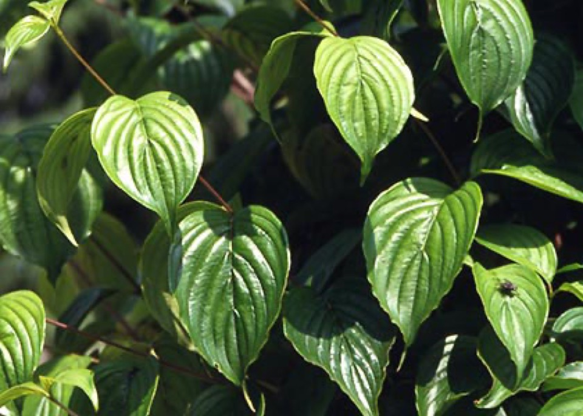
*잎 | 잎: 마주나기 · 달걀형, 타원형 또는 달걀꼴 피침형 · 가장자리: 밋밋함(전연)*

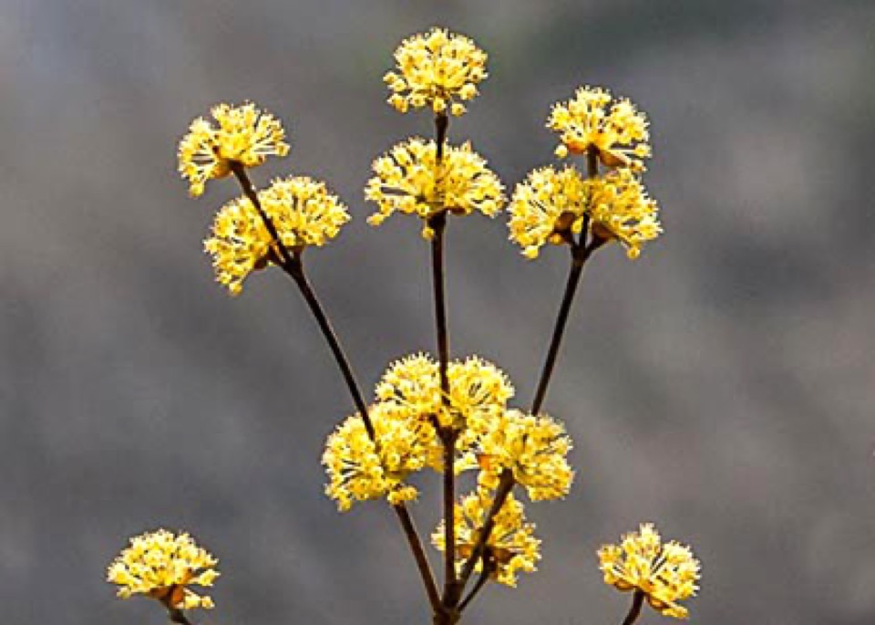
*꽃 | 꽃: 꽃잎은 노랑 꽃 · 우산꼴꽃차례((산형화서) · 암수한그루, 때로는 수꽃 암수한꽃 한그루*

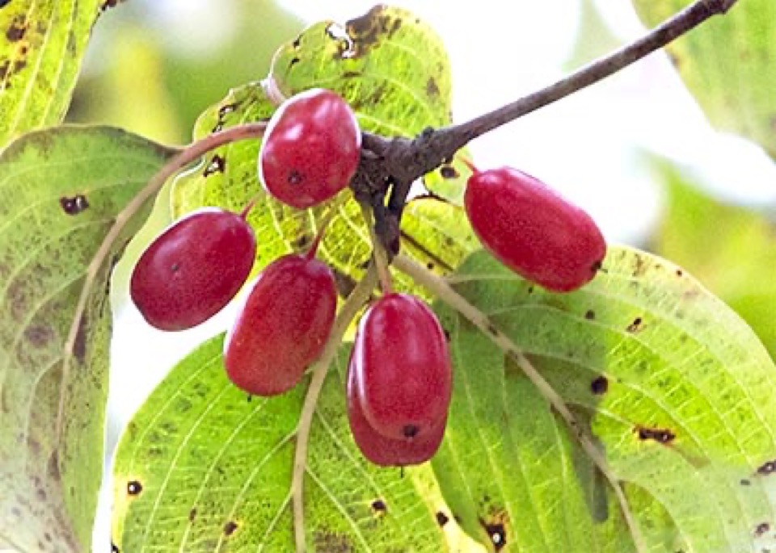
*열매 | 열매: 빨강, 자줏빛 빨강 열매 · 물열매(장과)*

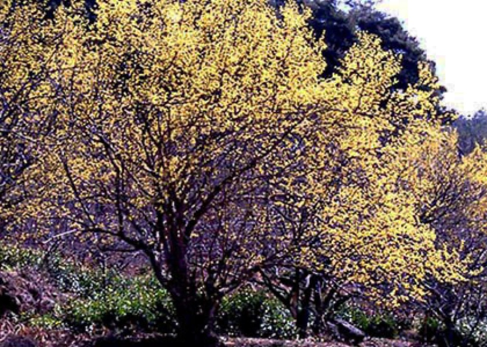
*수형 | 수형: 높이 4~10 m, 지름 30~50 cm · 수피: 껍질은 연한 갈색, 회갈색*

### 감별 핵심 포인트
- 잎보다 먼저 작은 노란 꽃이 둥근 무리로 핍니다.
- 붉은 열매가 길쭉한 타원형입니다.
- 잎맥이 잎 끝을 향해 휘는 모습을 봅니다.

### 주된 형태 특징 (4대 감별 지표)
- **🌿 잎:** 마주나기 · 달걀형, 타원형 또는 달걀꼴 피침형 · 가장자리: 밋밋함(전연) · 곁맥은 나란이맥으로 (4)6쌍 또는 7쌍 이고, 굽음
- **🌸 꽃:** 꽃잎은 노랑 꽃 · 우산꼴꽃차례((산형화서) · 암수한그루, 때로는 수꽃 암수한꽃 한그루
- **🍒 열매:** 빨강, 자줏빛 빨강 열매 · 물열매(장과)
- **🪵 줄기·수형:** 높이 4~10 m, 지름 30~50 cm · 수피: 껍질은 연한 갈색, 회갈색

**비교·주의:** 영상의 답안 이름은 ‘산수유’입니다. 생강나무와 잎 모양을 비교하세요.

[파이팅혼공 TV 강의](https://www.youtube.com/watch?v=K3PvgTi3eXI&t=4850s) · [수목도감(treeworld)](https://treeworld.co.kr/a01_01_02/29504) · [위키백과(한국어)](https://ko.wikipedia.org/wiki/%EC%82%B0%EC%88%98%EC%9C%A0) · [Wikipedia(English)](https://en.wikipedia.org/wiki/Cornus_officinalis)

## 064. 산철쭉
> *Rhododendron yedoense f. poukhanense(Lev.) Sugimoto ex T.Yamaz.* · Ericaceae 진달래과

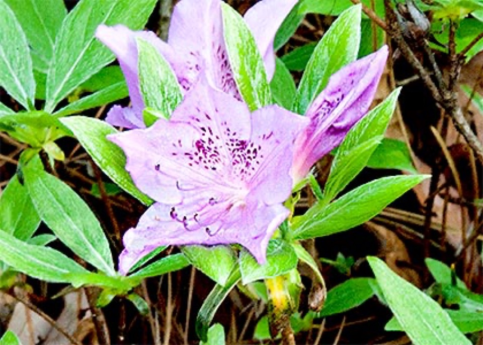
*꽃 | 꽃: 꽃부리는 자주빛 분홍, 연한 빨강 꽃 · 2~3개씩 우산꼴로 가지 끝에 달림 · 꽃부리는 넓은 깔때기형으로 지름 5~6 cm*

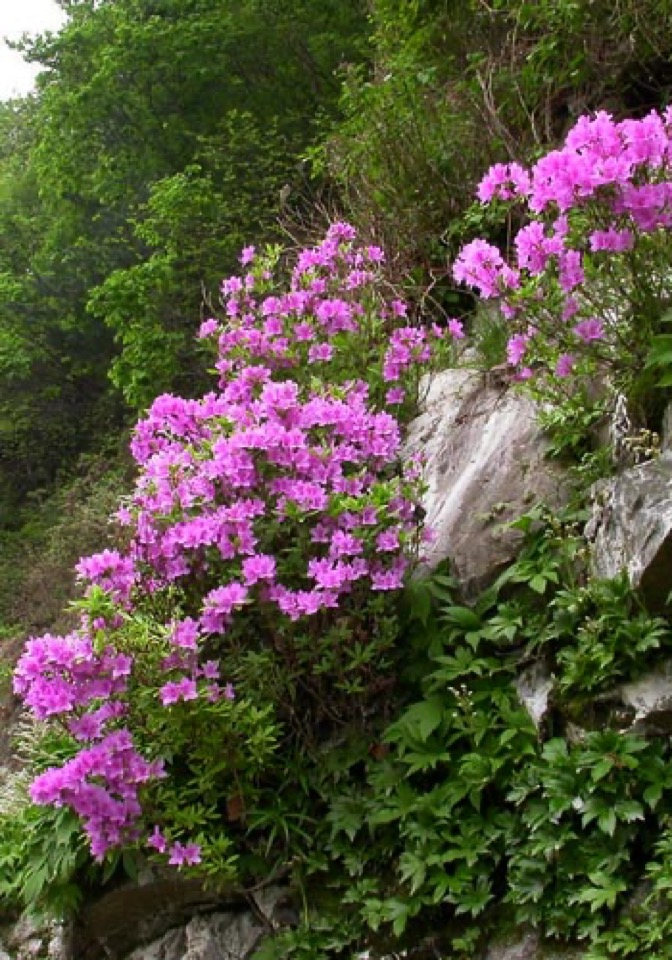
*수형 | 수형: 높이 1~2 m · 수피: 회빛 노란갈색*

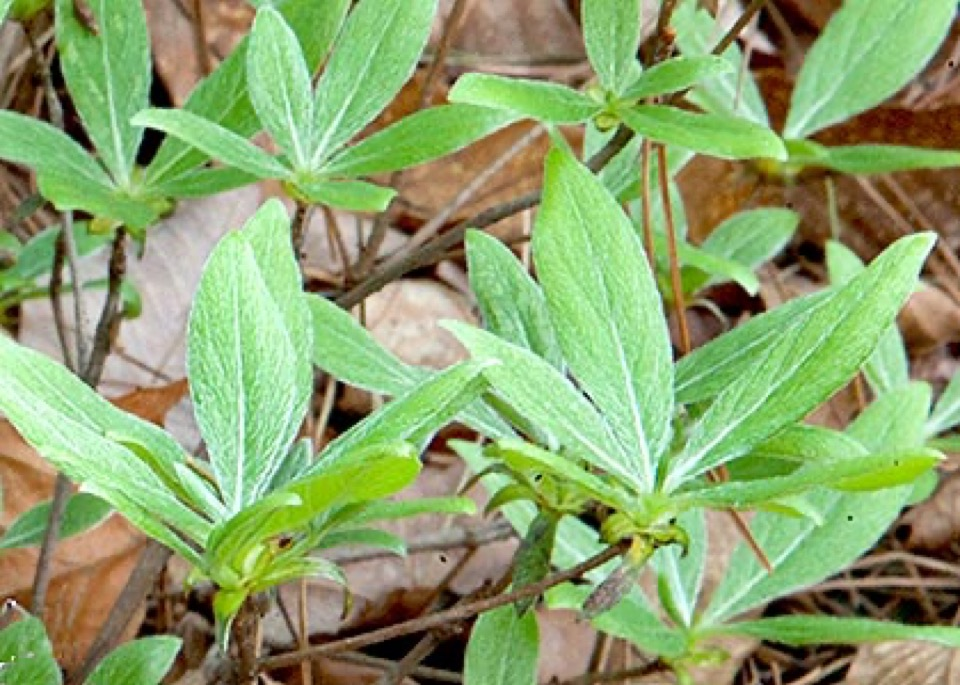
*새순 | 새순: 봄철 새로 돋아나는 잎과 가지*

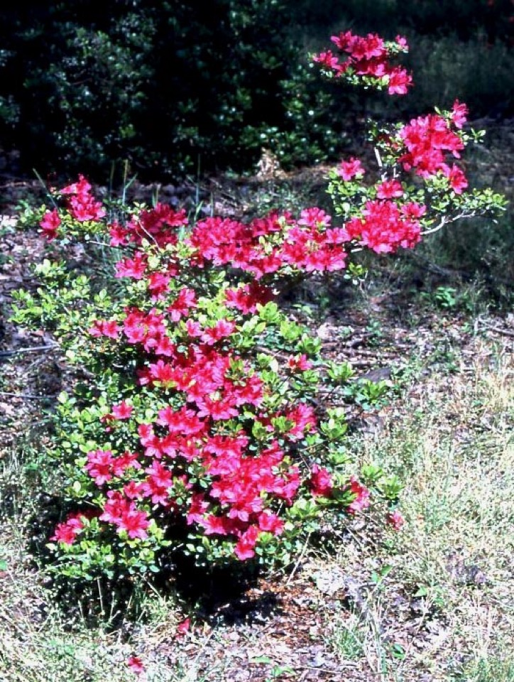
*기타1 | 기타1: 산철쭉의 고유 형태*

### 감별 핵심 포인트
- 진한 분홍색 꽃이 피며 꽃 안쪽에 반점이 보입니다.
- 잎은 끝이 좁고 길쭉한 타원형입니다.
- 꽃과 잎이 함께 나온 사진을 비교해 기억하세요.

### 주된 형태 특징 (4대 감별 지표)
- **🌿 잎:** 어긋나기 · 잎몸은 타원꼴 피침형, 거꿀피침형, 좁은 긴타원형으로 길이 3~8 cm, 너비 1~3 cm · 가장자리: 톱니 없이 밋밋함 · 중앙맥에 긴곁맥은 3~4개가 달리고, 짧은 맥이 여러개 달림
- **🌸 꽃:** 꽃부리는 자주빛 분홍, 연한 빨강 꽃 · 2~3개씩 우산꼴로 가지 끝에 달림 · 꽃부리는 넓은 깔때기형으로 지름 5~6 cm
- **🍒 열매:** 갈색 열매 · 튀는열매(삭과)
- **🪵 줄기·수형:** 높이 1~2 m · 수피: 회빛 노란갈색

**비교·주의:** 철쭉의 비교적 넓고 둥근 잎, 연한 분홍색 꽃과 구별합니다.

[파이팅혼공 TV 강의](https://www.youtube.com/watch?v=K3PvgTi3eXI&t=4950s) · [수목도감(treeworld)](https://treeworld.co.kr/a01_01_02/29501) · [위키백과(한국어)](https://ko.wikipedia.org/wiki/%EC%82%B0%EC%B2%A0%EC%AD%89) · [Wikipedia(English)](https://en.wikipedia.org/wiki/Rhododendron_yedoense)

## 065. 살구나무
> *Prunus armeniaca L.* · Rosaceae 장미과

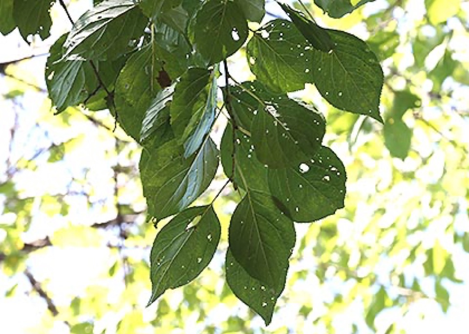
*잎 | 잎: 어긋나기 · 잎몸은 넓은타원형, 넓은달걀형, 둥근꼴 달걀형 · 가장자리: 무딘 홑톱니가 있음*

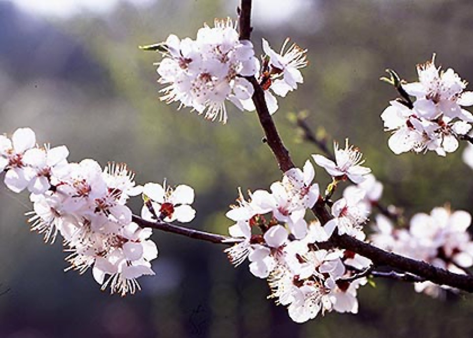
*꽃 | 꽃: 꽃잎은 하양, 분홍, 연한 빨강 꽃 · 산방꽃차례 · 지름 2.5~3.5 cm*

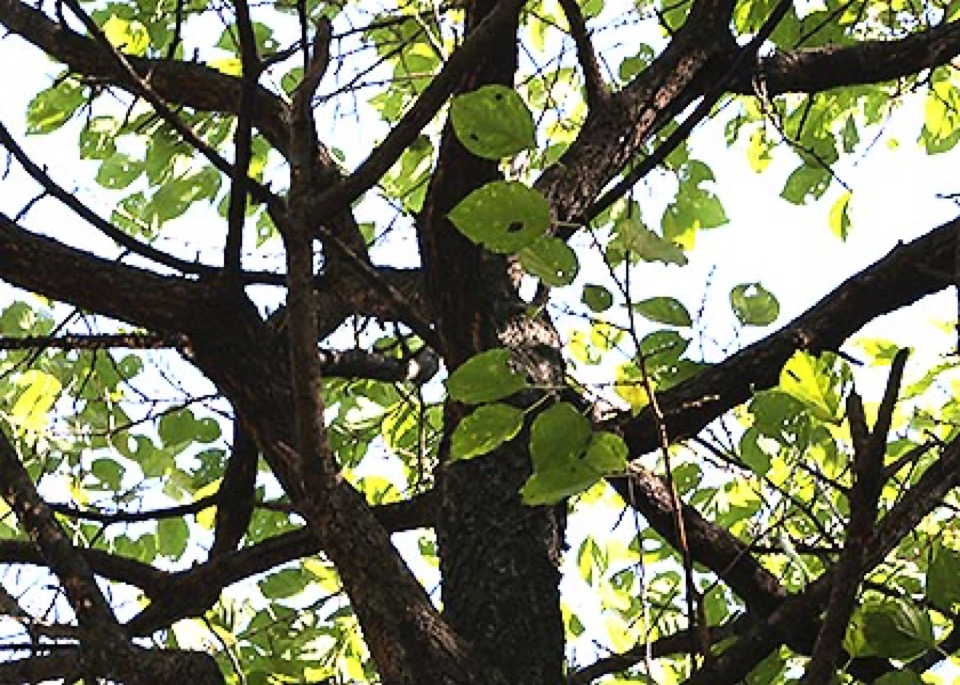
*수형 | 수형: 높이 5~10 m, 지름 약 40 cm · 수피: 검은갈색*

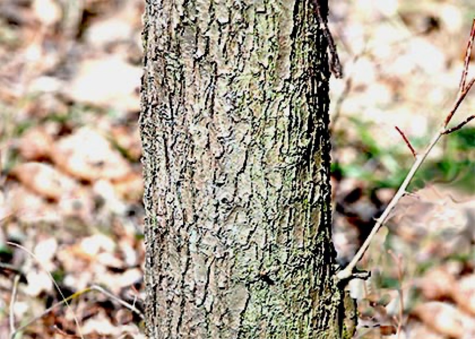
*줄기 | 줄기: 높이 5~10 m, 지름 약 40 cm · 수피: 검은갈색*

### 감별 핵심 포인트
- 옅은 분홍색 또는 흰빛 꽃이 잎보다 먼저 핍니다.
- 꽃 뒤쪽의 꽃받침이 뒤로 젖혀지는 모습이 특징입니다.
- 둥글고 노랗게 익는 살구 열매를 함께 기억하세요.

### 주된 형태 특징 (4대 감별 지표)
- **🌿 잎:** 어긋나기 · 잎몸은 넓은타원형, 넓은달걀형, 둥근꼴 달걀형 · 가장자리: 무딘 홑톱니가 있음 · 깃꼴 그물맥
- **🌸 꽃:** 꽃잎은 하양, 분홍, 연한 빨강 꽃 · 산방꽃차례 · 지름 2.5~3.5 cm
- **🍒 열매:** 노랑, 하양, 주황, 노란 빨강 열매 · 굳은씨열매(핵과)
- **🪵 줄기·수형:** 높이 5~10 m, 지름 약 40 cm · 수피: 검은갈색

**비교·주의:** 복사나무·산벚나무와 비교할 때 꽃받침과 꽃자루를 봅니다.

[파이팅혼공 TV 강의](https://www.youtube.com/watch?v=K3PvgTi3eXI&t=5050s) · [수목도감(treeworld)](https://treeworld.co.kr/a01_01_02/29476) · [위키백과(한국어)](https://ko.wikipedia.org/wiki/%EC%82%B4%EA%B5%AC%EB%82%98%EB%AC%B4) · [Wikipedia(English)](https://en.wikipedia.org/wiki/Prunus_armeniaca)

## 066. 상수리나무
> *Quercus acutissima Carruth.* · Fagaceae 참나무과(너도밤나무과)

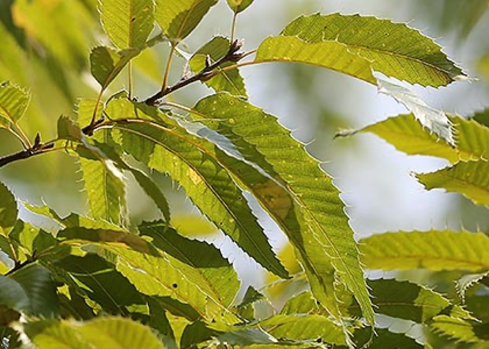
*잎 | 잎: 어긋나기 · 긴타원형, 넓은피침형 · 가장자리: 약간 물결꼴로 되고 바늘꼴 톱니를 갖임*

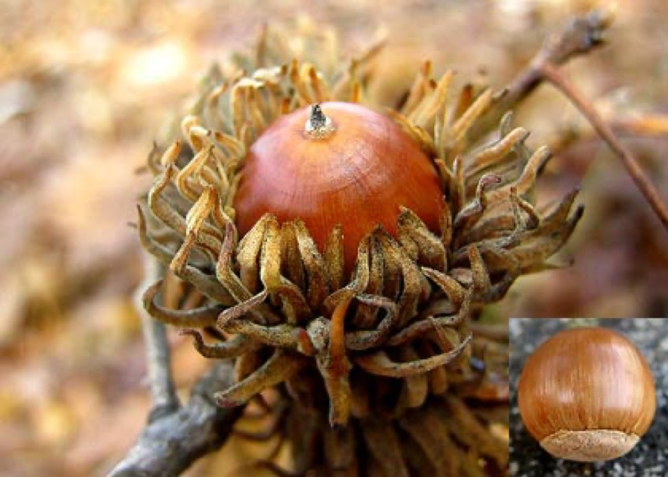
*열매 | 열매: 검은 갈색 열매 · 굳은껍질열매(견과(堅果.도토리)*

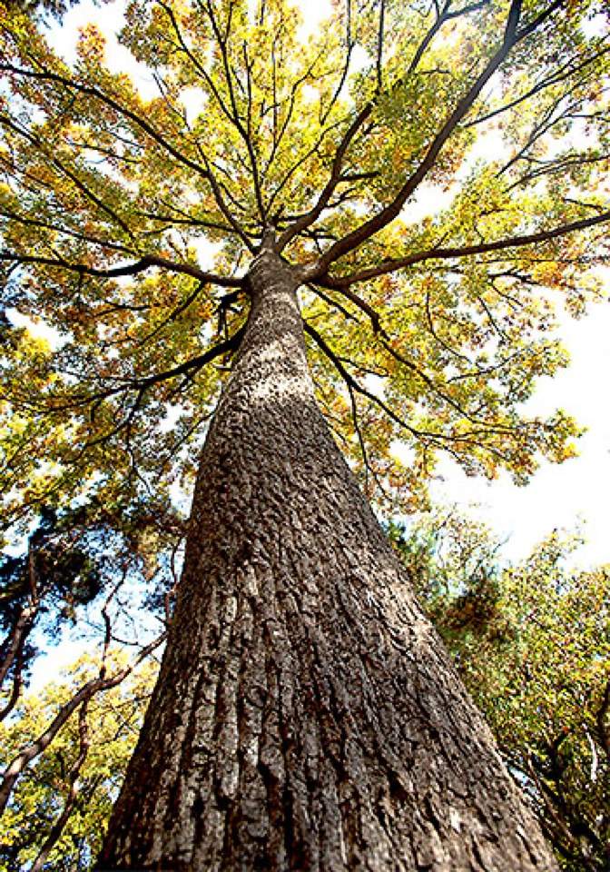
*수형 | 수형: 높이 15~25m, 지름 40~50cm(1m) · 수피: 어두운 회색, 검은 갈색*

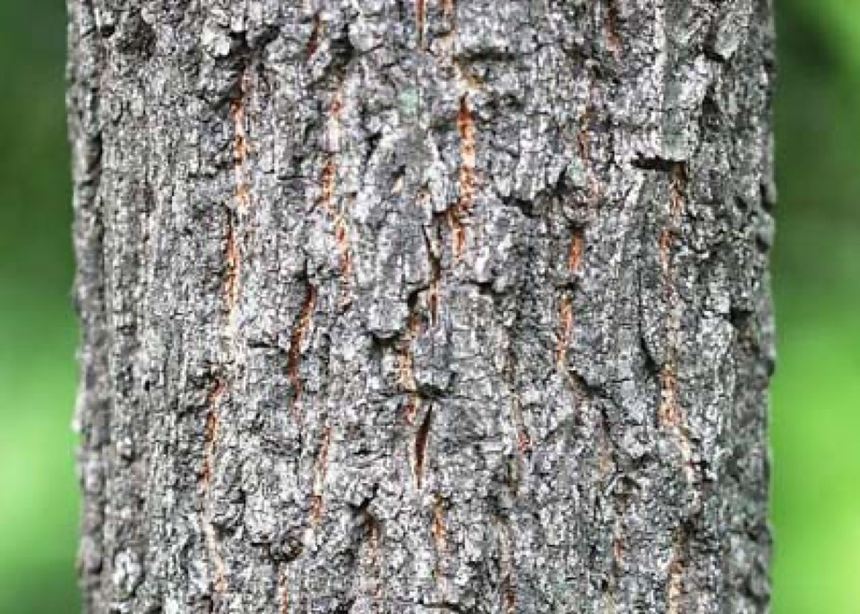
*줄기 | 줄기: 높이 15~25m, 지름 40~50cm(1m) · 수피: 어두운 회색, 검은 갈색*

### 감별 핵심 포인트
- 잎은 길쭉하고 가장자리에 뾰족한 톱니가 있습니다.
- 긴 수꽃차례가 아래로 늘어집니다.
- 도토리 모자의 길고 굵은 조각이 뒤로 젖혀져 보입니다.

### 주된 형태 특징 (4대 감별 지표)
- **🌿 잎:** 어긋나기 · 긴타원형, 넓은피침형 · 가장자리: 약간 물결꼴로 되고 바늘꼴 톱니를 갖임 · 곁맥 12~16쌍
- **🌸 꽃:** 수꽃은 노란 초록 꽃 · 암꽃이삭은 윗부분의 잎겨드랑이에서 곧추나옴 · 암수한그루(일가화)
- **🍒 열매:** 검은 갈색 열매 · 굳은껍질열매(견과(堅果.도토리)
- **🪵 줄기·수형:** 높이 15~25m, 지름 40~50cm(1m) · 수피: 어두운 회색, 검은 갈색

**비교·주의:** 떡갈나무의 넓고 둥근 잎과 도토리 모자를 비교하세요.

[파이팅혼공 TV 강의](https://www.youtube.com/watch?v=K3PvgTi3eXI&t=5150s) · [수목도감(treeworld)](https://treeworld.co.kr/a01_01_02/29439) · [위키백과(한국어)](https://ko.wikipedia.org/wiki/%EC%83%81%EC%88%98%EB%A6%AC%EB%82%98%EB%AC%B4) · [Wikipedia(English)](https://en.wikipedia.org/wiki/Quercus_acutissima)

## 067. 생강나무
> *Lindera obtusiloba Blume* · Lauraceae 녹나무과

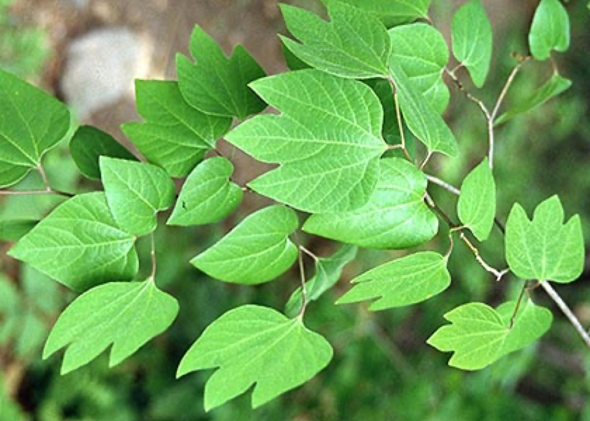
*잎 | 잎: 어긋나기 · 거의 둥근형, 달걀형 또는 달걀꼴 둥근형 · 가장자리: 보통은 밋밋함*

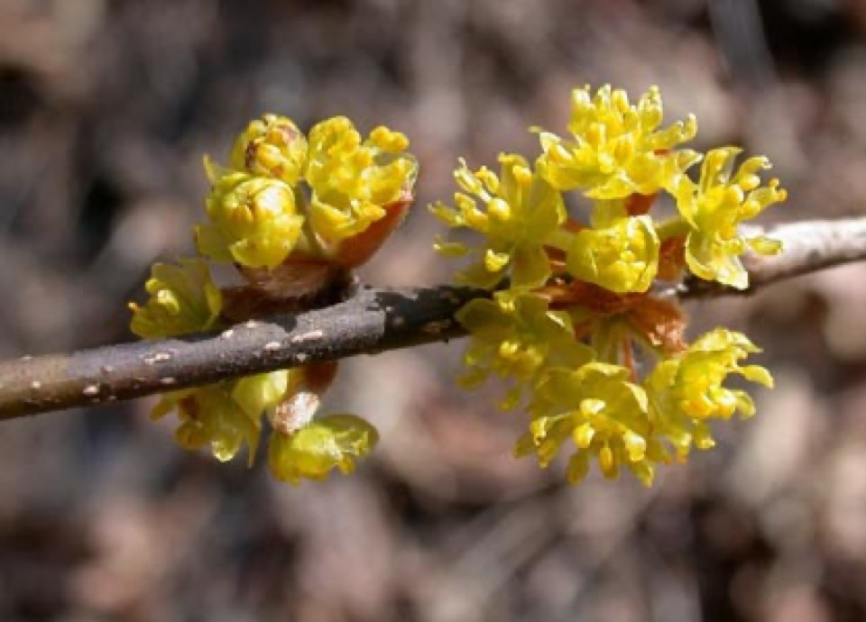
*꽃 | 꽃: 노랑 꽃 · 꽃자루가 없는 산형꽃차례이고, 4개의 큰꽃턱(총포)을 갖임 · 암수딴그루(이가화)*

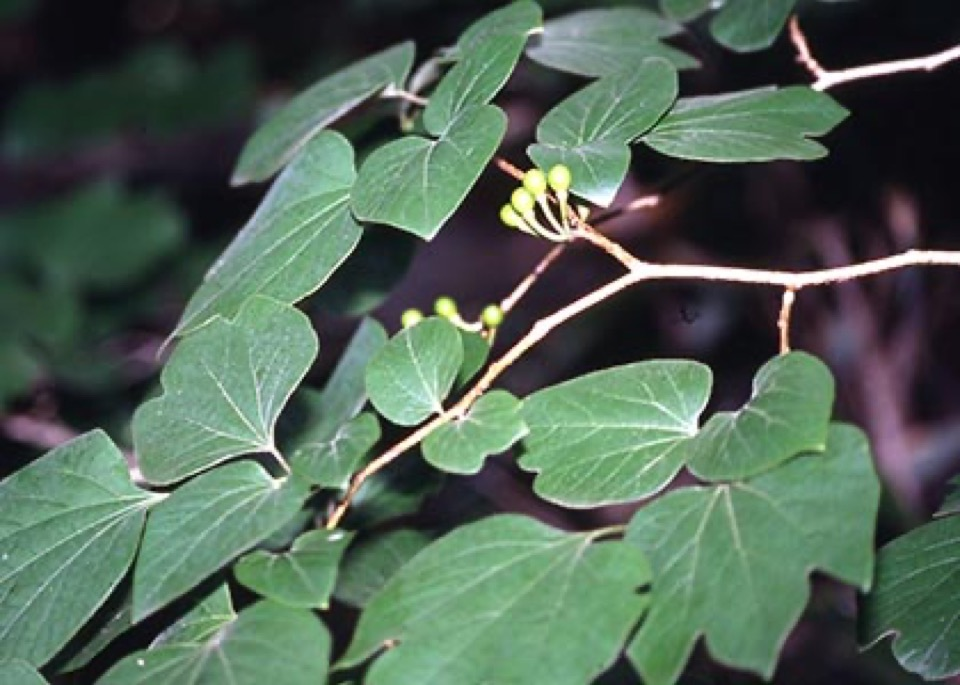
*열매 | 열매: 성숙하면 빨강, 나중에 자줏빛 검정, 건조하면 검은 갈색 열매 · 물열매(장과)*

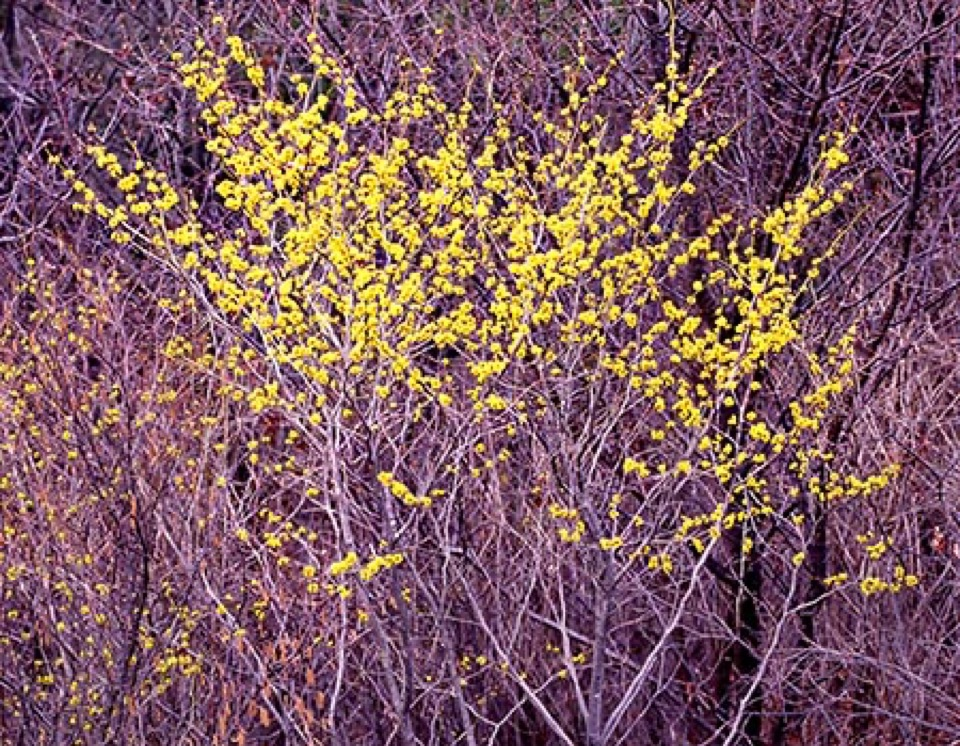
*수형 | 수형: 높이 2~5 m · 수피: 검은 회색, 검은 갈색*

### 감별 핵심 포인트
- 잎이 나기 전에 노란 꽃이 가지에 모여 핍니다.
- 잎은 넓고 일부는 크게 세 갈래로 갈라집니다.
- 노란 꽃뿐 아니라 넓은 잎 모양을 함께 기억하세요.

### 주된 형태 특징 (4대 감별 지표)
- **🌿 잎:** 어긋나기 · 거의 둥근형, 달걀형 또는 달걀꼴 둥근형 · 가장자리: 보통은 밋밋함 · 그믈맥은 뚜렷하고, 3출맥이며, 뒷면 맥에 털이 있음
- **🌸 꽃:** 노랑 꽃 · 꽃자루가 없는 산형꽃차례이고, 4개의 큰꽃턱(총포)을 갖임 · 암수딴그루(이가화)
- **🍒 열매:** 성숙하면 빨강, 나중에 자줏빛 검정, 건조하면 검은 갈색 열매 · 물열매(장과)
- **🪵 줄기·수형:** 높이 2~5 m · 수피: 검은 회색, 검은 갈색

**비교·주의:** 산수유도 노란 꽃이 먼저 핍니다. 잎 모양과 꽃이 붙는 모습을 비교하세요.

[파이팅혼공 TV 강의](https://www.youtube.com/watch?v=K3PvgTi3eXI&t=5270s) · [수목도감(treeworld)](https://treeworld.co.kr/a01_01_02/29418) · [위키백과(한국어)](https://ko.wikipedia.org/wiki/%EC%83%9D%EA%B0%95%EB%82%98%EB%AC%B4) · [Wikipedia(English)](https://en.wikipedia.org/wiki/Lindera_obtusiloba)

## 068. 서어나무
> *Carpinus laxiflora (Siebold & Zucc.) Blume* · Betulaceae 자작나무과

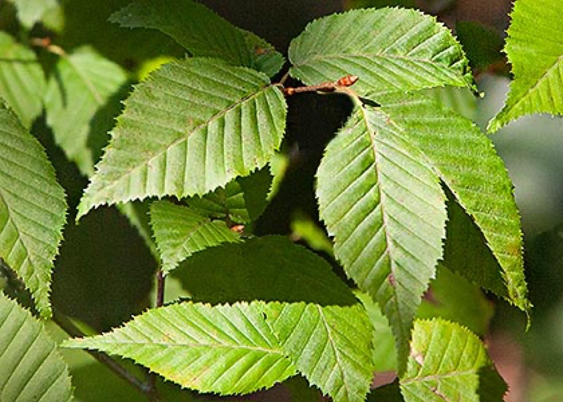
*잎 | 잎: 어긋나기 · 홑잎 · 가장자리: 겹톱니가 있음*

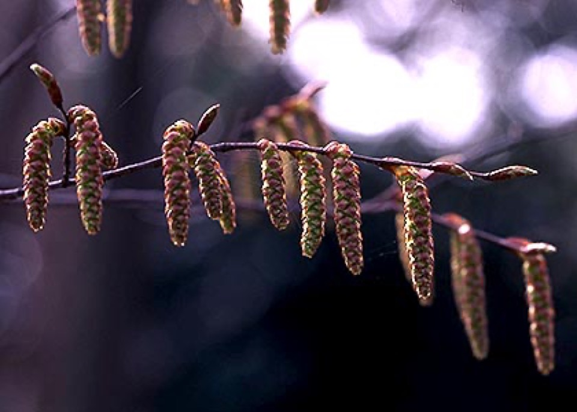
*꽃 | 꽃: 암꽃은 초록 꽃 · 꼬리꽃차례(미상화서, 유이화서: 이삭꽃차례의 하나)이며, 잎보다 먼저 피고 위로 섬 · 암수한그루(일가화)*

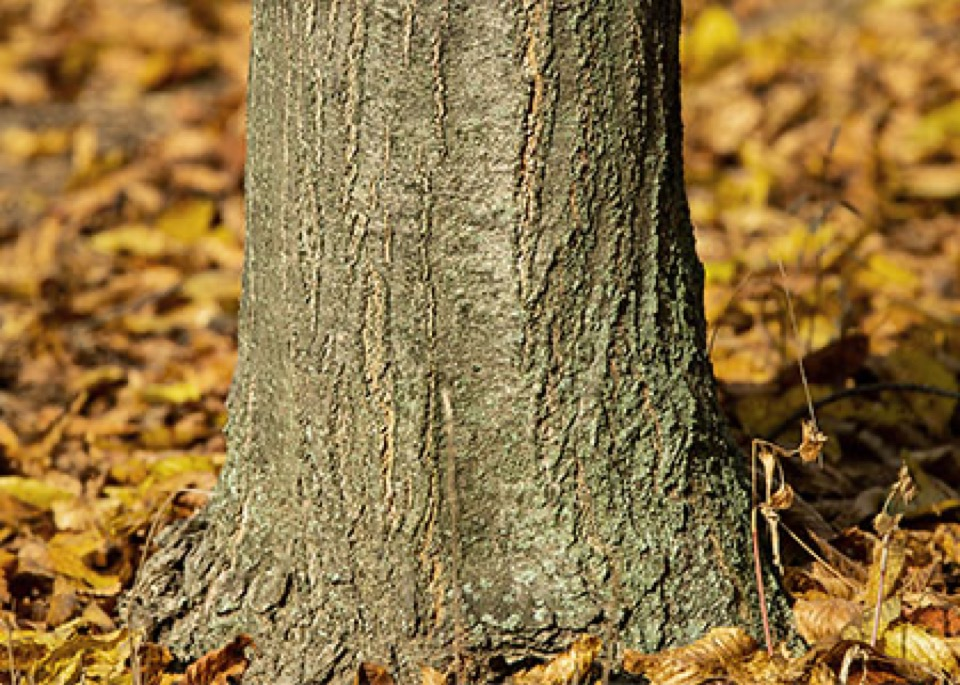
*수형 | 수형: 높이 15 m, 지름 1 m까지 자라며, 껍질은 밋밋하지만 울퉁불퉁함 · 수피: 회색, 어두운 회색*

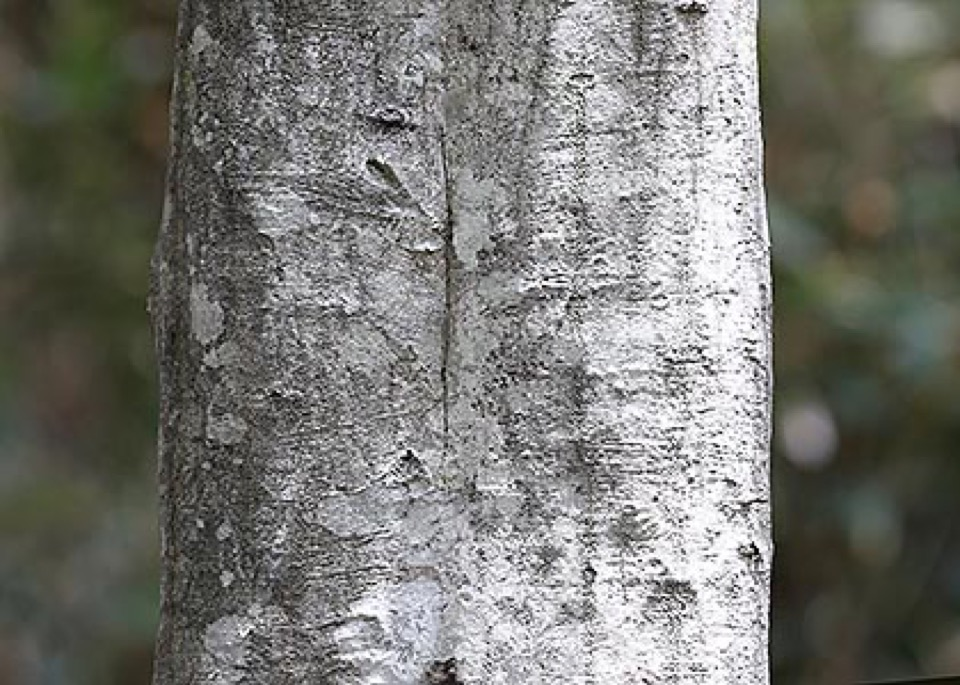
*줄기 | 줄기: 높이 15 m, 지름 1 m까지 자라며, 껍질은 밋밋하지만 울퉁불퉁함 · 수피: 회색, 어두운 회색*

### 감별 핵심 포인트
- 회색 수피의 줄기가 근육처럼 울퉁불퉁해 보입니다.
- 잎에는 선명한 잎맥과 톱니가 있습니다.
- 길게 늘어지는 꽃차례·열매이삭도 확인하세요.

### 주된 형태 특징 (4대 감별 지표)
- **🌿 잎:** 어긋나기 · 홑잎 · 가장자리: 겹톱니가 있음 · 곁맥 (7)10 ~12쌍으로 가장자리에 이르고, 뒷면이 튀어나옴
- **🌸 꽃:** 암꽃은 초록 꽃 · 꼬리꽃차례(미상화서, 유이화서: 이삭꽃차례의 하나)이며, 잎보다 먼저 피고 위로 섬 · 암수한그루(일가화)
- **🍒 열매:** 어릴 때 연한 초록. 갈색 열매 · 열매이삭(과수)은 길이 4~8 cm, 지름 1.8 cm
- **🪵 줄기·수형:** 높이 15 m, 지름 1 m까지 자라며, 껍질은 밋밋하지만 울퉁불퉁함 · 수피: 회색, 어두운 회색

[파이팅혼공 TV 강의](https://www.youtube.com/watch?v=K3PvgTi3eXI&t=5330s) · [수목도감(treeworld)](https://treeworld.co.kr/a01_01_02/29396) · [위키백과(한국어)](https://ko.wikipedia.org/wiki/%EC%84%9C%EC%96%B4%EB%82%98%EB%AC%B4) · [Wikipedia(English)](https://en.wikipedia.org/wiki/Carpinus_laxiflora)

## 069. 석류나무
> *Punica granatum L* · Lythraceae 부처꽃과

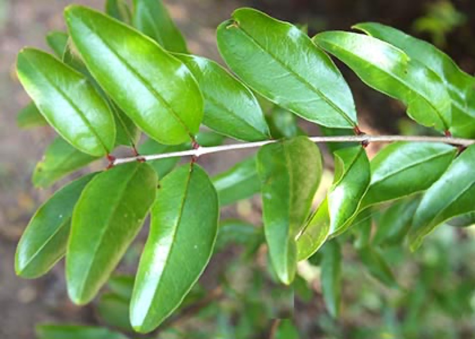
*잎 | 잎: 마주나기 또는 모아나기 · 홑잎 · 가장자리: 밋밋하고, 물결꼴을 갖기도 함*

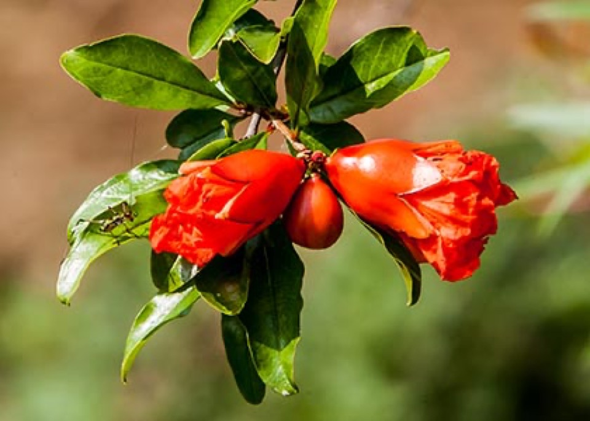
*꽃 | 꽃: 꽃잎은 밝은 주황빛 빨강이 보통이나 빨강, 노랑, 하양, 얼룩무늬 등이 있음 꽃 · 단일꽃차례, 단축꽃차례 · 암수한그루(일가화)*

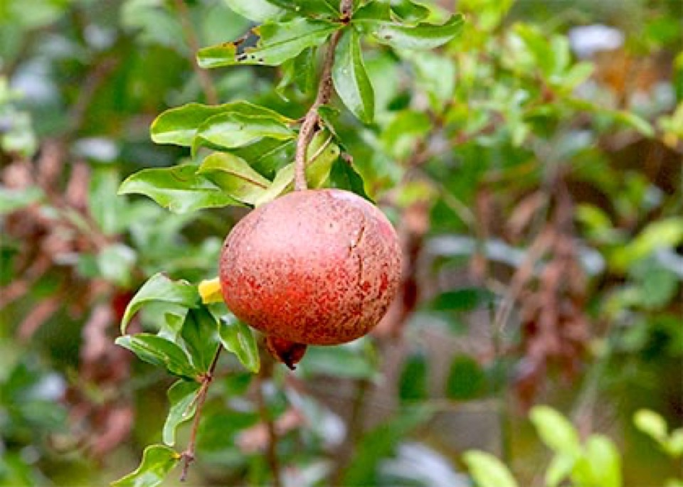
*열매 | 열매: 주황 또는 빨간 주황 열매 · 둥근형으로 지름 6~8 cm 이고, 끝에 꽃받침 조각이 남아있음*

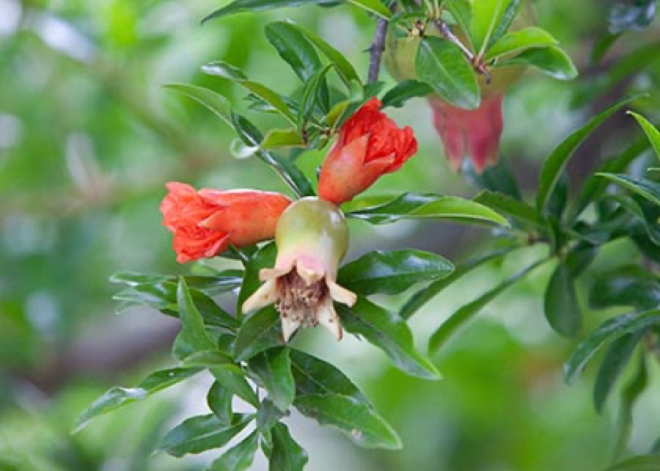
*수형 | 수형: 높이 2~4 m · 수피: 연한 회갈색( 벗겨진 뒤에는 갈색이 짙어짐). 연한 노랑*

### 감별 핵심 포인트
- 붉은 꽃과 두툼한 꽃받침이 눈에 띕니다.
- 꽃받침이 단단한 컵처럼 남아 열매의 끝을 이룹니다.
- 석류 열매와 좁고 매끈한 잎을 함께 봅니다.

### 주된 형태 특징 (4대 감별 지표)
- **🌿 잎:** 마주나기 또는 모아나기 · 홑잎 · 가장자리: 밋밋하고, 물결꼴을 갖기도 함 · 깃꼴맥
- **🌸 꽃:** 꽃잎은 밝은 주황빛 빨강이 보통이나 빨강, 노랑, 하양, 얼룩무늬 등이 있음 꽃 · 단일꽃차례, 단축꽃차례 · 암수한그루(일가화)
- **🍒 열매:** 주황 또는 빨간 주황 열매 · 둥근형으로 지름 6~8 cm 이고, 끝에 꽃받침 조각이 남아있음
- **🪵 줄기·수형:** 높이 2~4 m · 수피: 연한 회갈색( 벗겨진 뒤에는 갈색이 짙어짐). 연한 노랑

[파이팅혼공 TV 강의](https://www.youtube.com/watch?v=K3PvgTi3eXI&t=5390s) · [수목도감(treeworld)](https://treeworld.co.kr/a01_01_02/29376) · [위키백과(한국어)](https://ko.wikipedia.org/wiki/%EC%84%9D%EB%A5%98%EB%82%98%EB%AC%B4) · [Wikipedia(English)](https://en.wikipedia.org/wiki/Pomegranate)

## 070. 소나무
> *Pinus densiflora Siebold & Zucc.* · Pinaceae 소나무과

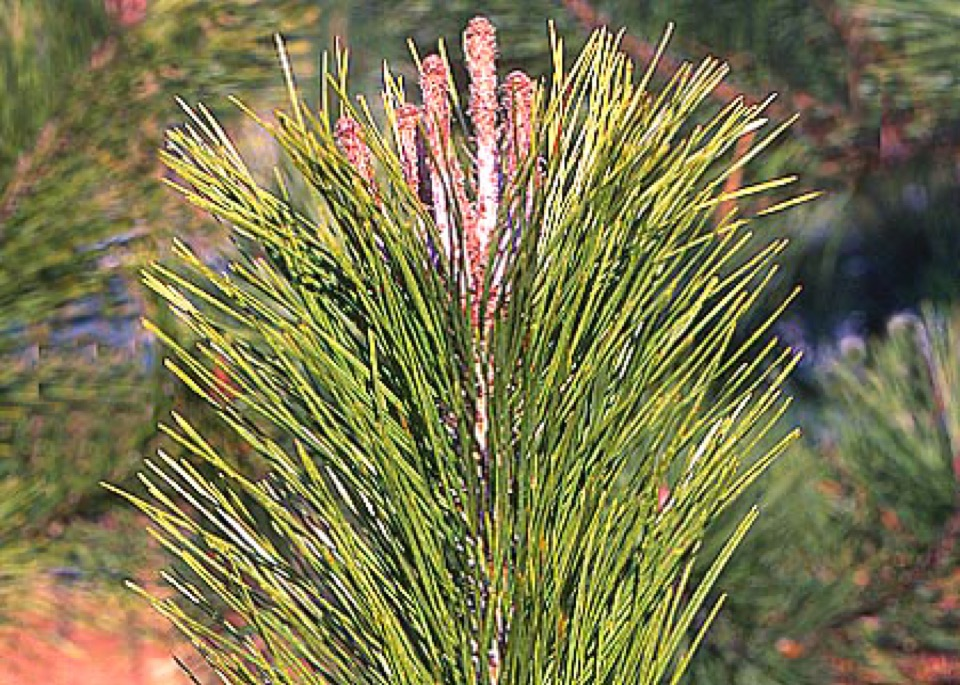
*잎 | 잎: 짧은 가지에 2 잎씩 모아나기(2엽송) · 바늘잎(針形) 또는 좁은 피침형으로 길이 7∼12 cm, 너비 0.7~1.5 mm · 가장자리: 밋밋하거나(全緣) 아주 자잘한 톱니(미거치)가 있음*

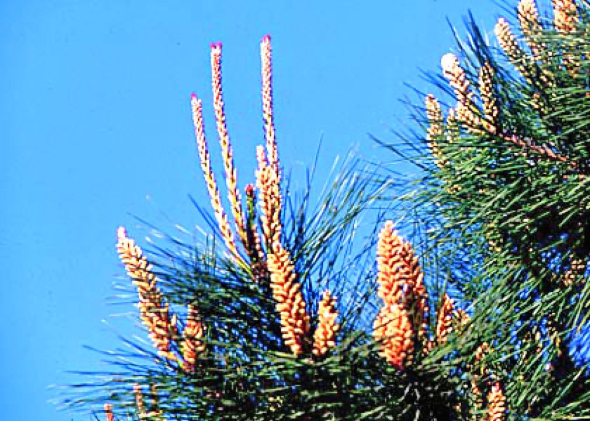
*꽃 | 꽃: 씨방울은 연한 빨강, 꽃가루방울은 연한 노랑 꽃 · 암꽃방울은 햇가지 끝에 1~3(그 이상)개가 달리고, 수꽃이삭은 햇가지 아래 부분 잎자리에 소포자잎 20~30개(때로는 이 보다 많음)씩 모여달림 · 암수한그루(자웅동주, 일가화)*

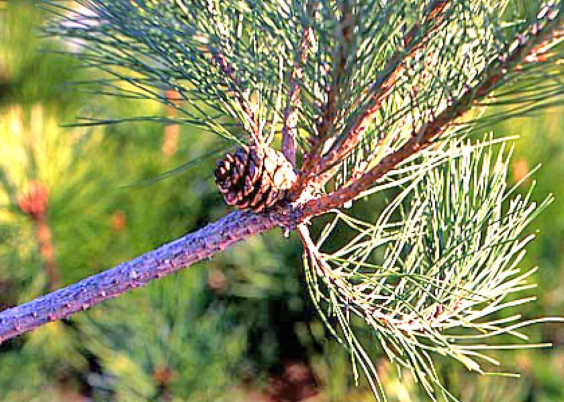
*열매 | 열매: 솔방울은 노란 갈색 열매 · 솔방울열매(구과)*

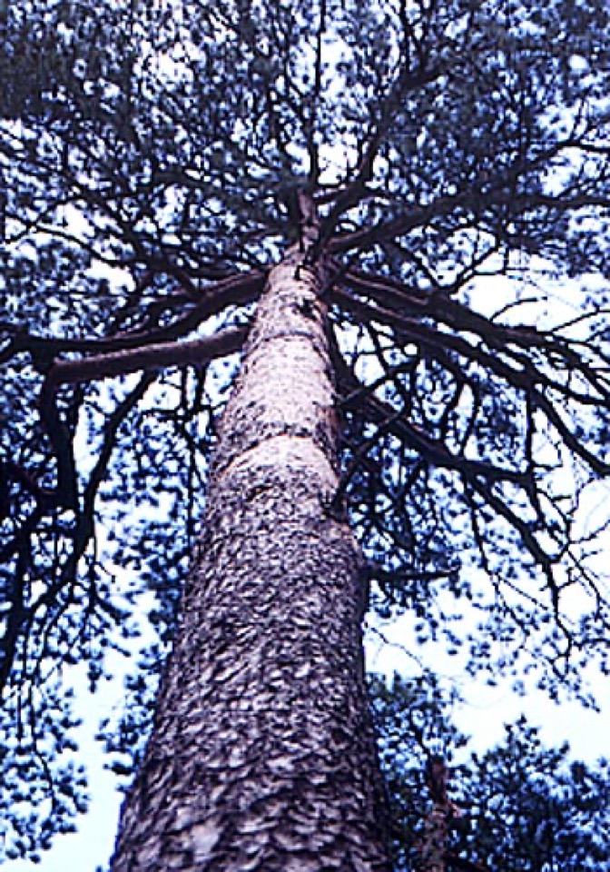
*수형 | 수형: 높이 20~35 m, 지름1.5~1.8 m · 수피: 빨간 갈색*

### 감별 핵심 포인트
- 바늘 모양 잎이 두 개씩 모여 납니다.
- 줄기 윗부분의 붉은빛 수피와 전체 수형을 확인하세요.
- 솔방울과 침엽이 함께 나온 사진으로 익혀두세요.

### 주된 형태 특징 (4대 감별 지표)
- **🌿 잎:** 짧은 가지에 2 잎씩 모아나기(2엽송) · 바늘잎(針形) 또는 좁은 피침형으로 길이 7∼12 cm, 너비 0.7~1.5 mm · 가장자리: 밋밋하거나(全緣) 아주 자잘한 톱니(미거치)가 있음 · 흐릿한 기공선이 앞뒷면에 있음
- **🌸 꽃:** 씨방울은 연한 빨강, 꽃가루방울은 연한 노랑 꽃 · 암꽃방울은 햇가지 끝에 1~3(그 이상)개가 달리고, 수꽃이삭은 햇가지 아래 부분 잎자리에 소포자잎 20~30개(때로는 이 보다 많음)씩 모여달림 · 암수한그루(자웅동주, 일가화)
- **🍒 열매:** 솔방울은 노란 갈색 열매 · 솔방울열매(구과)
- **🪵 줄기·수형:** 높이 20~35 m, 지름1.5~1.8 m · 수피: 빨간 갈색

**비교·주의:** 백송은 3엽, 잣나무류는 5엽입니다. 곰솔도 2엽이므로 수피와 눈을 함께 봅니다.

[파이팅혼공 TV 강의](https://www.youtube.com/watch?v=K3PvgTi3eXI&t=5490s) · [수목도감(treeworld)](https://treeworld.co.kr/a01_01_02/29305) · [위키백과(한국어)](https://ko.wikipedia.org/wiki/%EC%86%8C%EB%82%98%EB%AC%B4) · [Wikipedia(English)](https://en.wikipedia.org/wiki/Pinus_densiflora)

## 071. 수국
> *Hydrangea macrophylla (Thunb.) Ser.* · Hydrangeaceae 수국과

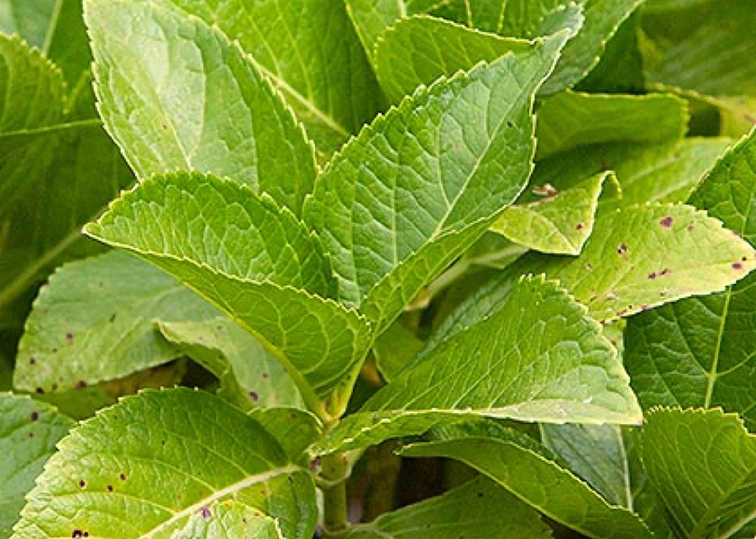
*잎 | 잎: 마주나기 · 홑잎 · 가장자리: 삼각꼴의 날선 톱니가 있음*

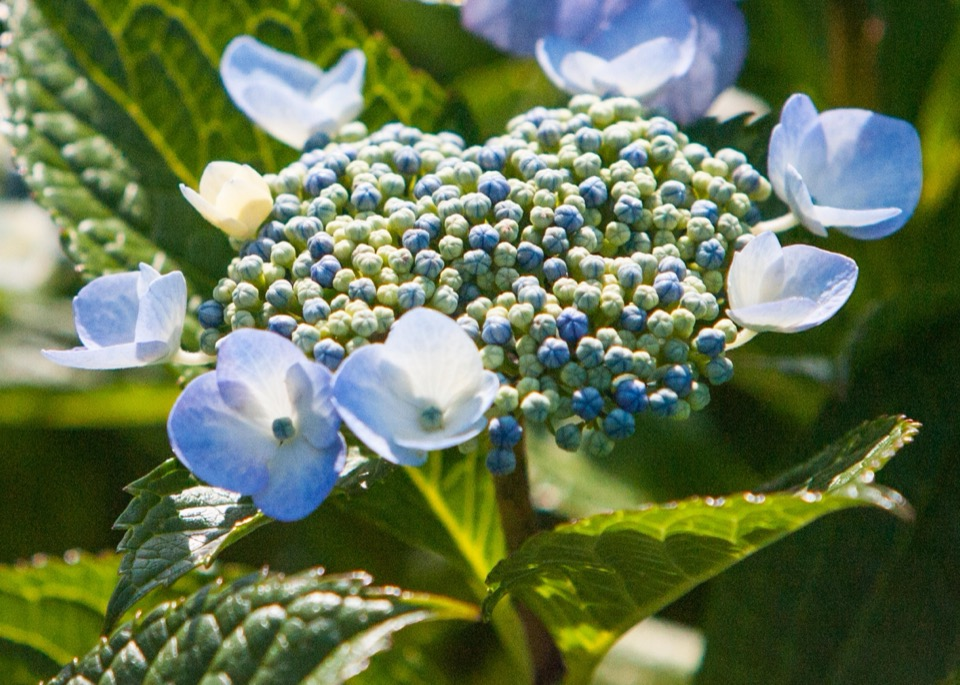
*꽃 | 꽃: 하양으로 피기 시작한 꽃들은 점차 파랑이 되고, 다시 빨강을 띄우면서 나중에는 자주가 됨 꽃 · 둥근꼴 모인꽃차례(취산화서) · 작은 꽃(중성화)들이 모여 커다란 공처럼 만들어 내는 꽃봉오리이고, 너비 8~22 cm*

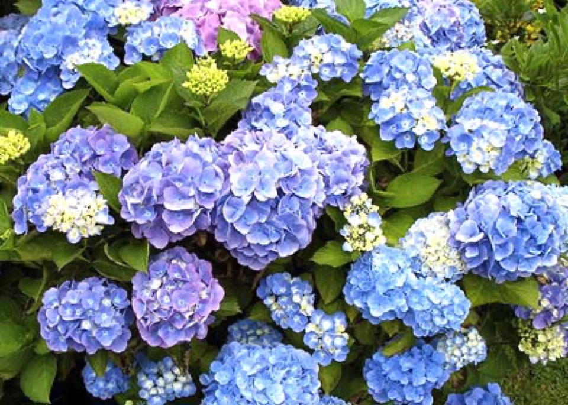
*수형 | 수형: 높이 1~2 m · 수피: 계피 색*

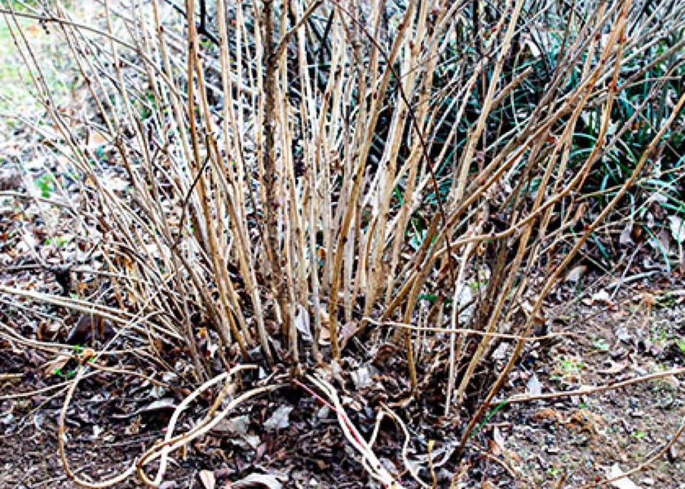
*줄기 | 줄기: 높이 1~2 m · 수피: 계피 색*

### 감별 핵심 포인트
- 큰 꽃무리가 둥근 공처럼 모여 핍니다.
- 잎은 넓고 끝이 뾰족하며 가장자리에 톱니가 있습니다.
- 꽃의 색보다 둥근 꽃무리와 넓은 잎을 기억하세요.

### 주된 형태 특징 (4대 감별 지표)
- **🌿 잎:** 마주나기 · 홑잎 · 가장자리: 삼각꼴의 날선 톱니가 있음 · 곁맥 4~7쌍
- **🌸 꽃:** 하양으로 피기 시작한 꽃들은 점차 파랑이 되고, 다시 빨강을 띄우면서 나중에는 자주가 됨 꽃 · 둥근꼴 모인꽃차례(취산화서) · 작은 꽃(중성화)들이 모여 커다란 공처럼 만들어 내는 꽃봉오리이고, 너비 8~22 cm
- **🍒 열매:** 튀는열매(삭과), 삭과
- **🪵 줄기·수형:** 높이 1~2 m · 수피: 계피 색

[파이팅혼공 TV 강의](https://www.youtube.com/watch?v=K3PvgTi3eXI&t=5550s) · [수목도감(treeworld)](https://treeworld.co.kr/a01_01_02/29239) · [위키백과(한국어)](https://ko.wikipedia.org/wiki/%EC%88%98%EA%B5%AD) · [Wikipedia(English)](https://en.wikipedia.org/wiki/Hydrangea_macrophylla)

## 072. 수수꽃다리
> *Syringa oblata subsp. dilatata (Nakai) P.S.Green & M.C.Chang* · Oleaceae 물푸레나무과

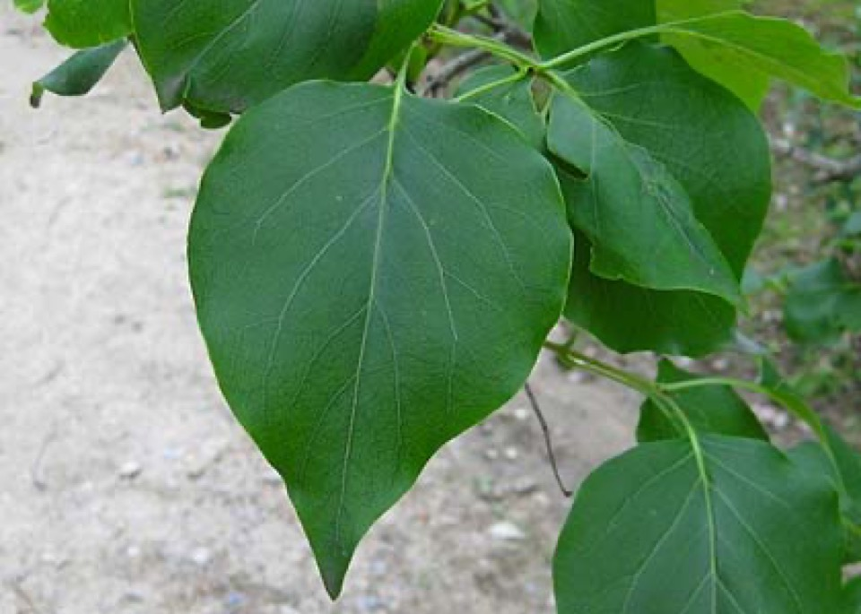
*잎 | 잎: 마주나기 · 잎몸은 넓은 달걀형 또는 달걀형으로 길이 4.5~12 cm, 너비 4~8.5 cm · 가장자리: 밋밋함*

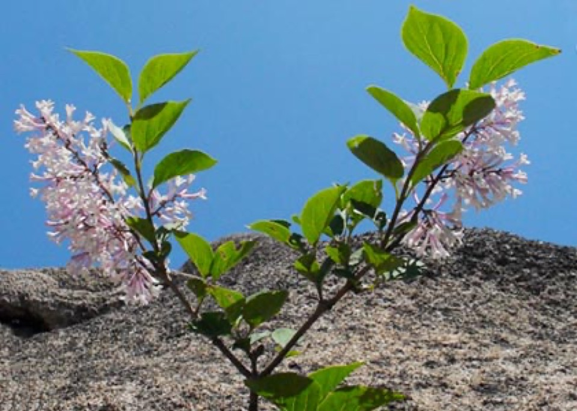
*꽃 | 꽃: 연한 자주 꽃 · 원뿔꽃차례 · 꽃대에 줄꼴(선상)의 돌기가 있고, 작은꽃자루는 길이 2 mm 이하*

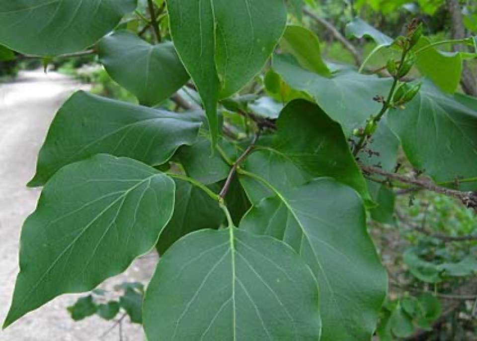
*수형 | 수형: 높이 2~4 m, 지름 5~8 cm · 수피: 회색*

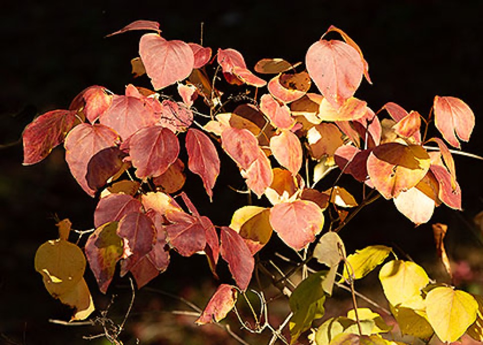
*기타1 | 기타1: 수수꽃다리의 고유 형태*

### 감별 핵심 포인트
- 연한 자주색의 작은 통꽃이 큰 무리로 모여 핍니다.
- 꽃부리 끝은 네 갈래로 벌어집니다.
- 잎은 넓고 하트나 삽을 닮은 모양입니다.

### 주된 형태 특징 (4대 감별 지표)
- **🌿 잎:** 마주나기 · 잎몸은 넓은 달걀형 또는 달걀형으로 길이 4.5~12 cm, 너비 4~8.5 cm · 가장자리: 밋밋함 · 깃꼴맥으로 곁맥은 3~5개
- **🌸 꽃:** 연한 자주 꽃 · 원뿔꽃차례 · 꽃대에 줄꼴(선상)의 돌기가 있고, 작은꽃자루는 길이 2 mm 이하
- **🍒 열매:**  열매 · 튀는열매(삭과)
- **🪵 줄기·수형:** 높이 2~4 m, 지름 5~8 cm · 수피: 회색

[파이팅혼공 TV 강의](https://www.youtube.com/watch?v=K3PvgTi3eXI&t=5570s) · [수목도감(treeworld)](https://treeworld.co.kr/a01_01_02/29235) · [위키백과(한국어)](https://ko.wikipedia.org/wiki/%EC%88%98%EC%88%98%EA%BD%83%EB%8B%A4%EB%A6%AC) · [Wikipedia(English)](https://en.wikipedia.org/wiki/Syringa_oblata_subsp._dilatata)

## 073. 쉬땅나무
> *Sorbaria sorbifolia var. stellipila Maxim.* · Rosaceae 장미과

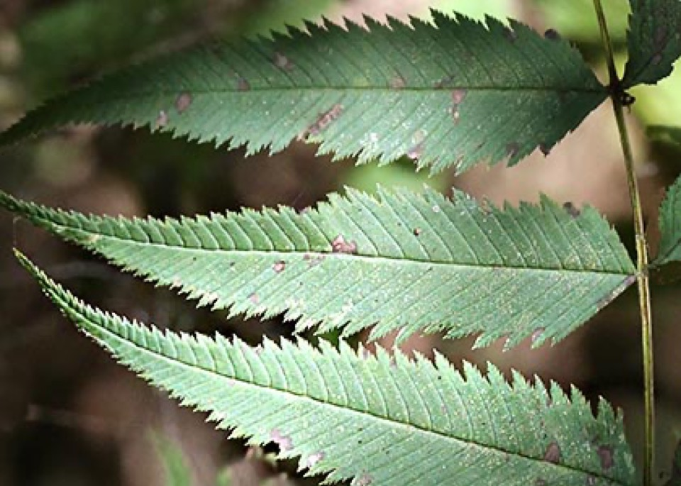
*잎 | 잎: 큰잎은 어긋나기 · 홀수 깃꼴 겹잎으로 길이 20~30 cm · 가장자리: 겹톱니가 있음*

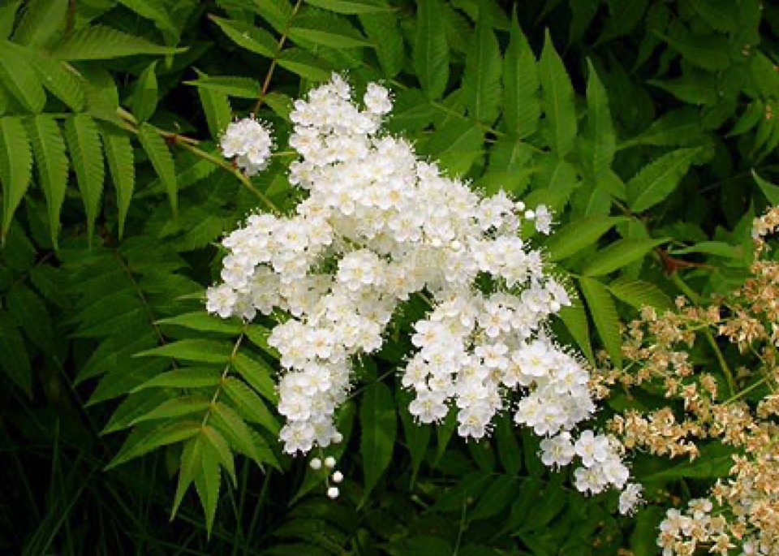
*꽃 | 꽃: 하양 꽃 · 겹총상꽃차례 · 꽃대는 길이 10~20 cm, 너비 5~12 cm 이고, 꽃대와 작은꽃자루는 많든 적든 얼마간 털이 있거나 별꼴털이 있음*

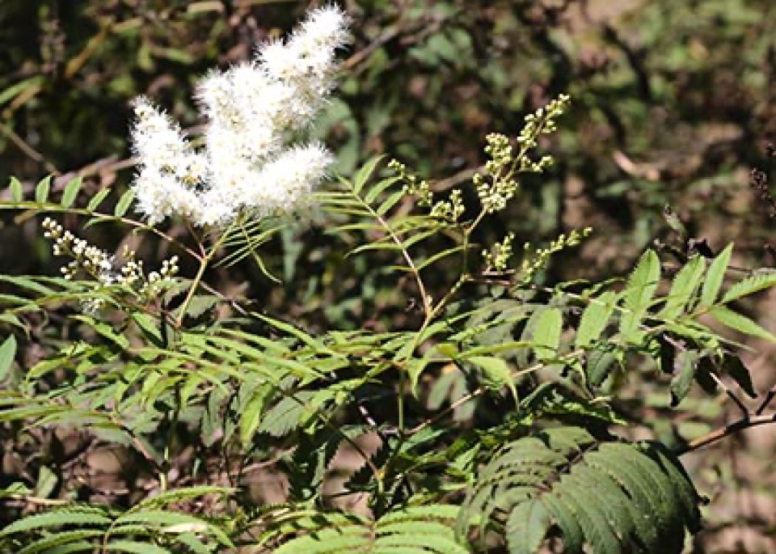
*수형 | 수형: 높이 2m 쯤으로 밑에서부터 자라는 여려개의 줄기가 한군데에서 모아남 · 수피: 회갈색, 검은 갈색*

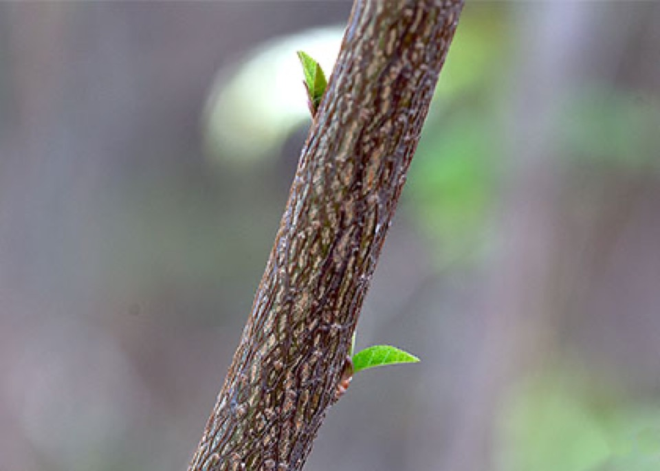
*줄기 | 줄기: 높이 2m 쯤으로 밑에서부터 자라는 여려개의 줄기가 한군데에서 모아남 · 수피: 회갈색, 검은 갈색*

### 감별 핵심 포인트
- 작은 흰 꽃이 솜털 같은 큰 꽃무리를 이룹니다.
- 수술이 길게 튀어나와 꽃무리가 복슬복슬해 보입니다.
- 길고 뾰족하며 톱니가 있는 작은 잎들이 양쪽으로 달립니다.

### 주된 형태 특징 (4대 감별 지표)
- **🌿 잎:** 큰잎은 어긋나기 · 홀수 깃꼴 겹잎으로 길이 20~30 cm · 가장자리: 겹톱니가 있음 · 깃꼴로 뚜렷하고, 곁맥은 12~16쌍
- **🌸 꽃:** 하양 꽃 · 겹총상꽃차례 · 꽃대는 길이 10~20 cm, 너비 5~12 cm 이고, 꽃대와 작은꽃자루는 많든 적든 얼마간 털이 있거나 별꼴털이 있음
- **🍒 열매:** 주황 열매 · 쪽꼬투리열매(대과, 골돌)
- **🪵 줄기·수형:** 높이 2m 쯤으로 밑에서부터 자라는 여려개의 줄기가 한군데에서 모아남 · 수피: 회갈색, 검은 갈색

**비교·주의:** 마가목과 잎이 비슷하지만 낮은 관목이며 꽃무리의 형태가 다릅니다.

[파이팅혼공 TV 강의](https://www.youtube.com/watch?v=K3PvgTi3eXI&t=5650s) · [수목도감(treeworld)](https://treeworld.co.kr/a01_01_02/29220) · [위키백과(한국어)](https://ko.wikipedia.org/wiki/%EC%89%AC%EB%95%85%EB%82%98%EB%AC%B4) · [Wikipedia(English)](https://en.wikipedia.org/wiki/Sorbaria_sorbifolia)

## 074. 스트로브잣나무
> *Pinus strobus L.* · Pinaceae 소나무과

*열매 | 열매: 씨방울은 갈색 열매 · 씨방울은 긴원통형으로 길이 8~20 cm, 지름 2~3 cm이고, 거의 끝에 달리고, 아래로 처지며, 흔히 구부러짐*

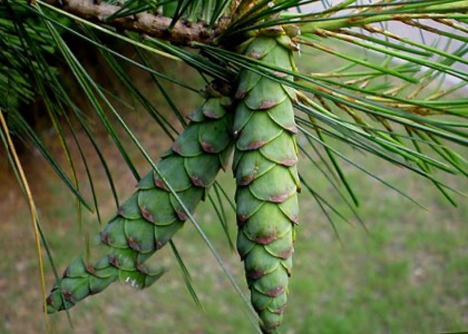
*수형 | 수형: 높이 25~50 m, 지름 1 m쯤으로 곧은 외줄기이지만 많은 오래된 나무는 두개 이상의 줄기를 보이기도 함 · 수피: 초록빛 갈색, 진한 회빛 갈색*

### 감별 핵심 포인트
- 바늘 모양 잎이 다섯 개씩 모여 납니다.
- 솔방울이 길쭉한 원통형으로 아래로 달립니다.
- 부드럽고 가는 침엽과 긴 솔방울의 조합을 기억하세요.

### 주된 형태 특징 (4대 감별 지표)
- **🌿 잎:** 한 묶음에 5개씩 모아나기 · 잎몸은 바늘형으로 길이 5~14 cm, 너비 0.7~1 mm이고, 가늘고, 늘어져있지 않고, 약간 꼬여있으며, 나긋나긋함 · 가장자리: 자잘한 잔톱니가 있음 · 앞면 안쪽에 2~3개의 흰 기공선이 있음
- **🌸 꽃:** 암꽃방울은 분홍, 연한 빨강, 회색빛 갈색(꽃가루받이가 이루어진 후에는 초록) 꽃 · 암꽃대는 가지 끝에 달리고, 수꽃대는 가지 중간에 달림 · 암수한그루(1가화)
- **🍒 열매:** 씨방울은 갈색 열매 · 씨방울은 긴원통형으로 길이 8~20 cm, 지름 2~3 cm이고, 거의 끝에 달리고, 아래로 처지며, 흔히 구부러짐
- **🪵 줄기·수형:** 높이 25~50 m, 지름 1 m쯤으로 곧은 외줄기이지만 많은 오래된 나무는 두개 이상의 줄기를 보이기도 함 · 수피: 초록빛 갈색, 진한 회빛 갈색

**비교·주의:** 잣나무와 함께 5엽이므로 솔방울 형태를 비교합니다.

[파이팅혼공 TV 강의](https://www.youtube.com/watch?v=K3PvgTi3eXI&t=5730s) · [수목도감(treeworld)](https://treeworld.co.kr/a01_01_02/29217) · [위키백과(한국어)](https://ko.wikipedia.org/wiki/%EC%8A%A4%ED%8A%B8%EB%A1%9C%EB%B8%8C%EC%9E%A3%EB%82%98%EB%AC%B4) · [Wikipedia(English)](https://en.wikipedia.org/wiki/Pinus_strobus)

## 075. 신갈나무
> *Quercus mongolica Fisch. ex Ledeb.* · Fagaceae 참나무과(너도밤나무과)

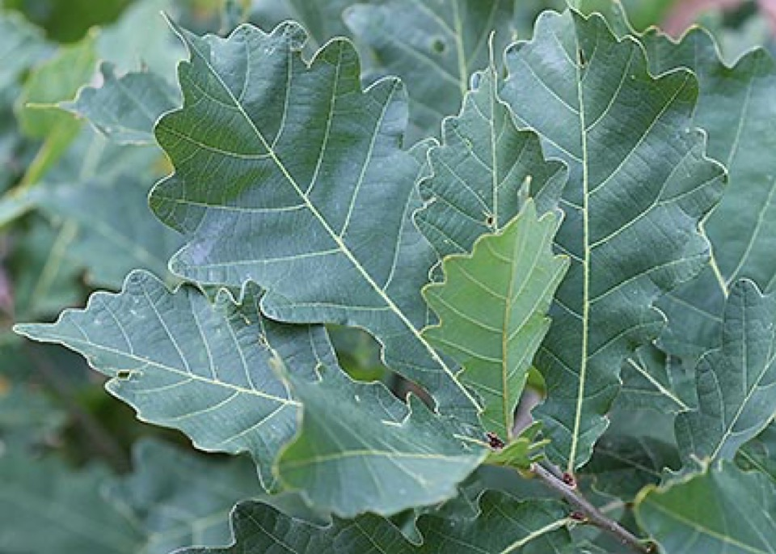
*잎 | 잎: 어긋나기 · 거꿀달걀형 또는 긴타원형 · 가장자리: 물결꼴로 양쪽에 (5)7~10개의 넓은 톱니가 있음*

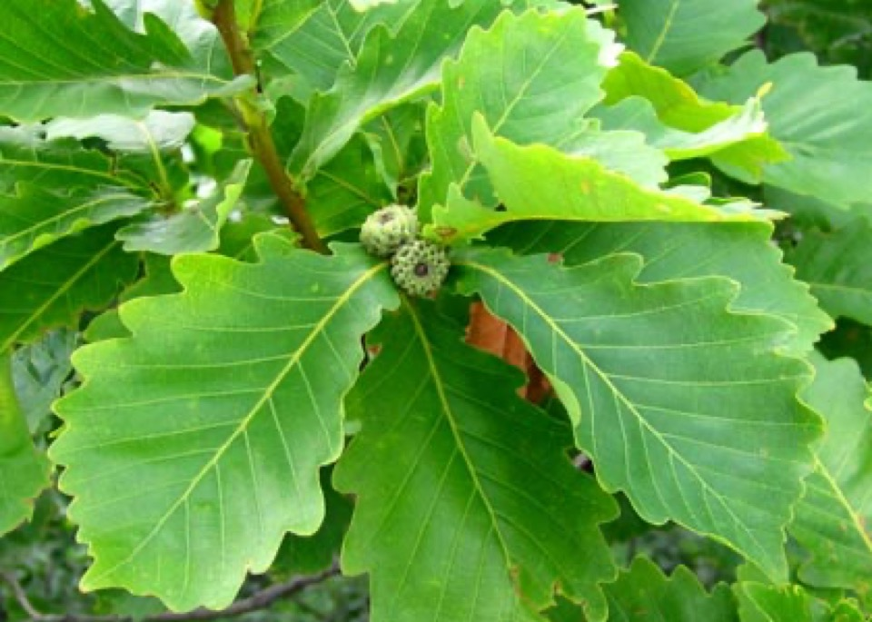
*꽃 | 꽃: 수꽃은 노란 초록 꽃 · 암꽃이삭은 새순 끝부분의 잎겨드랑이에 달림 · 암수한그루(일가화)*

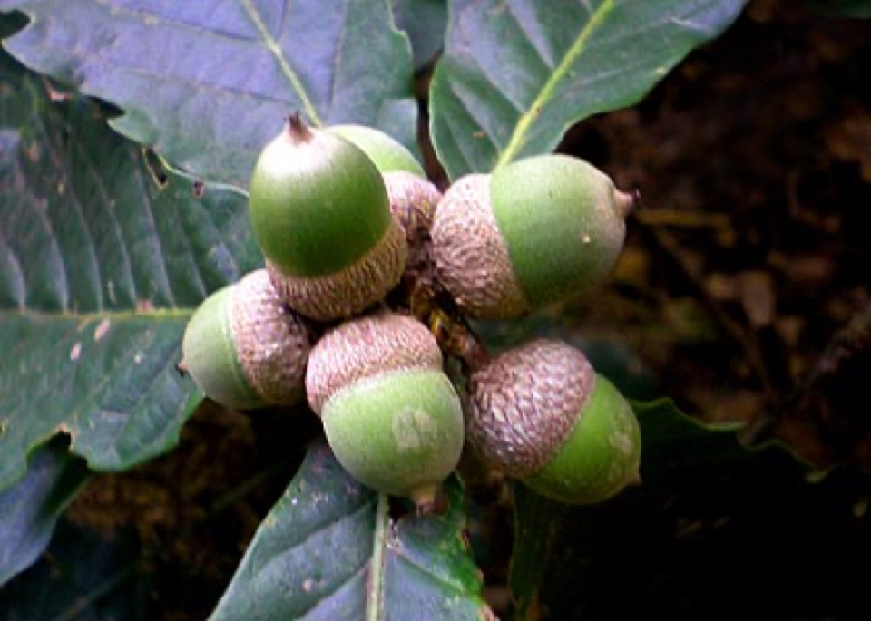
*열매 | 열매: 노란 갈색 열매 · 굳은껍질열매(견과, 도토리)*

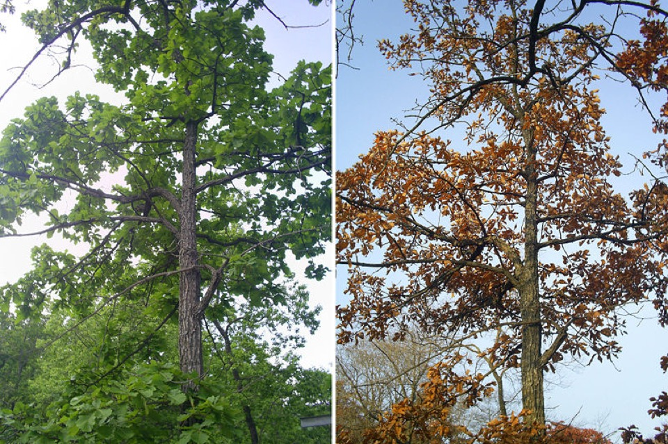
*수형 | 수형: 높이 20~30 m, 지름 1 m안팎 · 수피: 진한 회갈색*

### 감별 핵심 포인트
- 잎자루가 매우 짧고 잎 밑부분이 귀처럼 튀어나옵니다.
- 잎 가장자리에 큰 물결 모양 톱니가 있습니다.
- 도토리 모자 표면이 비교적 단정하게 보입니다.

### 주된 형태 특징 (4대 감별 지표)
- **🌿 잎:** 어긋나기 · 거꿀달걀형 또는 긴타원형 · 가장자리: 물결꼴로 양쪽에 (5)7~10개의 넓은 톱니가 있음 · 곁맥 (5)10~18개
- **🌸 꽃:** 수꽃은 노란 초록 꽃 · 암꽃이삭은 새순 끝부분의 잎겨드랑이에 달림 · 암수한그루(일가화)
- **🍒 열매:** 노란 갈색 열매 · 굳은껍질열매(견과, 도토리)
- **🪵 줄기·수형:** 높이 20~30 m, 지름 1 m안팎 · 수피: 진한 회갈색

**비교·주의:** 떡갈나무와 잎 밑부분·잎 끝, 도토리 모자의 거친 정도를 비교하세요.

[파이팅혼공 TV 강의](https://www.youtube.com/watch?v=K3PvgTi3eXI&t=5810s) · [수목도감(treeworld)](https://treeworld.co.kr/a01_01_02/29184) · [위키백과(한국어)](https://ko.wikipedia.org/wiki/%EC%8B%A0%EA%B0%88%EB%82%98%EB%AC%B4) · [Wikipedia(English)](https://en.wikipedia.org/wiki/Quercus_mongolica)

## 076. 신나무
> *Acer tataricum subsp. ginnala (Maxim.) Wesm.* · Sapindaceae 무환자나무과

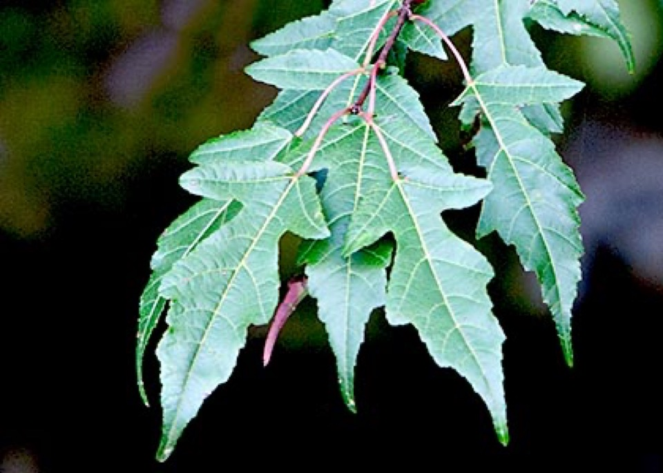
*잎 | 잎: 마주나기 · 홑잎 · 가장자리: 불규칙하게 깊게 패어들어가고, 겹톱니가 있음*

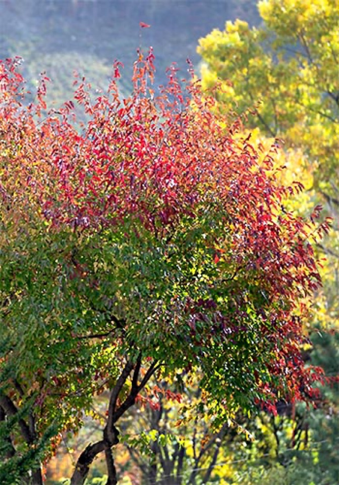
*수형 | 수형: 높이 8~10 m · 수피: 회빛 갈색, 회색*

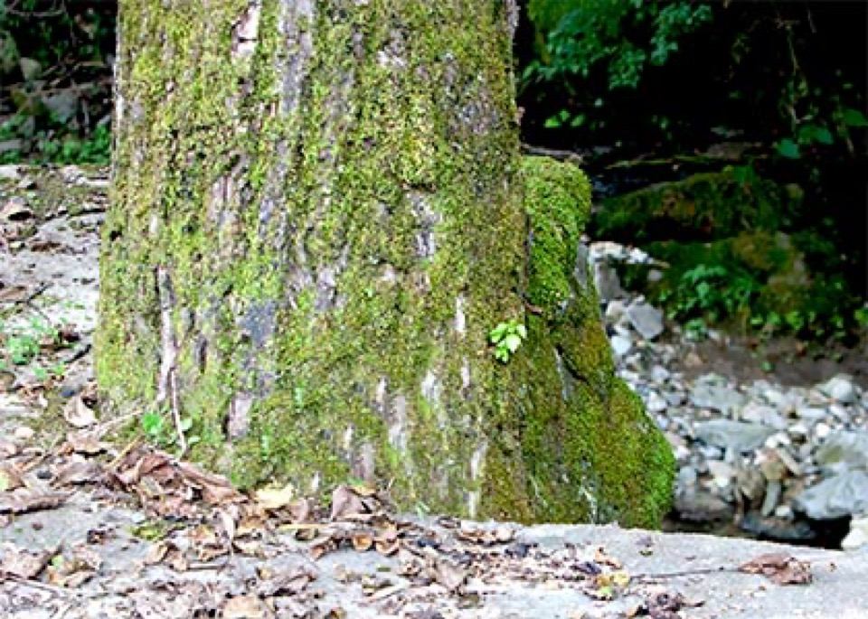
*줄기 | 줄기: 높이 8~10 m · 수피: 회빛 갈색, 회색*

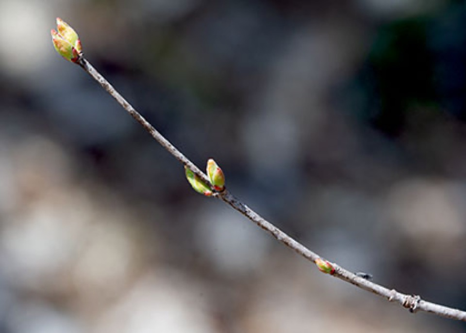
*새순 | 새순: 봄철 새로 돋아나는 잎과 가지*

### 감별 핵심 포인트
- 잎의 가운데 갈래가 길고 양옆에 작은 갈래가 있습니다.
- 잎 가장자리에 톱니가 있으며 로켓 같은 윤곽을 이룹니다.
- 두 날개가 달린 시과와 잎을 함께 확인하세요.

### 주된 형태 특징 (4대 감별 지표)
- **🌿 잎:** 마주나기 · 홑잎 · 가장자리: 불규칙하게 깊게 패어들어가고, 겹톱니가 있음 · 잎몸 밑에서 3출맥으로 이어진 그믈맥
- **🌸 꽃:** 꽃잎은 노란 하양 꽃 · 겹고른꽃차례(복산방꽃화서) · 암수한그루
- **🍒 열매:** 연한 노란갈색 열매 · 날개열매(시과)
- **🪵 줄기·수형:** 높이 8~10 m · 수피: 회빛 갈색, 회색

**비교·주의:** 중국단풍의 넓은 세 갈래 잎과 비교하세요.

[파이팅혼공 TV 강의](https://www.youtube.com/watch?v=K3PvgTi3eXI&t=5970s) · [수목도감(treeworld)](https://treeworld.co.kr/a01_01_02/29180) · [위키백과(한국어)](https://ko.wikipedia.org/wiki/%EC%8B%A0%EB%82%98%EB%AC%B4) · [Wikipedia(English)](https://en.wikipedia.org/wiki/Acer_tataricum_subsp._ginnala)

## 077. 아까시나무
> *Robinia pseudoacacia L.* · Leguminosae 콩과/ 콩아과

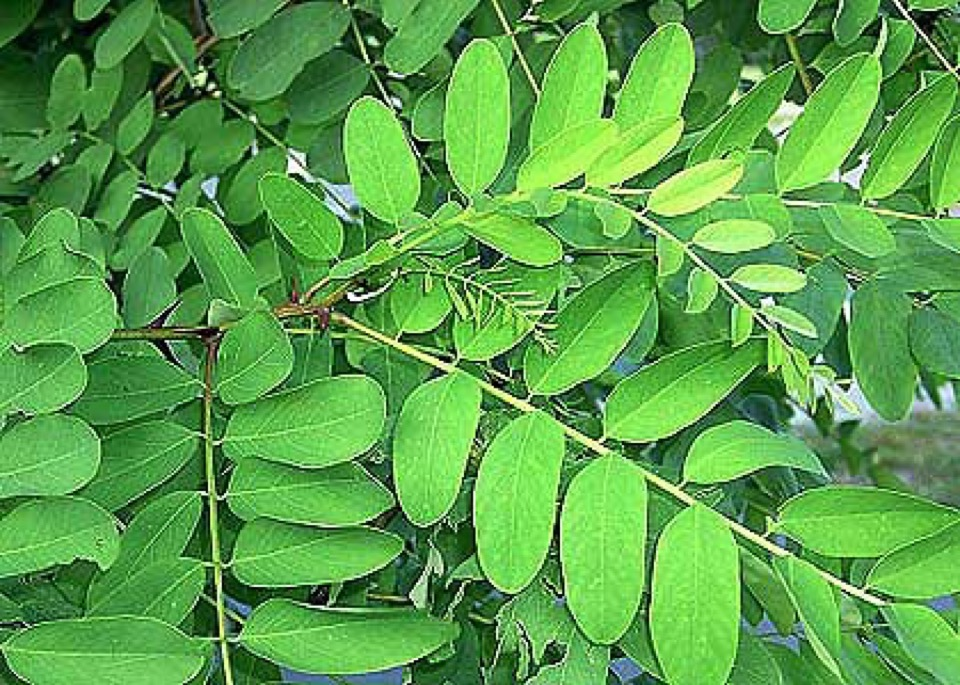
*잎 | 잎: 겹잎은 어긋나기 · 홀수 1회 깃꼴 겹잎으로 잎대는 길이 15~35cm · 가장자리: 밋밋함*

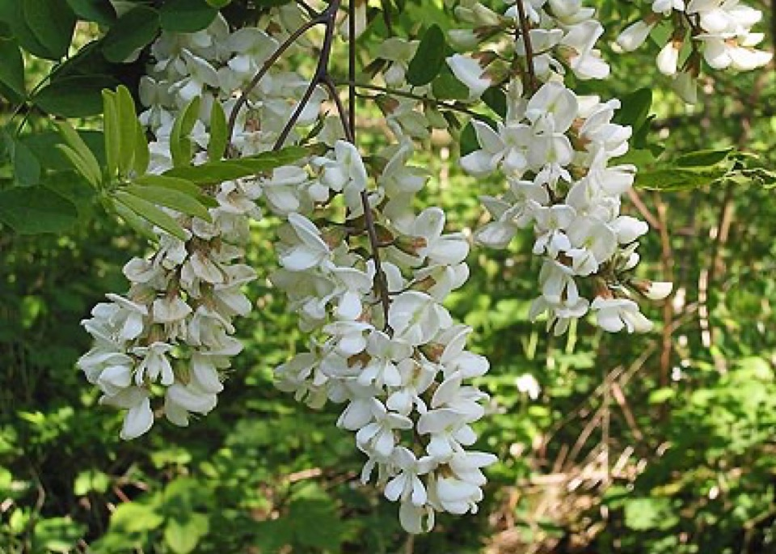
*꽃 | 꽃: 꽃잎은 하양 또는 연한 노란 하양으로 밑부분은 노랑 또는 연한 초록 꽃 · 총상꽃차례 · 꽃대의 길이는 10~20 cm*

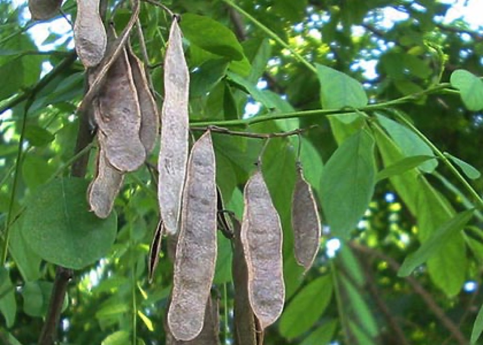
*열매 | 열매: 씨는 검은갈색 열매 · 꼬투리열매(협과)는 넓은 선형*

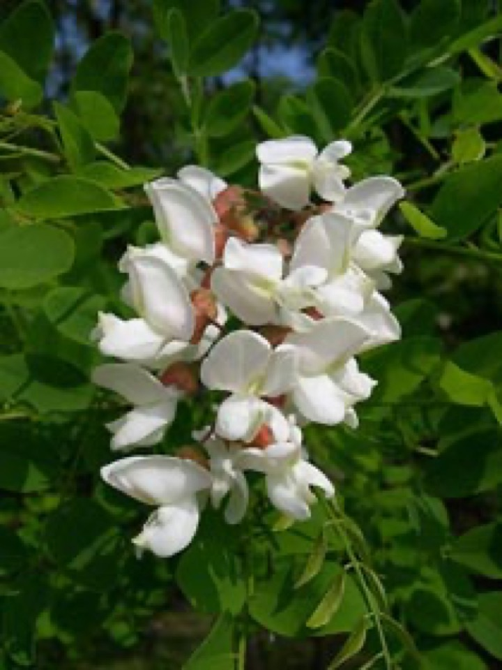
*수형 | 수형: 높이는 12~ 25 m · 수피: 노란갈색, 검은갈색*

### 감별 핵심 포인트
- 흰 나비 모양 꽃이 길게 늘어진 무리로 핍니다.
- 둥근 타원형 작은 잎들이 양쪽으로 나란히 달립니다.
- 콩깍지 모양 열매와 가지의 가시를 함께 봅니다.

### 주된 형태 특징 (4대 감별 지표)
- **🌿 잎:** 겹잎은 어긋나기 · 홀수 1회 깃꼴 겹잎으로 잎대는 길이 15~35cm · 가장자리: 밋밋함 · 깃꼴맥으로 흐릿하며, 곁맥은 5~7쌍
- **🌸 꽃:** 꽃잎은 하양 또는 연한 노란 하양으로 밑부분은 노랑 또는 연한 초록 꽃 · 총상꽃차례 · 꽃대의 길이는 10~20 cm
- **🍒 열매:** 씨는 검은갈색 열매 · 꼬투리열매(협과)는 넓은 선형
- **🪵 줄기·수형:** 높이는 12~ 25 m · 수피: 노란갈색, 검은갈색

**비교·주의:** 답안은 ‘아까시나무’로 연습합니다. 회화나무의 염주 모양 열매와 비교하세요.

[파이팅혼공 TV 강의](https://www.youtube.com/watch?v=K3PvgTi3eXI&t=6070s) · [수목도감(treeworld)](https://treeworld.co.kr/a01_01_02/29142) · [위키백과(한국어)](https://ko.wikipedia.org/wiki/%EC%95%84%EA%B9%8C%EC%8B%9C%EB%82%98%EB%AC%B4) · [Wikipedia(English)](https://en.wikipedia.org/wiki/Robinia_pseudoacacia)

## 078. 앵도나무
> *Prunus tomentosa Thunb.* · Rosaceae 장미과

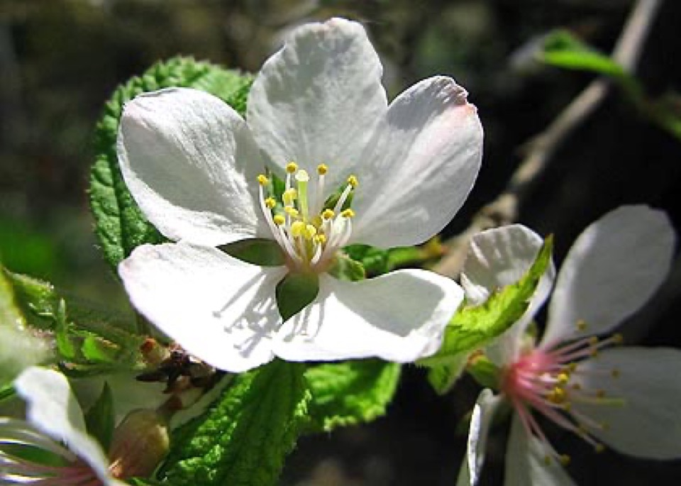
*꽃 | 꽃: 하양 또는 연한 분홍 꽃 · 1개 또는 2개씩 꽃싸개에 모여 달림 · 홑꽃*

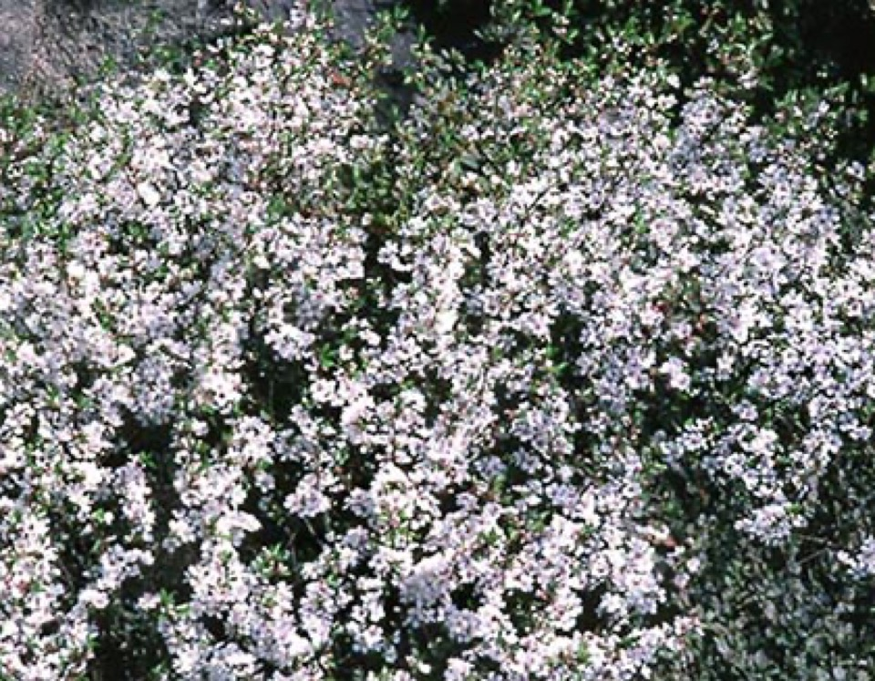
*수형 | 수형: 높이 2~3 m · 수피: 검은갈색*

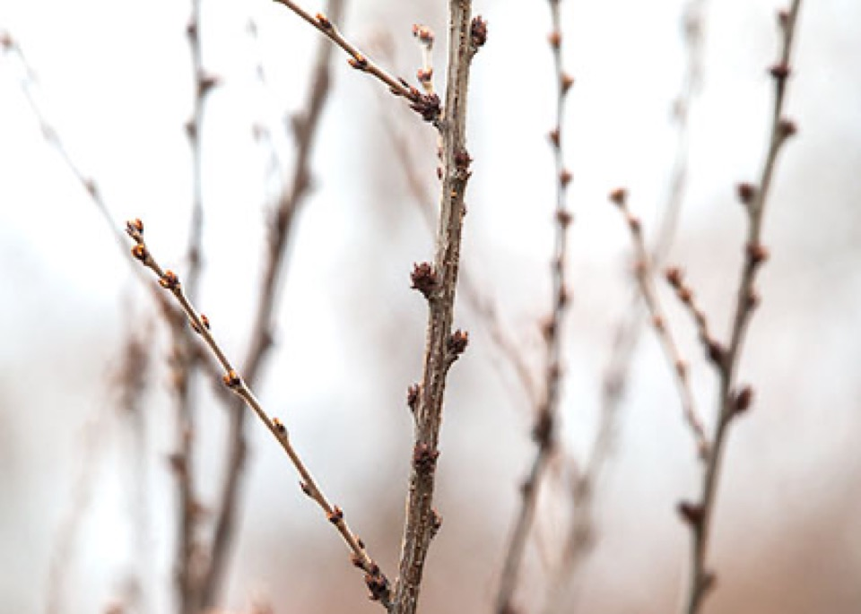
*겨울눈 | 겨울눈: 월동기 눈의 배열과 비늘잎 형태*

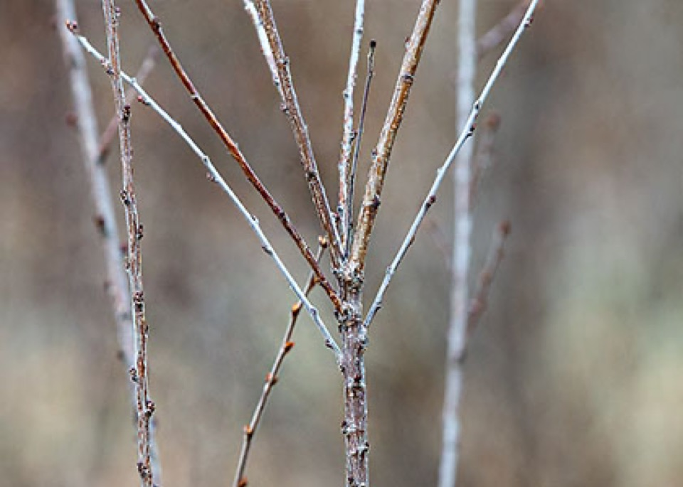
*가지 | 가지: 많이 갈라짐*

### 감별 핵심 포인트
- 흰색 또는 연분홍 꽃이 가지에 피는 작은 나무입니다.
- 잎은 끝 쪽이 넓고 잔톱니와 잔털이 보입니다.
- 작고 둥근 붉은 열매가 가지 가까이 달립니다.

### 주된 형태 특징 (4대 감별 지표)
- **🌿 잎:** 어긋나기 · 잎몸은 댤걀꼴 타원형, 거꿀달걀형, 타원형으로 길이 2~7 cm, 너비 1~3.5 cm · 가장자리: 불규칙하게 잔 톱니가 있음 · 곁맥은 4~7쌍으로로 맥이 깊어 잎에 주름이 많음
- **🌸 꽃:** 하양 또는 연한 분홍 꽃 · 1개 또는 2개씩 꽃싸개에 모여 달림 · 홑꽃
- **🍒 열매:** 빨강, 자줏빛 빨강 열매 · 굳은씨열매(핵과)
- **🪵 줄기·수형:** 높이 2~3 m · 수피: 검은갈색

**비교·주의:** 영상 표기는 ‘앵도나무’입니다. 앱에서는 ‘앵두나무’도 정답으로 인정합니다.

[파이팅혼공 TV 강의](https://www.youtube.com/watch?v=K3PvgTi3eXI&t=6170s) · [수목도감(treeworld)](https://treeworld.co.kr/a01_01_02/29127) · [위키백과(한국어)](https://ko.wikipedia.org/wiki/%EC%95%B5%EB%91%90%EB%82%98%EB%AC%B4) · [Wikipedia(English)](https://en.wikipedia.org/wiki/Prunus_tomentosa)

## 079. 오동나무
> *Paulownia tomentosa Steud.* · Scrophulariaceae 현삼과

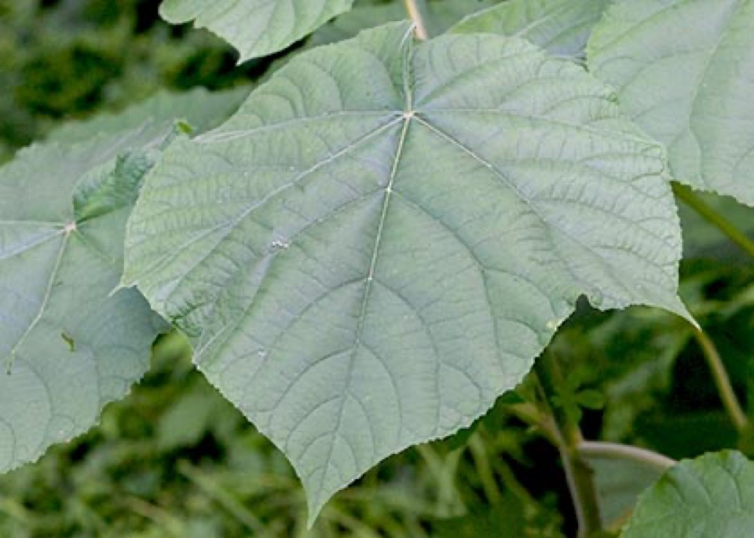
*잎 | 잎: 마주나기 · 홑잎 · 가장자리: 얕게 3~5개로 갈라지고, 톱니가 없으나 움가지에 달린 잎에는 톱니가 있음*

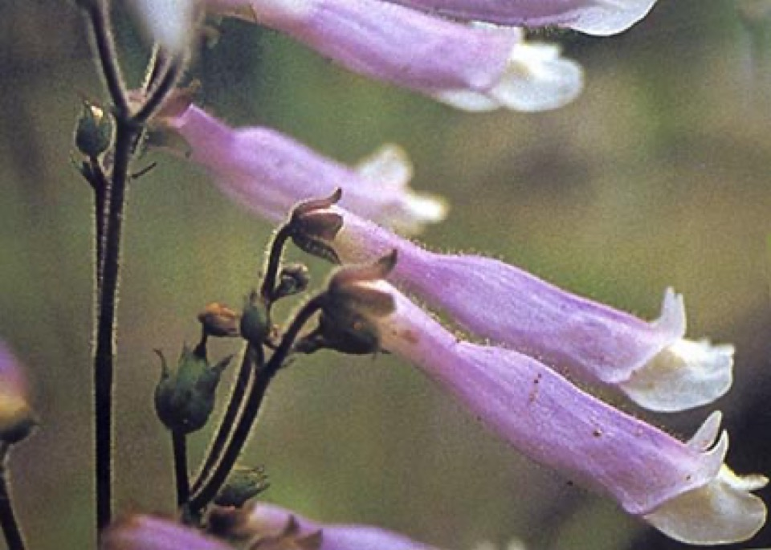
*꽃 | 꽃: 꽃부리는 연한 자주, 분홍빛 연보라이고 안쪽으로 자주빛 줄꼴 반점 무늬가 있는 것(참오동나무)이 있고, 없는 것(오동나무)이 있음 꽃 · 피라밋꼴의 취산 원뿔꽃차례로 가지 끝에 달림 · 통꽃*

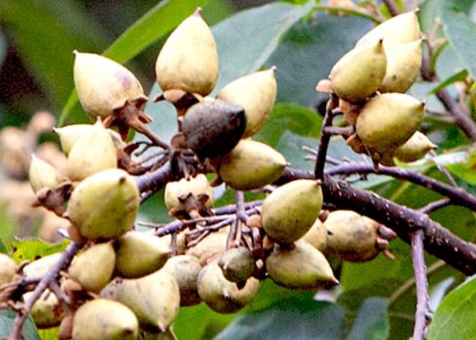
*열매 | 열매: 연한 갈색 열매 · 튀는열매 (삭과)*

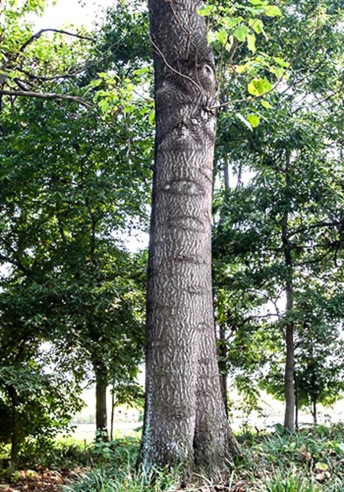
*수형 | 수형: 높이 8~15 m, 지름 80 cm 안팎 · 수피: 연한 갈색 또는 회빛 갈색*

### 감별 핵심 포인트
- 잎이 매우 크고 넓어 하트 모양에 가깝습니다.
- 보라색 통 모양 꽃이 큰 꽃차례로 모여 핍니다.
- 단단한 열매 껍질이 벌어지는 모습도 봅니다.

### 주된 형태 특징 (4대 감별 지표)
- **🌿 잎:** 마주나기 · 홑잎 · 가장자리: 얕게 3~5개로 갈라지고, 톱니가 없으나 움가지에 달린 잎에는 톱니가 있음 · 손바달꼴 그믈맥
- **🌸 꽃:** 꽃부리는 연한 자주, 분홍빛 연보라이고 안쪽으로 자주빛 줄꼴 반점 무늬가 있는 것(참오동나무)이 있고, 없는 것(오동나무)이 있음 꽃 · 피라밋꼴의 취산 원뿔꽃차례로 가지 끝에 달림 · 통꽃
- **🍒 열매:** 연한 갈색 열매 · 튀는열매 (삭과)
- **🪵 줄기·수형:** 높이 8~15 m, 지름 80 cm 안팎 · 수피: 연한 갈색 또는 회빛 갈색

**비교·주의:** 개오동의 흰 꽃과 길고 가는 열매, 벽오동의 녹색 줄기와 비교하세요.

[파이팅혼공 TV 강의](https://www.youtube.com/watch?v=K3PvgTi3eXI&t=6270s) · [수목도감(treeworld)](https://treeworld.co.kr/a01_01_02/29063) · [위키백과(한국어)](https://ko.wikipedia.org/wiki/%EC%98%A4%EB%8F%99%EB%82%98%EB%AC%B4) · [Wikipedia(English)](https://en.wikipedia.org/wiki/Paulownia_coreana)

## 080. 왕벚나무
> *Prunus yedoensis Matsum.* · Rosaceae 장미과/ 앵두나무아과

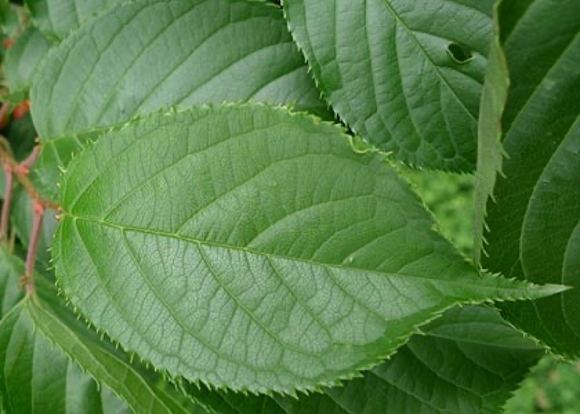
*잎 | 잎: 어긋나기 · 홑잎 · 가장자리: 날카로운 겹톱니가 있음*

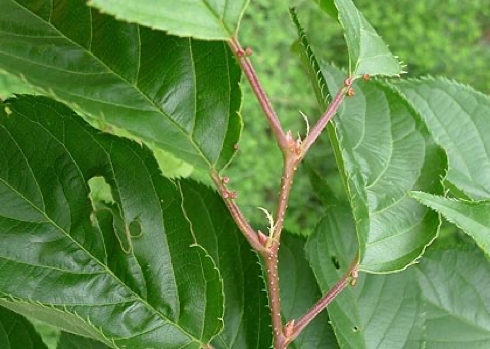
*수형 | 수형: 높이 4~15 m, 지름 50 cm쯤으로 넓게 곧추서고 껍질은 매끄러움 · 수피: 회갈색 또는 어두운 회색*

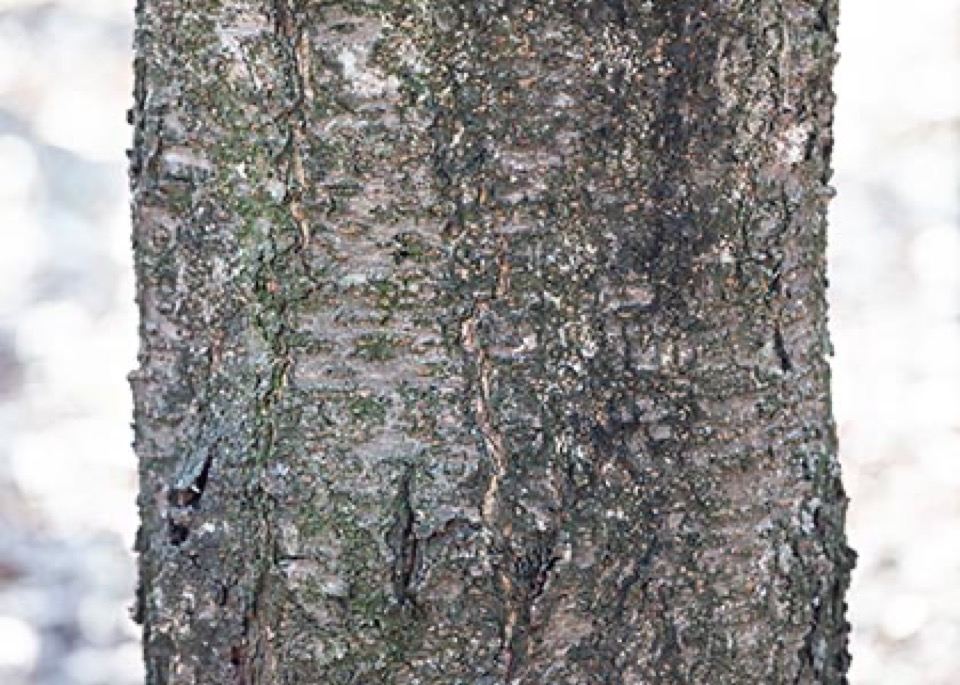
*줄기 | 줄기: 높이 4~15 m, 지름 50 cm쯤으로 넓게 곧추서고 껍질은 매끄러움 · 수피: 회갈색 또는 어두운 회색*

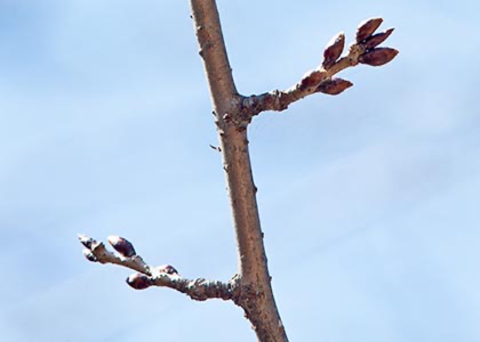
*겨울눈 | 겨울눈: 월동기 눈의 배열과 비늘잎 형태*

### 감별 핵심 포인트
- 흰색·연분홍 꽃이 가지를 풍성하게 덮습니다.
- 잎이 본격적으로 나오기 전 꽃이 크게 모여 핀 모습을 봅니다.
- 꽃잎 끝의 홈과 잎 가장자리의 잔톱니를 확인하세요.

### 주된 형태 특징 (4대 감별 지표)
- **🌿 잎:** 어긋나기 · 홑잎 · 가장자리: 날카로운 겹톱니가 있음 · 곁맥은 7~10쌍
- **🌸 꽃:** 겨울눈 속의 봉우리는 진한 빨강, 분홍이지만 꽃이 처음엔 연한 빨강, 활짝 피면 하양에 가까움 꽃 · 짧은 산형꽃차례( 가끔 산방꽃차례)로 잎보다 꽃이 먼저 핌 · 꽃대에 3(5)~(5)6개 달림
- **🍒 열매:** 검정, 검은 자주 열매 · 굳은씨열매(핵과)
- **🪵 줄기·수형:** 높이 4~15 m, 지름 50 cm쯤으로 넓게 곧추서고 껍질은 매끄러움 · 수피: 회갈색 또는 어두운 회색

**비교·주의:** 산벚나무와는 꽃의 크기만으로 단정하지 말고 잎·꽃자루도 함께 봅니다.

[파이팅혼공 TV 강의](https://www.youtube.com/watch?v=K3PvgTi3eXI&t=6350s) · [수목도감(treeworld)](https://treeworld.co.kr/a01_01_02/29044) · [위키백과(한국어)](https://ko.wikipedia.org/wiki/%EC%99%95%EB%B2%9A%EB%82%98%EB%AC%B4) · [Wikipedia(English)](https://en.wikipedia.org/wiki/Prunus_%C3%97_yedoensis)

## 081. 은행나무
> *Ginkgo biloba L.* · Ginkgoaceae 은행나무과

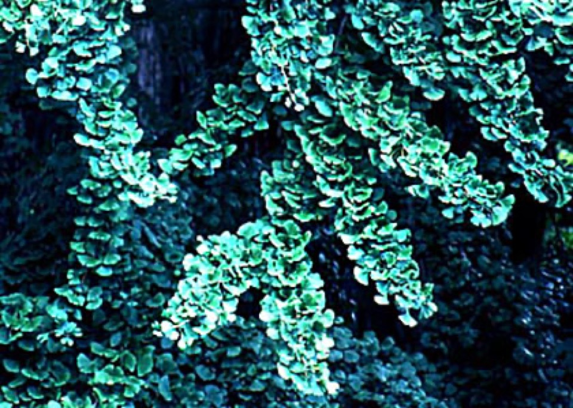
*잎 | 잎: 어긋나기(긴 가지) · 홑잎 · 가장자리: 긴가지의 잎은 깊게 갈라지고, 긴 햇가지의 것( 재생 가지 또는 줄기)은 끝단의 가운데에서 밑으로 더 깊게 갈라진 2개의 갈래잎을 갖임*

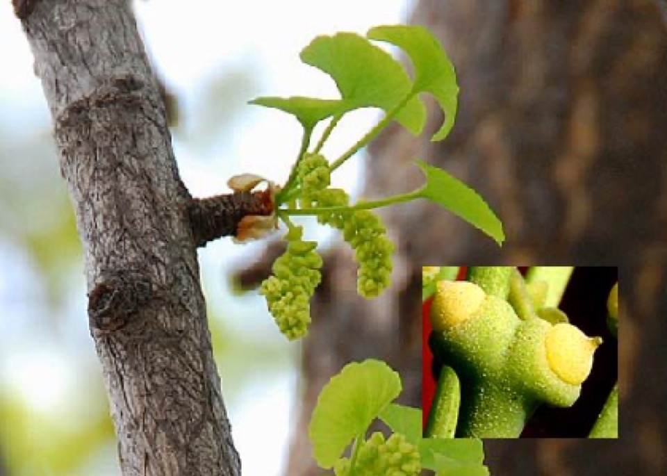
*꽃 | 꽃: 암컷방울은 연한 초록 꽃 · 암컷배우체 이삭은 잎자루와 함께 1~7개가 그 중앙에 모여 남 · 암수딴그루(자웅이주, 2가화)*

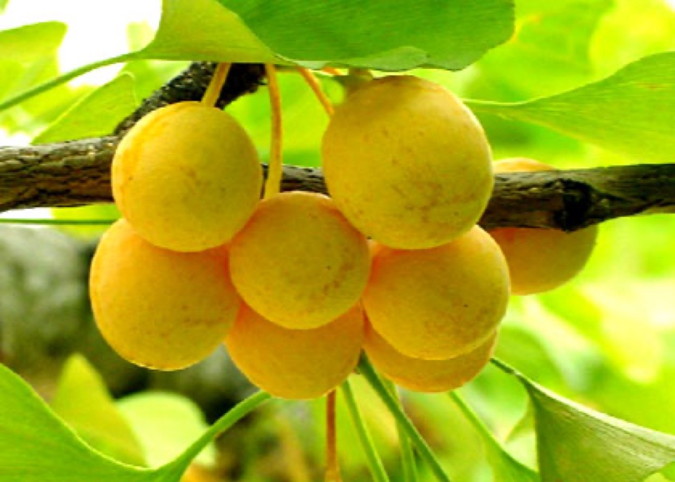
*열매 | 열매: 육질 겉껍질(다육외층)은 노랑, 노란 갈색 열매 · 좁은 거꿀달걀형, 달걀형, 달걀꼴 둥근형 또는 거의 둥근형으로 길이 2.~3.5 cm, 너비 1.6~2.2 cm*

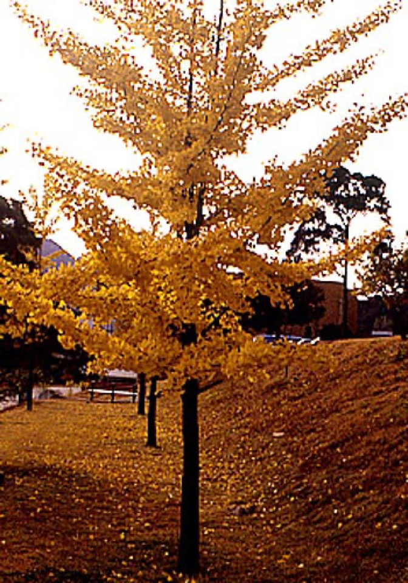
*수형 | 수형: 높이 30~40 m, 지름 1~4 m · 수피: 연한 회색, 회빛 갈색, 회빛 하양*

### 감별 핵심 포인트
- 부채 모양 잎과 평행하게 갈라지는 잎맥이 특징입니다.
- 가을에 잎이 노랗게 물듭니다.
- 둥근 씨가 달린 모습도 함께 기억하세요.

### 주된 형태 특징 (4대 감별 지표)
- **🌿 잎:** 어긋나기(긴 가지) · 홑잎 · 가장자리: 긴가지의 잎은 깊게 갈라지고, 긴 햇가지의 것( 재생 가지 또는 줄기)은 끝단의 가운데에서 밑으로 더 깊게 갈라진 2개의 갈래잎을 갖임 · 두갈래꼴맥(叉狀脈;차상맥)
- **🌸 꽃:** 암컷방울은 연한 초록 꽃 · 암컷배우체 이삭은 잎자루와 함께 1~7개가 그 중앙에 모여 남 · 암수딴그루(자웅이주, 2가화)
- **🍒 열매:** 육질 겉껍질(다육외층)은 노랑, 노란 갈색 열매 · 좁은 거꿀달걀형, 달걀형, 달걀꼴 둥근형 또는 거의 둥근형으로 길이 2.~3.5 cm, 너비 1.6~2.2 cm
- **🪵 줄기·수형:** 높이 30~40 m, 지름 1~4 m · 수피: 연한 회색, 회빛 갈색, 회빛 하양

[파이팅혼공 TV 강의](https://www.youtube.com/watch?v=K3PvgTi3eXI&t=6450s) · [수목도감(treeworld)](https://treeworld.co.kr/a01_01_02/28932) · [위키백과(한국어)](https://ko.wikipedia.org/wiki/%EC%9D%80%ED%96%89%EB%82%98%EB%AC%B4) · [Wikipedia(English)](https://en.wikipedia.org/wiki/Ginkgo_biloba)

## 082. 이팝나무
> *Chionanthus retusus Lindl.& Paxton* · Oleaceae 물푸레나무과

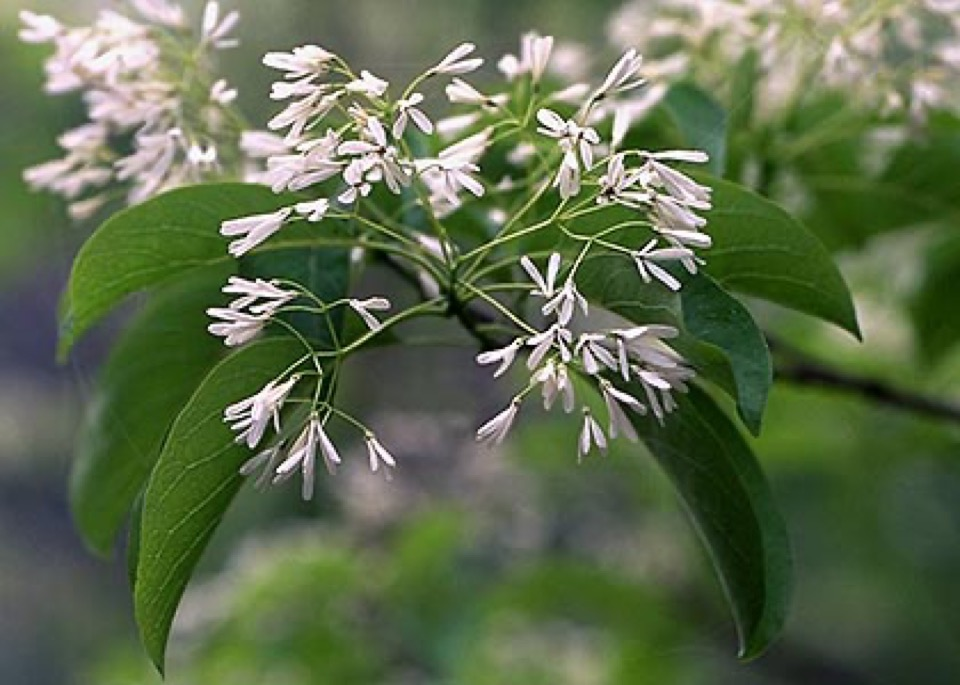
*꽃 | 꽃: 하양 꽃 · 고깔꽃차례(원추화서) · 암수딴그루(이가화)이지만 암꽃과 수꽃을 모두 가진 암수한그루가 때때로 있음*

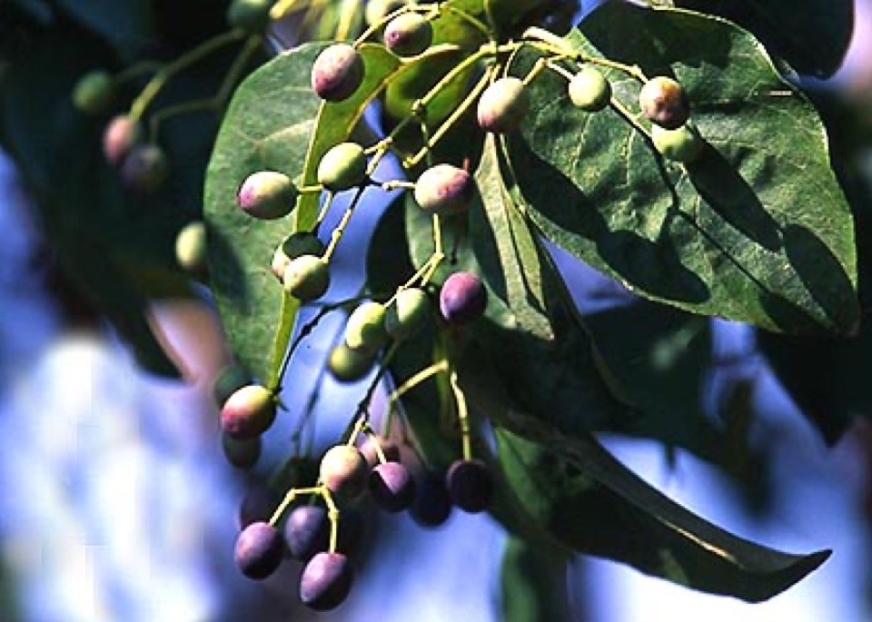
*열매 | 열매: 진한 검정, 보라빛 검정 열매 · 살찐 굳은씨열매(핵과)*

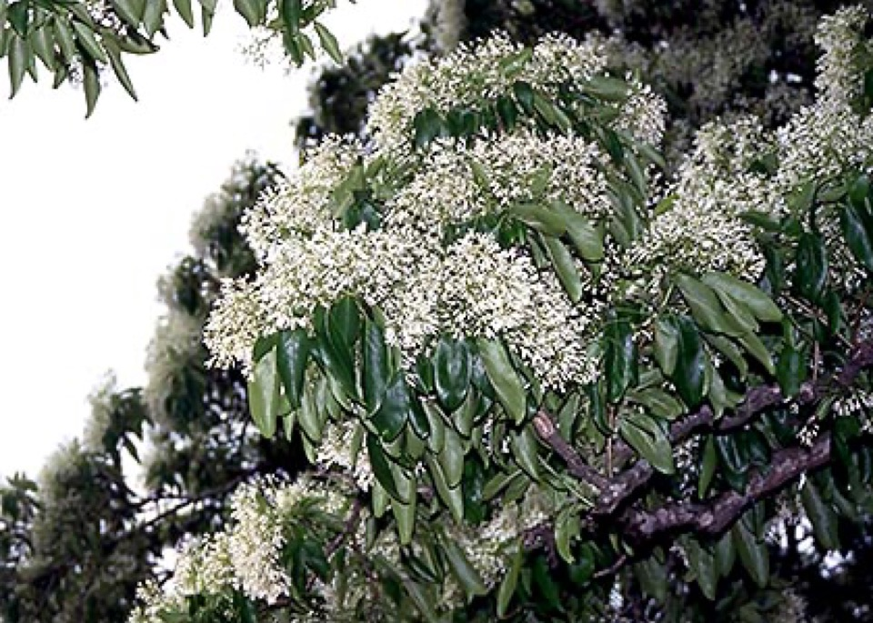
*수형 | 수형: 높이 8~20 m · 수피: 회갈색, 어두운 회갈색*

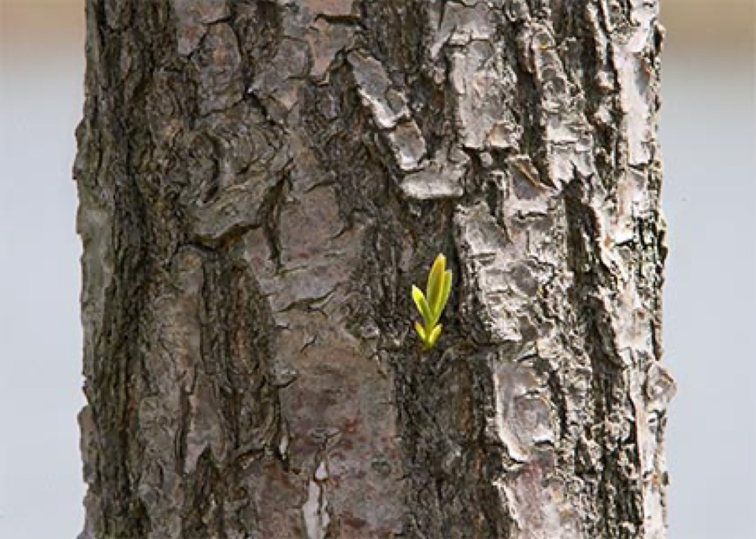
*줄기 | 줄기: 높이 8~20 m · 수피: 회갈색, 어두운 회갈색*

### 감별 핵심 포인트
- 가늘고 긴 흰 꽃잎이 쌀밥처럼 가지를 덮습니다.
- 꽃은 네 갈래가 길게 벌어진 모습입니다.
- 넓은 잎과 흰 꽃무리를 함께 확인하세요.

### 주된 형태 특징 (4대 감별 지표)
- **🌿 잎:** 마주나기(대생) 또는 거의 마주나기(아대생) · 홑잎 · 가장자리: 밋밋하지만 어린 나무의 경우 자잘한 겹톱니가 있음 · 곁맥은 5~8쌍
- **🌸 꽃:** 하양 꽃 · 고깔꽃차례(원추화서) · 암수딴그루(이가화)이지만 암꽃과 수꽃을 모두 가진 암수한그루가 때때로 있음
- **🍒 열매:** 진한 검정, 보라빛 검정 열매 · 살찐 굳은씨열매(핵과)
- **🪵 줄기·수형:** 높이 8~20 m · 수피: 회갈색, 어두운 회갈색

**비교·주의:** 수술이 길게 드러나는 다른 흰 꽃 무리와 구별합니다.

[파이팅혼공 TV 강의](https://www.youtube.com/watch?v=K3PvgTi3eXI&t=6470s) · [수목도감(treeworld)](https://treeworld.co.kr/a01_01_02/28889) · [위키백과(한국어)](https://ko.wikipedia.org/wiki/%EC%9D%B4%ED%8C%9D%EB%82%98%EB%AC%B4) · [Wikipedia(English)](https://en.wikipedia.org/wiki/Chionanthus_retusus)

## 083. 인동덩굴
> *Lonicera japonica Thunb.* · Caprifoliaceae 인동과

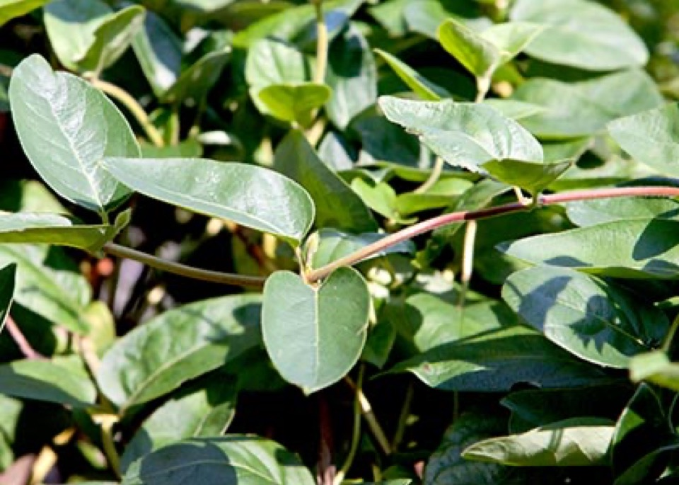
*잎 | 잎: 마주나기 · 잎몸은 달걀형 또는 타원형으로 길이 2.5~8 cm, 너비 0.7~3 cm · 가장자리: 밋밋함*

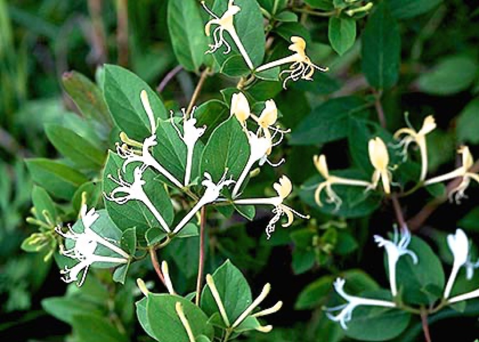
*꽃 | 꽃: 하양으로 피어 분홍으로 바뀌고, 나중에는 노랑 꽃 · 1~2개씩 잎겨드랑이에 달림 · 긴 대롱꼴 통꽃으로 꽃부리는 길이 2.5~3.5 cm이고, 겉에 잔털과 샘털이 있으며, 통 안에 겹털이 있음*

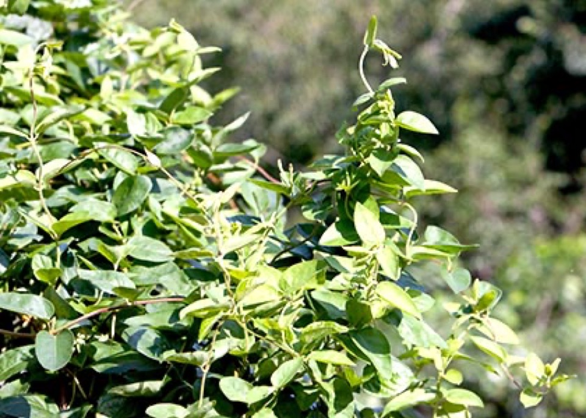
*수형 | 수형: 높이 3~4(6) m이고, 껍질은 세로로 얕게 갈라지고, 벗겨짐 · 수피: 노란갈색*

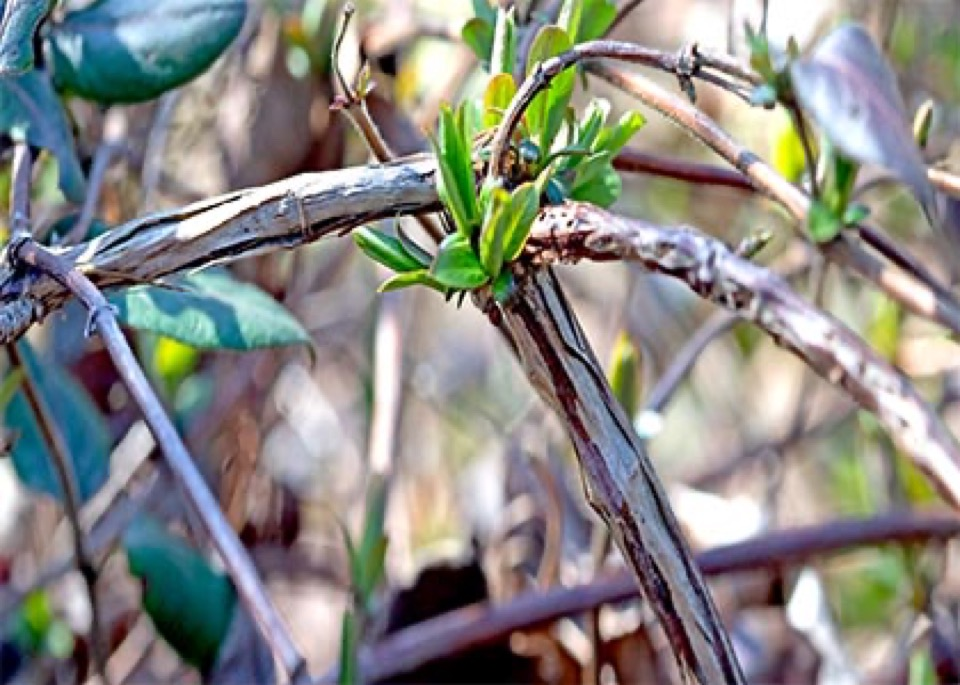
*줄기 | 줄기: 높이 3~4(6) m이고, 껍질은 세로로 얕게 갈라지고, 벗겨짐 · 수피: 노란갈색*

### 감별 핵심 포인트
- 덩굴성으로 자라며 길고 가는 통꽃이 핍니다.
- 꽃 끝이 벌어지고 한 갈래가 뒤로 젖혀집니다.
- 흰색에서 노란색으로 변하는 꽃과 검은 열매를 봅니다.

### 주된 형태 특징 (4대 감별 지표)
- **🌿 잎:** 마주나기 · 잎몸은 달걀형 또는 타원형으로 길이 2.5~8 cm, 너비 0.7~3 cm · 가장자리: 밋밋함 · 곁맥 4~6쌍
- **🌸 꽃:** 하양으로 피어 분홍으로 바뀌고, 나중에는 노랑 꽃 · 1~2개씩 잎겨드랑이에 달림 · 긴 대롱꼴 통꽃으로 꽃부리는 길이 2.5~3.5 cm이고, 겉에 잔털과 샘털이 있으며, 통 안에 겹털이 있음
- **🍒 열매:** 검정 열매 · 둥근 구슬형으로 지름 7~8 mm
- **🪵 줄기·수형:** 높이 3~4(6) m이고, 껍질은 세로로 얕게 갈라지고, 벗겨짐 · 수피: 노란갈색

[파이팅혼공 TV 강의](https://www.youtube.com/watch?v=K3PvgTi3eXI&t=6530s) · [수목도감(treeworld)](https://treeworld.co.kr/a01_01_02/28876) · [위키백과(한국어)](https://ko.wikipedia.org/wiki/%EC%9D%B8%EB%8F%99%EB%8D%A9%EA%B5%B4) · [Wikipedia(English)](https://en.wikipedia.org/wiki/Lonicera_japonica)

## 084. 일본목련
> *Magnolia obovata Thunb.* · Magnoliaceae 목련과

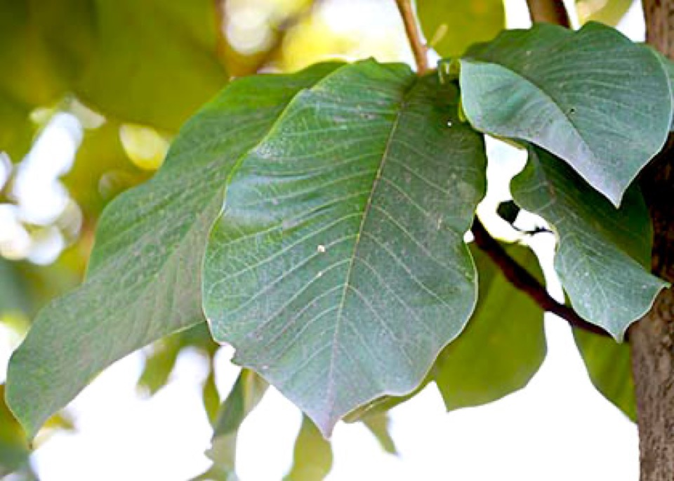
*잎 | 잎: 어긋나기 또는 새순 끝에 5~8개씩 돌림꼴 모아나기) · 홑잎 · 가장자리: 밋밋함(전연)*

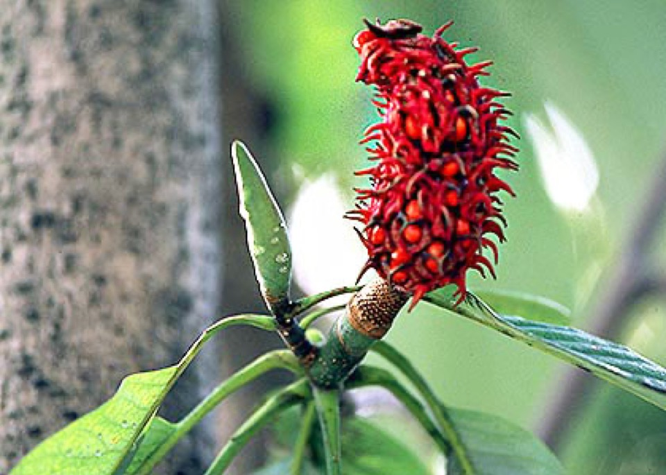
*열매 | 열매: 열매는 밝은 분홍빛 빨강 열매 · 쪽꼬투리열매(골돌, 대과)*

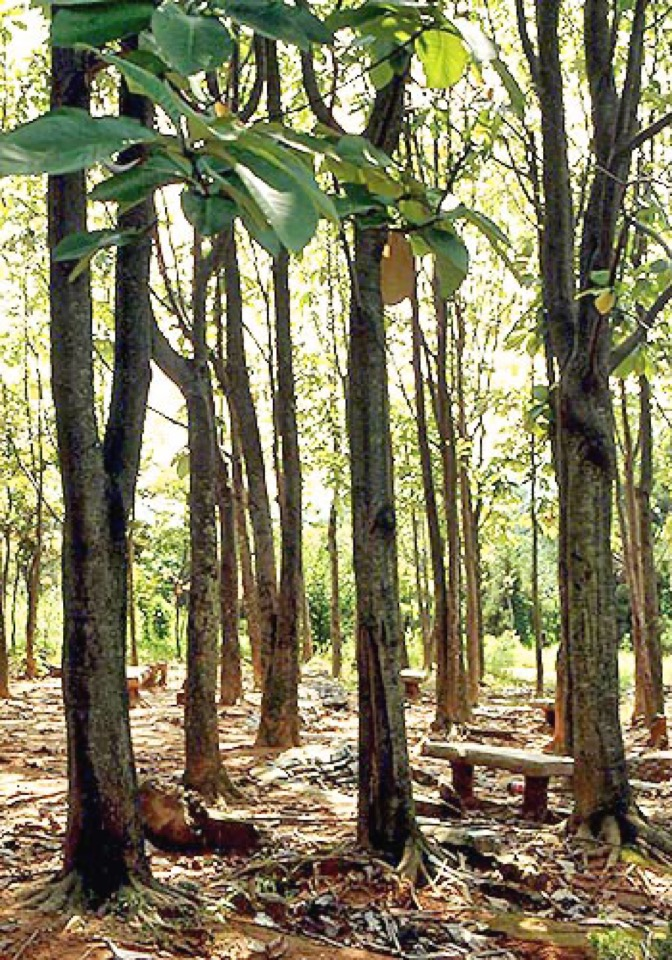
*수형 | 수형: 높이 15~30 m, 지름 1 m 안팎 (원산지) · 수피: 회백색, 진한 푸른빛 회색*

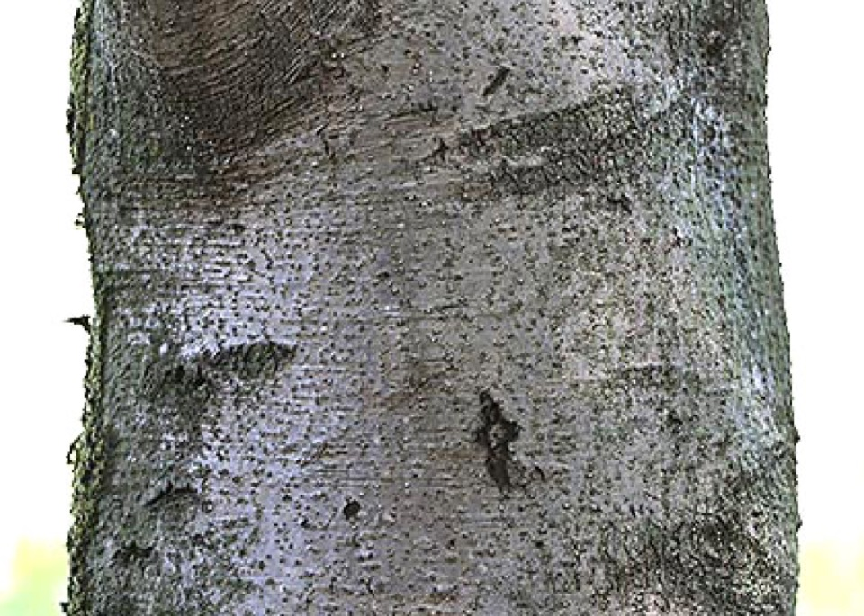
*줄기 | 줄기: 높이 15~30 m, 지름 1 m 안팎 (원산지) · 수피: 회백색, 진한 푸른빛 회색*

### 감별 핵심 포인트
- 큰 잎이 가지 끝에 모여 달립니다.
- 잎이 나온 뒤 가지 끝에 큰 흰 꽃이 핍니다.
- 길쭉하고 울퉁불퉁한 열매가 특징입니다.

### 주된 형태 특징 (4대 감별 지표)
- **🌿 잎:** 어긋나기 또는 새순 끝에 5~8개씩 돌림꼴 모아나기) · 홑잎 · 가장자리: 밋밋함(전연) · 깃꼴맥으로 잎의 아래쪽은 튀어나오고, 곁맥은 17~24쌍으로 잎가장자리에 이르지 못하고 서로 이어짐
- **🌸 꽃:** 꽃잎은 연한 노란하양(크림색) 꽃 · 단정꽃차례 · 큰꽃
- **🍒 열매:** 열매는 밝은 분홍빛 빨강 열매 · 쪽꼬투리열매(골돌, 대과)
- **🪵 줄기·수형:** 높이 15~30 m, 지름 1 m 안팎 (원산지) · 수피: 회백색, 진한 푸른빛 회색

**비교·주의:** 잎보다 꽃이 먼저 피는 백목련과 구별하세요.

[파이팅혼공 TV 강의](https://www.youtube.com/watch?v=K3PvgTi3eXI&t=6610s) · [수목도감(treeworld)](https://treeworld.co.kr/a01_01_02/28867) · [위키백과(한국어)](https://ko.wikipedia.org/wiki/%EC%9D%BC%EB%B3%B8%EB%AA%A9%EB%A0%A8) · [Wikipedia(English)](https://en.wikipedia.org/wiki/Magnolia_obovata)

## 085. 자귀나무
> *Albizia julibrissin Durazz.* · Fabaceae 콩과/ 미모사아과(Mimosoideae)

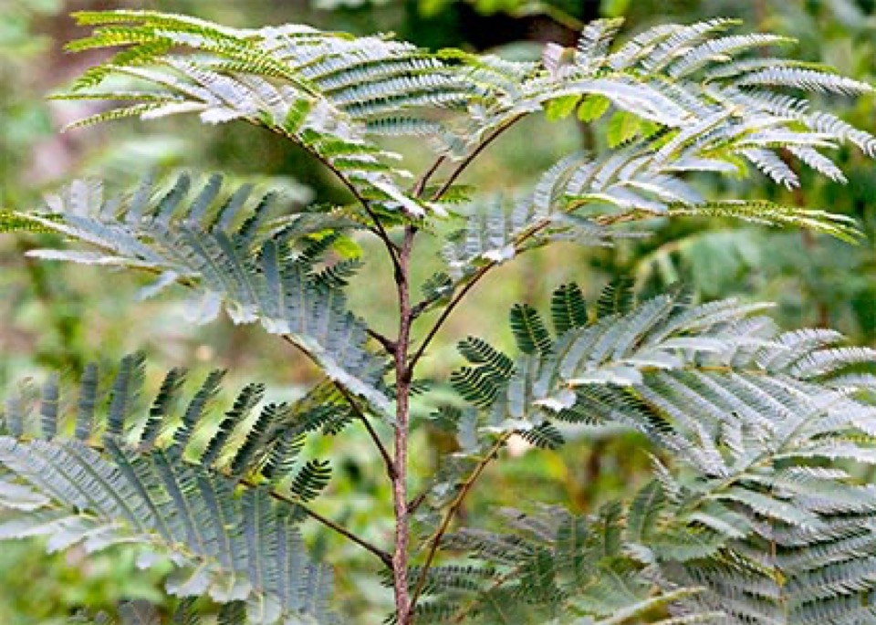
*잎 | 잎: 큰 겹잎은 어긋나기(잎대) · 짝수 2회 깃꼴겹잎(偶數2回羽狀複葉) · 가장자리: 밋밋함*

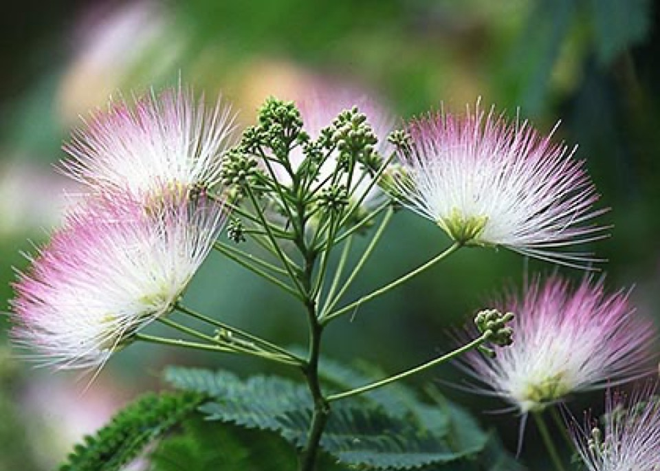
*꽃 | 꽃: 수술은 연하거나 진한 분홍 꽃 · 줄꼴 머리꼴꽃차례(두상화서)이고, 햇가지 끝에 이어지는 꽃대(화축)는 원뿔꽃차례(원추화서)로 올라가면서 꽃을 피우며, 우산꼴 또는 부채꼴로 보이기도 함 · 암수한꽃(양성화)*

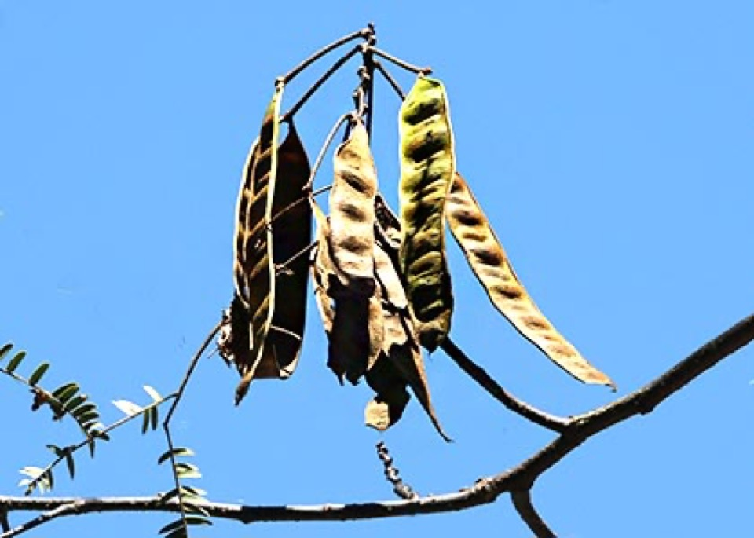
*열매 | 열매: 열매는 갈색 열매 · 꼬투리열매(협과, 두과 ; 열개과)*

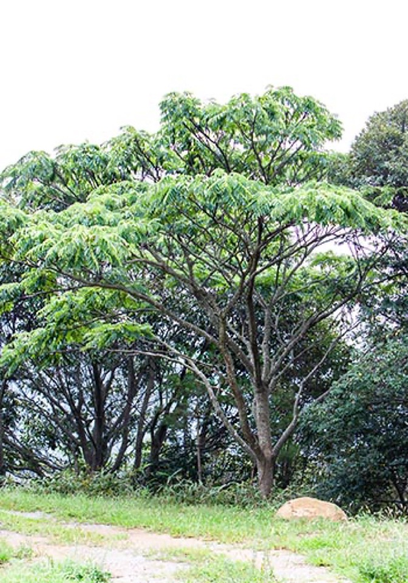
*수형 | 수형: 높이 3~9 m, 지름 40 cm 안팎 · 수피: 연한 갈색, 검은 갈색*

### 감별 핵심 포인트
- 분홍색의 긴 수술이 부채나 깃털처럼 퍼집니다.
- 아주 작은 잎들이 양쪽으로 촘촘히 배열됩니다.
- 납작한 콩깍지 같은 열매가 달립니다.

### 주된 형태 특징 (4대 감별 지표)
- **🌿 잎:** 큰 겹잎은 어긋나기(잎대) · 짝수 2회 깃꼴겹잎(偶數2回羽狀複葉) · 가장자리: 밋밋함 · 주맥은 가장자리 끝까지 이어지고, 곁맥은 7~12쌍으로 흐릿하지만 오른쪽으로 비교적 뚜렷함
- **🌸 꽃:** 수술은 연하거나 진한 분홍 꽃 · 줄꼴 머리꼴꽃차례(두상화서)이고, 햇가지 끝에 이어지는 꽃대(화축)는 원뿔꽃차례(원추화서)로 올라가면서 꽃을 피우며, 우산꼴 또는 부채꼴로 보이기도 함 · 암수한꽃(양성화)
- **🍒 열매:** 열매는 갈색 열매 · 꼬투리열매(협과, 두과 ; 열개과)
- **🪵 줄기·수형:** 높이 3~9 m, 지름 40 cm 안팎 · 수피: 연한 갈색, 검은 갈색

[파이팅혼공 TV 강의](https://www.youtube.com/watch?v=K3PvgTi3eXI&t=6650s) · [수목도감(treeworld)](https://treeworld.co.kr/a01_01_02/28839) · [위키백과(한국어)](https://ko.wikipedia.org/wiki/%EC%9E%90%EA%B7%80%EB%82%98%EB%AC%B4) · [Wikipedia(English)](https://en.wikipedia.org/wiki/Albizia_julibrissin)

## 086. 자작나무
> *Betula pendula Roth* · Betulaceae 자작나무과

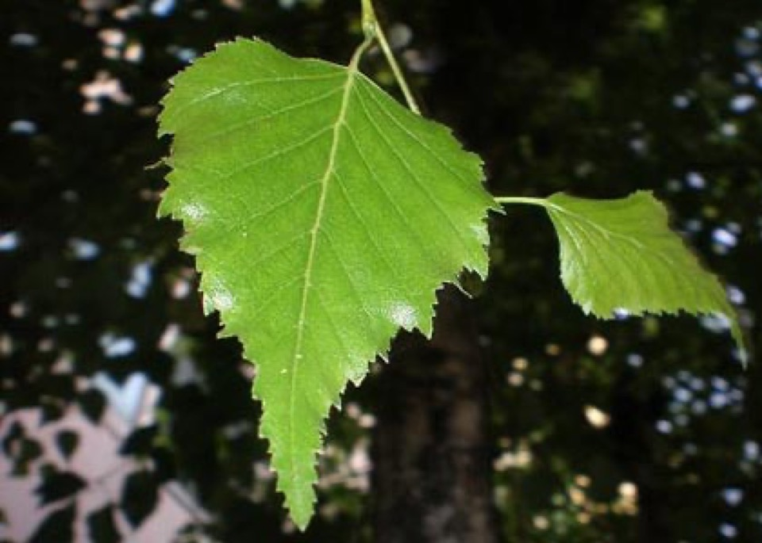
*잎 | 잎: 긴 가지는 어긋나기 · 홑잎 · 가장자리: 거칠고 깊게 갈라진 겹톱니 또는 홑톱니가 있음*

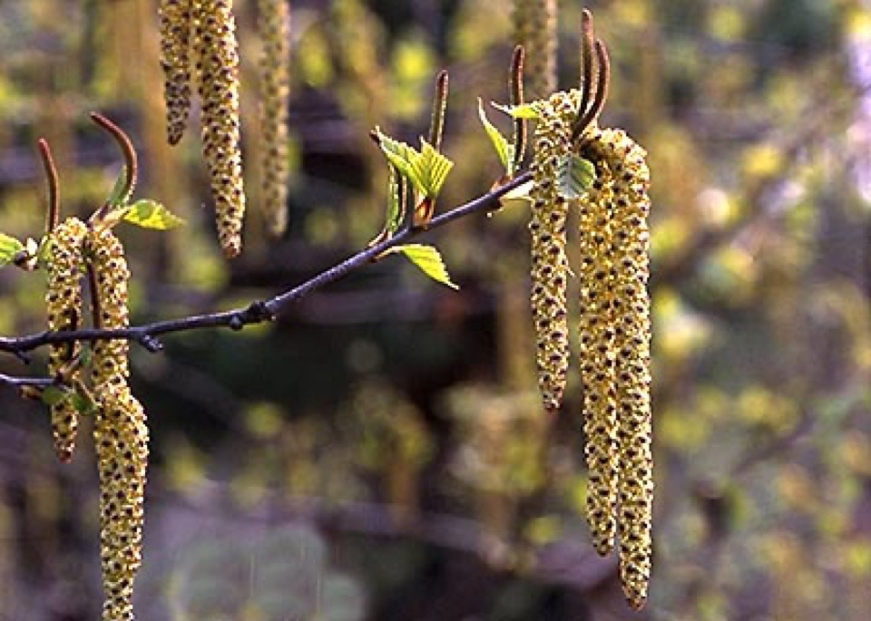
*꽃 | 꽃: 빨간갈색 꽃 · 이삭꽃차례(수상화서) · 암수한그루(일가화)*

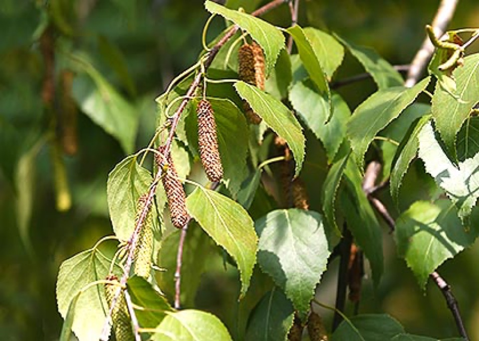
*열매 | 열매: 갈색 열매 · 작은 굳은껍질열매(소견과)*

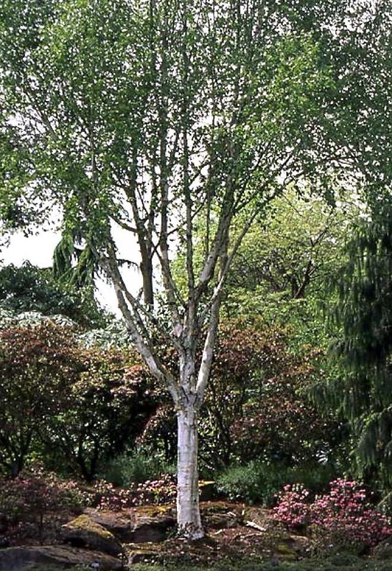
*수형 | 수형: 높이 25~30 m, 지름 40~60 (90) cm · 수피: 하양 또는 회빛 하양*

### 감별 핵심 포인트
- 줄기가 희고 수피가 얇게 벗겨집니다.
- 잎은 삼각형에 가깝고 불규칙한 톱니가 있습니다.
- 늘어진 꽃차례와 흰 수피를 함께 확인하세요.

### 주된 형태 특징 (4대 감별 지표)
- **🌿 잎:** 긴 가지는 어긋나기 · 홑잎 · 가장자리: 거칠고 깊게 갈라진 겹톱니 또는 홑톱니가 있음 · 곁맥은 5~8(9)쌍
- **🌸 꽃:** 빨간갈색 꽃 · 이삭꽃차례(수상화서) · 암수한그루(일가화)
- **🍒 열매:** 갈색 열매 · 작은 굳은껍질열매(소견과)
- **🪵 줄기·수형:** 높이 25~30 m, 지름 40~60 (90) cm · 수피: 하양 또는 회빛 하양

[파이팅혼공 TV 강의](https://www.youtube.com/watch?v=K3PvgTi3eXI&t=6710s) · [수목도감(treeworld)](https://treeworld.co.kr/a01_01_02/28816) · [위키백과(한국어)](https://ko.wikipedia.org/wiki/%EC%9E%90%EC%9E%91%EB%82%98%EB%AC%B4) · [Wikipedia(English)](https://en.wikipedia.org/wiki/Betula_platyphylla)

## 087. 작살나무
> *Callicarpa japonica Thunb.* · Lamiaceae 꿀풀과

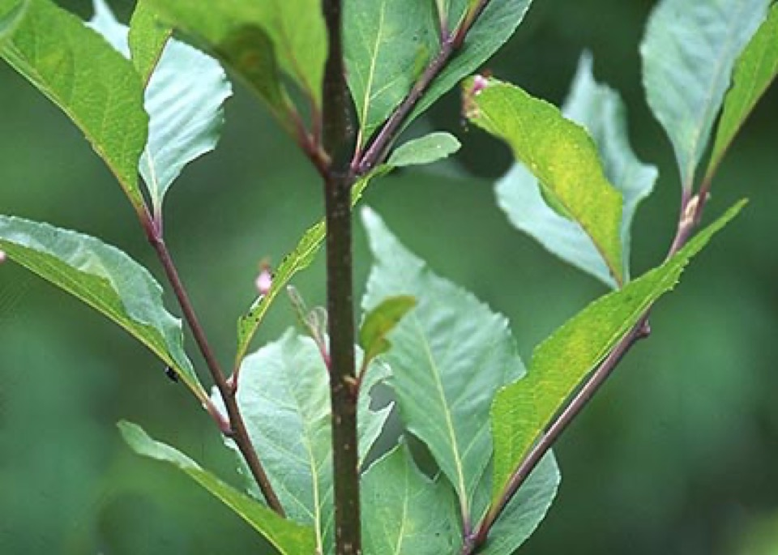
*잎 | 잎: 마주나기 · 홑잎 · 가장자리: 거의 모두에 잔톱니가 있음*

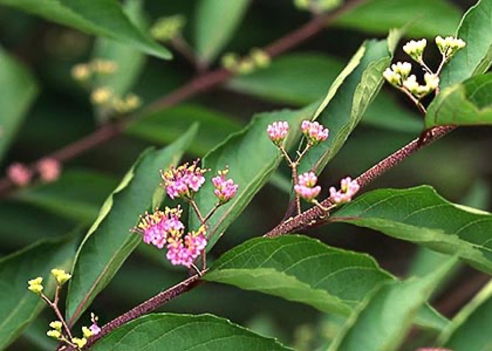
*꽃 | 꽃: 연한 자주 꽃 · 취산꽃차례 · 암수한꽃(양성화)*

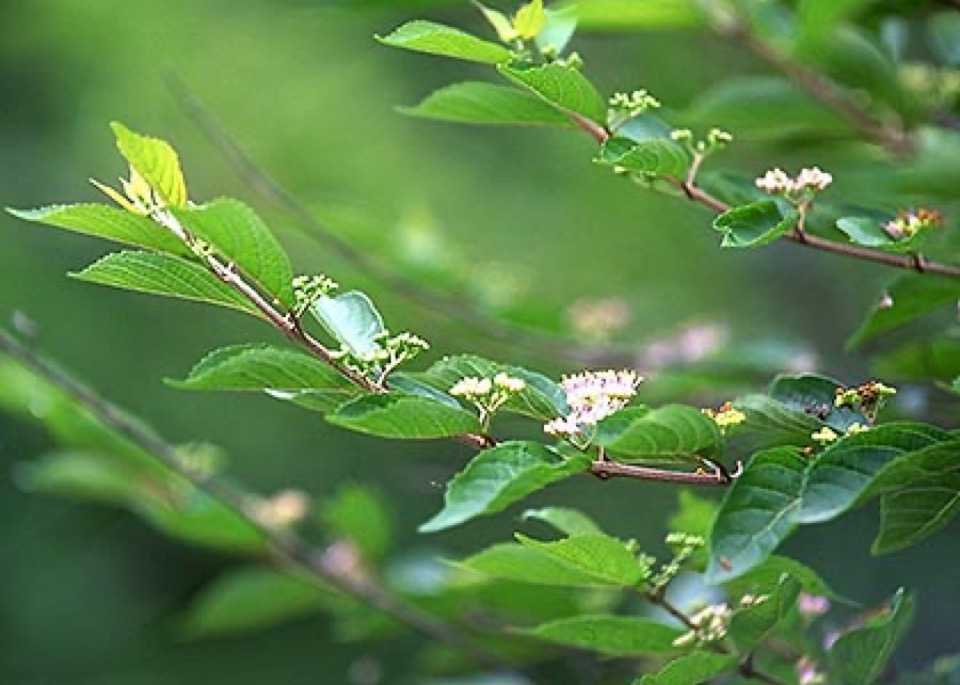
*수형 | 수형: 높이 1.5~3(5) m · 수피: 회갈색, 갈색*

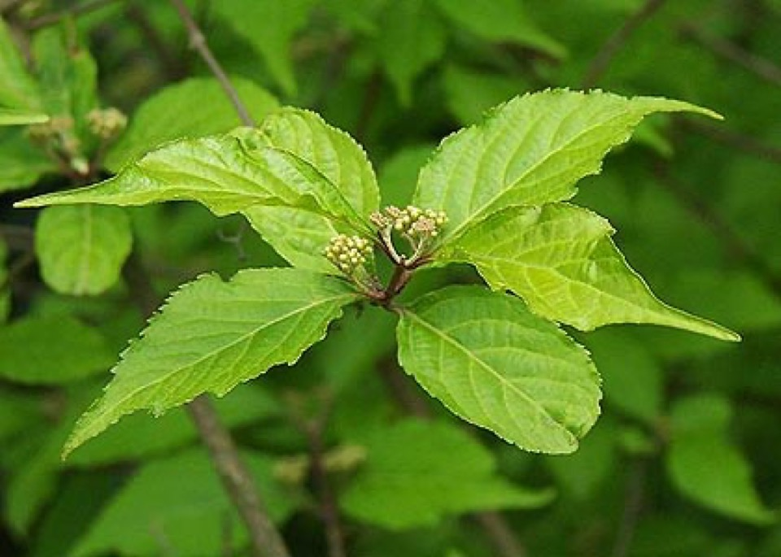
*새순 | 새순: 봄철 새로 돋아나는 잎과 가지*

### 감별 핵심 포인트
- 작고 둥근 보라색 열매가 가지에 모여 달립니다.
- 작은 연보라 꽃에서 노란 끝의 수술이 튀어나옵니다.
- 톱니가 있는 잎과 보라색 열매를 함께 기억하세요.

### 주된 형태 특징 (4대 감별 지표)
- **🌿 잎:** 마주나기 · 홑잎 · 가장자리: 거의 모두에 잔톱니가 있음 · 밑부분에서 부터 올라온 곁맥은 6~8쌍
- **🌸 꽃:** 연한 자주 꽃 · 취산꽃차례 · 암수한꽃(양성화)
- **🍒 열매:** 열매는 보라 열매 · 굳은씨열매(핵과)
- **🪵 줄기·수형:** 높이 1.5~3(5) m · 수피: 회갈색, 갈색

[파이팅혼공 TV 강의](https://www.youtube.com/watch?v=K3PvgTi3eXI&t=6770s) · [수목도감(treeworld)](https://treeworld.co.kr/a01_01_02/28810) · [위키백과(한국어)](https://ko.wikipedia.org/wiki/%EC%9E%91%EC%82%B4%EB%82%98%EB%AC%B4) · [Wikipedia(English)](https://en.wikipedia.org/wiki/Callicarpa_japonica)

## 088. 잣나무
> *Pinus koraiensis Siebold & Zucc.* · Pinaceae 소나무과

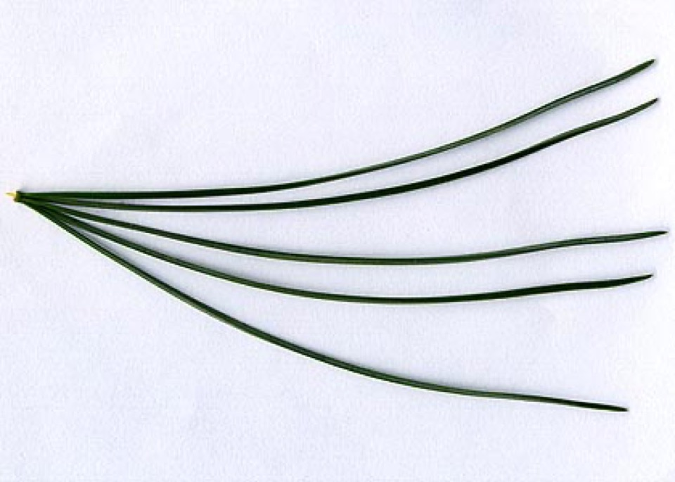
*잎 | 잎: 가지에 돌려나기 · 잎몸은 바늘잎으로 길이 6~12 cm이고, 똑바르며, 3개의 능선이 있음 · 가장자리: 자잘한 톱니가 있음*

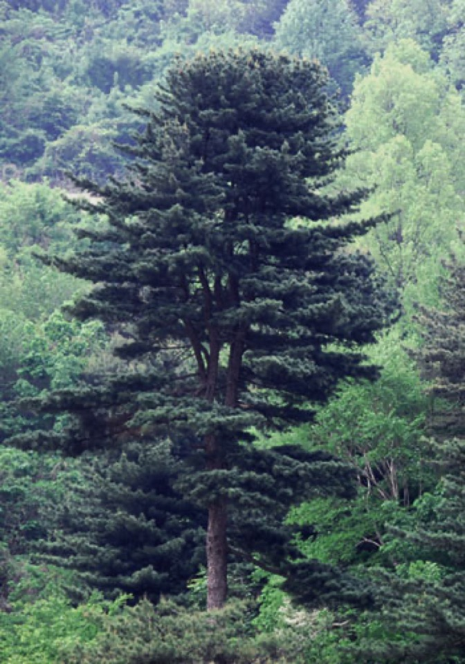
*수형 | 수형: 높이 30(50) m, 지름 1(1.5) m 안팎 · 수피: 겉껍질은 회빛 갈색 또는 검은갈색, 속껍질은 빨간 갈색*

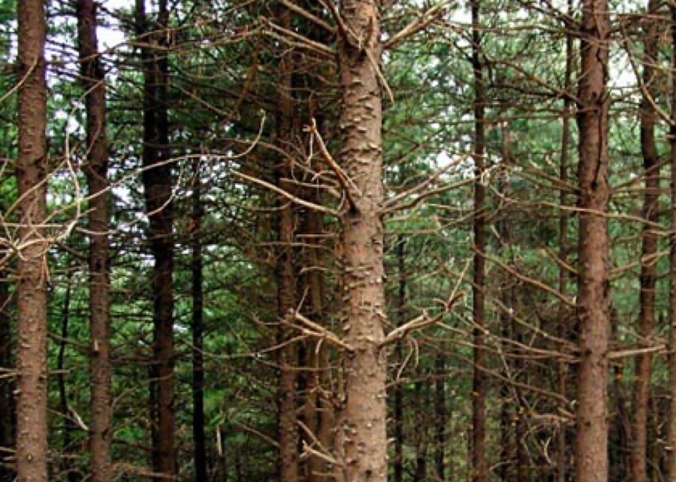
*줄기 | 줄기: 높이 30(50) m, 지름 1(1.5) m 안팎 · 수피: 겉껍질은 회빛 갈색 또는 검은갈색, 속껍질은 빨간 갈색*

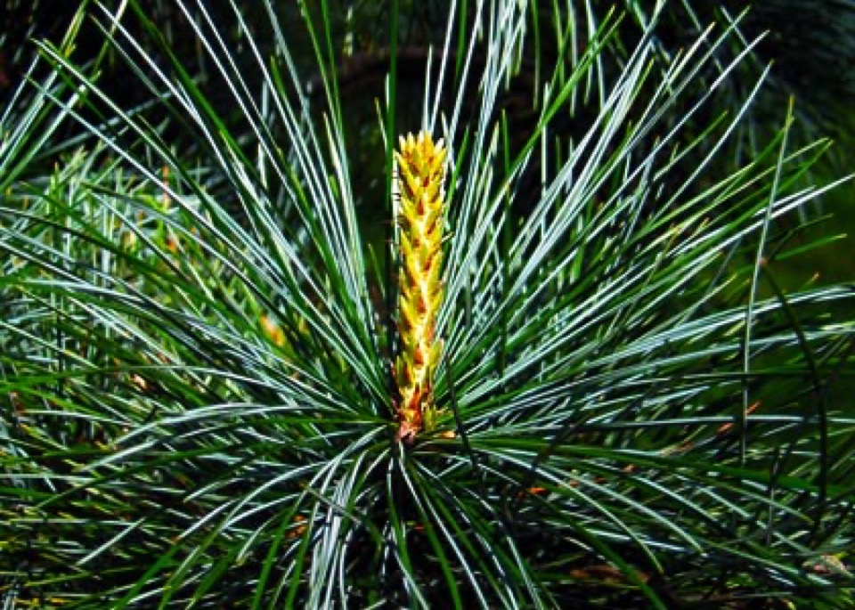
*새순 | 새순: 봄철 새로 돋아나는 잎과 가지*

### 감별 핵심 포인트
- 바늘 모양 잎이 다섯 개씩 모여 납니다.
- 큰 솔방울의 두꺼운 조각과 잣이 들어가는 구조를 봅니다.
- 가지에 풍성하게 모인 침엽을 확인하세요.

### 주된 형태 특징 (4대 감별 지표)
- **🌿 잎:** 가지에 돌려나기 · 잎몸은 바늘잎으로 길이 6~12 cm이고, 똑바르며, 3개의 능선이 있음 · 가장자리: 자잘한 톱니가 있음 · 앞쪽에 흰색 기공선이 있음
- **🌸 꽃:** 암꽃방울은 성숙하기 전에 초록 또는 자주이고, 꽃가루받이 후 18개월쯤에 익으면 갈색 꽃 · 암꽃대는 2~5개로 햇가지 끝 가까이 달리고, 수꽃대는 5~6개로 가지 밑에 달림 · 암수한그루
- **🍒 열매:** 씨방울은 처음에는 초록이지만 익으면 노란갈색, 갈색이 됨 열매 · 씨방울은 긴달걀형 또는 원통꼴 달걀형으로 길이 8~16 cm이고, 무딘끝이며, 보통 가지의 끝에 3~4개씩 달림
- **🪵 줄기·수형:** 높이 30(50) m, 지름 1(1.5) m 안팎 · 수피: 겉껍질은 회빛 갈색 또는 검은갈색, 속껍질은 빨간 갈색

**비교·주의:** 스트로브잣나무의 길고 가는 솔방울과 비교합니다.

[파이팅혼공 TV 강의](https://www.youtube.com/watch?v=K3PvgTi3eXI&t=6830s) · [수목도감(treeworld)](https://treeworld.co.kr/a01_01_02/28802) · [위키백과(한국어)](https://ko.wikipedia.org/wiki/%EC%9E%A3%EB%82%98%EB%AC%B4) · [Wikipedia(English)](https://en.wikipedia.org/wiki/Pinus_koraiensis)

## 089. 전나무
> *Abies holophylla Maxim.* · Pinaceae 소나무과

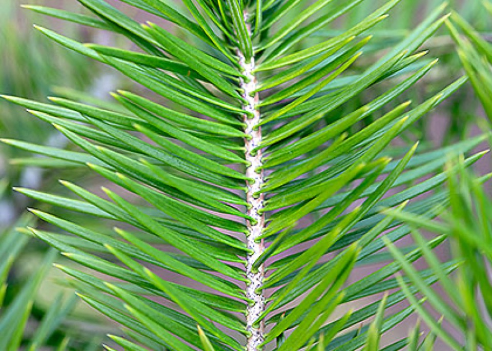
*잎 | 잎: 마주나기 · 홑잎 · 가장자리: 밋밋함*

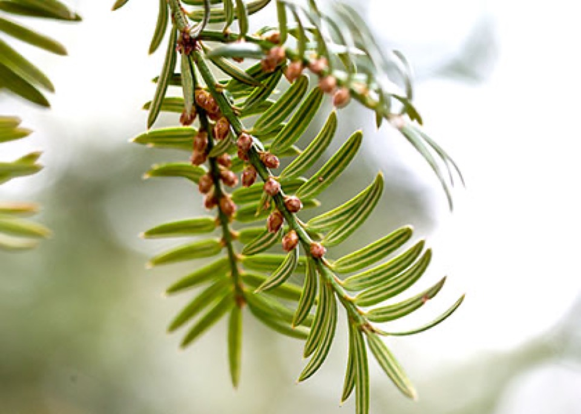
*꽃 | 꽃: 암꽃방울은 노란 초록 꽃 · 전년지의 잎겨드랑이에 달림 · 암수한그루*

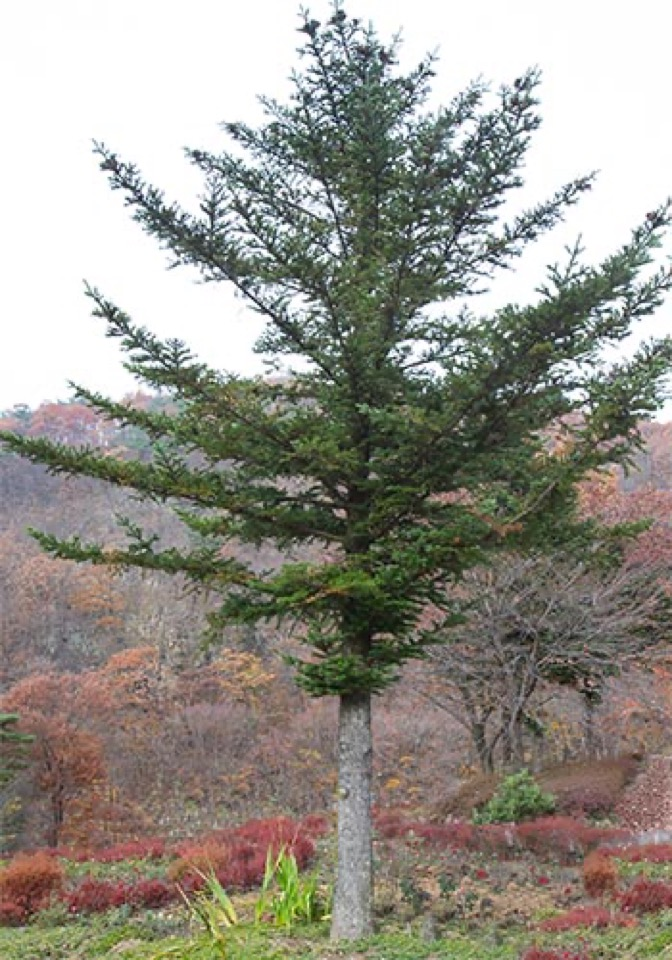
*수형 | 수형: 높이 30~40 m, 지름 1~1.5 m · 수피: 진한 갈색, 회색*

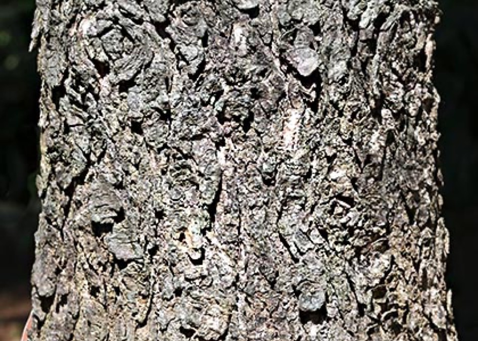
*줄기 | 줄기: 높이 30~40 m, 지름 1~1.5 m · 수피: 진한 갈색, 회색*

### 감별 핵심 포인트
- 짧고 비교적 뻣뻣한 잎이 가지에 달립니다.
- 잎 끝이 뾰족하며 뒷면에는 흰 줄이 보입니다.
- 길쭉한 솔방울이 위로 서는 모습을 확인하세요.

### 주된 형태 특징 (4대 감별 지표)
- **🌿 잎:** 마주나기 · 홑잎 · 가장자리: 밋밋함 · 앞면은 중앙맥, 뒷면에 2줄의 하얀 줄무늬(기공선)가 있음
- **🌸 꽃:** 암꽃방울은 노란 초록 꽃 · 전년지의 잎겨드랑이에 달림 · 암수한그루
- **🍒 열매:** 씨방울은 처음에 초록이지만 익으면 초록빛 갈색 열매 · 씨방울은 달걀형 또는 원통형으로 길이 10~12 cm, 지름 3.5 cm쯤이고, 자루는 길이 7 mm안팎
- **🪵 줄기·수형:** 높이 30~40 m, 지름 1~1.5 m · 수피: 진한 갈색, 회색

**비교·주의:** 구상나무·주목과 잎 끝, 잎 뒷면, 열매 형태를 비교합니다.

[파이팅혼공 TV 강의](https://www.youtube.com/watch?v=K3PvgTi3eXI&t=6890s) · [수목도감(treeworld)](https://treeworld.co.kr/a01_01_02/28785) · [위키백과(한국어)](https://ko.wikipedia.org/wiki/%EC%A0%84%EB%82%98%EB%AC%B4) · [Wikipedia(English)](https://en.wikipedia.org/wiki/Abies_holophylla)

## 090. 조릿대
> *Sasa borealis (Hack.) Makino & Shibata* · Poaceae 벼과

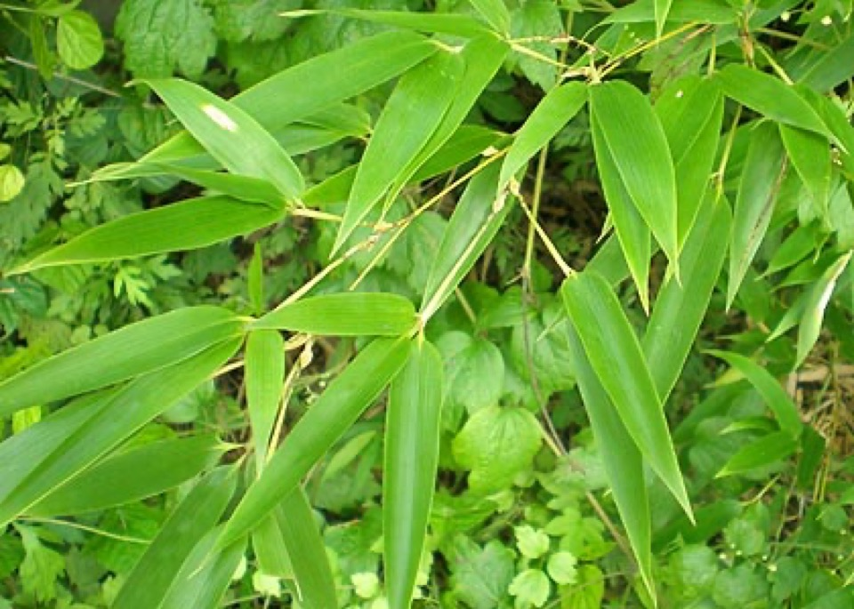
*잎 | 잎: 가지끝에서 2~3개씩 어긋나게 달림 · 잎몸은 긴타원꼴 피침형으로 길이 10~21 cm, 너비 15~25 mm · 가장자리: 가시꼴 잔톱니가 있음*

*수형 | 수형: 높이1~3 m, 지름 3~8 mm · 수피: 연한 초록*

### 감별 핵심 포인트
- 키가 낮은 대나무류로 마디가 있는 줄기가 보입니다.
- 잎은 길고 끝이 뾰족합니다.
- 낮게 무리 지어 자라는 줄기와 넓은 대나무형 잎을 기억하세요.

### 주된 형태 특징 (4대 감별 지표)
- **🌿 잎:** 가지끝에서 2~3개씩 어긋나게 달림 · 잎몸은 긴타원꼴 피침형으로 길이 10~21 cm, 너비 15~25 mm · 가장자리: 가시꼴 잔톱니가 있음 · 곧은맥(직맥)
- **🌸 꽃:** 자주 꽃 · 원뿔꽃차례 · 암수한그루
- **🍒 열매:** 진한 갈색 열매 · 낱알열매(穎果)
- **🪵 줄기·수형:** 높이1~3 m, 지름 3~8 mm · 수피: 연한 초록

[파이팅혼공 TV 강의](https://www.youtube.com/watch?v=K3PvgTi3eXI&t=7010s) · [수목도감(treeworld)](https://treeworld.co.kr/a01_01_02/28747) · [위키백과(한국어)](https://ko.wikipedia.org/wiki/%EC%A1%B0%EB%A6%BF%EB%8C%80%EC%86%8D) · [Wikipedia(English)](https://en.wikipedia.org/wiki/Sasamorpha)

## 091. 졸참나무
> *Quercus serrata Murray* · Fagaceae 참나무과(너도밤나무과)

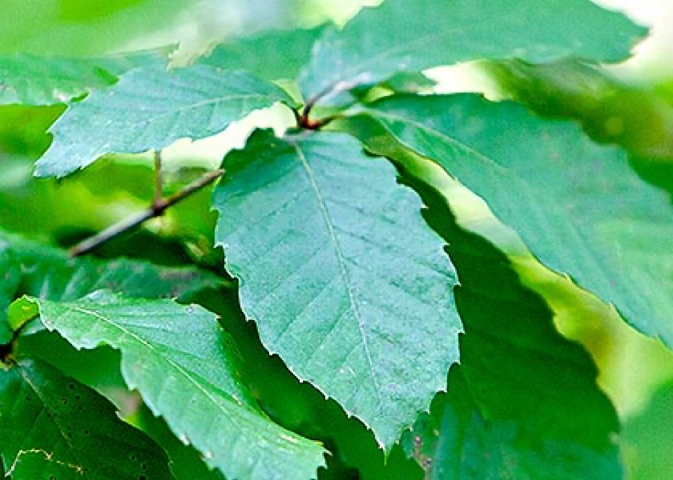
*잎 | 잎: 어긋나기 · 홑잎 · 가장자리: 뾰족한 톱니가 많으며, 다소 안쪽으로 향하고 있음*

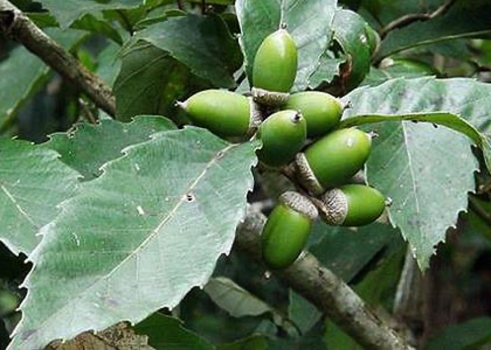
*열매 | 열매: 갈색 열매 · 굳은껍질열매(견과, 도토리)*

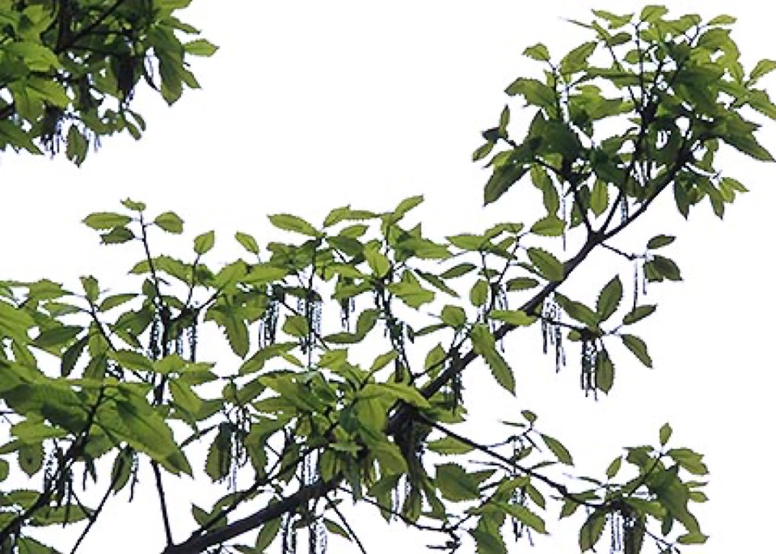
*수형 | 수형: 높이 25 m, 지름 1 m안팎 · 수피: 회빛 하양, 회색*

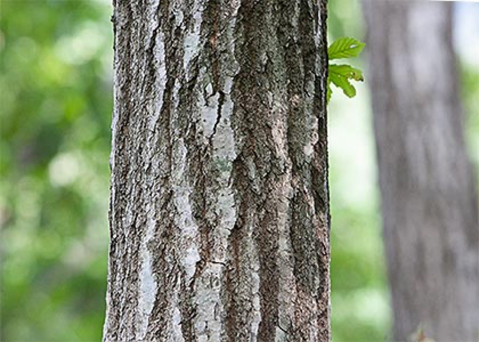
*줄기 | 줄기: 높이 25 m, 지름 1 m안팎 · 수피: 회빛 하양, 회색*

### 감별 핵심 포인트
- 참나무류 중 잎이 비교적 작고 잎자루가 보입니다.
- 잎 끝과 톱니가 뾰족하게 보입니다.
- 도토리와 작은 잎을 함께 확인하세요.

### 주된 형태 특징 (4대 감별 지표)
- **🌿 잎:** 어긋나기 · 홑잎 · 가장자리: 뾰족한 톱니가 많으며, 다소 안쪽으로 향하고 있음 · 곁맥은 7~12 쌍이고, 맥 위에 겹털이 있음
- **🌸 꽃:** 수꽃은 노란 초록 꽃 · 암꽃이삭은 윗부분에서 곧게 섬 · 암수한그루
- **🍒 열매:** 갈색 열매 · 굳은껍질열매(견과, 도토리)
- **🪵 줄기·수형:** 높이 25 m, 지름 1 m안팎 · 수피: 회빛 하양, 회색

**비교·주의:** 잎자루가 매우 짧은 떡갈나무·신갈나무와 비교하세요.

[파이팅혼공 TV 강의](https://www.youtube.com/watch?v=K3PvgTi3eXI&t=7050s) · [수목도감(treeworld)](https://treeworld.co.kr/a01_01_02/28720) · [위키백과(한국어)](https://ko.wikipedia.org/wiki/%EC%A1%B8%EC%B0%B8%EB%82%98%EB%AC%B4) · [Wikipedia(English)](https://en.wikipedia.org/wiki/Quercus_serrata)

## 092. 주목
> *Taxus cuspidata Siebold & Zucc.* · Taxaceae 주목과

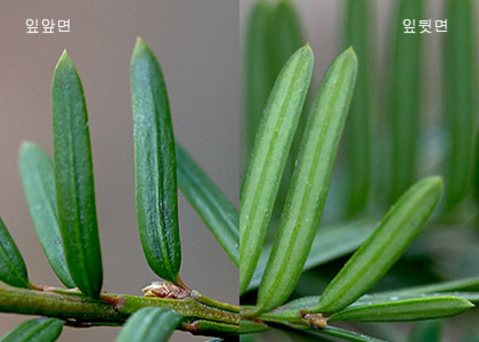
*잎 | 잎: 나선꼴 또는 깃꼴 어긋나기 · 2줄로 돌려나는(2열성) 선형. 똑바르거나 약간 갈고리꼴 · 가장자리: 밋밋하고 뒤로 젖혀짐*

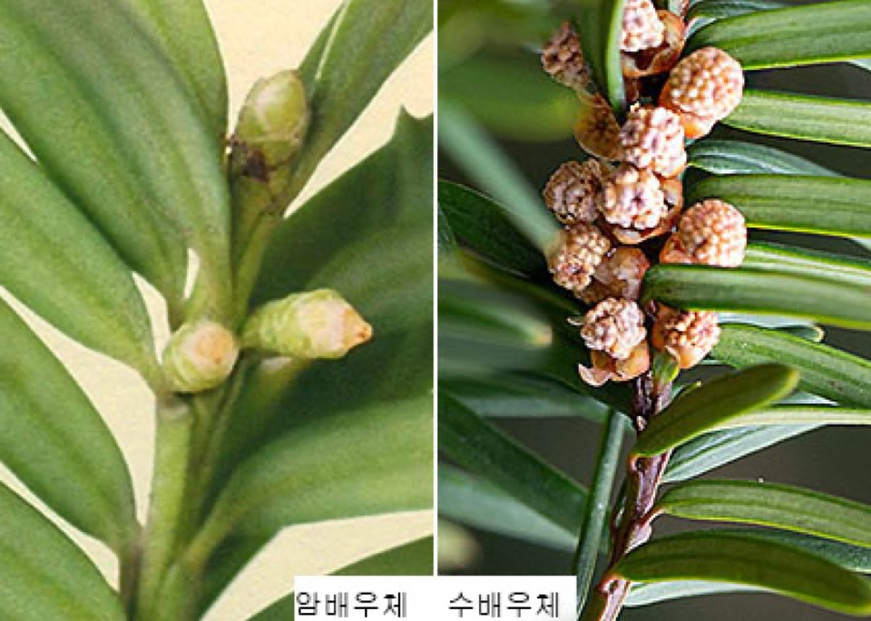
*꽃 | 꽃: 암꽃방울은 초록 꽃 · 암꽃대는 2년생의 짧은 가지 위에 하나씩 달림 · 암수딴그루(2가화) 드믈게 암수한그루(1가화)인 암수한꽃(단성화)*

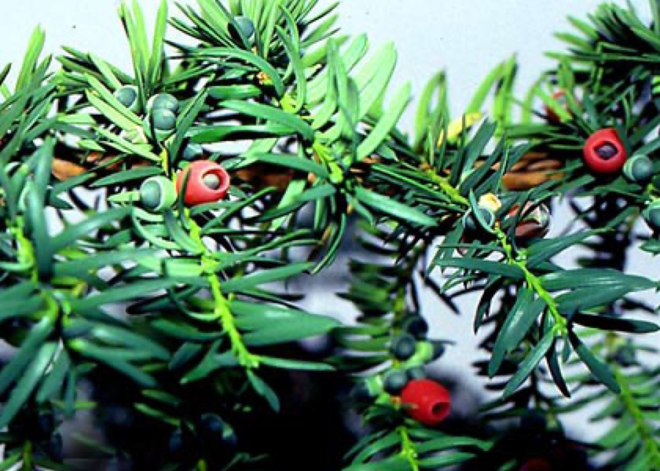
*열매 | 열매: 익으면 씨옷은 자줏빛 빨강(반질거림), 씨는 갈색 열매 · 컵 같은 씨옷(種衣, 가종피) 안에 달걀형의 굳은껍질열매(견과) 같은 씨가 들어있음. 씨옷은 윗부분이 열려있음*

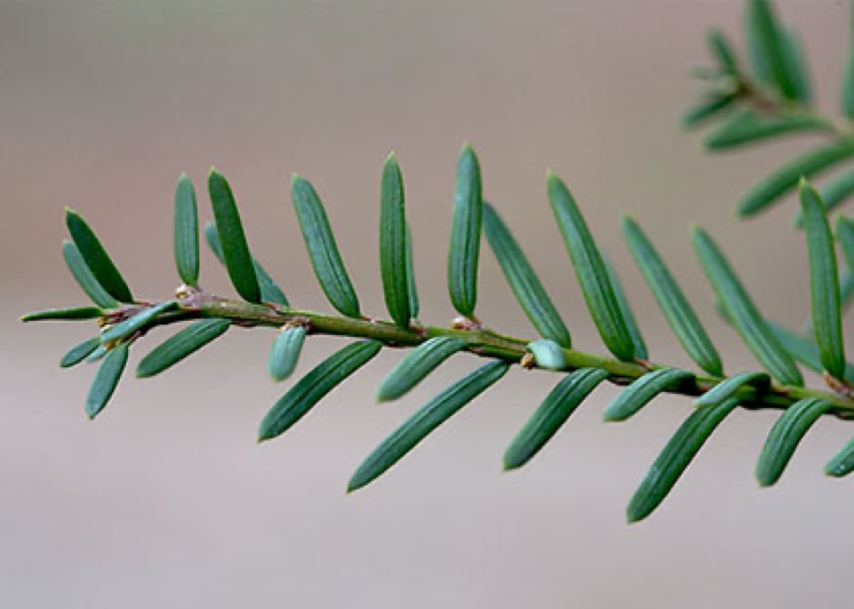
*수형 | 수형: 높이 17~20 m, 지름 1~1.5 m이고, 껍질은 얕게 벗겨짐 · 수피: 빨강 또는 빨간 갈색*

### 감별 핵심 포인트
- 납작하고 뾰족한 잎이 가지 양쪽으로 달립니다.
- 붉은 컵 같은 부분 안에 씨가 보이는 열매 모습이 특징입니다.
- 잎 뒷면의 연한 녹색과 붉은 열매를 함께 봅니다.

### 주된 형태 특징 (4대 감별 지표)
- **🌿 잎:** 나선꼴 또는 깃꼴 어긋나기 · 2줄로 돌려나는(2열성) 선형. 똑바르거나 약간 갈고리꼴 · 가장자리: 밋밋하고 뒤로 젖혀짐 · 중앙맥이 앞뒷면으로 돋우라져 있으나 뒷면이 뚜렷함
- **🌸 꽃:** 암꽃방울은 초록 꽃 · 암꽃대는 2년생의 짧은 가지 위에 하나씩 달림 · 암수딴그루(2가화) 드믈게 암수한그루(1가화)인 암수한꽃(단성화)
- **🍒 열매:** 익으면 씨옷은 자줏빛 빨강(반질거림), 씨는 갈색 열매 · 컵 같은 씨옷(種衣, 가종피) 안에 달걀형의 굳은껍질열매(견과) 같은 씨가 들어있음. 씨옷은 윗부분이 열려있음
- **🪵 줄기·수형:** 높이 17~20 m, 지름 1~1.5 m이고, 껍질은 얕게 벗겨짐 · 수피: 빨강 또는 빨간 갈색

**비교·주의:** 붉은 열매가 있어도 넓은 잎을 가진 수목들과는 다릅니다.

[파이팅혼공 TV 강의](https://www.youtube.com/watch?v=K3PvgTi3eXI&t=7250s) · [수목도감(treeworld)](https://treeworld.co.kr/a01_01_02/28681) · [위키백과(한국어)](https://ko.wikipedia.org/wiki/%EC%A3%BC%EB%AA%A9) · [Wikipedia(English)](https://en.wikipedia.org/wiki/Taxus_cuspidata)

## 093. 중국단풍
> *Acer buergerianum Miq.* · Sapindaceae 무환자나무과

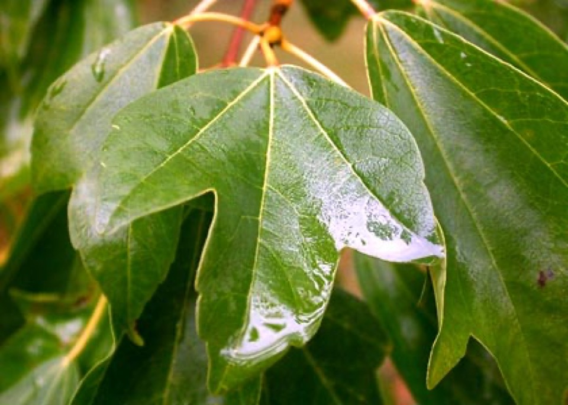
*잎 | 잎: 마주나기 · 홑잎 · 가장자리: 보통은 밋밋함, 드믈게 몇개의 톱니를 갖이며, 때로는 갈래조각이 매우 작음*

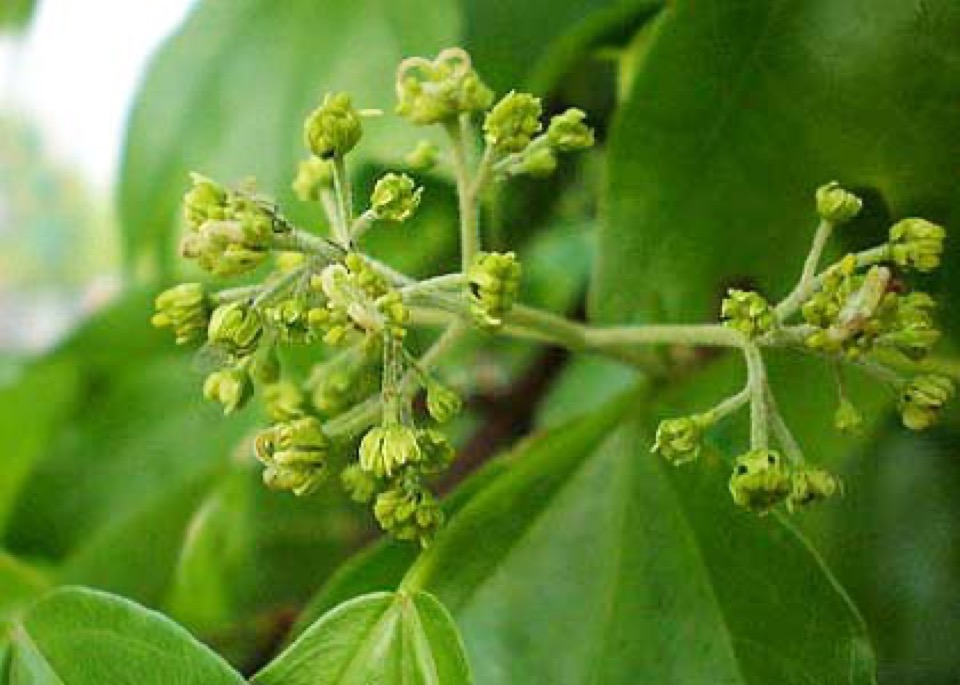
*꽃 | 꽃: 꽃잎은 연한 노란 하양 꽃 · 산방꽃차례 · 암수한그루*

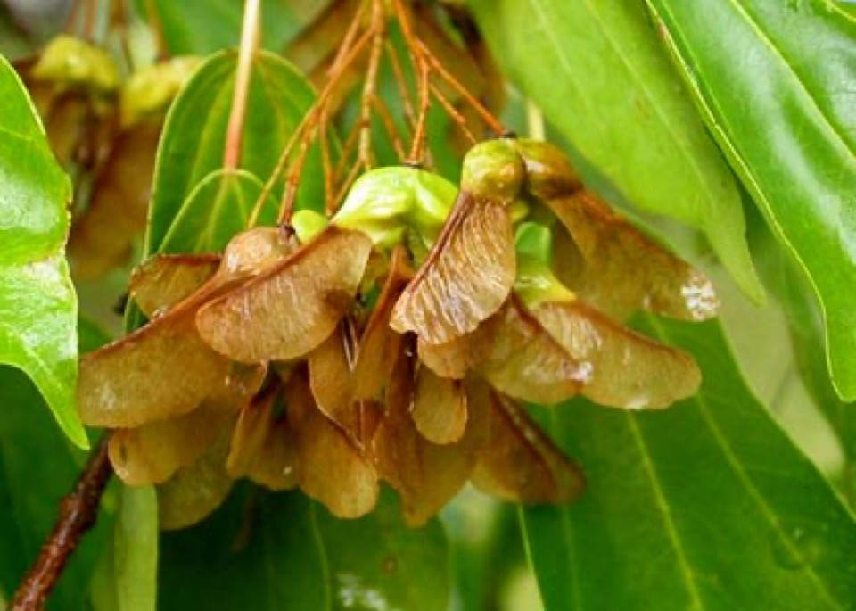
*열매 | 열매: 노란 갈색 열매 · 날개열매(시과)*

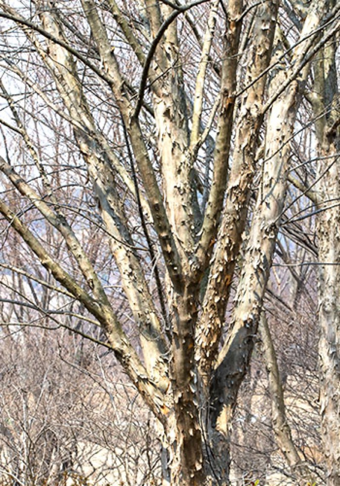
*수형 | 수형: 높이 15~20 m · 수피: 주황빛 회갈색, 회빛 갈색*

### 감별 핵심 포인트
- 잎이 크게 세 갈래로 갈라져 오리발을 닮았습니다.
- 단풍나무보다 잎의 갈래 수가 적고 갈라짐이 얕습니다.
- 두 날개가 달린 시과가 달립니다.

### 주된 형태 특징 (4대 감별 지표)
- **🌿 잎:** 마주나기 · 홑잎 · 가장자리: 보통은 밋밋함, 드믈게 몇개의 톱니를 갖이며, 때로는 갈래조각이 매우 작음 · 3출맥
- **🌸 꽃:** 꽃잎은 연한 노란 하양 꽃 · 산방꽃차례 · 암수한그루
- **🍒 열매:** 노란 갈색 열매 · 날개열매(시과)
- **🪵 줄기·수형:** 높이 15~20 m · 수피: 주황빛 회갈색, 회빛 갈색

**비교·주의:** 가운데 갈래가 더 길고 톱니가 뚜렷한 신나무와 비교하세요.

[파이팅혼공 TV 강의](https://www.youtube.com/watch?v=K3PvgTi3eXI&t=7330s) · [수목도감(treeworld)](https://treeworld.co.kr/a01_01_02/28639) · [위키백과(한국어)](https://ko.wikipedia.org/wiki/%EC%A4%91%EA%B5%AD%EB%8B%A8%ED%92%8D) · [Wikipedia(English)](https://en.wikipedia.org/wiki/Acer_buergerianum)

## 094. 쥐똥나무
> *Ligustrum obtusifolium Siebold & Zucc.* · Oleaceae 물푸레나무과

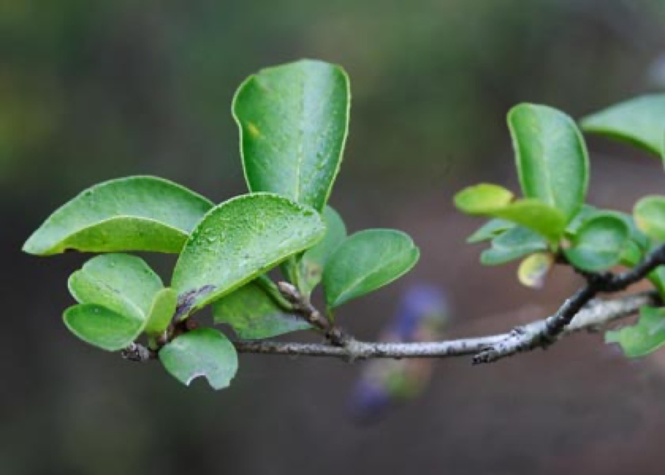
*잎 | 잎: 마주나기 · 홑잎 · 가장자리: 밋밋함*

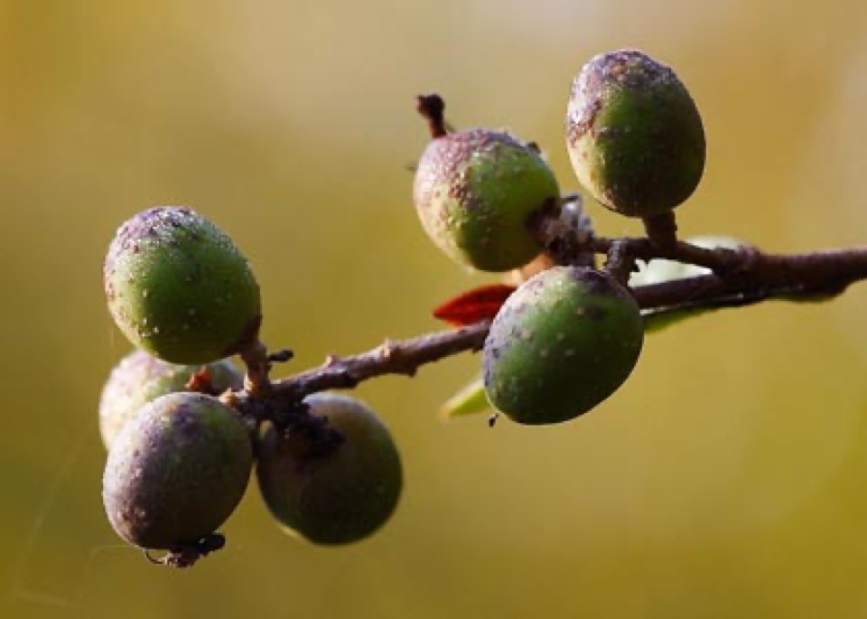
*열매 | 열매: 검정 또는 보랏빛 검정 열매 · 굳은씨열매(핵과)*

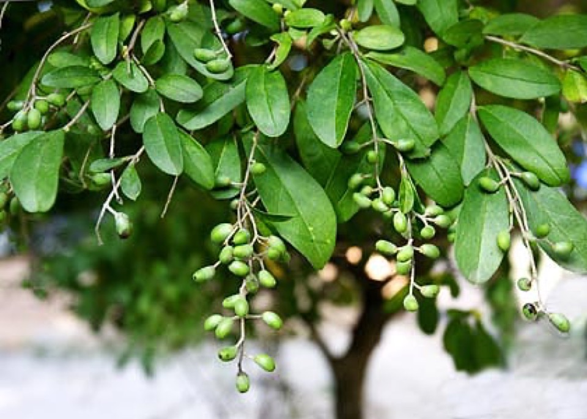
*수형 | 수형: 높이 2~4 m, 너비 3 cm쯤으로 여러개의 줄기가 올라옴 · 수피: 회빛 하양*

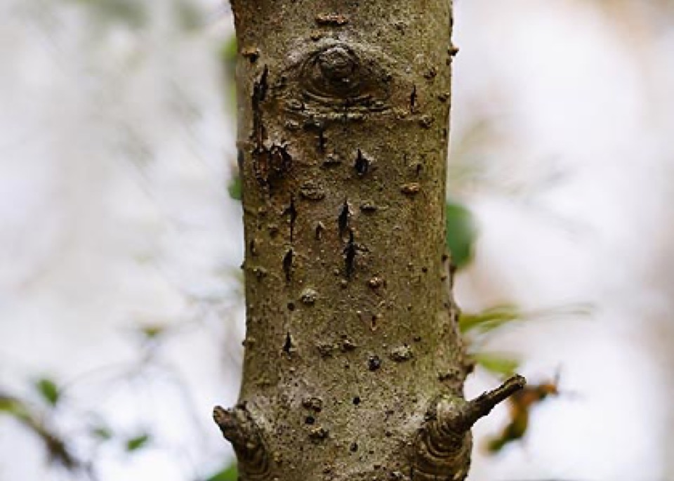
*줄기 | 줄기: 높이 2~4 m, 너비 3 cm쯤으로 여러개의 줄기가 올라옴 · 수피: 회빛 하양*

### 감별 핵심 포인트
- 작고 길쭉한 타원형 잎의 끝이 비교적 둥글게 보입니다.
- 흰 통꽃이 모여 피고 끝이 네 갈래로 벌어집니다.
- 작고 검은 타원형 열매가 달립니다.

### 주된 형태 특징 (4대 감별 지표)
- **🌿 잎:** 마주나기 · 홑잎 · 가장자리: 밋밋함 · 중앙맥은 뚜렷하고, 곁맥은 3~5(7)개, 때로는 뚜렷하지 않거나 축에서 약간 두드러짐
- **🌸 꽃:** 꽃잎은 우유빛 하양 꽃 · 총상꽃차례(고깔꽃차례) 또는 겹총상꽃차례 · 암수한그루
- **🍒 열매:** 검정 또는 보랏빛 검정 열매 · 굳은씨열매(핵과)
- **🪵 줄기·수형:** 높이 2~4 m, 너비 3 cm쯤으로 여러개의 줄기가 올라옴 · 수피: 회빛 하양

**비교·주의:** 광나무의 두껍고 광택 있는 잎과 비교하세요.

[파이팅혼공 TV 강의](https://www.youtube.com/watch?v=K3PvgTi3eXI&t=7430s) · [수목도감(treeworld)](https://treeworld.co.kr/a01_01_02/28625) · [위키백과(한국어)](https://ko.wikipedia.org/wiki/%EC%A5%90%EB%98%A5%EB%82%98%EB%AC%B4) · [Wikipedia(English)](https://en.wikipedia.org/wiki/Ligustrum_obtusifolium)

## 095. 진달래
> *Rhododendron mucronulatum Turcz.* · Ericaceae 진달래과

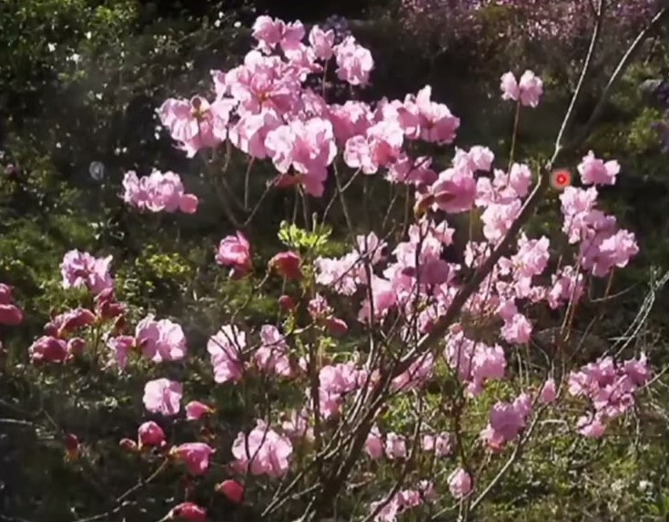
*꽃·전경 | 꽃: 연분홍빛 또는 자주색 꽃이 잎보다 먼저 가지에 무리 지어 핌*

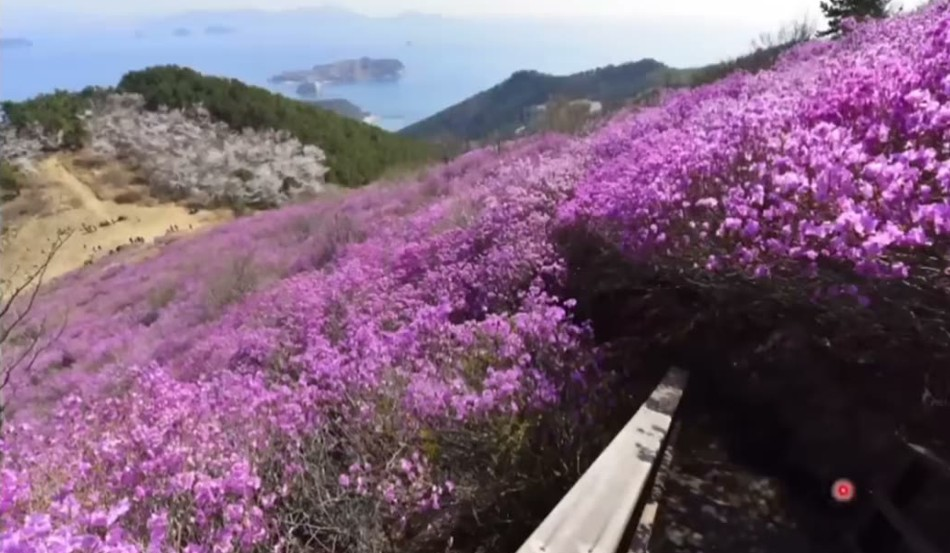
*잎·수형 | 잎 및 줄기: 긴타원형 또는 거꿀피침형, 높이 2~3m 자람*

### 감별 핵심 포인트
- 잎보다 먼저 붉은빛 분홍 꽃이 핍니다.
- 꽃이 핀 가지에 잎이 아직 적은 모습을 봅니다.
- 길쭉한 잎과 꽃의 안쪽 무늬도 함께 확인하세요.

### 주된 형태 특징 (4대 감별 지표)
- **🌿 잎:** 어긋나기 · 긴타원형, 타원꼴 피침형 또는 거꿀피침형 · 가장자리: 밋밋함 · 깃꼴그믈맥
- **🌸 꽃:** 자줏빛 빨강색 또는 연한 빨강이고, 하얀색도 있음 꽃 · 끝 부분에는 1개 또는 3개가 달리고, 곁부분에 1개씩 나오지만 2~5개가 산형꽃차례 처럼 모여 달리기도 함 · 암수한그루
- **🍒 열매:** 검은 갈색 열매 · 튀는열매(삭과)
- **🪵 줄기·수형:** 높이 1~3 m · 수피: 갈색, 회갈색

**비교·주의:** 산철쭉·철쭉은 꽃과 잎이 함께 보이는 사진과 비교해 익히세요.

[파이팅혼공 TV 강의](https://www.youtube.com/watch?v=K3PvgTi3eXI&t=7510s) · [수목도감(treeworld)](https://treeworld.co.kr/a01_01_02/28618) · [위키백과(한국어)](https://ko.wikipedia.org/wiki/%EC%A7%84%EB%8B%AC%EB%9E%98) · [Wikipedia(English)](https://en.wikipedia.org/wiki/Rhododendron_mucronulatum)

## 096. 쪽동백나무
> *Styrax obassia Siebold & Zucc.* · Styracaceae 때죽나무과

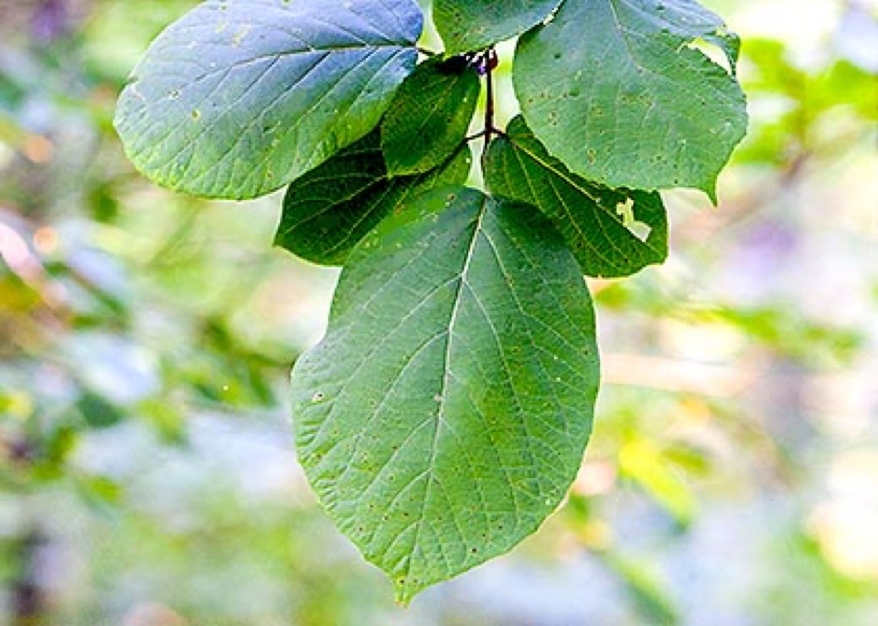
*잎 | 잎: 어긋나기 · 홑잎 · 가장자리: 끝부분에 아주 약간 또는 얕게 이빨꼴 톱니가 있거나 없음*

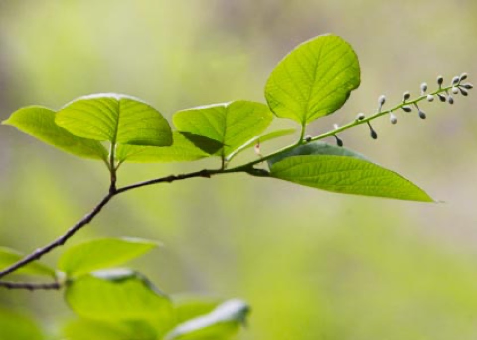
*꽃 | 꽃: 하양 꽃 · 총상꽃차례 · 암수한꽃*

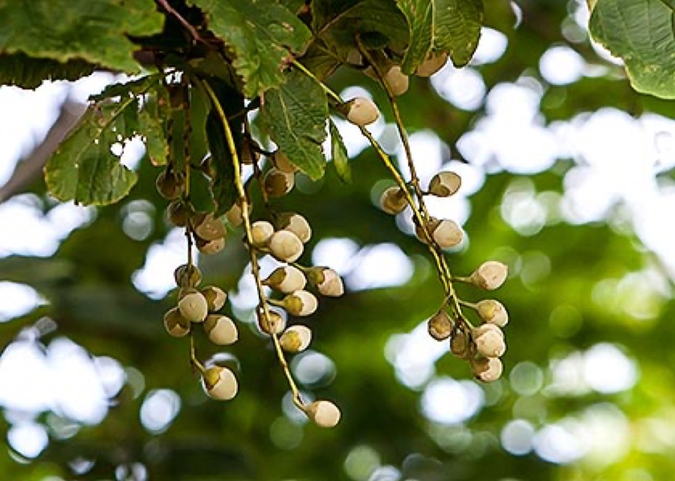
*열매 | 열매: 열매는 회빛 초록 열매 · 굳은씨열매(핵과)*

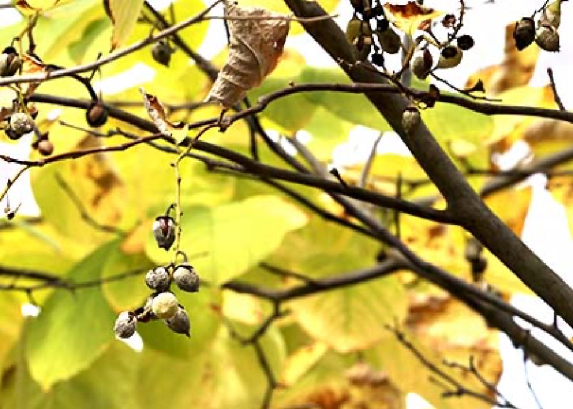
*수형 | 수형: 높이 6~15 m, 지름 약 30 cm · 수피: 껍질은 회빛 갈색, 회빛 하양, 검은빛 회색*

### 감별 핵심 포인트
- 흰 꽃이 길게 이어진 꽃차례에 아래를 향해 달립니다.
- 때죽나무보다 크고 넓은 잎이 두드러집니다.
- 둥근 열매가 여러 개 늘어선 모습을 봅니다.

### 주된 형태 특징 (4대 감별 지표)
- **🌿 잎:** 어긋나기 · 홑잎 · 가장자리: 끝부분에 아주 약간 또는 얕게 이빨꼴 톱니가 있거나 없음 · 중앙맥은 높고, 곁맥은 5~7쌍으로 깃꼴맥을 갖임
- **🌸 꽃:** 하양 꽃 · 총상꽃차례 · 암수한꽃
- **🍒 열매:** 열매는 회빛 초록 열매 · 굳은씨열매(핵과)
- **🪵 줄기·수형:** 높이 6~15 m, 지름 약 30 cm · 수피: 껍질은 회빛 갈색, 회빛 하양, 검은빛 회색

**비교·주의:** 동백나무와는 전혀 다른 꽃 모양입니다. 때죽나무와 잎·꽃차례를 비교하세요.

[파이팅혼공 TV 강의](https://www.youtube.com/watch?v=K3PvgTi3eXI&t=7550s) · [수목도감(treeworld)](https://treeworld.co.kr/a01_01_02/28605) · [위키백과(한국어)](https://ko.wikipedia.org/wiki/%EC%AA%BD%EB%8F%99%EB%B0%B1%EB%82%98%EB%AC%B4) · [Wikipedia(English)](https://en.wikipedia.org/wiki/Styrax_obassia)

## 097. 참느릅나무
> *Ulmus parvifolia Jacq.* · Ulmaceae 느릅나무과

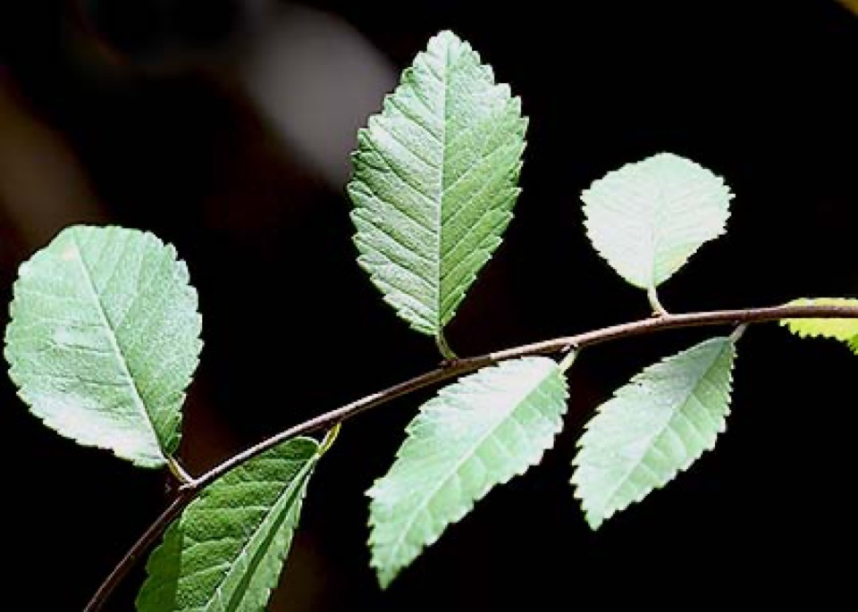
*잎 | 잎: 어긋나기 · 홑잎 · 가장자리: 짧고 뾰족한 홑톱니(단거치)가 있음*

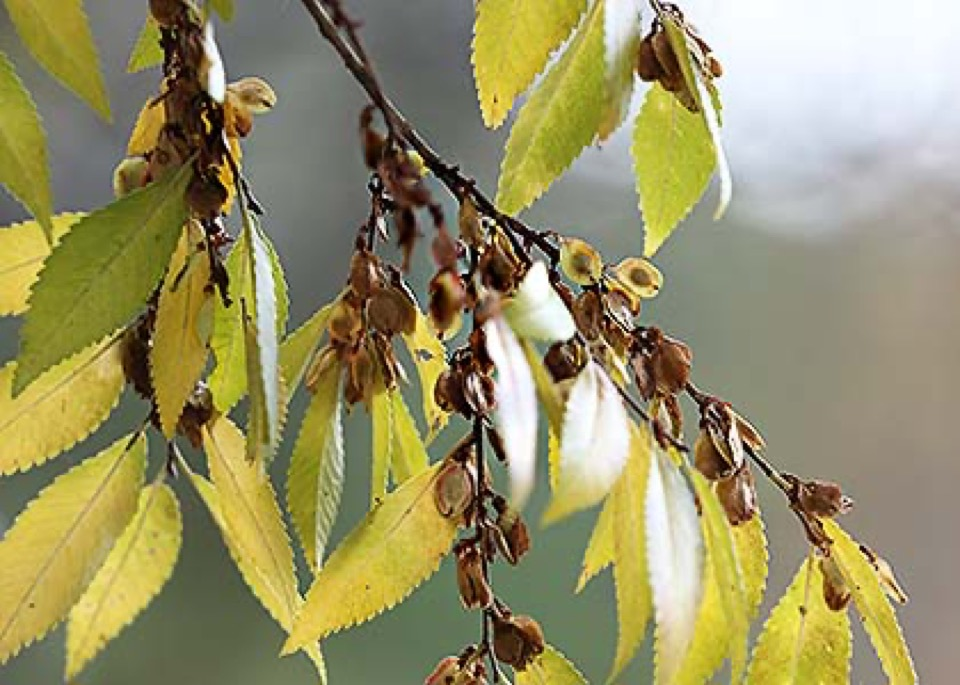
*열매 | 열매: 연한 갈색 또는 노란 갈색 때로는 짙은 갈색 열매 · 날개열매(시과)*

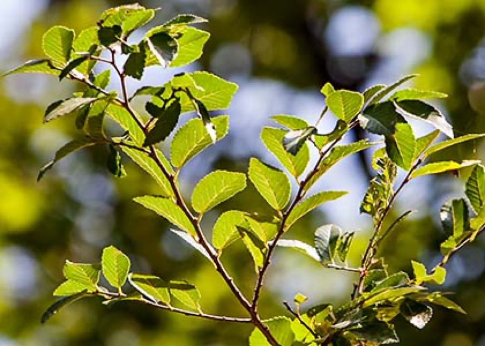
*수형 | 수형: 높이 15~25 m, 지름 70~100 cm · 수피: 회색 또는 회갈색*

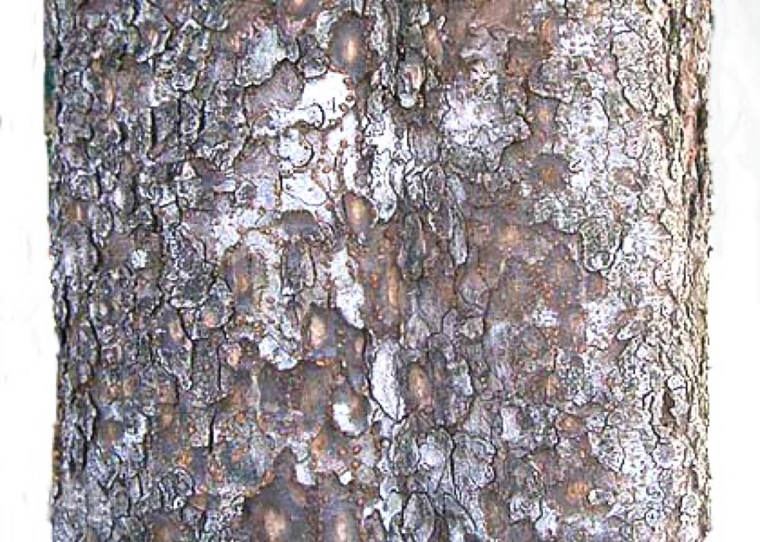
*줄기 | 줄기: 높이 15~25 m, 지름 70~100 cm · 수피: 회색 또는 회갈색*

### 감별 핵심 포인트
- 작은 잎의 밑부분이 좌우 비대칭입니다.
- 잎 가장자리에 톱니가 있으며 잎맥이 뚜렷합니다.
- 씨 주변을 얇은 날개가 둘러싼 열매를 확인하세요.

### 주된 형태 특징 (4대 감별 지표)
- **🌿 잎:** 어긋나기 · 홑잎 · 가장자리: 짧고 뾰족한 홑톱니(단거치)가 있음 · 곁맥은 10∼12쌍(이하)로서 뚜렷하여 거칠게 보임
- **🌸 꽃:** 노란 갈색 꽃 · 작은 다발의 취산꽃차례 · 잡성화
- **🍒 열매:** 연한 갈색 또는 노란 갈색 때로는 짙은 갈색 열매 · 날개열매(시과)
- **🪵 줄기·수형:** 높이 15~25 m, 지름 70~100 cm · 수피: 회색 또는 회갈색

**비교·주의:** 팽나무와 비교할 때 잎의 비대칭뿐 아니라 열매 형태도 봅니다.

[파이팅혼공 TV 강의](https://www.youtube.com/watch?v=K3PvgTi3eXI&t=7670s) · [수목도감(treeworld)](https://treeworld.co.kr/a01_01_02/28562) · [위키백과(한국어)](https://ko.wikipedia.org/wiki/%EC%B0%B8%EB%8A%90%EB%A6%85%EB%82%98%EB%AC%B4) · [Wikipedia(English)](https://en.wikipedia.org/wiki/Ulmus_parvifolia)

## 098. 철쭉
> *Rhododendron schlippenbachii Maxim.* · Ericaceae 진달래과

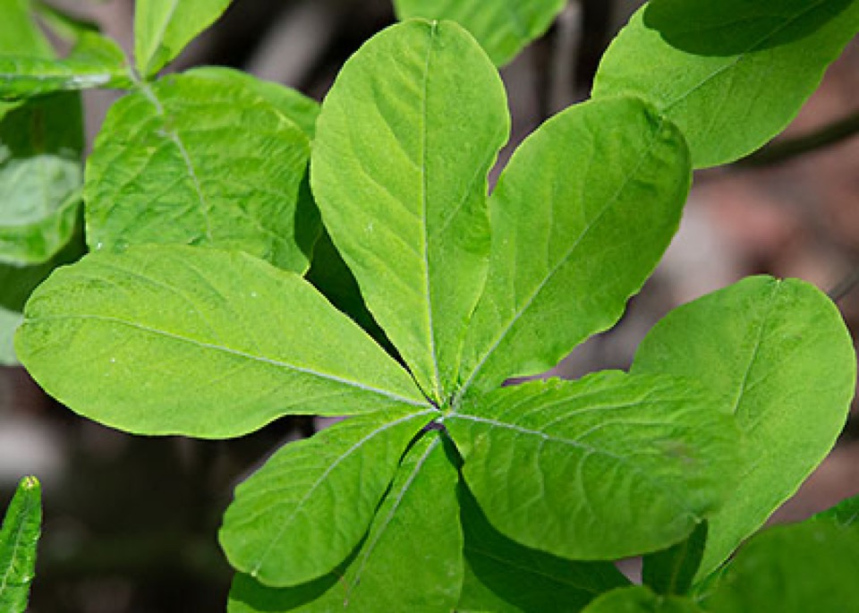
*잎 | 잎: 어긋나기이지만 가지 끝에서는 4~5개씩 모여 돌려나기 · 홑잎 · 가장자리: 밋밋함*

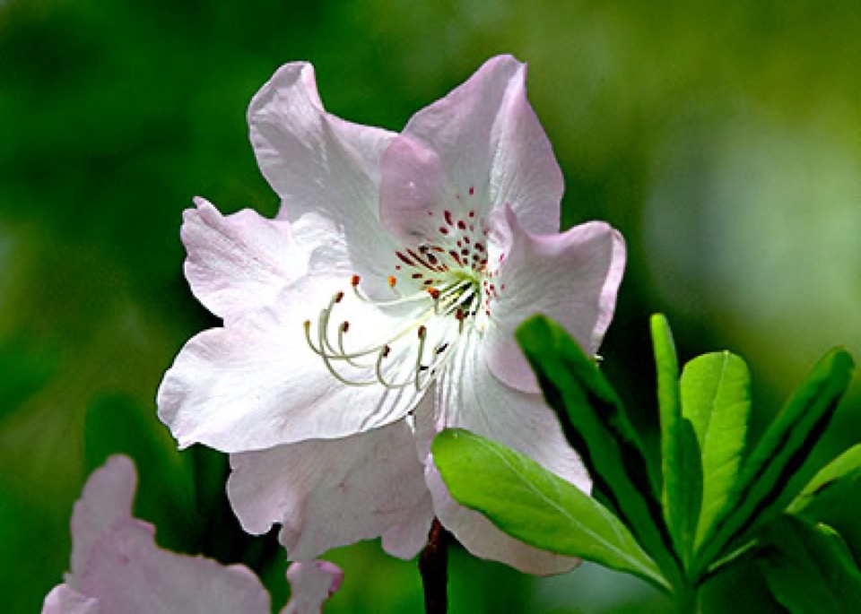
*꽃 | 꽃: 하얀 빨강, 연한 분홍, 하양 꽃 · 산형꽃차례 · 암수한꽃*

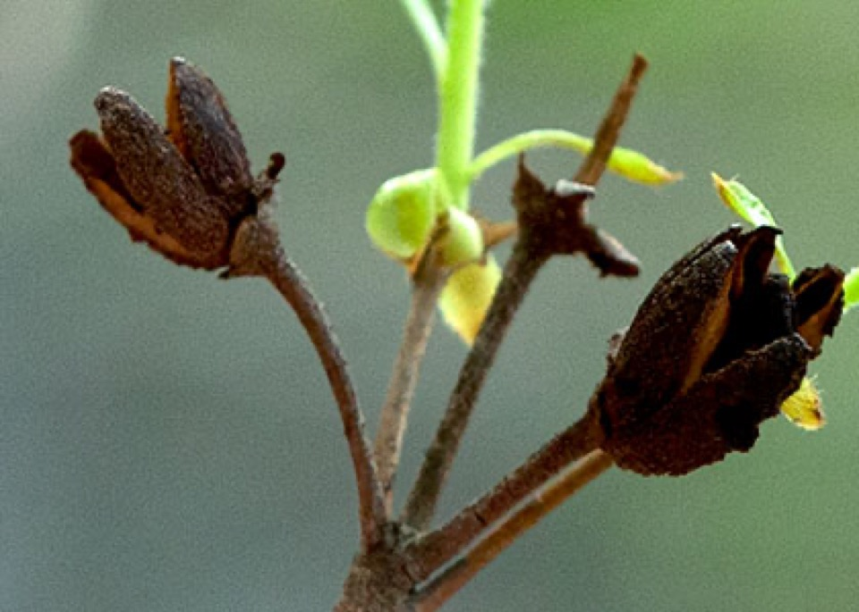
*열매 | 열매: 어두운 갈색 열매 · 튀는열매(삭과)*

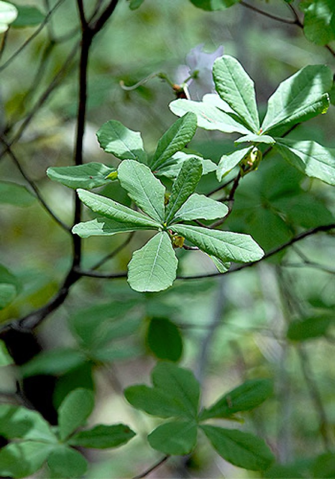
*수형 | 수형: 높이 1~5 m · 수피: 연한 노란 갈색, 회빛 갈색*

### 감별 핵심 포인트
- 연한 분홍색 꽃 안쪽에 적갈색 반점이 보입니다.
- 잎이 가지 끝에 모여 달리고 끝이 비교적 둥급니다.
- 넓은 잎과 연분홍 꽃의 조합을 기억하세요.

### 주된 형태 특징 (4대 감별 지표)
- **🌿 잎:** 어긋나기이지만 가지 끝에서는 4~5개씩 모여 돌려나기 · 홑잎 · 가장자리: 밋밋함 · 깃꼴 그믈맥
- **🌸 꽃:** 하얀 빨강, 연한 분홍, 하양 꽃 · 산형꽃차례 · 암수한꽃
- **🍒 열매:** 어두운 갈색 열매 · 튀는열매(삭과)
- **🪵 줄기·수형:** 높이 1~5 m · 수피: 연한 노란 갈색, 회빛 갈색

**비교·주의:** 산철쭉은 비교적 길고 좁은 잎과 진한 분홍색 꽃을 봅니다.

[파이팅혼공 TV 강의](https://www.youtube.com/watch?v=K3PvgTi3eXI&t=7750s) · [수목도감(treeworld)](https://treeworld.co.kr/a01_01_02/28512) · [위키백과(한국어)](https://ko.wikipedia.org/wiki/%EC%B2%A0%EC%AD%89) · [Wikipedia(English)](https://en.wikipedia.org/wiki/Rhododendron_schlippenbachii)

## 099. 측백나무
> *Platycladus orientalis (L.) Franco* · Cupressaceae 측백나무과

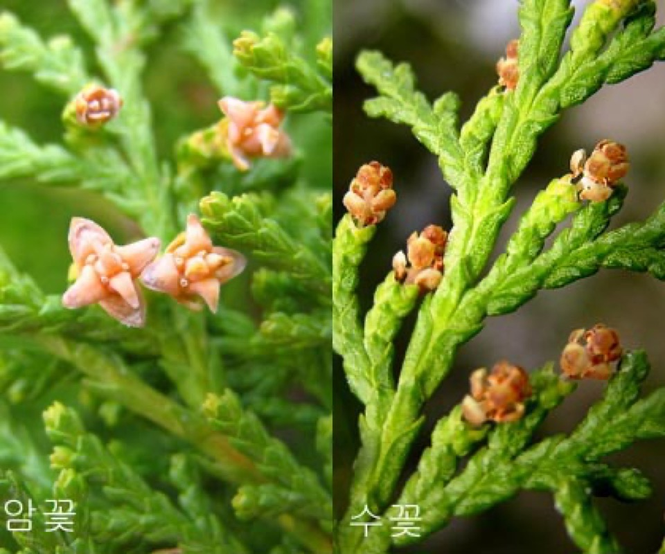
*꽃 | 꽃: 암꽃방울은 어릴 때 푸른 초록이고, 익으먼 연한 자주빛 갈색 꽃 · 암꽃대는 끝에 달리고, 수꽃대는 달걀형으로 자루가 짧고, 묵은 가지의 끝에 1개 달림 · 암수한그루(일가화)*

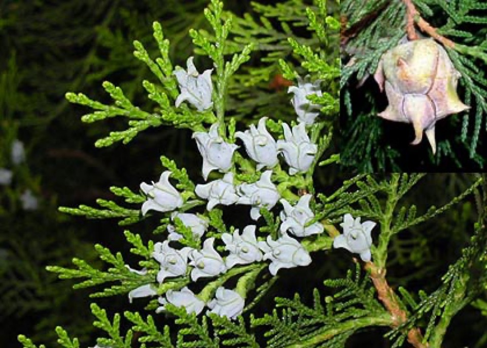
*열매 | 열매: 어린 씨방울은 푸른빛 초록으로 익은 씨방울은 갈색 열매 · 씨방울열매*

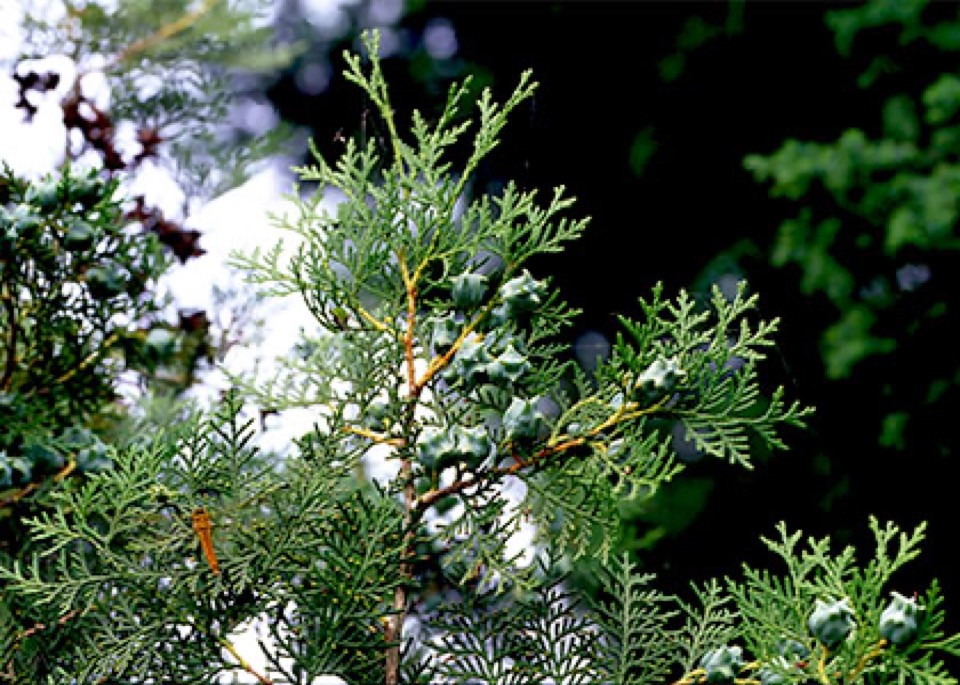
*수형 | 수형: 높이 5~12 (25) m, 지름 0.5~1 m (더 큰 것도 있을 수 있음) · 수피: 빨간 갈색, 연한 회갈색*

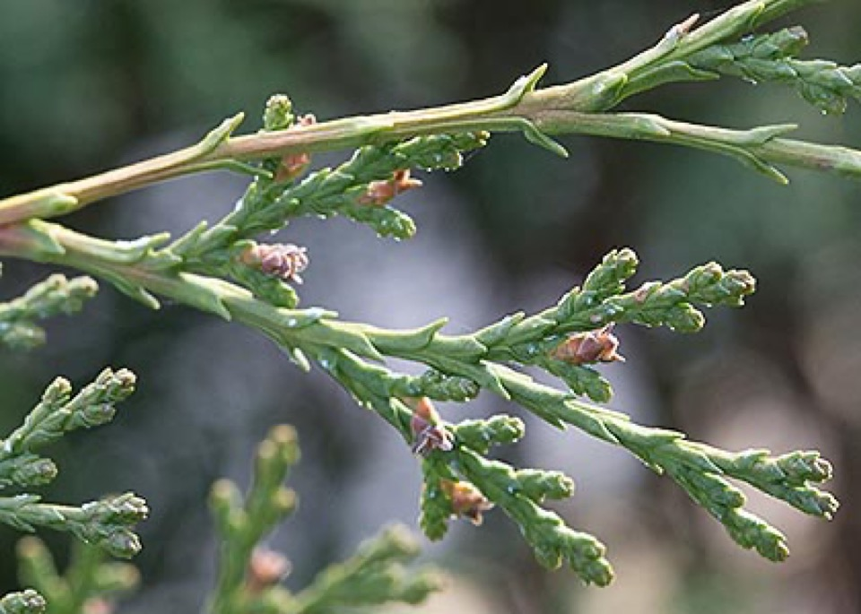
*겨울눈 | 겨울눈: 월동기 눈의 배열과 비늘잎 형태*

### 감별 핵심 포인트
- 비늘 모양 잎이 붙은 잔가지가 납작하게 퍼집니다.
- 작은 꽃과 울퉁불퉁한 작은 솔방울이 달립니다.
- 손바닥처럼 납작하게 펼쳐진 가지를 기억하세요.

### 주된 형태 특징 (4대 감별 지표)
- **🌿 잎:** 수직 및 거의 평행으로 십자꼴 마주나기 · 비늘잎(인엽) · 가장자리: 밋밋함 · 중앙의 잎 그리고 왼쪽과 오른쪽의 잎 사이에 고랑이 패임
- **🌸 꽃:** 암꽃방울은 어릴 때 푸른 초록이고, 익으먼 연한 자주빛 갈색 꽃 · 암꽃대는 끝에 달리고, 수꽃대는 달걀형으로 자루가 짧고, 묵은 가지의 끝에 1개 달림 · 암수한그루(일가화)
- **🍒 열매:** 어린 씨방울은 푸른빛 초록으로 익은 씨방울은 갈색 열매 · 씨방울열매
- **🪵 줄기·수형:** 높이 5~12 (25) m, 지름 0.5~1 m (더 큰 것도 있을 수 있음) · 수피: 빨간 갈색, 연한 회갈색

**비교·주의:** 향나무의 둥근 열매와 구별합니다.

[파이팅혼공 TV 강의](https://www.youtube.com/watch?v=K3PvgTi3eXI&t=7810s) · [수목도감(treeworld)](https://treeworld.co.kr/a01_01_02/28469) · [위키백과(한국어)](https://ko.wikipedia.org/wiki/%EC%B8%A1%EB%B0%B1%EB%82%98%EB%AC%B4) · [Wikipedia(English)](https://en.wikipedia.org/wiki/Platycladus)

## 100. 층층나무
> *Cornus controversa Hemsl.* · Cornaceae 층층나무과

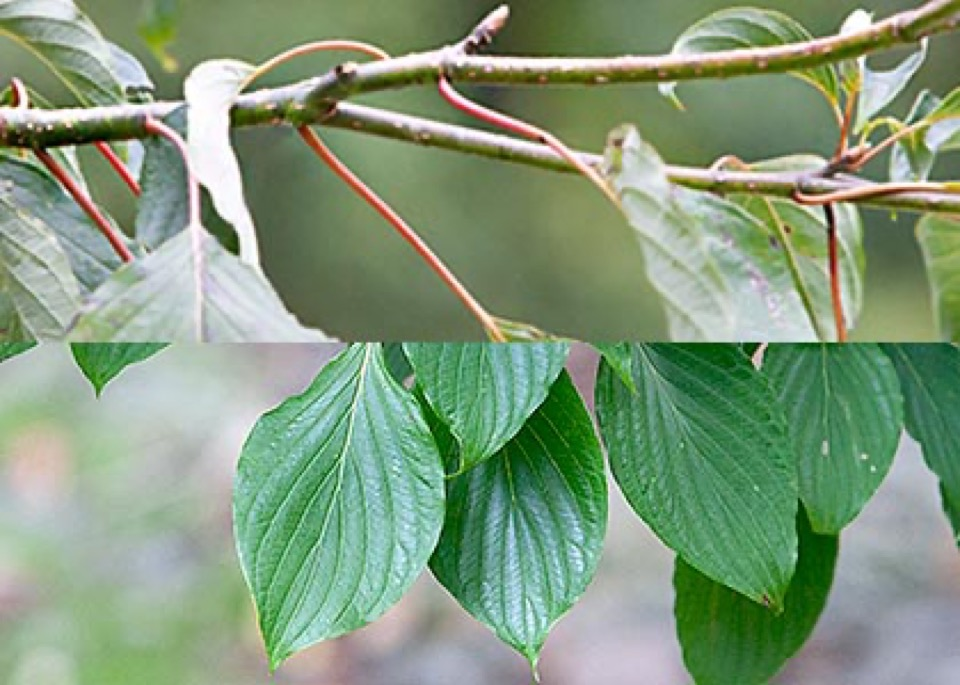
*잎 | 잎: 어긋나기 · 홑잎 · 가장자리: 밋밋하고, 뚜렷하지 않는 물결꼴*

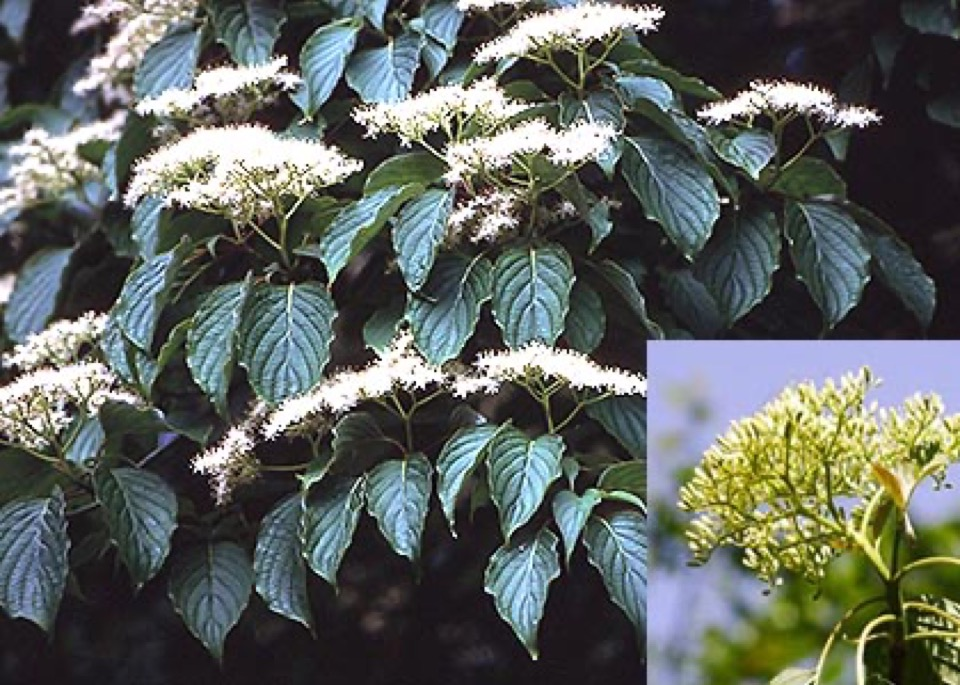
*꽃 | 꽃: 우유빛 하양 꽃 · 고른살(산방꼴) 모인꽃차례(취산화서) · 꽃대는 지름 5~12 cm로 털이 있거나 없고, 많은 꽃을 층층이 달고 있으며, 하나 하나의 꽃은 아주 작으며 지름 8~9 mm*

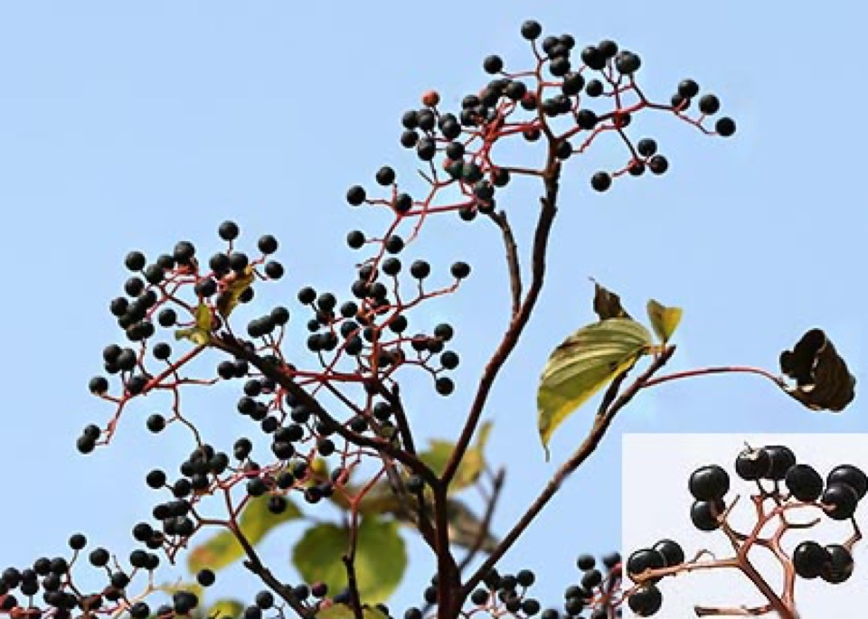
*열매 | 열매: 열매는 초록에서 점차 붉게 되어지고 나중에는 자줏빛 빨강 또는 푸른빛 검정 열매 · 굳은씨열매(핵과)*

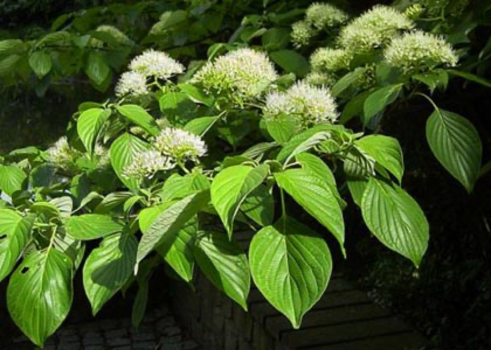
*수형 | 수형: 높이 3~15(24) m, 너비 0.7~ 1m · 수피: 진한 회색, 회빛 갈색*

### 감별 핵심 포인트
- 가지가 층을 이루며 수평으로 퍼지는 수형이 특징입니다.
- 잎은 어긋나며 잎맥이 끝을 향해 휘어집니다.
- 작은 흰 꽃이 넓고 평평한 무리로 핍니다.

### 주된 형태 특징 (4대 감별 지표)
- **🌿 잎:** 어긋나기 · 홑잎 · 가장자리: 밋밋하고, 뚜렷하지 않는 물결꼴 · 나란이맥(평행맥)
- **🌸 꽃:** 우유빛 하양 꽃 · 고른살(산방꼴) 모인꽃차례(취산화서) · 꽃대는 지름 5~12 cm로 털이 있거나 없고, 많은 꽃을 층층이 달고 있으며, 하나 하나의 꽃은 아주 작으며 지름 8~9 mm
- **🍒 열매:** 열매는 초록에서 점차 붉게 되어지고 나중에는 자줏빛 빨강 또는 푸른빛 검정 열매 · 굳은씨열매(핵과)
- **🪵 줄기·수형:** 높이 3~15(24) m, 너비 0.7~ 1m · 수피: 진한 회색, 회빛 갈색

**비교·주의:** 말채나무는 잎이 마주납니다. 꽃무리만으로 판단하지 마세요.

[파이팅혼공 TV 강의](https://www.youtube.com/watch?v=K3PvgTi3eXI&t=7850s) · [수목도감(treeworld)](https://treeworld.co.kr/a01_01_02/28456) · [위키백과(한국어)](https://ko.wikipedia.org/wiki/%EC%B8%B5%EC%B8%B5%EB%82%98%EB%AC%B4) · [Wikipedia(English)](https://en.wikipedia.org/wiki/Cornus_controversa)

## 101. 칠엽수
> *Aesculus turbinata Blume* · Hippocastanaceae 칠엽수과

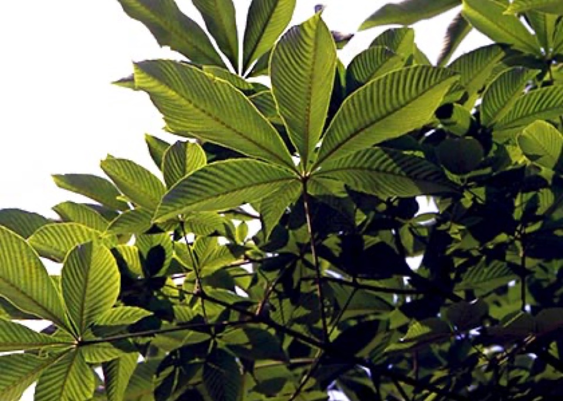
*잎 | 잎: 마주나기 · 손바닥꼴 겹잎 · 가장자리: 얕은 겹톱니를 갖임*

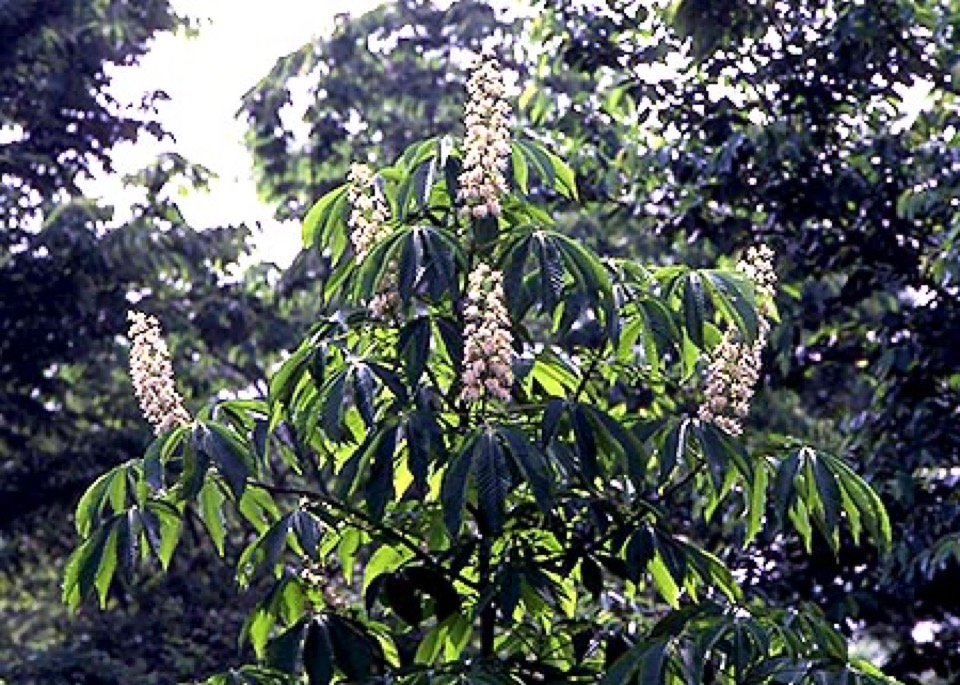
*꽃 | 꽃: 분홍빛 하양 꽃 · 원뿔꽃차례 · 암수한그루*

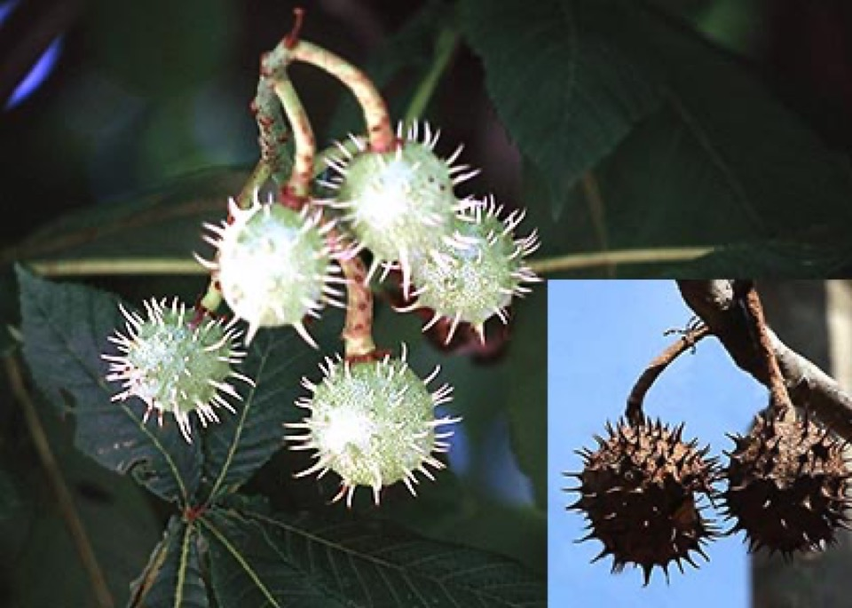
*열매 | 열매: 노란 갈색 열매 · 거꿀원추형*

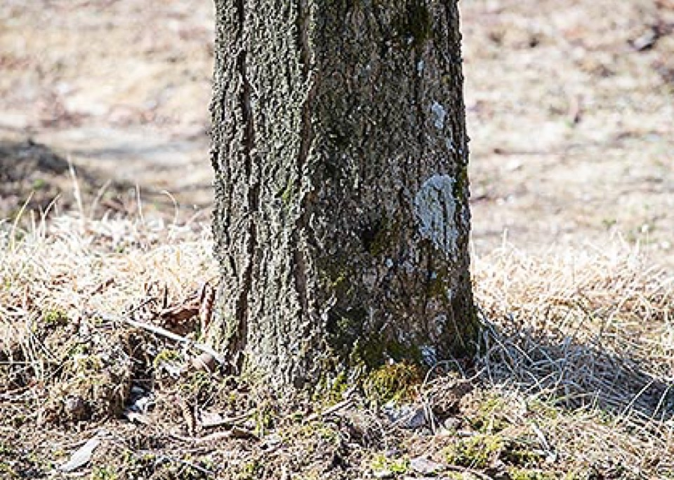
*수형 | 수형: 높이 20~30m, 지름 60cm · 수피: 회갈색*

### 감별 핵심 포인트
- 큰 작은잎 여러 장이 한 점에서 손바닥처럼 퍼집니다.
- 흰 꽃이 위로 선 원뿔 모양 꽃차례를 이룹니다.
- 크고 둥근 열매와 손 모양 겹잎을 함께 봅니다.

### 주된 형태 특징 (4대 감별 지표)
- **🌿 잎:** 마주나기 · 손바닥꼴 겹잎 · 가장자리: 얕은 겹톱니를 갖임 · 곁맥은 18~26쌍
- **🌸 꽃:** 분홍빛 하양 꽃 · 원뿔꽃차례 · 암수한그루
- **🍒 열매:** 노란 갈색 열매 · 거꿀원추형
- **🪵 줄기·수형:** 높이 20~30m, 지름 60cm · 수피: 회갈색

**비교·주의:** 하나의 잎이 갈라진 팔손이와 여러 작은잎이 모인 칠엽수를 구별하세요.

[파이팅혼공 TV 강의](https://www.youtube.com/watch?v=K3PvgTi3eXI&t=7970s) · [수목도감(treeworld)](https://treeworld.co.kr/a01_01_02/28438) · [위키백과(한국어)](https://ko.wikipedia.org/wiki/%EC%B9%A0%EC%97%BD%EC%88%98) · [Wikipedia(English)](https://en.wikipedia.org/wiki/Aesculus_turbinata)

## 102. 태산목
> *Magnolia grandiflora L.* · Magnoliaceae 목련과

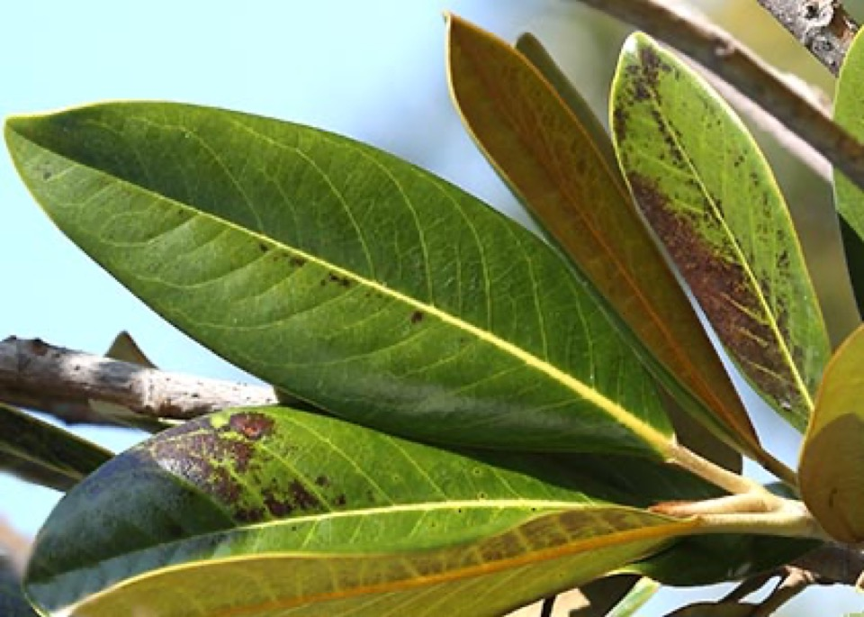
*잎 | 잎: 어긋나기, 가지 끝에 돌려나기 생김새로 모여나지 않음 · 홑잎 · 가장자리: 밋밋하며, 안쪽으로 약간 굽음*

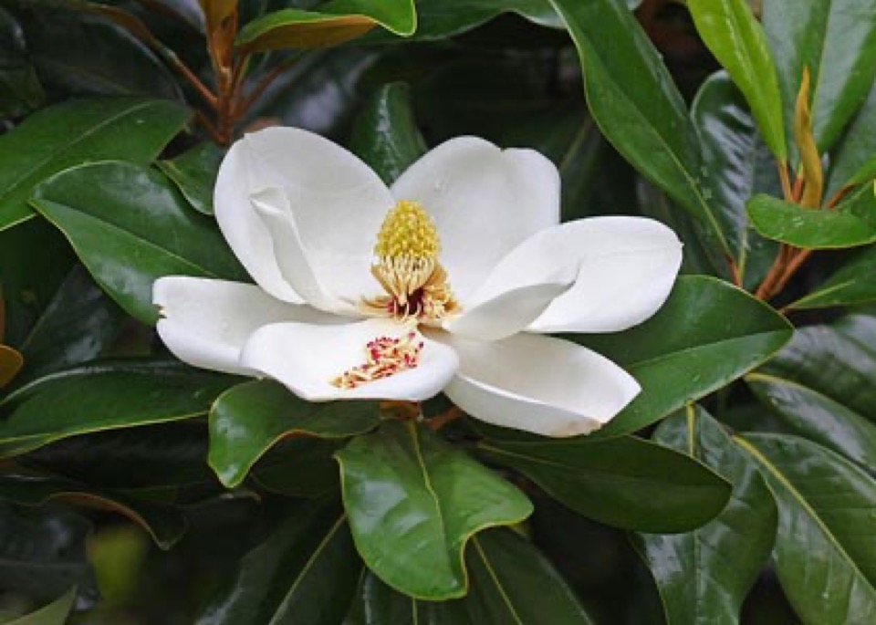
*꽃 | 꽃: 꽃덮개 조각은 우유빛 또는 크림색을 띤 하양 꽃 · 단정꽃차례 · 암수한꽃(양성화)*

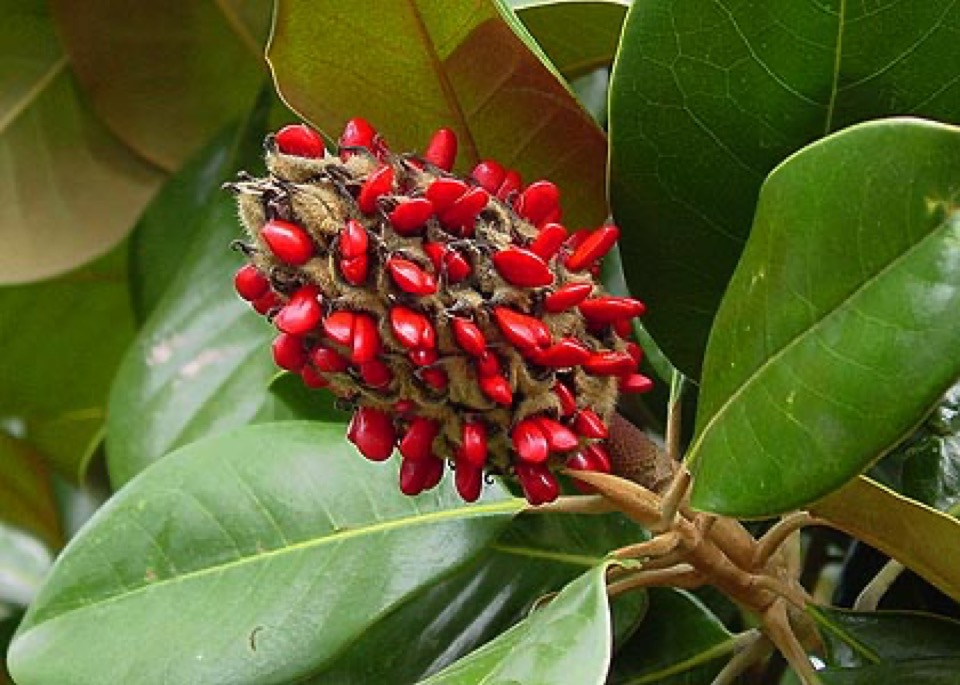
*열매 | 열매: 초록빛 하양 열매 · 쪽꼬투리열매(대과, 골돌)*

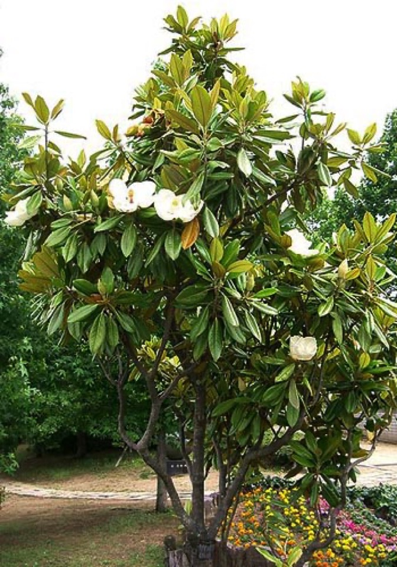
*수형 | 수형: 외줄기, 높이 10~30(37) m · 수피: 껍질은 회색, 담갈색*

### 감별 핵심 포인트
- 잎이 크고 두껍고 윤기가 납니다.
- 매우 큰 흰 꽃이 잎 사이에 핍니다.
- 원뿔 모양으로 모인 열매에서 붉은 씨가 드러납니다.

### 주된 형태 특징 (4대 감별 지표)
- **🌿 잎:** 어긋나기, 가지 끝에 돌려나기 생김새로 모여나지 않음 · 홑잎 · 가장자리: 밋밋하며, 안쪽으로 약간 굽음 · 곁맥은 8~(10)15쌍
- **🌸 꽃:** 꽃덮개 조각은 우유빛 또는 크림색을 띤 하양 꽃 · 단정꽃차례 · 암수한꽃(양성화)
- **🍒 열매:** 초록빛 하양 열매 · 쪽꼬투리열매(대과, 골돌)
- **🪵 줄기·수형:** 외줄기, 높이 10~30(37) m · 수피: 껍질은 회색, 담갈색

**비교·주의:** 백목련과는 꽃이 필 때 잎의 유무와 두꺼운 잎의 질감을 비교하세요.

[파이팅혼공 TV 강의](https://www.youtube.com/watch?v=K3PvgTi3eXI&t=8050s) · [수목도감(treeworld)](https://treeworld.co.kr/a01_01_02/28401) · [위키백과(한국어)](https://ko.wikipedia.org/wiki/%ED%83%9C%EC%82%B0%EB%AA%A9) · [Wikipedia(English)](https://en.wikipedia.org/wiki/Magnolia_grandiflora)

## 103. 탱자나무
> *Citrus trifoliata L.* · Rutaceae 운향과

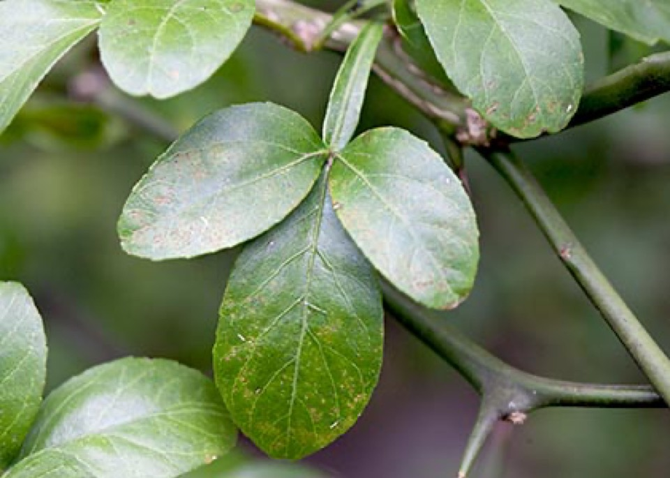
*잎 | 잎: 어긋나기 · 삼출엽 · 가장자리: 무딘 톱니가 있음*

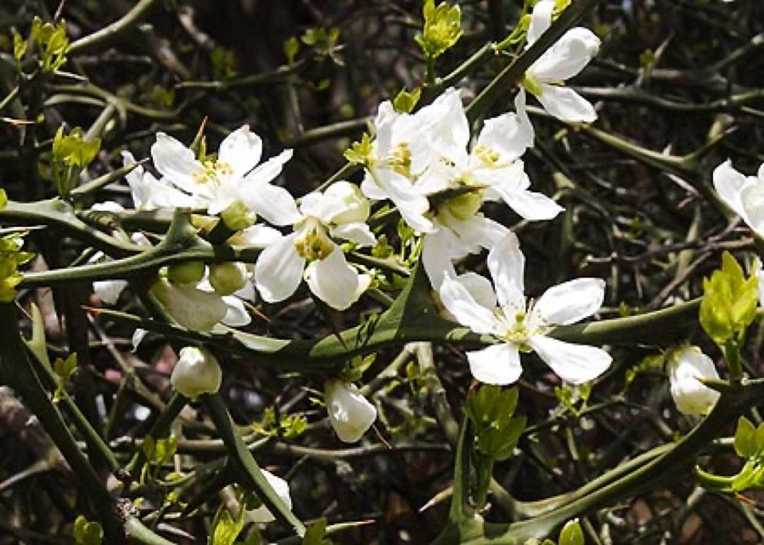
*꽃 | 꽃: 하양 꽃 · 가지 끝(정생) 또는 잎겨드랑이(액생)에 1개 또는 2개씩 달림 · 갈래꽃 (이판화)으로 지름 3.5~5 cm*

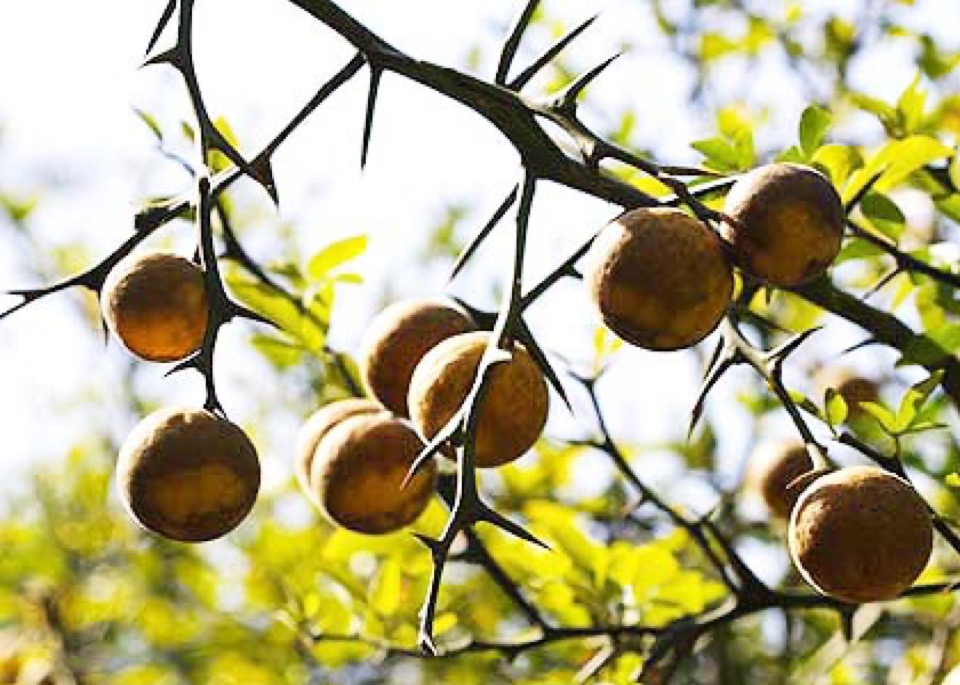
*열매 | 열매: 노랑 열매 · 물열매(장과)*

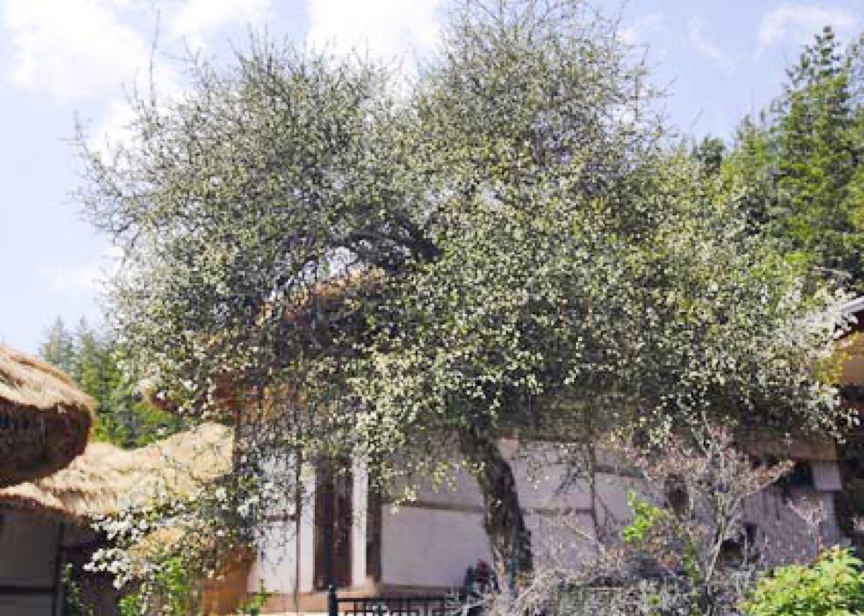
*수형 | 수형: 높이 1~5 m · 수피: 수직으로 무늬가 나는 어두운 갈색과 회갈색*

### 감별 핵심 포인트
- 녹색 가지에 길고 날카로운 가시가 있습니다.
- 작은 잎 세 장이 한 세트로 달립니다.
- 흰 꽃과 둥글고 노랗게 익는 탱자 열매가 특징입니다.

### 주된 형태 특징 (4대 감별 지표)
- **🌿 잎:** 어긋나기 · 삼출엽 · 가장자리: 무딘 톱니가 있음 · 그물맥
- **🌸 꽃:** 하양 꽃 · 가지 끝(정생) 또는 잎겨드랑이(액생)에 1개 또는 2개씩 달림 · 갈래꽃 (이판화)으로 지름 3.5~5 cm
- **🍒 열매:** 노랑 열매 · 물열매(장과)
- **🪵 줄기·수형:** 높이 1~5 m · 수피: 수직으로 무늬가 나는 어두운 갈색과 회갈색

**비교·주의:** 귤처럼 보이는 열매만 보지 말고 녹색 가시와 세 장의 잎을 확인하세요.

[파이팅혼공 TV 강의](https://www.youtube.com/watch?v=K3PvgTi3eXI&t=8110s) · [수목도감(treeworld)](https://treeworld.co.kr/a01_01_02/28391) · [위키백과(한국어)](https://ko.wikipedia.org/wiki/%ED%83%B1%EC%9E%90%EB%82%98%EB%AC%B4) · [Wikipedia(English)](https://en.wikipedia.org/wiki/Trifoliate_orange)

## 104. 백합나무
> *Liriodendron tulipifera L.* · Magnoliaceae 목련과

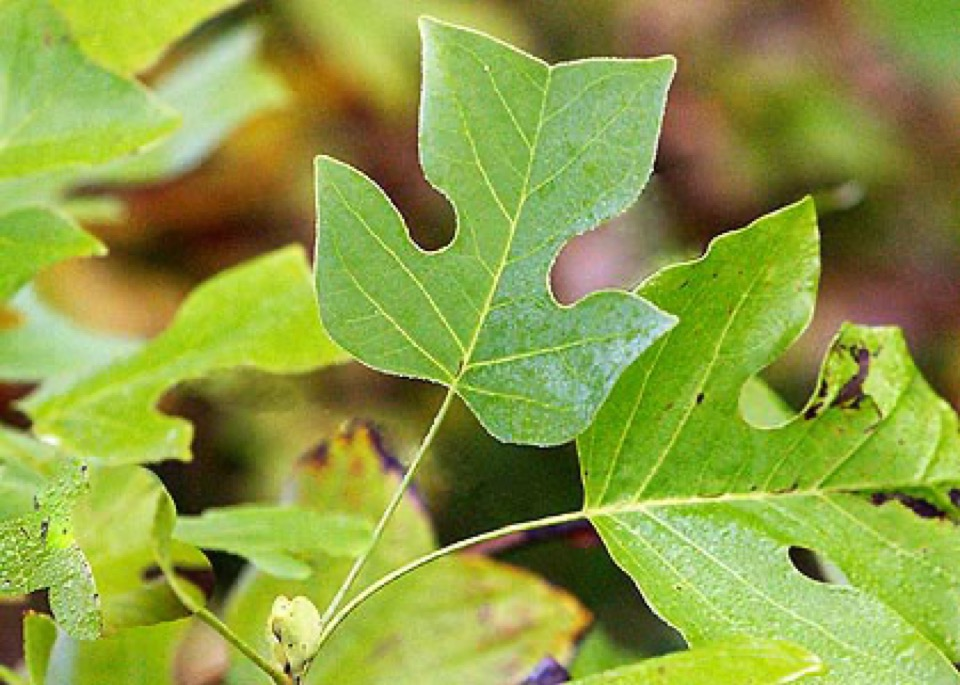
*잎 | 잎: 어긋나기 · 홑잎 · 가장자리: 밋밋함*

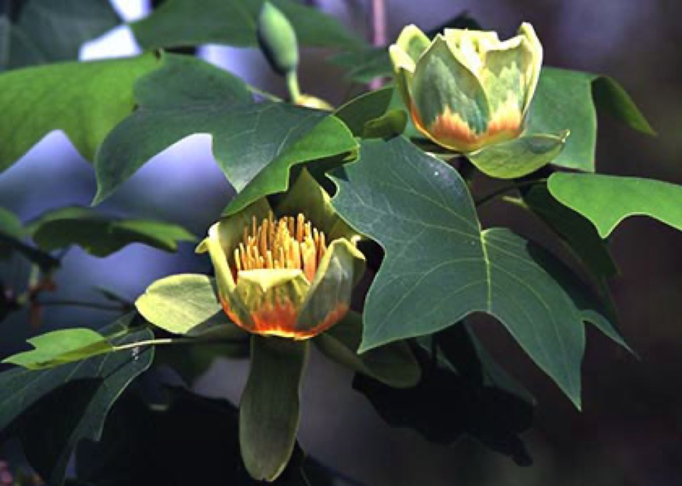
*꽃 | 꽃: 꽃잎은 연한 초록빛 노랑 꽃 · 단정화 · 종형으로 튤립과 같은 꽃이 가지 끝에 1개씩 달림*

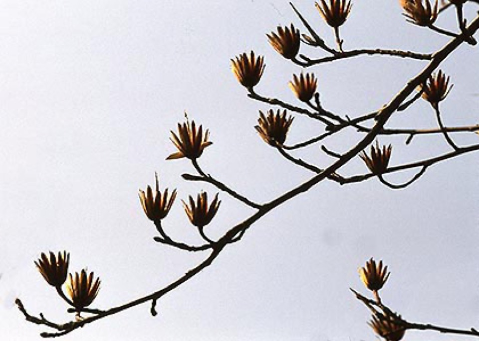
*열매 | 열매: 초록에서 노란 갈색으로 변함 열매 · 솔방울꼴로 모여 바로 섬*

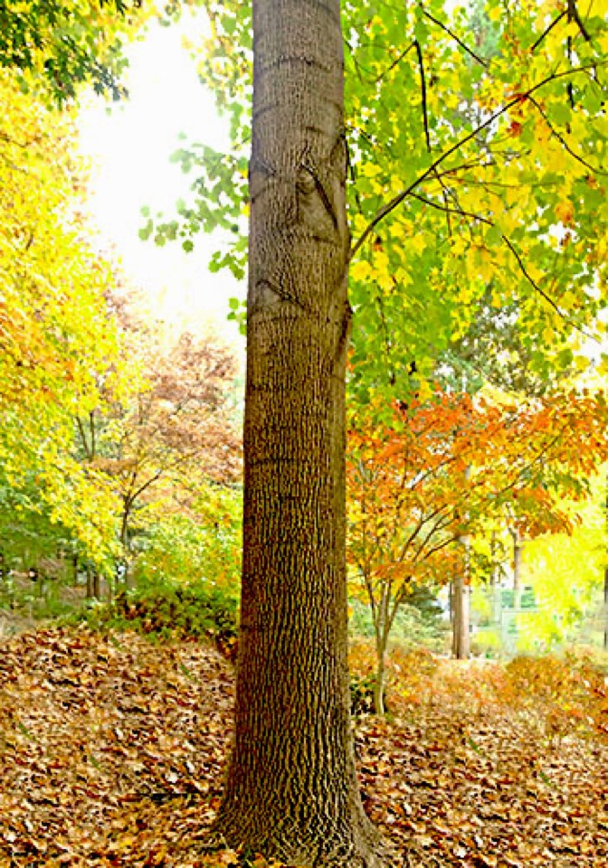
*수형 | 수형: 높이 20~36 m, 지름 50~100 cm · 수피: 검은 갈색 또는 회빛 하양*

### 감별 핵심 포인트
- 잎 끝이 잘린 듯한 독특한 모양으로 갈라집니다.
- 녹황색 꽃이 튤립처럼 위를 향해 핍니다.
- 가을에 노란 단풍이 들며 열매가 위로 모여 섭니다.

### 주된 형태 특징 (4대 감별 지표)
- **🌿 잎:** 어긋나기 · 홑잎 · 가장자리: 밋밋함 · 깃꼴 그믈맥
- **🌸 꽃:** 꽃잎은 연한 초록빛 노랑 꽃 · 단정화 · 종형으로 튤립과 같은 꽃이 가지 끝에 1개씩 달림
- **🍒 열매:** 초록에서 노란 갈색으로 변함 열매 · 솔방울꼴로 모여 바로 섬
- **🪵 줄기·수형:** 높이 20~36 m, 지름 50~100 cm · 수피: 검은 갈색 또는 회빛 하양

**비교·주의:** 영상 104번은 ‘백합나무’이며 ‘튤립나무’도 같은 수목 이름으로 인정합니다.

[파이팅혼공 TV 강의](https://www.youtube.com/watch?v=K3PvgTi3eXI&t=8210s) · [수목도감(treeworld)](https://treeworld.co.kr/a01_01_02/29811) · [위키백과(한국어)](https://ko.wikipedia.org/wiki/%EB%B0%B1%ED%95%A9%EB%82%98%EB%AC%B4) · [Wikipedia(English)](https://en.wikipedia.org/wiki/Liriodendron_tulipifera)

## 105. 팔손이
> *Fatsia japonica (Thunb.) Decne. & Planch.* · Araliaceae 두릅나무과

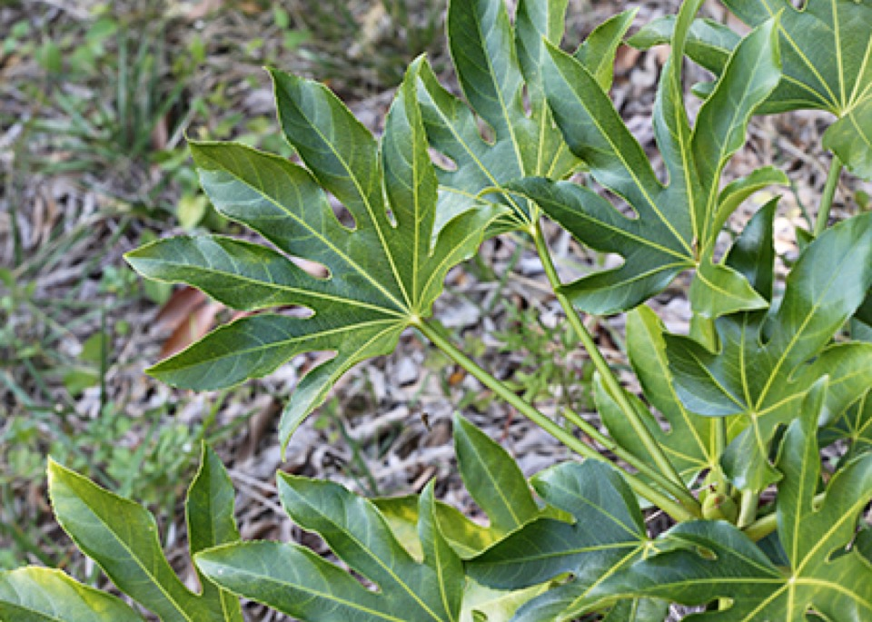
*잎 | 잎: 가지끝에 나선꼴로 모여 달린 어긋나기 · 홑잎 · 가장자리: 무딘 톱날꼴 톱니가 있음*

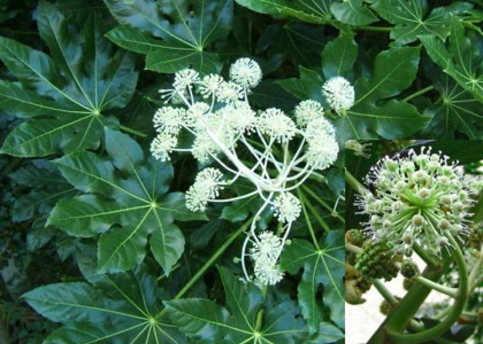
*꽃 | 꽃: 우유빛 하양 꽃 · 우산꽃차례가 모여서 원뿔꽃차례를 이루며, 줄기 및 가지 끝에 모여 달림 · 암수한꽃 또는 수꽃 암수한꽃 한그루(잡성화)*

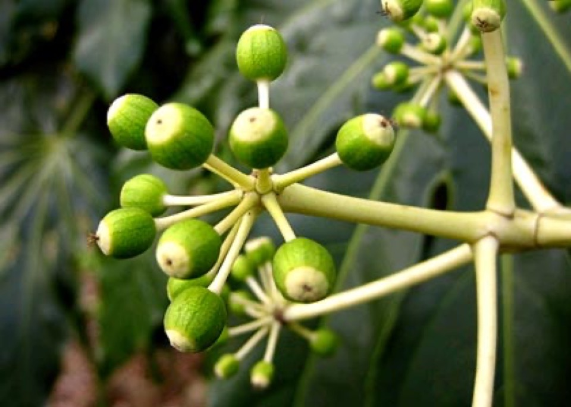
*열매 | 열매: 검정, 자줏빛 검정, 자주 열매 · 물열매(장과)*

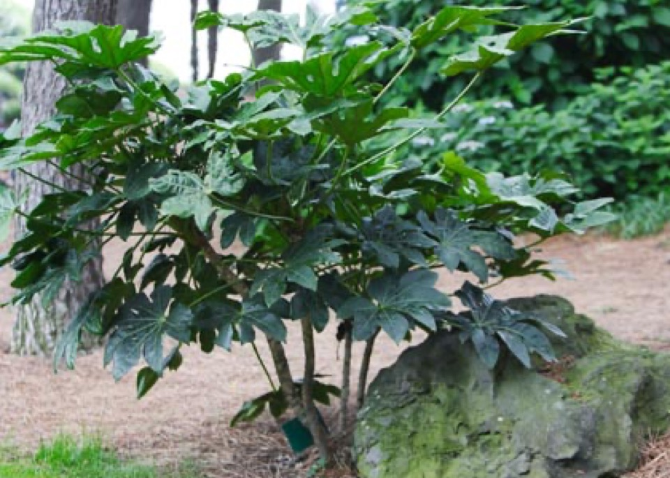
*수형 | 수형: 높이 1~3(5) m · 수피: 햇줄기는 초록*

### 감별 핵심 포인트
- 크고 윤기 있는 잎이 손바닥처럼 깊게 갈라집니다.
- 잎의 갈래가 여러 손가락처럼 퍼집니다.
- 작은 흰 꽃이 둥근 무리로 모여 핍니다.

### 주된 형태 특징 (4대 감별 지표)
- **🌿 잎:** 가지끝에 나선꼴로 모여 달린 어긋나기 · 홑잎 · 가장자리: 무딘 톱날꼴 톱니가 있음 · 손바닥꼴맥(장상맥)
- **🌸 꽃:** 우유빛 하양 꽃 · 우산꽃차례가 모여서 원뿔꽃차례를 이루며, 줄기 및 가지 끝에 모여 달림 · 암수한꽃 또는 수꽃 암수한꽃 한그루(잡성화)
- **🍒 열매:** 검정, 자줏빛 검정, 자주 열매 · 물열매(장과)
- **🪵 줄기·수형:** 높이 1~3(5) m · 수피: 햇줄기는 초록

**비교·주의:** 칠엽수처럼 작은잎이 따로 나뉜 겹잎과 구별하세요.

[파이팅혼공 TV 강의](https://www.youtube.com/watch?v=K3PvgTi3eXI&t=8250s) · [수목도감(treeworld)](https://treeworld.co.kr/a01_01_02/28373) · [위키백과(한국어)](https://ko.wikipedia.org/wiki/%ED%8C%94%EC%86%90%EC%9D%B4) · [Wikipedia(English)](https://en.wikipedia.org/wiki/Fatsia_japonica)

## 106. 팥배나무
> *Sorbus alnifolia (Siebold & Zucc.) C. Koch* · Rosaceae 장미과

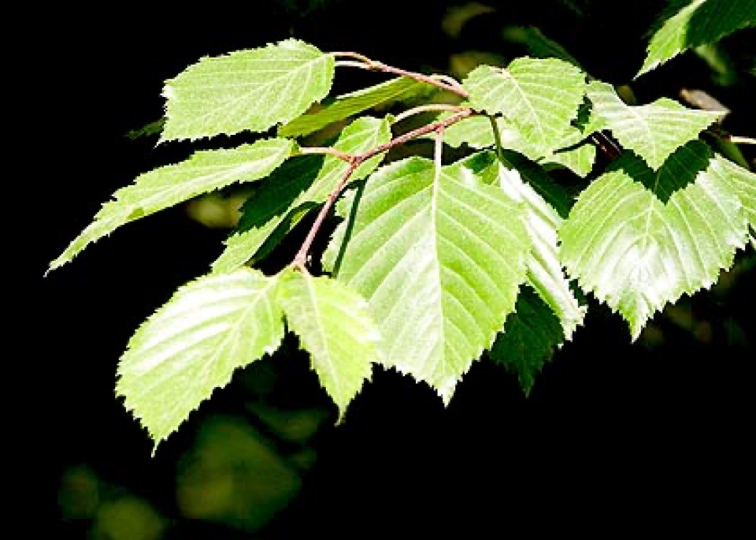
*잎 | 잎: 어긋나기 · 홑잎 · 가장자리: 불규칙하게 날카로운 겹톱니가 있거나 갈라짐*

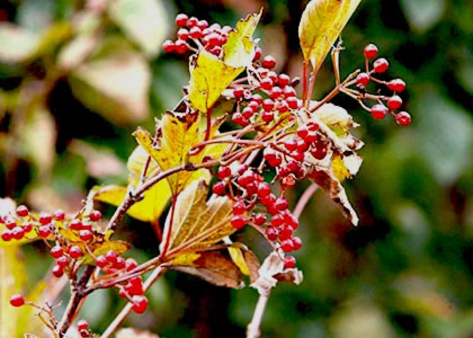
*열매 | 열매: 열매는 빨강 열매 · 배열매(이과)*

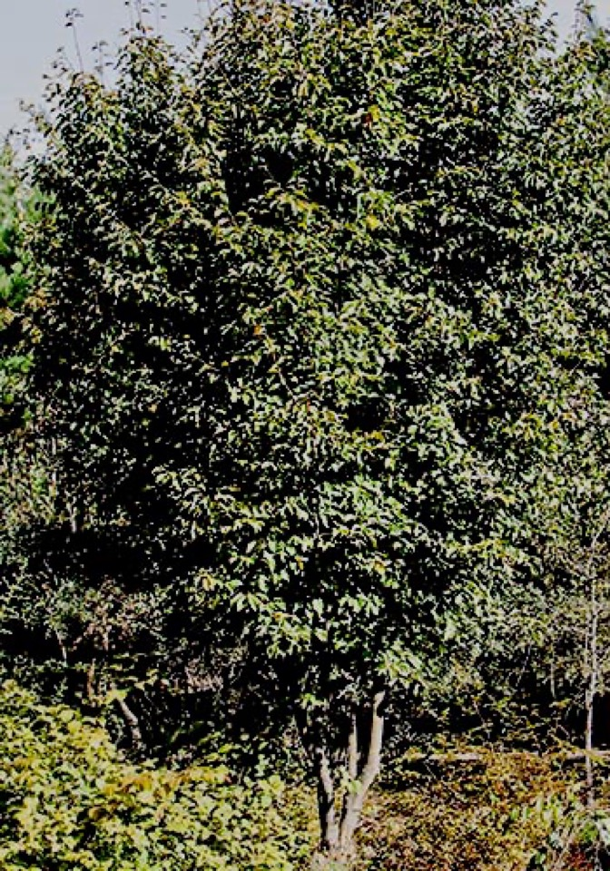
*수형 | 수형: 높이 8~15 m, 너비 6~9 m, 지름 30 cm · 수피: 회갈색 또는 검은 갈색*

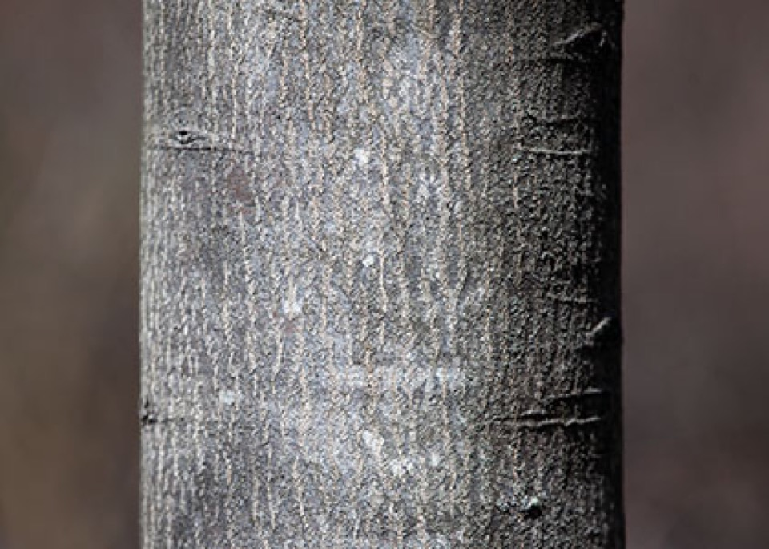
*줄기 | 줄기: 높이 8~15 m, 너비 6~9 m, 지름 30 cm · 수피: 회갈색 또는 검은 갈색*

### 감별 핵심 포인트
- 잎 가장자리에 불규칙한 이중 톱니가 있습니다.
- 흰 꽃이 가지 끝에서 여러 개 모여 핍니다.
- 작은 붉은 열매가 팥알처럼 다발로 달립니다.

### 주된 형태 특징 (4대 감별 지표)
- **🌿 잎:** 어긋나기 · 홑잎 · 가장자리: 불규칙하게 날카로운 겹톱니가 있거나 갈라짐 · 곁맥 6~10(14)쌍이 뒷쪽으로 솟아있고, 거의 평행으로 달리고 잎가장자리 톱니까지 이어짐
- **🌸 꽃:** 꽃잎 하양 꽃 · 겹고른꽃차례(복산방꽃차례) · 암수한그루
- **🍒 열매:** 열매는 빨강 열매 · 배열매(이과)
- **🪵 줄기·수형:** 높이 8~15 m, 너비 6~9 m, 지름 30 cm · 수피: 회갈색 또는 검은 갈색

**비교·주의:** 마가목과 달리 하나의 넓은 잎입니다. 붉은 열매와 잎을 함께 보세요.

[파이팅혼공 TV 강의](https://www.youtube.com/watch?v=K3PvgTi3eXI&t=8310s) · [수목도감(treeworld)](https://treeworld.co.kr/a01_01_02/28357) · [위키백과(한국어)](https://ko.wikipedia.org/wiki/%ED%8C%A5%EB%B0%B0%EB%82%98%EB%AC%B4) · [Wikipedia(English)](https://en.wikipedia.org/wiki/Alniaria_alnifolia)

## 107. 팽나무
> *Celtis sinensis Pers.* · Cannabaceae 삼과

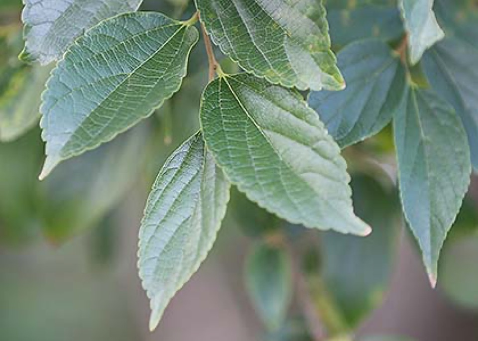
*잎 | 잎: 어긋나기 · 홑잎 · 가장자리: 아래쪽은 밋밋하나 윗쪽은 1*

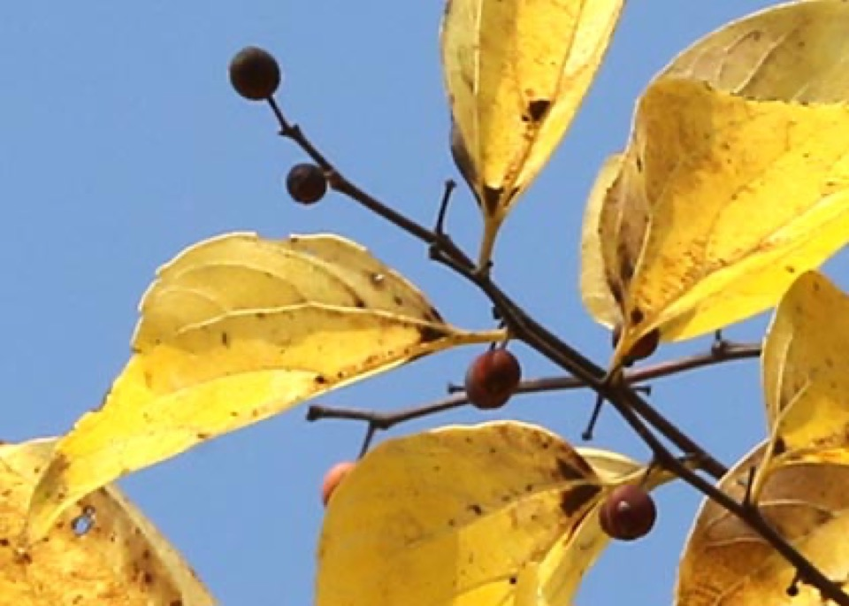
*열매 | 열매: 열매는 진한 주황에서 빨간 갈색 열매 · 굳은씨열매(핵과)*

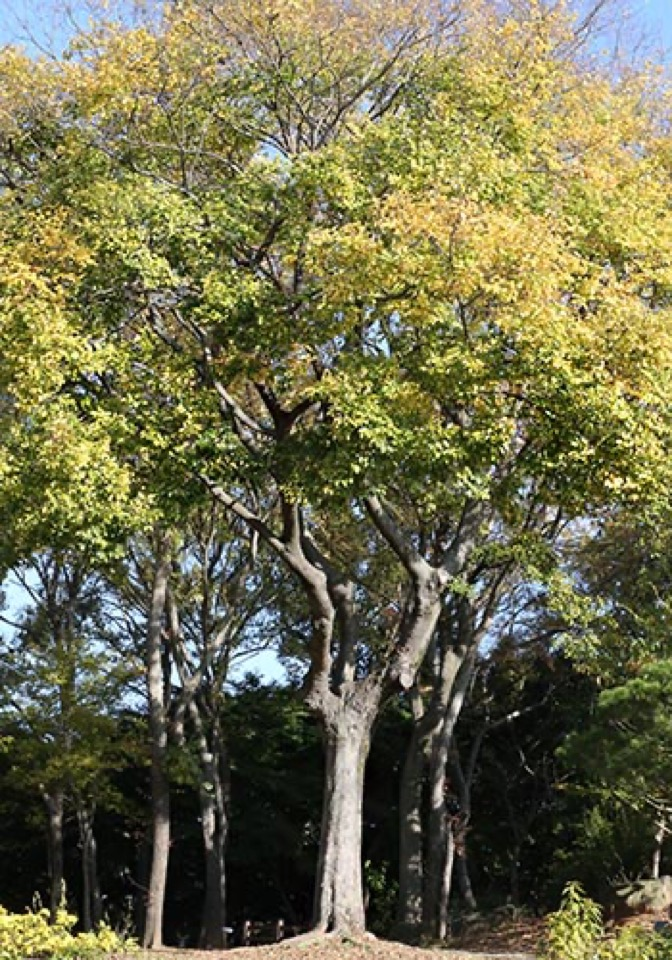
*수형 | 수형: 높이 20 m, 지름 1 m쯤으로 껍질은 매끄럽지만 약간 거칠고, 작은 껍질틈이 있음 · 수피: 회색, 검은 갈색, 회빛 검은갈색*

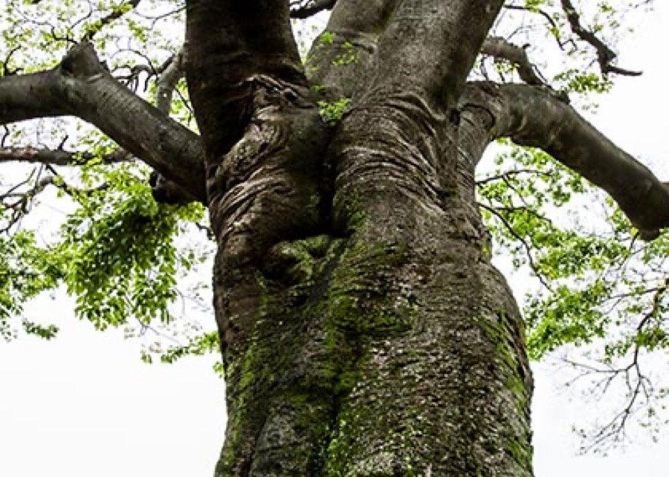
*줄기 | 줄기: 높이 20 m, 지름 1 m쯤으로 껍질은 매끄럽지만 약간 거칠고, 작은 껍질틈이 있음 · 수피: 회색, 검은 갈색, 회빛 검은갈색*

### 감별 핵심 포인트
- 잎 밑부분이 좌우 비대칭으로 비틀린 듯 보입니다.
- 잎의 윗부분에 톱니가 보입니다.
- 작고 둥근 열매가 황갈색·주황빛으로 익습니다.

### 주된 형태 특징 (4대 감별 지표)
- **🌿 잎:** 어긋나기 · 홑잎 · 가장자리: 아래쪽은 밋밋하나 윗쪽은 1 · 아래에서 3개의 기본맥(주맥)이 나옴
- **🌸 꽃:** 초록 꽃 · 암꽃은 잎겨드랑이에 1~3개씩 달림 · 암수한그루(1가화) 또는 암수한꽃과 수꽃(잡성화)
- **🍒 열매:** 열매는 진한 주황에서 빨간 갈색 열매 · 굳은씨열매(핵과)
- **🪵 줄기·수형:** 높이 20 m, 지름 1 m쯤으로 껍질은 매끄럽지만 약간 거칠고, 작은 껍질틈이 있음 · 수피: 회색, 검은 갈색, 회빛 검은갈색

**비교·주의:** 참느릅나무의 날개 열매와 비교하세요.

[파이팅혼공 TV 강의](https://www.youtube.com/watch?v=K3PvgTi3eXI&t=8390s) · [수목도감(treeworld)](https://treeworld.co.kr/a01_01_02/28349) · [위키백과(한국어)](https://ko.wikipedia.org/wiki/%ED%8C%BD%EB%82%98%EB%AC%B4) · [Wikipedia(English)](https://en.wikipedia.org/wiki/Celtis_sinensis)

## 108. 풍년화
> *Hamamelis japonica Siebold & Zucc.* · Hamamelidaceae 조록나무과

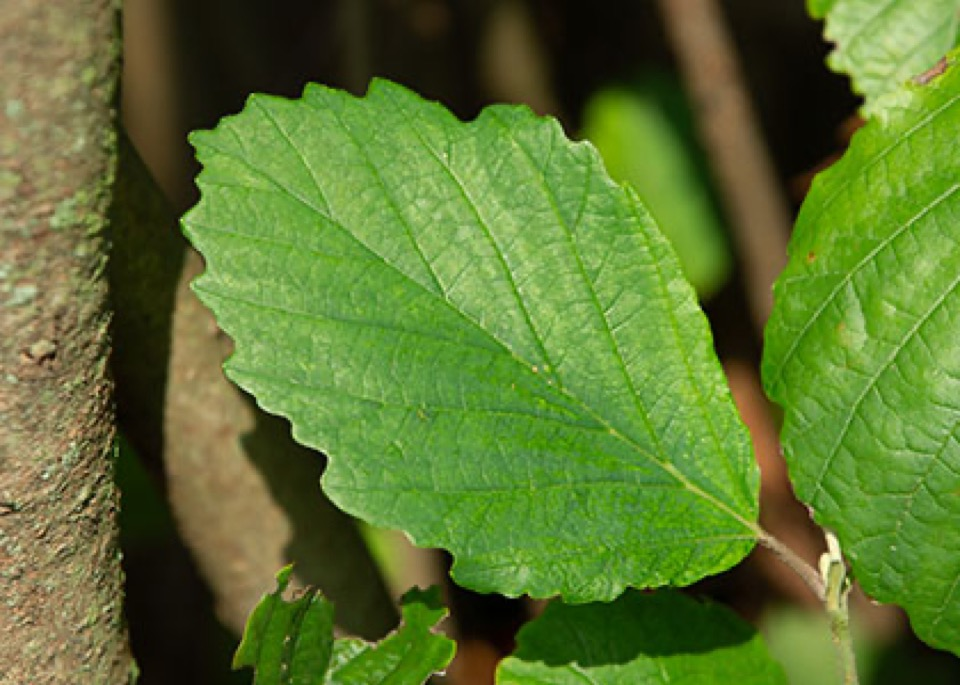
*잎 | 잎: 어긋나기 · 홑잎 · 가장자리: 잎몸 중간 아래는 톱니가 없으나 윗부분에는 물결꼴 톱니가 있고 질이 두꺼움*

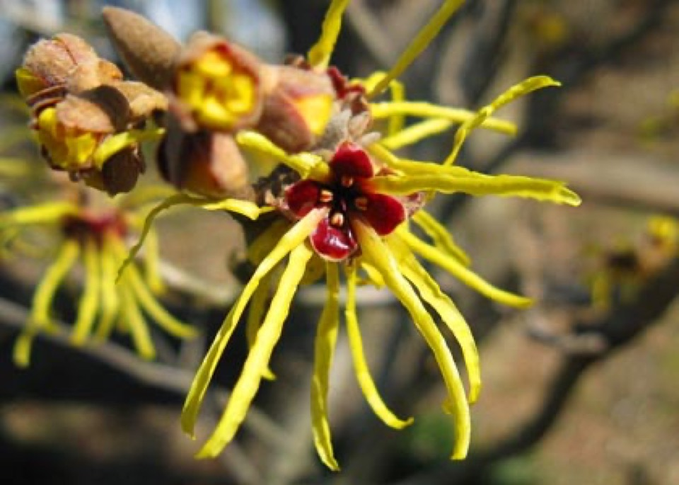
*꽃 | 꽃: 노랑 또는 빨간 갈색 꽃 · 전년 가지의 잎겨드랑이에서 1개씩 또는 여러 개가 모여 달림 · 암수한그루*

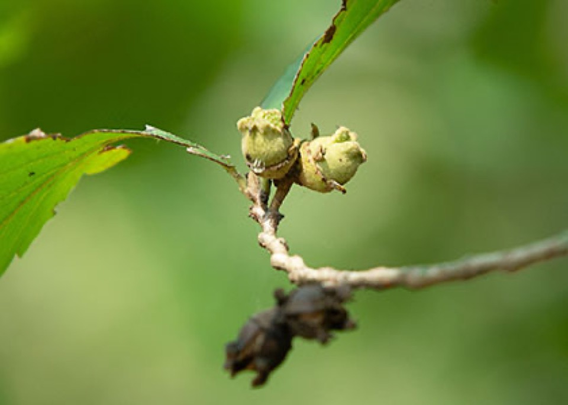
*열매 | 열매: 열매는 노란 갈색 열매 · 열개열매(삭과)*

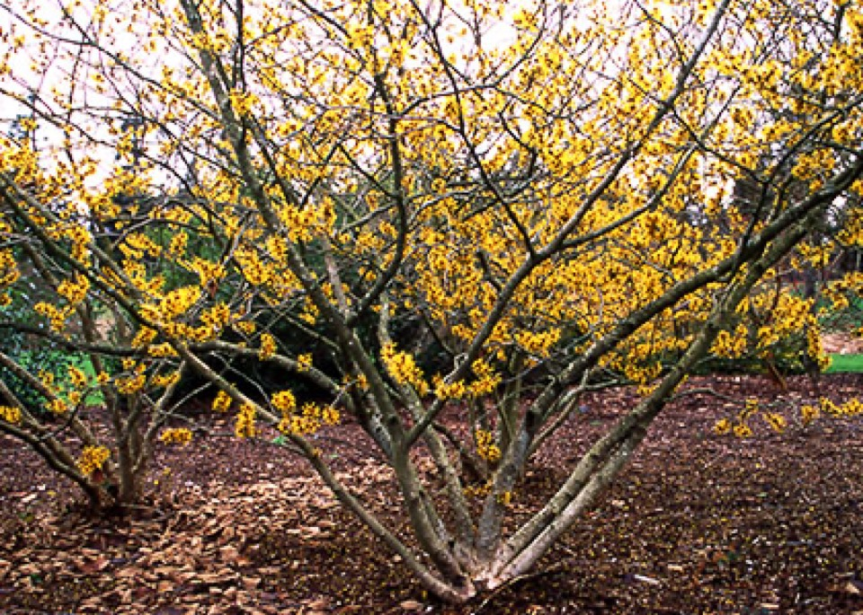
*수형 | 수형: 높이는 2.5~3 m 쯤으로 밑에서 줄기가 많이 올라와 큰 포기를 이룸 · 수피: 회갈색*

### 감별 핵심 포인트
- 가늘고 긴 노란 꽃잎이 리본처럼 말리며 퍼집니다.
- 잎이 나오기 전 가지에 독특한 꽃이 핍니다.
- 넓은 잎의 굵은 잎맥도 함께 확인하세요.

### 주된 형태 특징 (4대 감별 지표)
- **🌿 잎:** 어긋나기 · 홑잎 · 가장자리: 잎몸 중간 아래는 톱니가 없으나 윗부분에는 물결꼴 톱니가 있고 질이 두꺼움 · 곁맥은 6~9쌍(보통7쌍)
- **🌸 꽃:** 노랑 또는 빨간 갈색 꽃 · 전년 가지의 잎겨드랑이에서 1개씩 또는 여러 개가 모여 달림 · 암수한그루
- **🍒 열매:** 열매는 노란 갈색 열매 · 열개열매(삭과)
- **🪵 줄기·수형:** 높이는 2.5~3 m 쯤으로 밑에서 줄기가 많이 올라와 큰 포기를 이룸 · 수피: 회갈색

**비교·주의:** 노란 꽃의 가늘고 구불구불한 모양이 핵심입니다.

[파이팅혼공 TV 강의](https://www.youtube.com/watch?v=K3PvgTi3eXI&t=8450s) · [수목도감(treeworld)](https://treeworld.co.kr/a01_01_02/28315) · [위키백과(한국어)](https://ko.wikipedia.org/wiki/%ED%92%8D%EB%85%84%ED%99%94) · [Wikipedia(English)](https://en.wikipedia.org/wiki/Hamamelis_japonica)

## 109. 피나무
> *Tilia amurensis Rupr.* · Malvaceae 아욱과

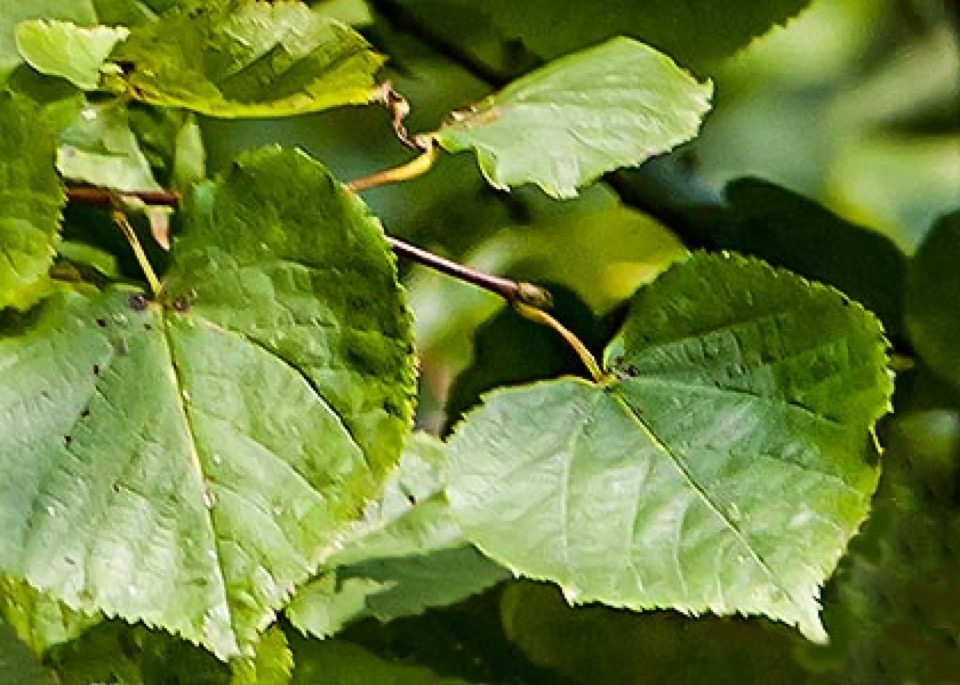
*잎 | 잎: 어긋나기 · 잎몸은 넓은 달걀형, 달걀꼴 둥근형, 심장형으로 길이 3~9 cm, 너비 3~4.5 cm · 가장자리: 날카로운 톱니가 있고, 톱니는 약 1 mm*

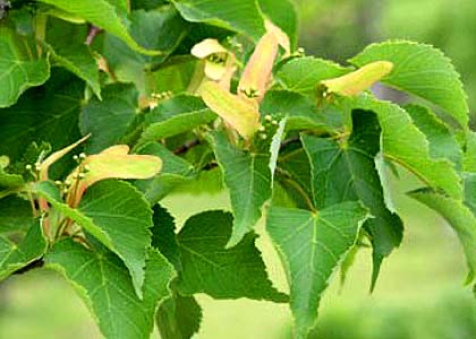
*꽃 | 꽃: 연한 노랑 꽃 · 산방꼴 취산꽃차례 · 암수한꽃*

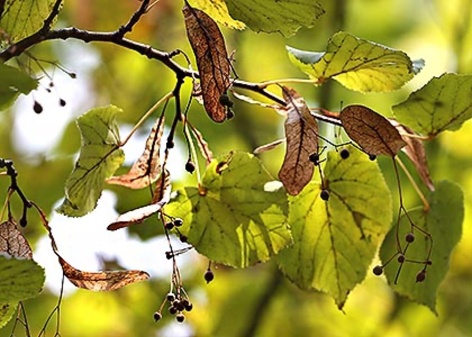
*열매 | 열매: 연한 갈색 열매 · 작은굳은씨열매(소견과)*

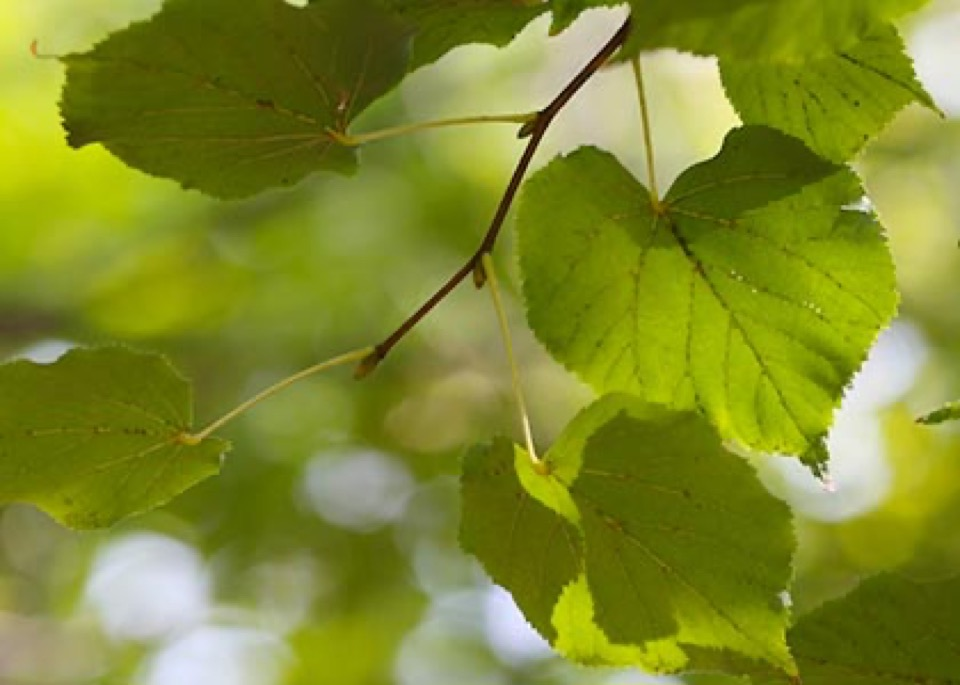
*수형 | 수형: 높이 20~25 m, 지름 1 m 쯤으로 곧게 자람 · 수피: 회빛 갈색, 회색*

### 감별 핵심 포인트
- 잎은 심장형이며 잎자루가 길고 가장자리에 톱니가 있습니다.
- 옅은 황색 꽃에서 긴 수술이 드러납니다.
- 꽃과 열매 자루에 붙은 길쭉한 포엽이 중요한 단서입니다.

### 주된 형태 특징 (4대 감별 지표)
- **🌿 잎:** 어긋나기 · 잎몸은 넓은 달걀형, 달걀꼴 둥근형, 심장형으로 길이 3~9 cm, 너비 3~4.5 cm · 가장자리: 날카로운 톱니가 있고, 톱니는 약 1 mm · 잎자루에서 기본맥이 7~8개가 올라간 손바닥꼴맥(장상맥)으로 곁맥은 4~5쌍이며, 맥겨드랑이에 하얀 또는 갈색의 털이 촘촘하게 있음
- **🌸 꽃:** 연한 노랑 꽃 · 산방꼴 취산꽃차례 · 암수한꽃
- **🍒 열매:** 연한 갈색 열매 · 작은굳은씨열매(소견과)
- **🪵 줄기·수형:** 높이 20~25 m, 지름 1 m 쯤으로 곧게 자람 · 수피: 회빛 갈색, 회색

**비교·주의:** 계수나무 등 심장형 잎을 가진 수목과 포엽 유무로 비교하세요.

[파이팅혼공 TV 강의](https://www.youtube.com/watch?v=K3PvgTi3eXI&t=8490s) · [수목도감(treeworld)](https://treeworld.co.kr/a01_01_02/28299) · [위키백과(한국어)](https://ko.wikipedia.org/wiki/%ED%94%BC%EB%82%98%EB%AC%B4) · [Wikipedia(English)](https://en.wikipedia.org/wiki/Tilia_amurensis)

## 110. 피라칸다
> *Pyracantha angustifolia (Franch.) C.K. Schneid.* · Rosaceae 장미과

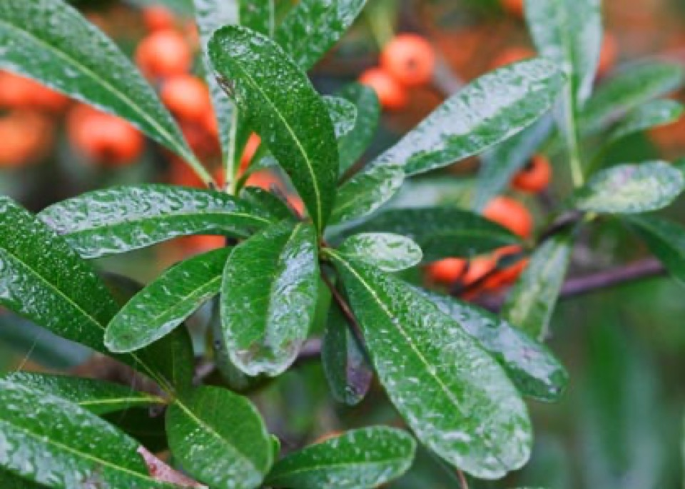
*잎 | 잎: 어긋나기 · 좁은 긴타원형 또는 거꿀피침꼴 타원형 · 가장자리: 밋밋함(전연) 또는 끝쪽으로 뚜럿하지 않게 작는 톱니가 있음*

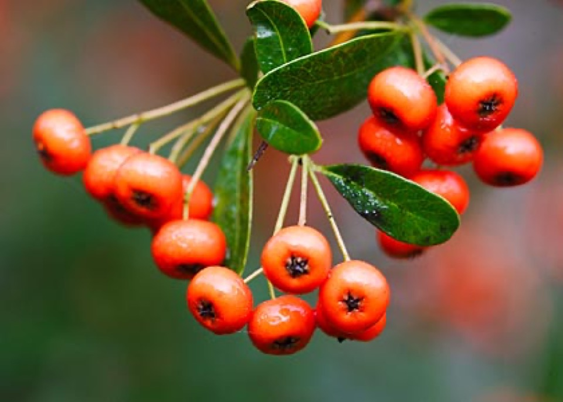
*열매 | 열매: 열매는 빨강 또는 주황 열매 · 배꼽열매(이과)*

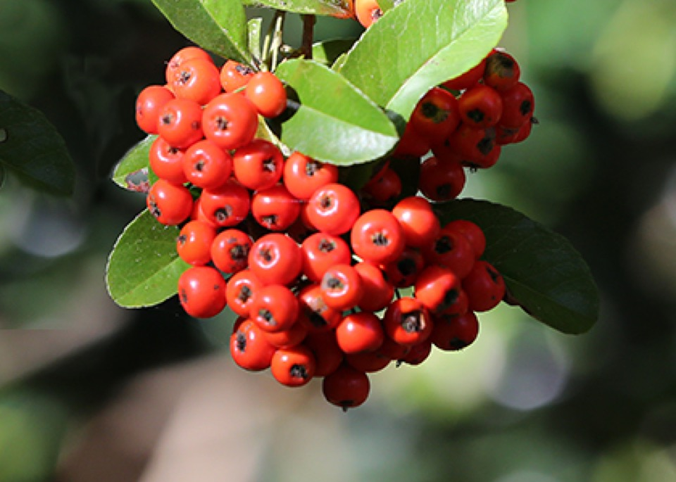
*수형 | 수형: 높이 4 m까지 자라고, 긴 가시가 발달하며, 때로는 땅에 엎드려 자람 · 수피: 회검정*

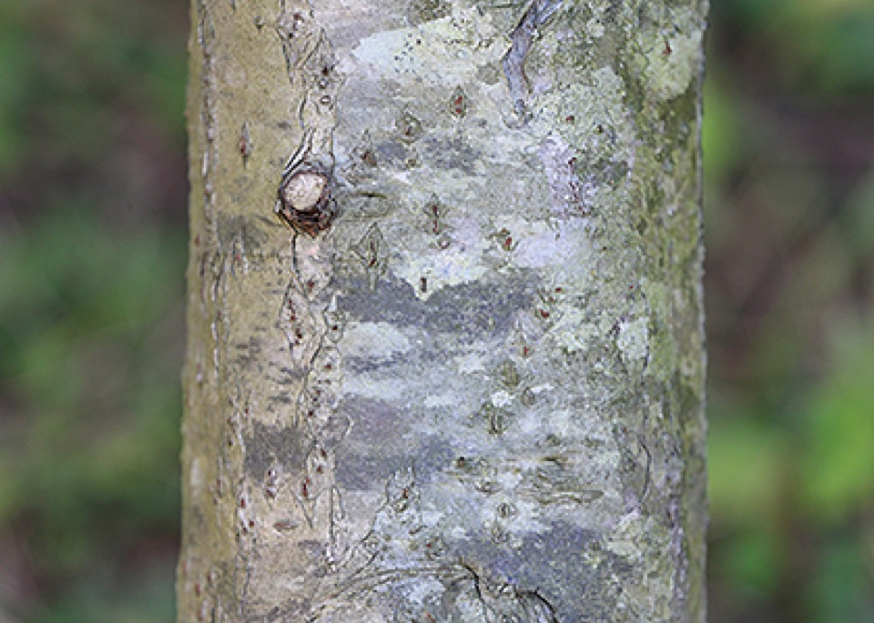
*줄기 | 줄기: 높이 4 m까지 자라고, 긴 가시가 발달하며, 때로는 땅에 엎드려 자람 · 수피: 회검정*

### 감별 핵심 포인트
- 작은 흰 꽃이 무리 지어 핍니다.
- 잎은 작고 두꺼운 긴 타원형입니다.
- 붉거나 주황빛 열매가 가지를 빽빽하게 덮습니다.

### 주된 형태 특징 (4대 감별 지표)
- **🌿 잎:** 어긋나기 · 좁은 긴타원형 또는 거꿀피침꼴 타원형 · 가장자리: 밋밋함(전연) 또는 끝쪽으로 뚜럿하지 않게 작는 톱니가 있음 · 곁맥은 5~7개로 흐릿함
- **🌸 꽃:** 하양 또는 연한 노란하양 꽃 · 겹산방꽃차례 · 꽃송이는 지름 2~4 cm이고, 몇개의 꽃을 달고 있음
- **🍒 열매:** 열매는 빨강 또는 주황 열매 · 배꼽열매(이과)
- **🪵 줄기·수형:** 높이 4 m까지 자라고, 긴 가시가 발달하며, 때로는 땅에 엎드려 자람 · 수피: 회검정

**비교·주의:** 영상 표기는 ‘피라칸다’입니다. ‘피라칸타’도 정답으로 인정합니다.

[파이팅혼공 TV 강의](https://www.youtube.com/watch?v=K3PvgTi3eXI&t=8570s) · [수목도감(treeworld)](https://treeworld.co.kr/a01_01_02/28291) · [위키백과(한국어)](https://ko.wikipedia.org/wiki/%ED%94%BC%EB%9D%BC%EC%B9%B8%ED%83%80) · [Wikipedia(English)](https://en.wikipedia.org/wiki/Pyracantha_angustifolia)

## 111. 해당화
> *Rosa rugosa Thunb.* · Rosaceae 장미과

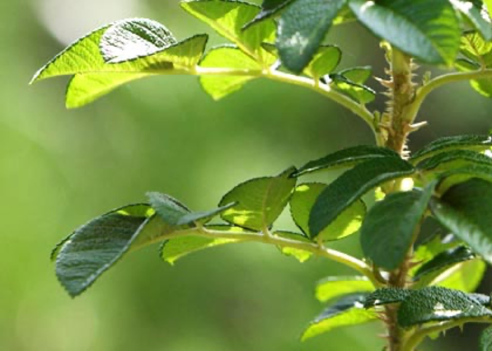
*잎 | 잎: 어긋나기 · 홀수 깃꼴 겹잎 · 가장자리: 날카로운 잔톱니가 있음*

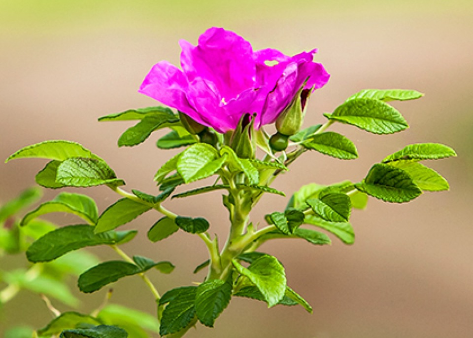
*꽃 | 꽃: 진한 분홍, 빨간 보라 꽃 · 1개의 꽃 또는 여러개의 송이 꽃 · 지름 6~9 cm*

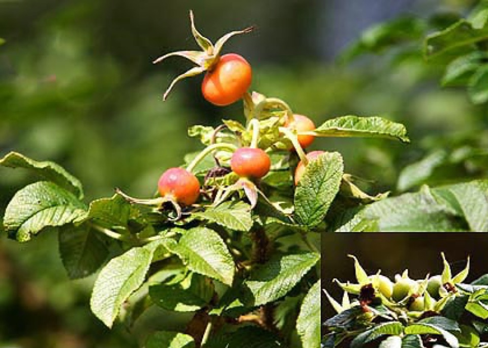
*열매 | 열매: 주홍 또는 빨강으로 반질거림 열매 · 얇은 열매(수과)*

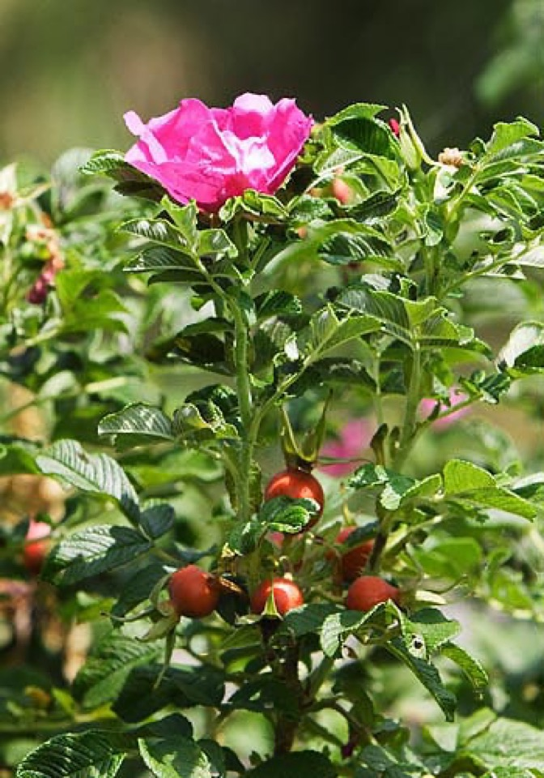
*수형 | 수형: 높이 1~2 m · 수피: 노란 갈색*

### 감별 핵심 포인트
- 큰 분홍 꽃이 피며 가운데 노란 수술이 모여 있습니다.
- 작은 잎들이 깃 모양으로 배열되고 잎맥이 깊게 보입니다.
- 붉은 열매 끝에 꽃받침이 남습니다.

### 주된 형태 특징 (4대 감별 지표)
- **🌿 잎:** 어긋나기 · 홀수 깃꼴 겹잎 · 가장자리: 날카로운 잔톱니가 있음 · 앞면은 잎맥에 따라 주름이 깊게 패이고, 뒷면의 맥이 튀어나옴
- **🌸 꽃:** 진한 분홍, 빨간 보라 꽃 · 1개의 꽃 또는 여러개의 송이 꽃 · 지름 6~9 cm
- **🍒 열매:** 주홍 또는 빨강으로 반질거림 열매 · 얇은 열매(수과)
- **🪵 줄기·수형:** 높이 1~2 m · 수피: 노란 갈색

[파이팅혼공 TV 강의](https://www.youtube.com/watch?v=K3PvgTi3eXI&t=8710s) · [수목도감(treeworld)](https://treeworld.co.kr/a01_01_02/28105) · [위키백과(한국어)](https://ko.wikipedia.org/wiki/%ED%95%B4%EB%8B%B9%ED%99%94) · [Wikipedia(English)](https://en.wikipedia.org/wiki/Rosa_rugosa)

## 112. 향나무
> *Juniperus chinensis L.* · Cupressaceae 측백나무과

*꽃 | 꽃: 암꽃방울(종자방울)은 연한 보라빛 초록이고, 익으면 갈색 꽃 · 1개씩 달리며, 암꽃대와 수꽃대 모두 지난 해 자란 비늘잎 가지끝 위에 달림 · 암수딴그루(자웅이주, 2가화), 드믈게 암수한그루(자웅동주, 1가화)*

*열매 | 열매: 씨방울은 자줏빛 검정으로 보통은 하얀가루가 있음 열매 · 씨방울열매(구과)*

*수형 | 수형: 높이 20~25 m, 지름 0.8 m 쯤이고, 넓거나 불규칙함. 늙은 줄기는 껍질이 세로로 갈라지면서 가는 조각처럼 벗겨짐 · 수피: 회갈색, 빨간 갈색,*

*줄기 | 줄기: 높이 20~25 m, 지름 0.8 m 쯤이고, 넓거나 불규칙함. 늙은 줄기는 껍질이 세로로 갈라지면서 가는 조각처럼 벗겨짐 · 수피: 회갈색, 빨간 갈색,*

### 감별 핵심 포인트
- 바늘 모양 잎과 비늘 모양 잎이 나타납니다.
- 둥근 열매가 어두운 자주색·검은빛으로 익습니다.
- 높게 자라는 수형과 잎·열매를 함께 봅니다.

### 주된 형태 특징 (4대 감별 지표)
- **🌿 잎:** 4~6줄로 배열 · 바늘잎(침엽)과 비늘잎(인엽)의 2종류 잎(二型葉)이 달리지만 주로 비늘잎이 주로 달림 · 가장자리: 비늘잎은 하얀색으로 밋밋함 · 중앙맥(증륵)은 도두라짐
- **🌸 꽃:** 암꽃방울(종자방울)은 연한 보라빛 초록이고, 익으면 갈색 꽃 · 1개씩 달리며, 암꽃대와 수꽃대 모두 지난 해 자란 비늘잎 가지끝 위에 달림 · 암수딴그루(자웅이주, 2가화), 드믈게 암수한그루(자웅동주, 1가화)
- **🍒 열매:** 씨방울은 자줏빛 검정으로 보통은 하얀가루가 있음 열매 · 씨방울열매(구과)
- **🪵 줄기·수형:** 높이 20~25 m, 지름 0.8 m 쯤이고, 넓거나 불규칙함. 늙은 줄기는 껍질이 세로로 갈라지면서 가는 조각처럼 벗겨짐 · 수피: 회갈색, 빨간 갈색,

**비교·주의:** 낮게 기어 자라는 눈향나무와 수형을 비교하세요.

[파이팅혼공 TV 강의](https://www.youtube.com/watch?v=K3PvgTi3eXI&t=8770s) · [수목도감(treeworld)](https://treeworld.co.kr/a01_01_02/28088) · [위키백과(한국어)](https://ko.wikipedia.org/wiki/%ED%96%A5%EB%82%98%EB%AC%B4) · [Wikipedia(English)](https://en.wikipedia.org/wiki/Juniperus_chinensis)

## 113. 호두나무
> *Juglans regia L.* · Juglandaceae 가래나무과

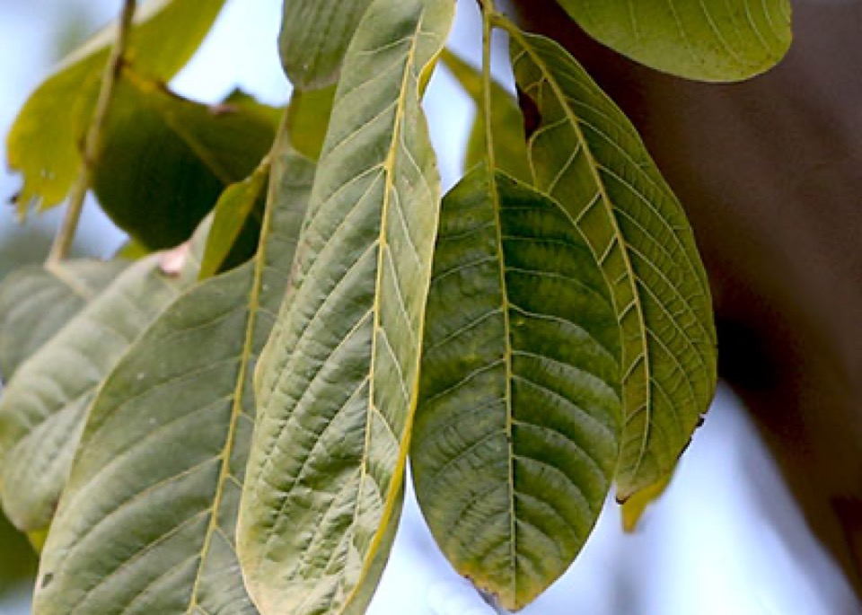
*잎 | 잎: 겹입은 어긋나기 · 홀수깃꼴겹잎(기수우상복엽)으로 길이 25~30cm · 가장자리: 밋밋하지만(성숙한 나무) 때로는 뚜렷하지 않은 작은 톱니가 있음(어린 나무)*

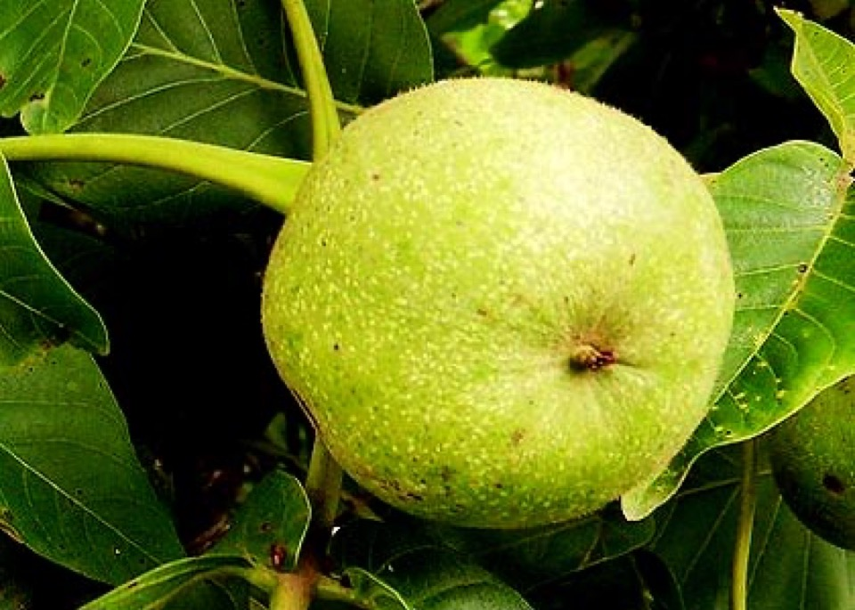
*열매 | 열매: 겉껍질은 초록이며, 안의 핵은 연한 갈색 열매 · 굳은씨열매(핵과)*

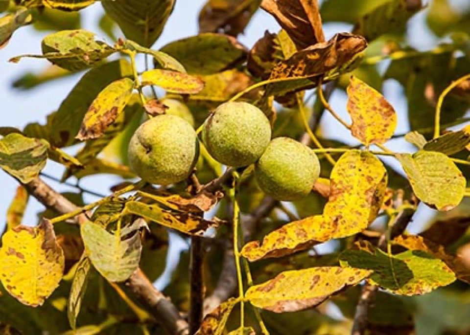
*수형 | 수형: 높이 20~25m · 수피: 회색, 약간 밝은 회색*

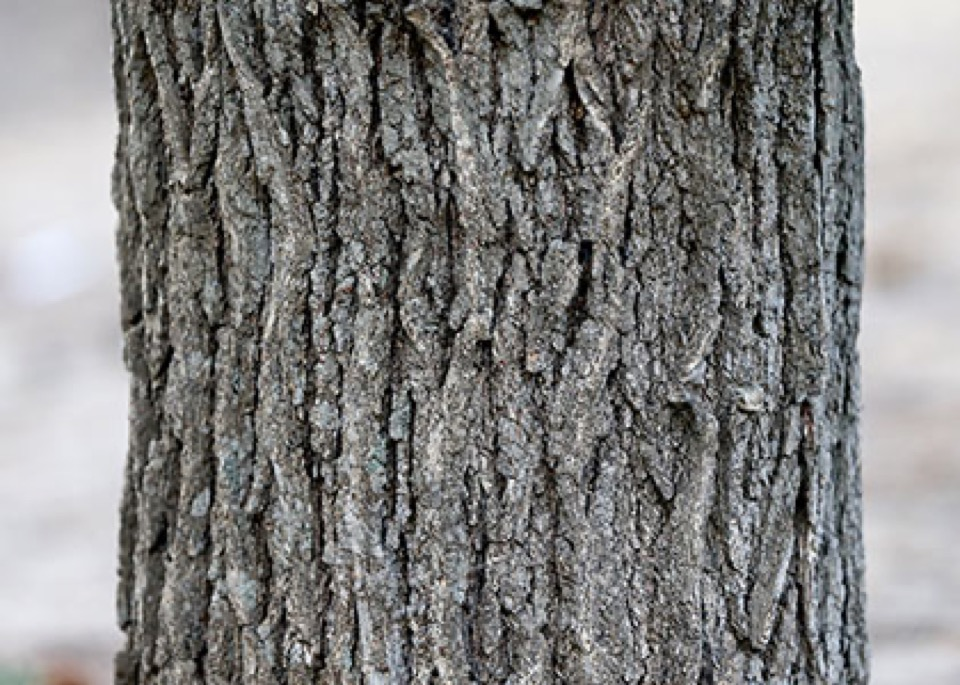
*줄기 | 줄기: 높이 20~25m · 수피: 회색, 약간 밝은 회색*

### 감별 핵심 포인트
- 여러 작은 잎이 양쪽에 달리는 홀수깃모양 겹잎입니다.
- 긴 수꽃차례가 아래로 늘어집니다.
- 녹색 껍질에 싸인 둥근 호두 열매를 확인하세요.

### 주된 형태 특징 (4대 감별 지표)
- **🌿 잎:** 겹입은 어긋나기 · 홀수깃꼴겹잎(기수우상복엽)으로 길이 25~30cm · 가장자리: 밋밋하지만(성숙한 나무) 때로는 뚜렷하지 않은 작은 톱니가 있음(어린 나무) · 깃털맥
- **🌸 꽃:** 암술머리는 붉은 빛을 띠지않음 꽃 · 암꽃은 햇가지에 달리며, 위를 향함 · 암수한그루(일가화, 자웅동주)
- **🍒 열매:** 겉껍질은 초록이며, 안의 핵은 연한 갈색 열매 · 굳은씨열매(핵과)
- **🪵 줄기·수형:** 높이 20~25m · 수피: 회색, 약간 밝은 회색

[파이팅혼공 TV 강의](https://www.youtube.com/watch?v=K3PvgTi3eXI&t=8790s) · [수목도감(treeworld)](https://treeworld.co.kr/a01_01_02/28260) · [위키백과(한국어)](https://ko.wikipedia.org/wiki/%ED%98%B8%EB%91%90%EB%82%98%EB%AC%B4) · [Wikipedia(English)](https://en.wikipedia.org/wiki/Juglans_regia)

## 114. 호랑가시나무
> *Ilex cornuta Lindl. & Paxton* · Aquifoliaceae 감탕나무과

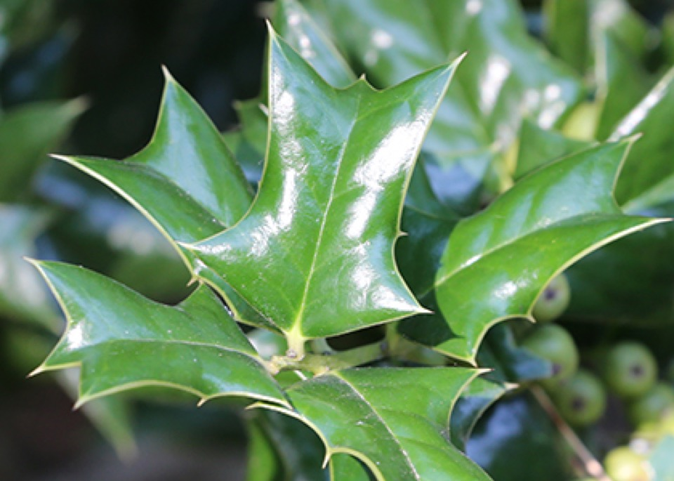
*잎 | 잎: 어긋나기 · 홑잎 · 가장자리: 각 모서리는 가시꼴이고, 한 쪽에 1~2개의 가시들이 있으며, 때로는 밋밋함(전연)*

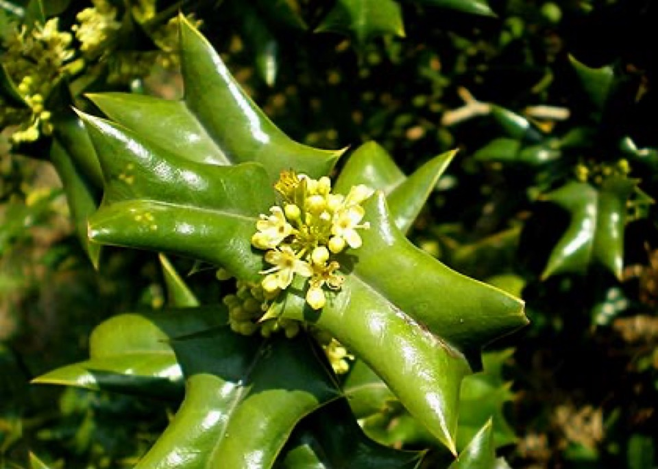
*꽃 | 꽃: 꽃잎은 하양 또는 연한 노랑 꽃 · 산형꽃차례 · 암수딴그루(이가화) 또는 잡성화*

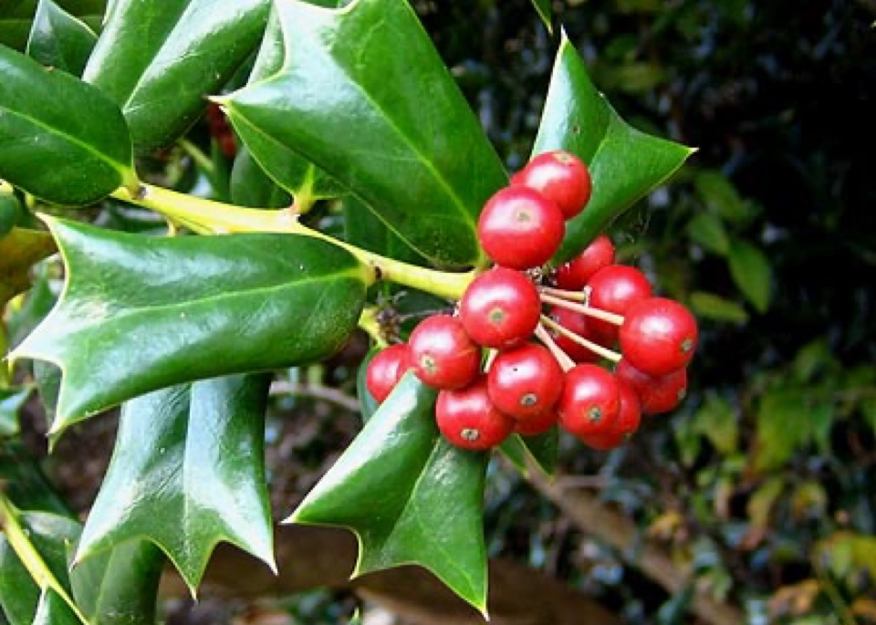
*열매 | 열매: 열매는 밝은 빨강( 품종에 따라 다양한 색을 갖임) 열매 · 굳은씨열매(핵과)*

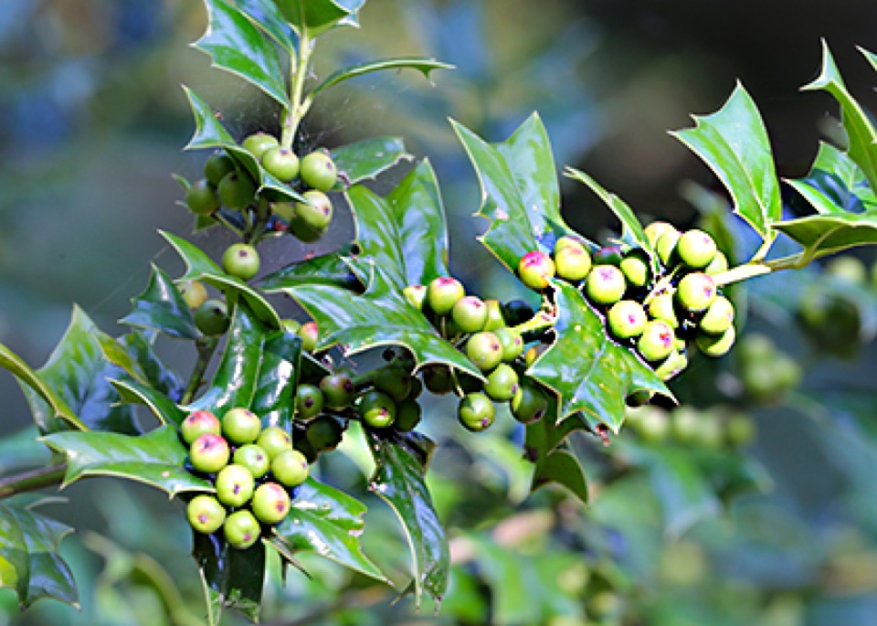
*수형 | 수형: 높이 1~5 m · 수피: 회색*

### 감별 핵심 포인트
- 두껍고 광택 있는 잎 가장자리에 크고 날카로운 가시가 있습니다.
- 잎 윤곽이 각지고 가시 끝이 뾰족합니다.
- 붉은 열매와 가시 달린 잎이 함께 보입니다.

### 주된 형태 특징 (4대 감별 지표)
- **🌿 잎:** 어긋나기 · 홑잎 · 가장자리: 각 모서리는 가시꼴이고, 한 쪽에 1~2개의 가시들이 있으며, 때로는 밋밋함(전연) · 곁맥은 5~6 쌍이고, 가장자리 가까이 그믈맥이고, 뒷면은 뚜렷하고, 앞면은 분명하지 않음
- **🌸 꽃:** 꽃잎은 하양 또는 연한 노랑 꽃 · 산형꽃차례 · 암수딴그루(이가화) 또는 잡성화
- **🍒 열매:** 열매는 밝은 빨강( 품종에 따라 다양한 색을 갖임) 열매 · 굳은씨열매(핵과)
- **🪵 줄기·수형:** 높이 1~5 m · 수피: 회색

**비교·주의:** 가시나무의 잎 톱니보다 훨씬 크고 날카로운 가시가 핵심입니다.

[파이팅혼공 TV 강의](https://www.youtube.com/watch?v=K3PvgTi3eXI&t=8830s) · [수목도감(treeworld)](https://treeworld.co.kr/a01_01_02/28252) · [위키백과(한국어)](https://ko.wikipedia.org/wiki/%ED%98%B8%EB%9E%91%EA%B0%80%EC%8B%9C%EB%82%98%EB%AC%B4) · [Wikipedia(English)](https://en.wikipedia.org/wiki/Ilex_cornuta)

## 115. 화살나무
> *Euonymus alatus (Thunb.) Siebold* · Celastraceae 노박덩굴과

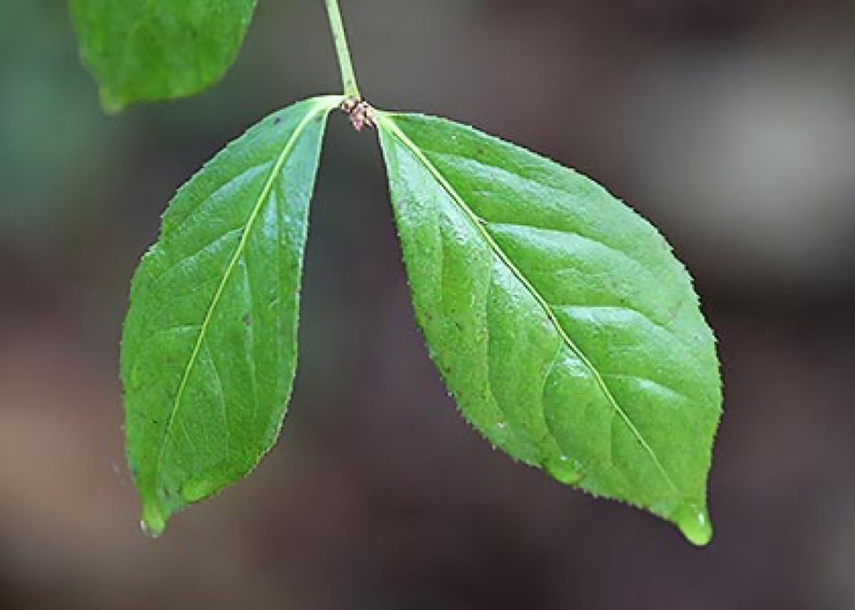
*잎 | 잎: 마주나기 · 홑잎 · 가장자리: 무딘 톱니 또는 날카로운 잔 톱니가 있음*

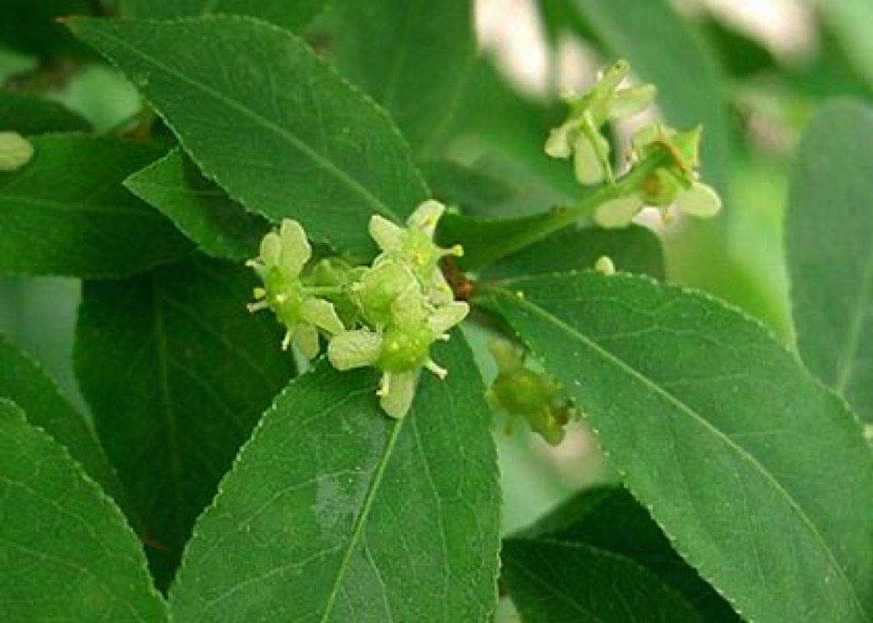
*꽃 | 꽃: 꽃잎은 초록, 연한 노랑 또는 노란 초록 꽃 · 모인꽃차례(취산화서) · 꽃대는 가늘고 짧으며, 1~2cm 이고, 전형적으로 3개의 꽃을 갖인 한개의 갈라진 가지를 갖거나 드믈게 더 많은 꽃을 갖인 2개의 갈라진 가지를 갖기도 함(보통은 양쪽에 3개씩, 가운데 1개)*

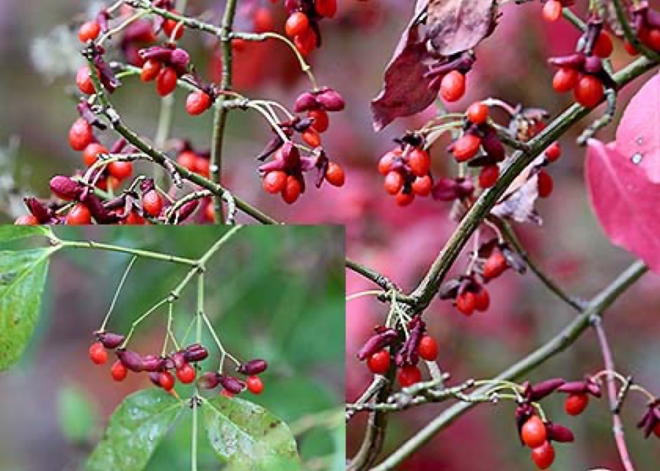
*열매 | 열매: 열매는 신선하면 빨간 갈색, 건조하면 진한 갈색 또는 회색 열매 · 열매는 4개로 갈라지며, 지름 1~1,3 cm 이고, 1~3개 만이 발달하며, 12월까지 달려 있음*

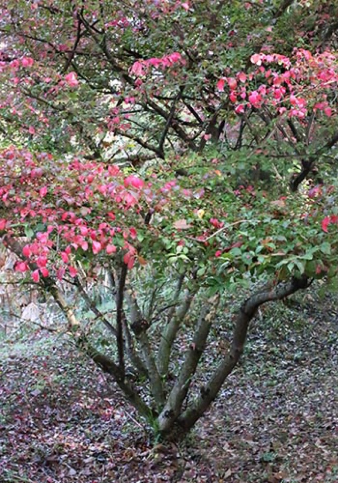
*수형 | 수형: 높이와 너비 1~4m · 수피: 짙은 회갈색*

### 감별 핵심 포인트
- 줄기에 코르크질 날개가 길게 붙어 있습니다.
- 가을에 잎이 붉게 물듭니다.
- 작은 황록색 꽃과 붉게 드러나는 씨도 확인하세요.

### 주된 형태 특징 (4대 감별 지표)
- **🌿 잎:** 마주나기 · 홑잎 · 가장자리: 무딘 톱니 또는 날카로운 잔 톱니가 있음 · 곁맥은 5~7쌍
- **🌸 꽃:** 꽃잎은 초록, 연한 노랑 또는 노란 초록 꽃 · 모인꽃차례(취산화서) · 꽃대는 가늘고 짧으며, 1~2cm 이고, 전형적으로 3개의 꽃을 갖인 한개의 갈라진 가지를 갖거나 드믈게 더 많은 꽃을 갖인 2개의 갈라진 가지를 갖기도 함(보통은 양쪽에 3개씩, 가운데 1개)
- **🍒 열매:** 열매는 신선하면 빨간 갈색, 건조하면 진한 갈색 또는 회색 열매 · 열매는 4개로 갈라지며, 지름 1~1,3 cm 이고, 1~3개 만이 발달하며, 12월까지 달려 있음
- **🪵 줄기·수형:** 높이와 너비 1~4m · 수피: 짙은 회갈색

**비교·주의:** 붉은 열매보다 줄기의 납작한 날개를 먼저 찾으세요.

[파이팅혼공 TV 강의](https://www.youtube.com/watch?v=K3PvgTi3eXI&t=8870s) · [수목도감(treeworld)](https://treeworld.co.kr/a01_01_02/28216) · [위키백과(한국어)](https://ko.wikipedia.org/wiki/%ED%99%94%EC%82%B4%EB%82%98%EB%AC%B4) · [Wikipedia(English)](https://en.wikipedia.org/wiki/Euonymus_alatus)

## 116. 회양목
> *Buxus microphylla Sieb. & Zucc.* · Buxaceae 회향목과

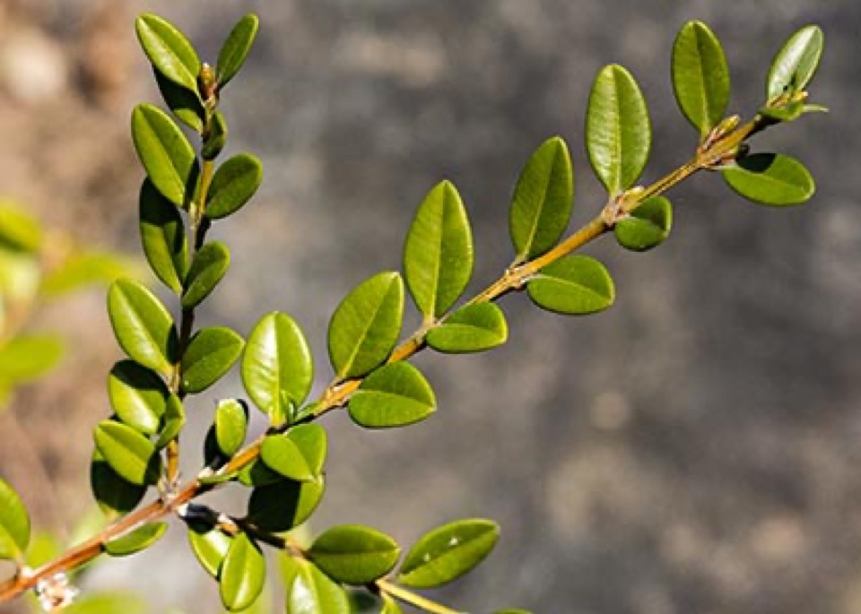
*잎 | 잎: 마주나기 · 홑잎 · 가장자리: 밋밋함(전연)*

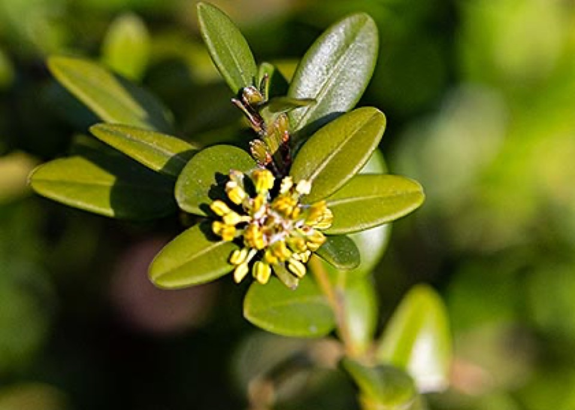
*꽃 | 꽃: 연한 노랑 꽃 · 머리꼴꽃차례(두상화서) · 암수한그루(일가화)*

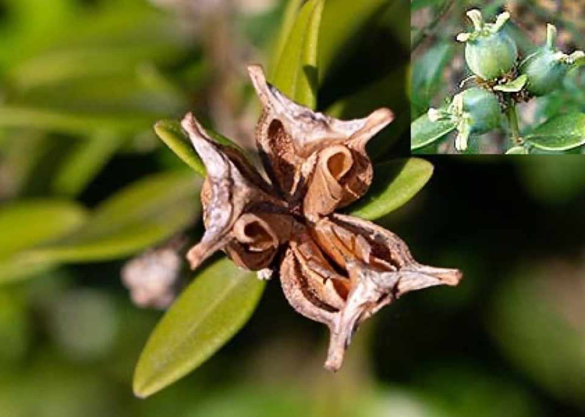
*열매 | 열매: 열매는 초록에서 갈색 열매 · 튀는열매(삭과)*

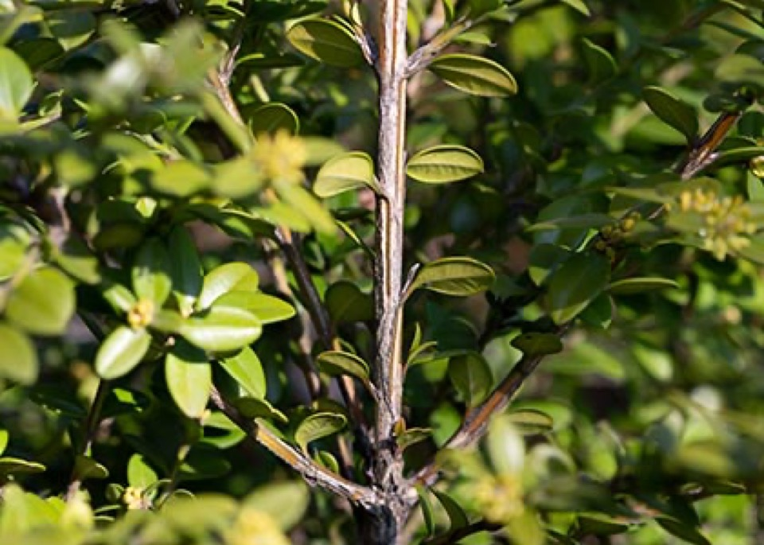
*수형 | 수형: 높이 (1)2~3(6) m, 지름 15 cm 안팎 · 수피: 회빛 하양, 회빛 검정*

### 감별 핵심 포인트
- 작고 두꺼운 타원형 잎이 마주 달립니다.
- 잎 끝이 둥글고 가지에 잎이 촘촘합니다.
- 작은 꽃과 갈라지는 마른 열매도 살펴보세요.

### 주된 형태 특징 (4대 감별 지표)
- **🌿 잎:** 마주나기 · 홑잎 · 가장자리: 밋밋함(전연) · 중앙맥은 높고, 곁맥은 흐릿하여 앞면 쪽으로 솟아보이고, 한 줄 또는 한쪽 끝이 두갈래로 갈라짐
- **🌸 꽃:** 연한 노랑 꽃 · 머리꼴꽃차례(두상화서) · 암수한그루(일가화)
- **🍒 열매:** 열매는 초록에서 갈색 열매 · 튀는열매(삭과)
- **🪵 줄기·수형:** 높이 (1)2~3(6) m, 지름 15 cm 안팎 · 수피: 회빛 하양, 회빛 검정

**비교·주의:** 꽝꽝나무의 검은 열매와 잎 배열을 함께 비교하세요.

[파이팅혼공 TV 강의](https://www.youtube.com/watch?v=K3PvgTi3eXI&t=8910s) · [수목도감(treeworld)](https://treeworld.co.kr/a01_01_02/28170) · [위키백과(한국어)](https://ko.wikipedia.org/wiki/%ED%9A%8C%EC%96%91%EB%AA%A9) · [Wikipedia(English)](https://en.wikipedia.org/wiki/Buxus_microphylla)

## 117. 회화나무
> *Styphnolobium japonicum (L.) Schott* · Leguminosae 콩과/ 콩아과

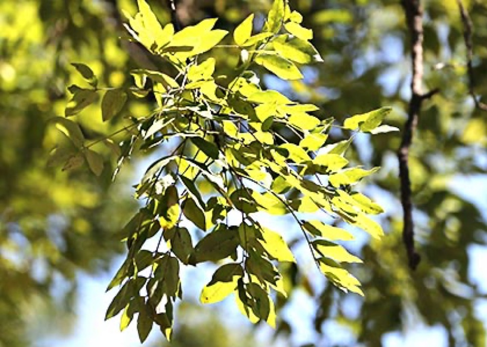
*잎 | 잎: 어긋나기 · 홀수깃꼴겹잎 · 가장자리: 톱니가 없음*

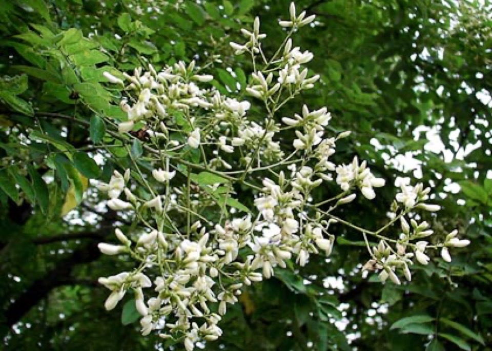
*꽃 | 꽃: 노랑 또는 크림같은 노랑, 드믈게 자줏빛 빨강 꽃 · 원뿔꽃차례 · 나비꼴꽃부리(접형화관)*

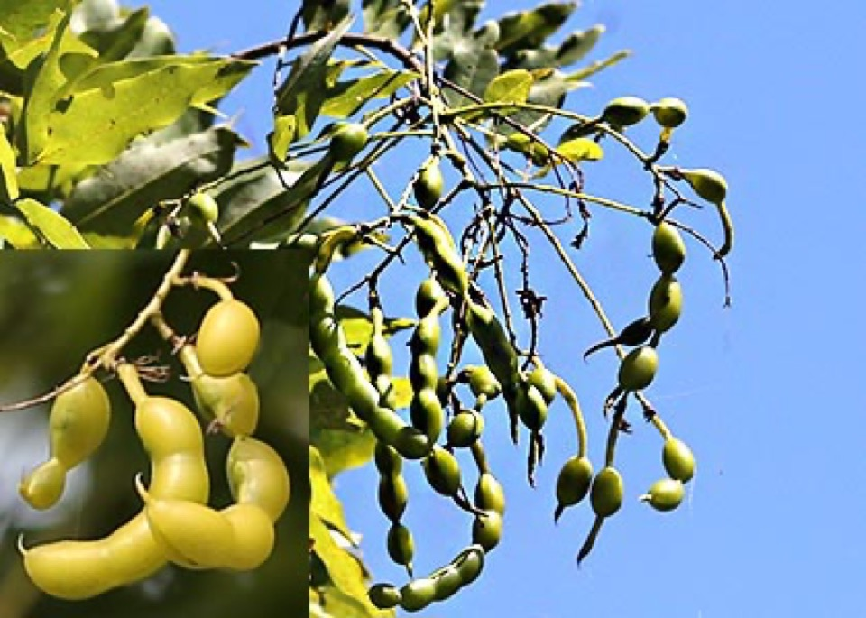
*열매 | 열매: 노랑 열매 · 협과*

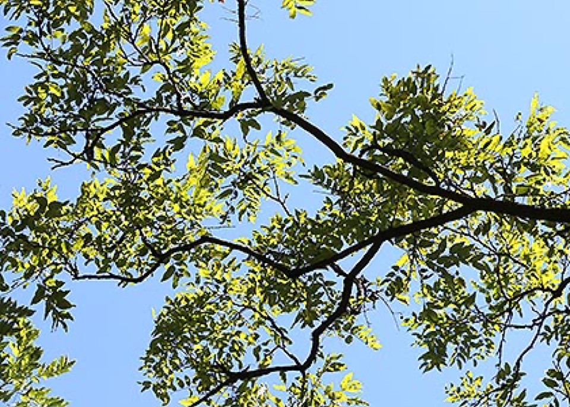
*수형 | 수형: 높이 25~30m · 수피: 회갈색 또는 어두운 갈색*

### 감별 핵심 포인트
- 작은 잎들이 양쪽으로 나란히 달린 겹잎입니다.
- 옅은 황백색 꽃이 큰 꽃무리로 핍니다.
- 열매가 씨 사이에서 잘록해져 염주처럼 보입니다.

### 주된 형태 특징 (4대 감별 지표)
- **🌿 잎:** 어긋나기 · 홀수깃꼴겹잎 · 가장자리: 톱니가 없음 · 깃꼴 그믈맥으로 곁맥은 6~8개(?)
- **🌸 꽃:** 노랑 또는 크림같은 노랑, 드믈게 자줏빛 빨강 꽃 · 원뿔꽃차례 · 나비꼴꽃부리(접형화관)
- **🍒 열매:** 노랑 열매 · 협과
- **🪵 줄기·수형:** 높이 25~30m · 수피: 회갈색 또는 어두운 갈색

**비교·주의:** 아까시나무의 납작한 콩깍지와 염주 모양 열매를 비교하세요.

[파이팅혼공 TV 강의](https://www.youtube.com/watch?v=K3PvgTi3eXI&t=8990s) · [수목도감(treeworld)](https://treeworld.co.kr/a01_01_02/28162) · [위키백과(한국어)](https://ko.wikipedia.org/wiki/%ED%9A%8C%ED%99%94%EB%82%98%EB%AC%B4) · [Wikipedia(English)](https://en.wikipedia.org/wiki/Styphnolobium_japonicum)

## 118. 후박나무
> *Machilus thunbergii Siebold & Zucc.* · Lauraceae 녹나무과

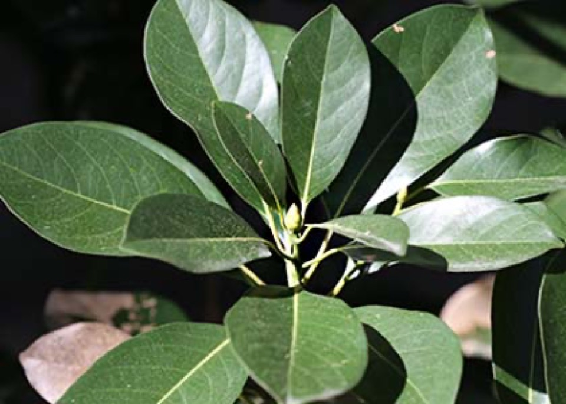
*잎 | 잎: 어긋나기 · 거꿀달걀형 · 가장자리: 밋밋함*

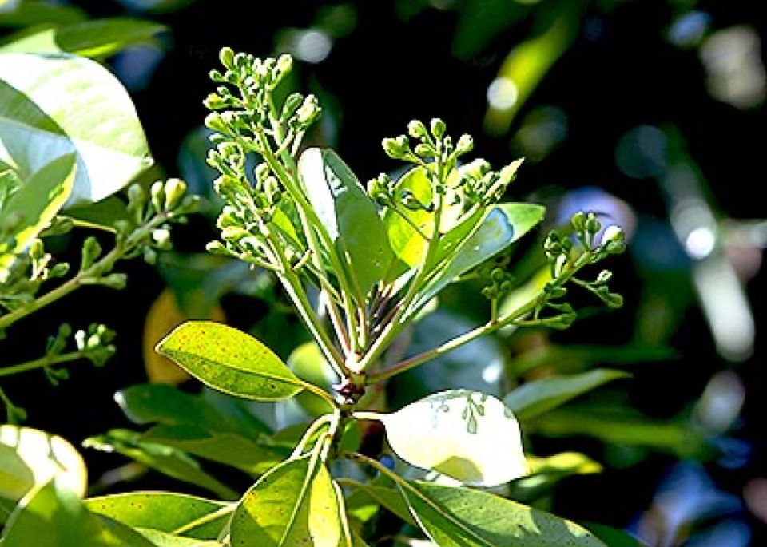
*꽃 | 꽃: 노란 초록 꽃 · 원뿔꽃차례 · 암수한꽃(양성화)*

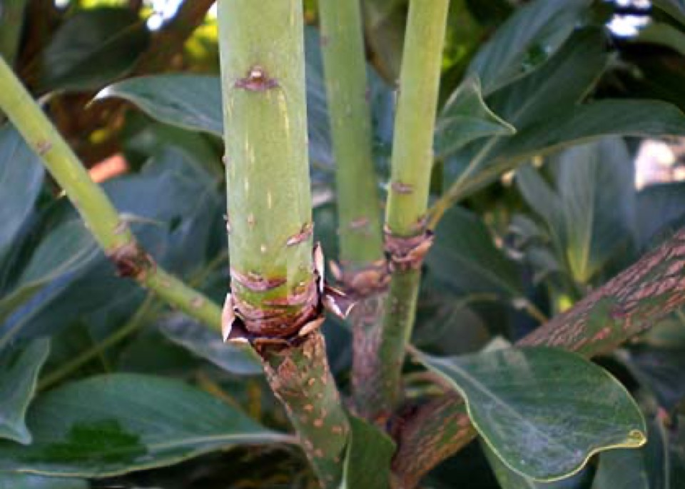
*수형 | 수형: 높이 10~15(20) m, 지름 65~130 cm · 수피: 초록 갈색, 노란 갈색*

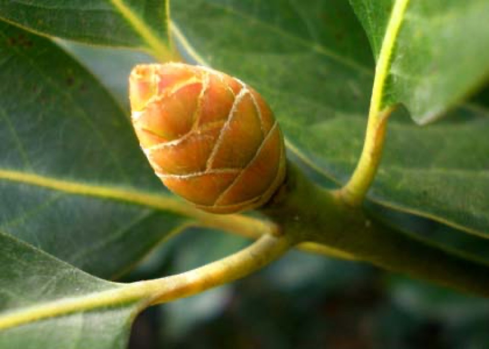
*겨울눈 | 겨울눈: 끝눈은 타원형이고 많은 조각이 싸고 있으며 붉은 빛을 띰*

### 감별 핵심 포인트
- 잎은 길고 두꺼우며 광택이 납니다.
- 잎 가장자리에 톱니가 없고 가지 끝에 잎이 모여 보입니다.
- 작은 황록색 꽃과 둥근 열매를 함께 봅니다.

### 주된 형태 특징 (4대 감별 지표)
- **🌿 잎:** 어긋나기 · 거꿀달걀형 · 가장자리: 밋밋함 · 곁맥은 7~12쌍
- **🌸 꽃:** 노란 초록 꽃 · 원뿔꽃차례 · 암수한꽃(양성화)
- **🍒 열매:** 검은 자주 열매 · 물열매(장과)
- **🪵 줄기·수형:** 높이 10~15(20) m, 지름 65~130 cm · 수피: 초록 갈색, 노란 갈색

**비교·주의:** 일본목련의 매우 큰 잎·꽃과 혼동하지 마세요.

[파이팅혼공 TV 강의](https://www.youtube.com/watch?v=K3PvgTi3eXI&t=9050s) · [수목도감(treeworld)](https://treeworld.co.kr/a01_01_02/28154) · [위키백과(한국어)](https://ko.wikipedia.org/wiki/%ED%9B%84%EB%B0%95%EB%82%98%EB%AC%B4) · [Wikipedia(English)](https://en.wikipedia.org/wiki/Machilus_thunbergii)

## 119. 흰말채나무
> *Cornus alba L.* · Cornaceae 층층나무과

*잎 | 잎: 마주나기 · 홑잎 · 가장자리: 밋밋하거나 약간 뒤로 젖혀짐*

*꽃 | 꽃: 꽃잎은 하양 또는 노란 하양 꽃 · 고른살 모인꽃차례(산방꼴 취산화서) · 꽃대는 길이 2~2.5cm, 너비 3 cm까지 이고, 작은꽃은 길이 약 3 mm, 지름 6~8.2 mm 이며, 작은꽃자루는 가늘고 길이 5~10 mm*

*열매 | 열매: 크림빛 하양 또는 성숙하면 푸른빛 하양 열매 · 굳은씨열매(핵과)*

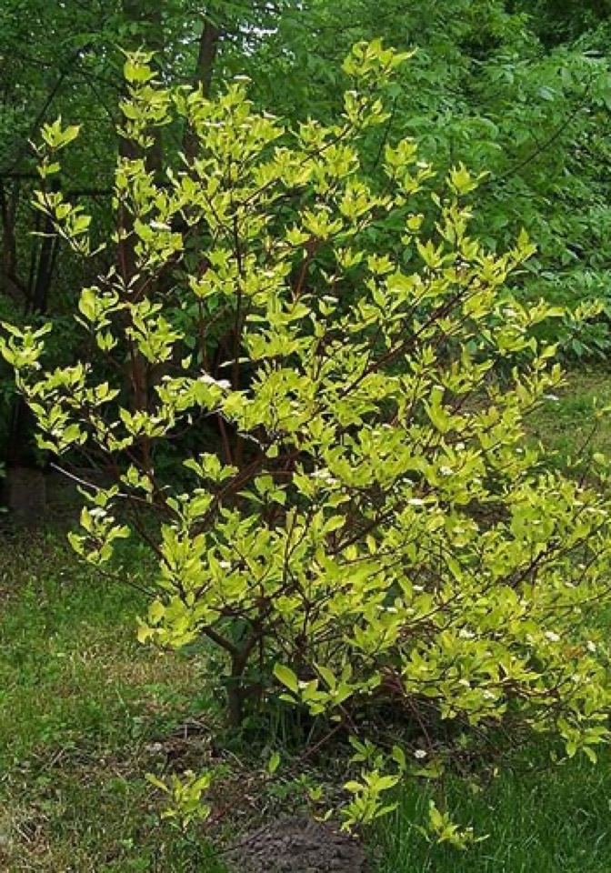
*수형 | 수형: 높이 2.3~3 m, 너비 1.5~3 m · 수피: 여름에는 껍질이 초록빛 갈색이지만 가을과 겨울에는 자줏빛 빨강*

### 감별 핵심 포인트
- 어린 가지가 붉은색을 띠는 것이 특징입니다.
- 작은 흰 꽃이 모여 피고 열매도 흰색으로 익습니다.
- 잎맥이 끝을 향해 휘는 넓은 잎을 확인하세요.

### 주된 형태 특징 (4대 감별 지표)
- **🌿 잎:** 마주나기 · 홑잎 · 가장자리: 밋밋하거나 약간 뒤로 젖혀짐 · 곁맥은 (4)5~6쌍
- **🌸 꽃:** 꽃잎은 하양 또는 노란 하양 꽃 · 고른살 모인꽃차례(산방꼴 취산화서) · 꽃대는 길이 2~2.5cm, 너비 3 cm까지 이고, 작은꽃은 길이 약 3 mm, 지름 6~8.2 mm 이며, 작은꽃자루는 가늘고 길이 5~10 mm
- **🍒 열매:** 크림빛 하양 또는 성숙하면 푸른빛 하양 열매 · 굳은씨열매(핵과)
- **🪵 줄기·수형:** 높이 2.3~3 m, 너비 1.5~3 m · 수피: 여름에는 껍질이 초록빛 갈색이지만 가을과 겨울에는 자줏빛 빨강

**비교·주의:** 노랑말채나무는 노란 가지입니다. 이름의 ‘흰’은 가지 색이 아닙니다.

[파이팅혼공 TV 강의](https://www.youtube.com/watch?v=K3PvgTi3eXI&t=9110s) · [수목도감(treeworld)](https://treeworld.co.kr/a01_01_02/28128) · [위키백과(한국어)](https://ko.wikipedia.org/wiki/%ED%9D%B0%EB%A7%90%EC%B1%84%EB%82%98%EB%AC%B4) · [Wikipedia(English)](https://en.wikipedia.org/wiki/Cornus_alba)

## 120. 히어리
> *Corylopsis coreana Uyeki* · Hamamelidaceae 조록나무과

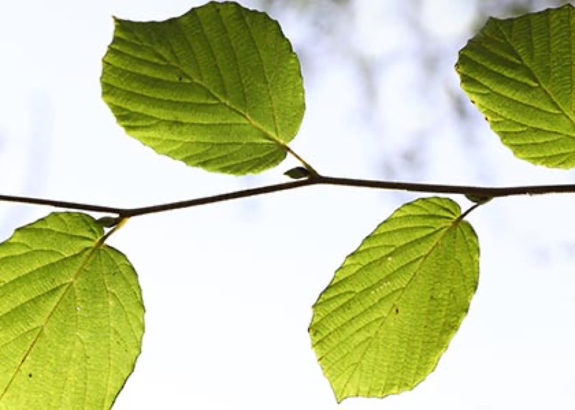
*잎 | 잎: 어긋나기 · 잎몸은 달걀꼴 둥근형 또는 심장형으로 길이 5~11 cm, 너비 (4.5)7~10.5 cm · 가장자리: 뾰족한 톱니가 있음*

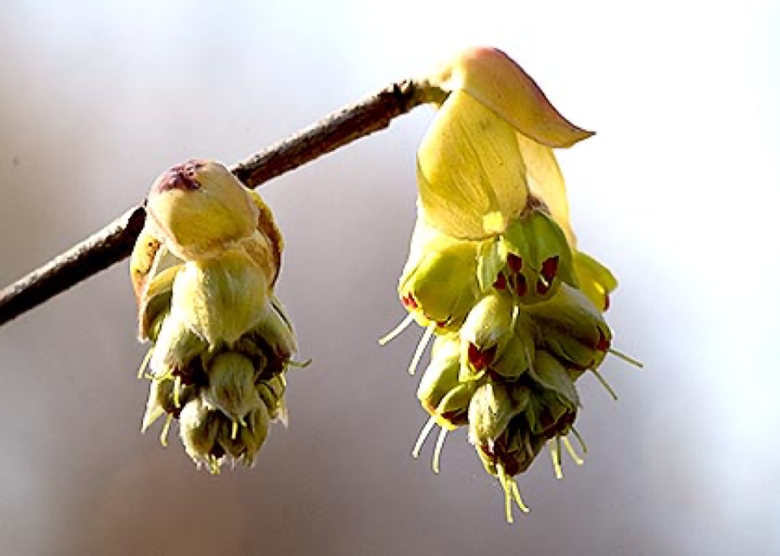
*꽃 | 꽃: 꽃받침은 연한 노란 초록 꽃 · 총상꽃차례 · 꽃대는 길이 3~4 cm이지만 꽃이 핀 다음 7~8 mm로 길어지고, 7~12개의 꽃이 작은 그릇처럼 모여달림*

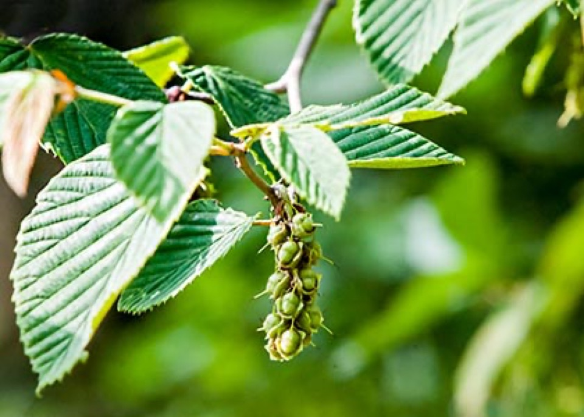
*열매 | 열매: 씨는 검정 열매 · 튀는열매(삭과)*

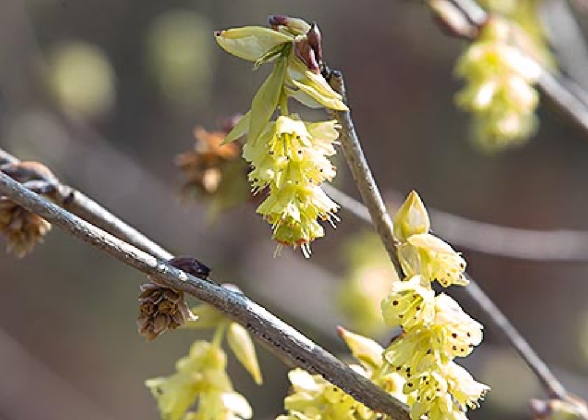
*수형 | 수형: 높이 1~7 m, 지름 3~5 cm · 수피: *

### 감별 핵심 포인트
- 옅은 노란 꽃이 짧은 이삭처럼 아래로 매달립니다.
- 잎은 둥근 심장형이며 톱니와 잎맥이 선명합니다.
- 아래로 늘어진 노란 꽃무리와 넓은 잎을 함께 기억하세요.

### 주된 형태 특징 (4대 감별 지표)
- **🌿 잎:** 어긋나기 · 잎몸은 달걀꼴 둥근형 또는 심장형으로 길이 5~11 cm, 너비 (4.5)7~10.5 cm · 가장자리: 뾰족한 톱니가 있음 · 부채살처럼 곁맥이 뚜렷함
- **🌸 꽃:** 꽃받침은 연한 노란 초록 꽃 · 총상꽃차례 · 꽃대는 길이 3~4 cm이지만 꽃이 핀 다음 7~8 mm로 길어지고, 7~12개의 꽃이 작은 그릇처럼 모여달림
- **🍒 열매:** 씨는 검정 열매 · 튀는열매(삭과)
- **🪵 줄기·수형:** 높이 1~7 m, 지름 3~5 cm · 수피: 

**비교·주의:** 풍년화의 가는 리본 모양 꽃잎과 비교하세요.

[파이팅혼공 TV 강의](https://www.youtube.com/watch?v=K3PvgTi3eXI&t=9170s) · [수목도감(treeworld)](https://treeworld.co.kr/a01_01_02/28114) · [위키백과(한국어)](https://ko.wikipedia.org/wiki/%ED%9E%88%EC%96%B4%EB%A6%AC) · [Wikipedia(English)](https://en.wikipedia.org/wiki/Corylopsis)
